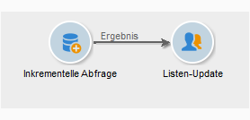
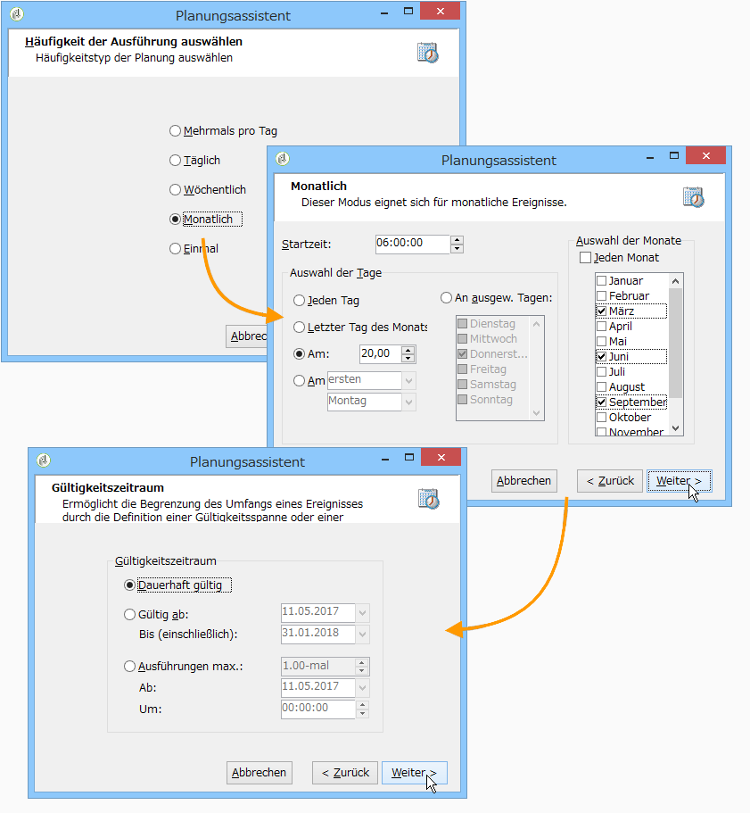

# Vierteljährliches Listen-Update mithilfe einer inkrementellen Abfrage {#quarterly-list-update}

Im folgenden Beispiel wird eine [inkrementelle Abfrage](incremental-query.md) verwendet, um eine Empfängerliste automatisch zu aktualisieren. Diese Empfangenden werden im Rahmen von saisonalen Marketing-Kampagnen angesprochen.

Da diese Kampagnen zu Beginn jeder Saison gestartet werden, um relevante sportliche Aktivitäten anzubieten, werden diese Listen jedes Quartal aktualisiert. Eine empfangende Person darf von dieser Kampagne jedoch nur einmal alle 9 Monate angesprochen werden. So können Sie die Eignungshäufigkeit der empfangenden Person strecken und Aktivitäten für verschiedene Jahreszeiten im Laufe der Jahre anbieten.

1. Erstellen Sie einen neuen Workflow und positionieren Sie eine inkrementelle Abfrage mit anschließendem Listen-Update im Diagramm.
1. Konfigurieren Sie in der Aktivität die Registerkarte **[!UICONTROL Inkrementelle Abfrage]** (wie im Abschnitt [Erstellen einer Abfrage](query.md#creating-a-query) beschrieben).
1. Wählen Sie die Registerkarte **[!UICONTROL Planung und Verlauf]** aus und geben Sie dann einen Verlauf von 270 Tagen an. Bereits angesprochene Empfangende werden im Rahmen dieser Kampagne innerhalb der nächsten 270 Tage, also ungefähr 9 Monate, nicht mehr kontaktiert.

   Klicken Sie dann auf die Schaltfläche **[!UICONTROL Ändern...]**.

1. Da die Liste jeweils zu Saisonbeginn aktualisiert werden soll, muss als Häufigkeit **[!UICONTROL Monatlich]** ausgewählt werden.
1. Wählen Sie im nächsten Bildschirm die Monate März, Juni, September und Dezember aus. Wählen Sie als Tag den 20. des Monats und geben Sie die Uhrzeit an, an der der Workflow gestartet werden soll.
1. Geben Sie abschließend den Gültigkeitszeitraum der Abfrage an. Im vorliegenden Beispiel wurde **[!UICONTROL Dauerhaft gültig]** ausgewählt.

   

1. Konfigurieren Sie nun die Aktivität Listen-Update (wie im Abschnitt ](list-update.md)Listen-Update[ beschrieben).

Der Workflow startet automatisch kurz vor Saisonbeginn. Die Liste wird jeweils mit den neuen Angebotsempfangenden aktualisiert.
