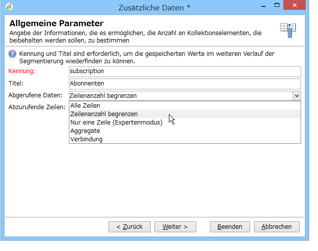

# Abfrage{#query}

## Abfragen erstellen {#creating-a-query}

Über Abfragen lassen sich Zielgruppen anhand von Filterkriterien bestimmen. Es besteht die Möglichkeit, dem Abfrageergebnis einen Segment-Code zuzuweisen und es mit Zusatzdaten zu ergänzen.

>[!NOTE]
>
>Beispiele für Abfragen werden in [diesem Abschnitt](../../workflow/using/querying-recipient-table.md) beschrieben.

For more on using and managing additional data, refer to [Adding data](#adding-data).

The **[!UICONTROL Edit query...]** link lets you define the targeting type, the restrictions, and the selection criteria for the population in the following way:

1. Wählen Sie zunächst Zielgruppen- und Filterdimension aus. Standardmäßig wird die Zielgruppe aus den Empfängern ausgewählt. Die vorgeschlagenen Einschränkungsfilter sind dieselben wie bei der Zielgruppenbestimmung in einem Versand.

   Die Zielgruppendimension bezeichnet den Elementtyp, der verwendet werden soll, beispielsweise die mit der Kampagne anzusprechende Population.

   Filterdimensionen ermöglichen die spezifische Auswahl der Elemente, beispielsweise nach Kriterien wie Verträgen, Altersgruppen etc.

   Weitere Informationen finden Sie unter [Targeting- und Filterdimensionen](../../workflow/using/building-a-workflow.md#targeting-and-filtering-dimensions).

   

   A query can be based on data from the inbound transition, if necessary, by selecting **[!UICONTROL Temporary schema]** when choosing targeting and filtering dimensions.

   

1. Definieren Sie die Populationen mithilfe des Assistenten. Die einzugebenden Felder können je nach Zieltyp unterschiedlich sein. Sie können eine Vorschau der Zielgruppe mit Ihren aktuellen Kriterien auf der **[!UICONTROL Preview]** Registerkarte anzeigen.

   Weiterführende Informationen zur Erstellung und Verwendung von Filtern und zu Abfragen finden Sie in diesem [Abschnitt](../../platform/using/filtering-options.md).

   

1. If you have selected **[!UICONTROL Filtering conditions]** at step 1 or using the **[!UICONTROL Filters]** > **[!UICONTROL Advanced filter...]** option, then you will have to manually add filtering criteria later on.

   Es besteht darüber hinaus die Möglichkeit, die gefilterten Daten zu gruppieren. Dies ist jedoch nur möglich, wenn die Filterdimension nicht mit der Zielgruppendimension identisch ist. Weiterführende Informationen finden Sie in diesem [Abschnitt](../../workflow/using/querying-using-grouping-management.md).

   Sie können auch weitere Kriterien hinzufügen, indem Sie den Ausdrucksgenerator verwenden und ihn mit den logischen Optionen AND, OR und EXCEPT kombinieren. Sie können dann eine Vorschau der **[!UICONTROL Corresponding SQL query...]** Kriterienkombination anzeigen. Weiterführende Informationen hierzu finden Sie in diesem [Abschnitt](../../platform/using/defining-filter-conditions.md#building-expressions).

   Speichern Sie die Abfrage, um sie später erneut verwenden zu können.

   

## Daten hinzufügen {#adding-data}

Es besteht die Möglichkeit, in Workflows zusätzliche Informationen über die Zielgruppe zu verwenden. Dies können beispielsweise Versicherungsnummern, Abonnements von bestimmten Newslettern oder die Herkunft der Empfänger sein. Diese Informationen können entweder aus der Adobe-Campaign-Datenbank oder aus externen Datenbanken stammen.

The **[!UICONTROL Add data...]** link lets you select the additional data to collect.

Wählen Sie im ersten Fenster des Assistenten zunächst den Typ der hinzuzufügenden Daten aus:

* Wählen Sie **[!UICONTROL Data linked to the filtering dimension]** die Daten in der Adobe Campaign-Datenbank aus.
* Wählen Sie diese Option, **[!UICONTROL External data]** um Daten aus einer externen Datenbank hinzuzufügen. Diese Option ist nur verfügbar, wenn Sie die Option **Federated Data Access** erworben haben. For more on this, refer to [Accessing an external database (FDA)](../../workflow/using/accessing-an-external-database--fda-.md).
* Wählen Sie die **[!UICONTROL An offer proposition]** Option aus, um einen Satz Spalten hinzuzufügen, mit denen Sie die beste von der Angebotsmaschine generierte Proposition speichern können. This option is only available if you have purchased the **Interaction** module.

Wenn keines der o. g. Module auf Ihrer Plattform installiert ist, überspringt der Assistent das Auswahlfenster. Sie werden direkt zum nächsten Schritt weitergeleitet.

Gehen Sie folgendermaßen vor, um Daten aus der Adobe-Campaign-Datenbank hinzuzufügen:

1. Wählen Sie den Datentyp aus, der hinzugefügt werden soll. Hierbei kann es sich um Daten der Filterdimension direkt oder Daten aus in Relation zur Filterdimension stehenden Tabellen handeln.

   

1. Wenn die Daten aus der Filterdimension der Abfrage stammen, können Sie sie direkt aus der Liste der verfügbaren Felder auswählen, um sie in den Ausgabespalten anzuzeigen.

   

   Hinzugefügt werden können des Weiteren:

   * Ein Feld, das auf der Grundlage von Daten aus der Zielgruppe oder einer Aggregation berechnet wird (Anzahl der ausstehenden Käufe innerhalb des letzten Monats, durchschnittlicher Betrag einer Quittung usw.). Ein Beispiel finden Sie unter Daten [auswählen](../../workflow/using/targeting-data.md#selecting-data).
   * A new field, created using the **[!UICONTROL Add]** button to the right of the list of output columns.

      Sie können auch eine Sammlung von Informationen hinzufügen, z. B. eine Liste von Verträgen, die letzten 5 Auslieferungen usw. Sammlungen fallen mit Feldern zusammen, die mehrere Werte für dasselbe Profil aufweisen können (1-N-Beziehung). Weitere Informationen finden Sie unter [Bearbeiten zusätzlicher Daten](../../workflow/using/targeting-data.md#editing-additional-data).

Gehen Sie folgendermaßen vor, um eine mit einer Zielpopulation verknüpfte Informationskollektion hinzuzufügen:

1. Wählen Sie im ersten Schritt des Assistenten die **[!UICONTROL Data linked to the filtering dimension]** Option:
1. Select the table which contains the information you want to collect and click **[!UICONTROL Next]**.

   

1. Geben Sie bei Bedarf die Anzahl der Elemente der Sammlung an, die Sie beibehalten möchten, indem Sie einen der Werte im **[!UICONTROL Data collected]** Feld auswählen. Standardmäßig werden alle Zeilen der Sammlung wiederhergestellt und anschließend gemäß den im folgenden Schritt angegebenen Bedingungen gefiltert.

   * If a single element of the collection coincides with the filtering conditions for this collection, select **[!UICONTROL Single row]** in the **[!UICONTROL Data collected]** field.

      >[!CAUTION]
      >
      >Dieser Modus optimiert die erzeugte SQL-Abfrage, da ein direkter Join auf die Kollektionselemente erstellt wird.
      >
      >Wenn die ursprüngliche Bedingung nicht respektiert wird, kann das Ergebnis falsch sein (fehlende Zeilen oder Dubletten).

   * If you choose to recover several lines (**[!UICONTROL Limit the line count]**) you can specify the number of lines to collect.
   * Wenn die erfassten Spalten Aggregate enthalten, z. B. die Anzahl der gemeldeten Fehler, die durchschnittlichen Ausgaben auf einer Site usw. können Sie den **[!UICONTROL Aggregates]** Wert verwenden.
   

1. Definieren Sie die Unterauswahl der Kollektionselemente. Beispielsweise die Käufe der letzten 15 Tage.

   

1. Wenn Sie die **[!UICONTROL Limit the line count]** Option ausgewählt haben, legen Sie die Reihenfolge fest, in der die erfassten Daten gefiltert werden sollen. Sobald die Anzahl der erfassten Zeilen größer ist als die Anzahl der Zeilen, die Sie für die Aufbewahrung angegeben haben, können Sie in der Filterreihenfolge angeben, welche Zeilen beibehalten werden sollen.

## Beispiel: Zielgruppenbestimmung anhand einfacher Empfängerattribute {#example--targeting-on-simple-recipient-attributes}

In folgendem Beispiel sollen alle Männer zwischen 18 und 30 Jahre identifiziert werden, die in Deutschland leben. Die Abfrage könnte in einem Workflow Verwendung finden, der ein speziell an diese Zielgruppe gerichtetes Angebot versendet. Gehen Sie wie folgt vor:

>[!NOTE]
>
>Beispiele für zusätzliche Abfragen werden in [diesem Abschnitt](../../workflow/using/querying-recipient-table.md) beschrieben.

1. Name your query then select the **[!UICONTROL Edit query...]** link.
1. Select **[!UICONTROL Filtering conditions]** in the list of types of filter available.
1. Konfigurieren Sie die verschiedenen Kriterien für die gesuchte Zielgruppe. Im vorliegenden Beispiel werden die einzelnen Kriterien mit dem Operator UND verknüpft. Die Empfänger müssen also die vier folgenden Bedingungen erfüllen:

   * Anrede gleich &quot;Herr&quot; (oder **Geschlecht** gleich **Männlich**),
   * Alter kleiner als 30 Jahre.
   * Alter größer als 18 Jahre.
   * Land gleich Deutschland.
   

   Der der Abfrage entsprechende SQL-Code stellt sich wie folgt dar:

   

1. Prüfen Sie das Abfrageergebnis im Vorschau-Tab:

   

1. Save your filters so that you can use them again at a later date by clicking **[!UICONTROL Finish]** > **[!UICONTROL OK]**.
1. Continue editing your workflow by adding other activities to it. Once it has been launched and the previous query step finished, the number of recipients found will be displayed. You can display further details using the mouse pop-up menu (right click the transition > **[!UICONTROL Display the target...]**).

   

## Ausgabeparameter {#output-parameters}

* tableName
* schema
* recCount

Dieser Satz von drei Werten identifiziert die Zielgruppe der Abfrage. **[!UICONTROL tableName]** ist der Name der Tabelle, in der die Zielkennungen aufgezeichnet werden, das Schema der Population (normalerweise nms:empfänger) und die Anzahl der Elemente in der Tabelle **[!UICONTROL schema]** ist **[!UICONTROL recCount]** dies.

Dieser Wert ist das Schema der Arbeitstabelle. Dieser Parameter ist für alle Übergänge mit **[!UICONTROL tableName]** und gültig **[!UICONTROL schema]**.

## Optimieren der Abfragen {#optimizing-queries}

Im folgenden Abschnitt finden Sie Best Practices zur Optimierung der in Adobe Campaign ausgeführten Abfragen, um den Arbeitsaufwand für die Datenbank zu begrenzen und die Benutzerfreundlichkeit zu verbessern.

### Verbindungen und Indizes {#joins-and-indexes}

* Effiziente Abfragen basieren auf Indizes.
* Verwenden Sie einen Index für alle Verbindungen.
* Durch das Definieren von Links im Schema werden die Bedingungen für die Verknüpfung festgelegt. Die verknüpfte Tabelle sollte einen eindeutigen Index für den Primärschlüssel und die Verknüpfung für dieses Feld aufweisen.
* Führen Sie Verknüpfungen durch, indem Sie Schlüssel für numerische Felder anstelle von Zeichenfolgenfeldern definieren.
* Vermeiden Sie äußere Verbindungen. Verwenden Sie nach Möglichkeit den Null-ID-Datensatz, um eine äußere Verbindungsfunktion zu erhalten.
* Verwenden Sie den richtigen Datentyp für Joins.

   Stellen Sie sicher, dass die `where` Klausel der gleiche Typ wie das Feld ist.

   Ein häufiger Fehler ist: `iBlacklist='3'` Hierbei `iBlacklist` handelt es sich um ein numerisches Feld, das einen Textwert `3` angibt.

   Achten Sie darauf, dass Sie wissen, wie der Ausführungsplan für Ihre Abfrage aussehen wird. Vermeiden Sie vollständige Tabellenscans, insbesondere bei Echtzeitabfragen oder Echtzeitabfragen, die jede Minute ausgeführt werden.

Weitere Informationen finden Sie in[den Abschnitten Best Practices](https://helpx.adobe.com/campaign/kb/acc-data-model-best-practices.html) für das Datenmodell und [Datenbankzuordnung](../../configuration/using/database-mapping.md) .

### Funktionen {#functions}

* Vorsicht vor Funktionen wie `Lower(...)`. Wenn die Funktion Lower verwendet wird, wird der Index nicht verwendet.
* Überprüfen Sie Abfragen anhand der Anweisung &quot;like&quot; oder der Anweisungen &quot;top&quot; oder &quot;lower&quot;. Wenden Sie &quot;Oberhalb&quot;auf die Benutzereingabe und nicht auf das Datenbankfeld an.

   For more on functions, refer to [this section](../../platform/using/defining-filter-conditions.md#list-of-functions).

### Filtern von Dimensionen {#filtering-dimensions}

Verwenden Sie die Filterdimension der Abfrage, anstatt den Operator &quot;exists as&quot;zu verwenden.

In Abfragen sind Bedingungen wie &quot;vorhanden&quot;in Filtern nicht effizient. Sie entsprechen einer Subabfrage in SQL:

`select iRecipientId from nmsRecipient where iRecipientId IN (select iRecipientId from nmsBroadLog where (...))`

Am besten verwenden Sie stattdessen die Filterdimension der Abfrage:

Die Entsprechung der Filterdimension in SQL ist die innere Verbindung:

`select iRecipientId from nmsRecipient INNER JOIN nmsBroadLog ON (...)`

For more on filtering dimensions, refer to [this section](../../workflow/using/building-a-workflow.md#targeting-and-filtering-dimensions).

### Architektur {#architecture}

* Erstellen Sie eine Entwicklungsplattform mit ähnlichen Volumes, Parametern und Architekturen wie die Produktionsplattform.
* Verwenden Sie dieselben Werte für die Entwicklungs- und Produktionsumgebungen. Verwenden Sie so weit wie möglich dieselben:

   * Betriebssystem,
   * Version,
   * Daten,
   * Anwendung,
   * Volumen.
   >[!NOTE]
   >
   >Eine Funktion, die in einer Entwicklungsumgebung funktioniert, funktioniert möglicherweise nicht in einer Produktionsumgebung, in der die Daten unterschiedlich sein können. Versuchen Sie, die Hauptunterschiede zu ermitteln, um Risiken zu antizipieren und Lösungen vorzubereiten.

* Konfigurationen, die mit den Zielvolumina übereinstimmen. Große Volumes erfordern spezifische Konfigurationen. Eine Konfiguration, die für 100.000 Empfänger funktionierte, funktioniert möglicherweise nicht für 10.000.000 Empfänger.

   Überlegen Sie, wie das System skaliert wird, wenn es live geschaltet wird. Nur weil etwas in kleinem Maßstab funktioniert, bedeutet das nicht, dass es mit größeren Mengen geeignet sein wird. Die Tests sollten mit ähnlichen Mengen wie das Produktionsvolumen durchgeführt werden. Sie sollten auch die Auswirkungen von Änderungen der Volumen (Anzahl der Aufrufe, Größe der Datenbank) zu Spitzenzeiten, Spitzenzeiten und während der gesamten Projektlaufzeit bewerten.
