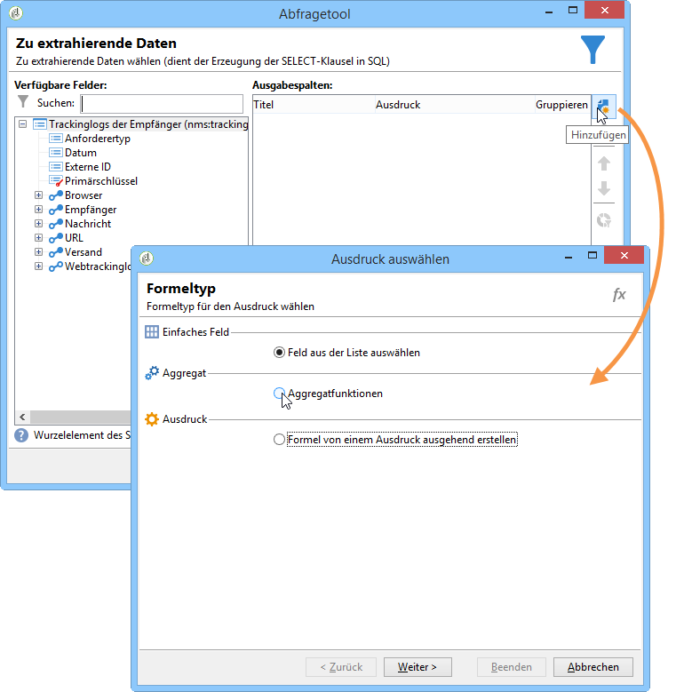
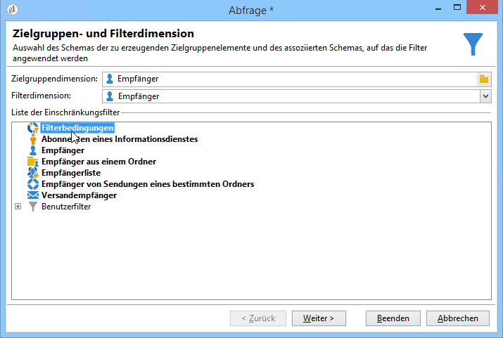
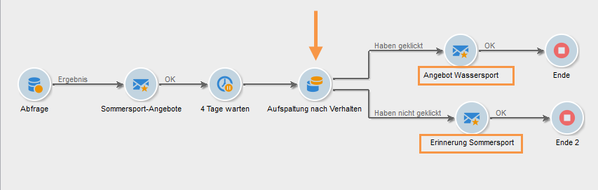

# Abfrage zu Versandinformationen {#querying-delivery-information}

## Anzahl der Klicks für einen bestimmten Versand {#number-of-clicks-for-a-specific-delivery}

In diesem Beispiel versuchen wir, die Anzahl der Klicks für eine bestimmte Bereitstellung wiederherzustellen. Diese Klicks werden dank der Verfolgungsprotokolle der Empfänger aufgezeichnet, die über einen bestimmten Zeitraum erfasst wurden. Der Empfänger wird über seine E-Mail-Adresse identifiziert. Diese Abfrage verwendet die **[!UICONTROL Recipient tracking logs]** Tabelle.

* Welche Tabelle soll ausgewählt werden?

   The recipient log tracking table (**[!UICONTROL nms:trackingLogRcp]**)

* Felder, die als Ausgabespalten verwendet werden sollen?

   Primärschlüssel (mit Zählung) und E-Mail

* Nach welchen Kriterien werden die Informationen gefiltert?

   Nach einem Zeitraum und einem Element im Versandtitel

Gehen Sie für dieses Beispiel wie folgt vor:

1. Öffnen Sie das Schema **[!UICONTROL Generic query editor]** und wählen Sie das **[!UICONTROL Recipient tracking logs]** Schema aus.

   

1. Im **[!UICONTROL Data to extract]** Fenster wollen wir ein Aggregat erstellen, um Informationen zu sammeln. Fügen Sie dazu den primären Schlüssel hinzu (oberhalb des Hauptelements **[!UICONTROL Recipient tracking logs]** ): Die Anzahl der Verfolgungsprotokolle wird für dieses **[!UICONTROL Primary key]** Feld ermittelt. Der bearbeitete Ausdruck wird **[!UICONTROL x=count(primary key)]** angezeigt. Es verknüpft die Summe der verschiedenen Verfolgungsprotokolle mit einer einzelnen E-Mail-Adresse.

   Gehen Sie dazu wie folgt vor:

   * Klicken Sie auf das **[!UICONTROL Add]** Symbol rechts neben dem **[!UICONTROL Output columns]** Feld. Wählen Sie im **[!UICONTROL Formula type]** Fenster die **[!UICONTROL Edit the formula using an expression]** Option aus und klicken Sie auf **[!UICONTROL Next]**. Klicken Sie im **[!UICONTROL Field to select]** Fenster auf **[!UICONTROL Advanced selection]**.

      

   * Führen Sie im **[!UICONTROL Formula type]** Fenster einen Prozess für die Aggregationsfunktion aus. Dieser Prozess ist eine primäre Schlüsselzahl.

      Wählen Sie **[!UICONTROL Process on an aggregate function]** im **[!UICONTROL Aggregate]** Abschnitt aus und klicken Sie auf **[!UICONTROL Count]**.

      

      Klicks **[!UICONTROL Next]**.

   * Wählen Sie das **[!UICONTROL Primary key (@id)]** Feld aus. Die **[!UICONTROL count (primary key)]** Ausgabefalte wird konfiguriert.

      

1. Wählen Sie das andere Feld aus, das in der Spalte &quot;Ausgabe&quot;angezeigt werden soll. Öffnen Sie in der **[!UICONTROL Available fields]** Spalte die **[!UICONTROL Recipient]** Node und wählen Sie **[!UICONTROL Email]**. Markieren Sie das **[!UICONTROL Group]** **[!UICONTROL Yes]** Kästchen, um die Verfolgungsprotokolle nach E-Mail-Adresse zu gruppieren: Diese Gruppe verknüpft jedes Protokoll mit dem Empfänger.

   

1. Konfigurieren Sie die Spaltensortierung, damit die aktivsten Empfänger (mit den meisten Verfolgungsprotokollen) zuerst angezeigt werden. Checken Sie **[!UICONTROL Yes]** die **[!UICONTROL Descending sort]** Spalte ein.

   

1. Im folgenden Schritt können Sie die Abfrageergebnisse weiter einschränken und beispielsweise aus allen Logs jene herausfiltern, die unter 15 Tage alt sind und deren Sendungen sich auf eine Gartenausstellung beziehen.

   Gehen Sie dazu wie folgt vor:

   * Konfigurieren Sie die Datenfilterung. Wählen Sie dazu **[!UICONTROL Filter conditions]** und klicken Sie auf **[!UICONTROL Next]**.

      

   * Drei Filterbedingungen sind erforderlich, um die Ergebnisse wie gewünscht einzuschränken: zwei Datumsfilter zur Eingrenzung des Zeitraums zwischen 15 Tagen vor dem aktuellen Datum und 1 Tag vor dem aktuellen Datum sowie eine weitere Bedingung, um nur Logs bezüglich bestimmter Sendungen zu erfassen.

      Konfigurieren Sie im **[!UICONTROL Target element]** Fenster das Datum, ab dem Verfolgungsprotokolle berücksichtigt werden. Klicks **[!UICONTROL Add]**. Eine Bedingungszeile wird angezeigt. Bearbeiten Sie die **[!UICONTROL Expression]** Spalte, indem Sie auf die **[!UICONTROL Edit expression]** Funktion klicken. Wählen Sie im **[!UICONTROL Field to select]** Fenster **[!UICONTROL Date (@logDate)]**.

      

      Wählen Sie den **[!UICONTROL greater than]** Operator aus. Klicken Sie in der **[!UICONTROL Value]** Spalte auf **[!UICONTROL Edit expression]** und wählen Sie im **[!UICONTROL Formula type]** Fenster **[!UICONTROL Process on dates]**. Geben **[!UICONTROL Current date minus n days]** Sie schließlich &quot;15&quot;ein.

      Klicks **[!UICONTROL Finish]**.

      

   * Um das Enddatum der Verfolgungsprotokoll-Suche auszuwählen, erstellen Sie eine zweite Bedingung, indem Sie auf **[!UICONTROL Add]**. Wählen Sie in der **[!UICONTROL Expression]** Spalte **[!UICONTROL Date (@logDate)]** erneut aus.

      Wählen Sie den **[!UICONTROL less than]** Operator aus. Klicken Sie in der **[!UICONTROL Value]** Spalte auf **[!UICONTROL Edit expression]**. Zur Datumsverarbeitung gehen Sie zum **[!UICONTROL Formula type]** Fenster und geben Sie &quot;1&quot;in **[!UICONTROL Current date minus n days]**.

      Klicks **[!UICONTROL Finish]**.

      

      Der gewünschte Zeitraum wurde konfiguriert. In der dritten Filterbedingung gilt es, nur einen bestimmten Versand zu berücksichtigen.

   * Klicken Sie auf die **[!UICONTROL Add]** Funktion, um eine weitere Filterbedingung zu erstellen. Klicken Sie in der **[!UICONTROL Expression]** Spalte auf **[!UICONTROL Edit expression]**. Wählen Sie im **[!UICONTROL Field to select]** Fenster **[!UICONTROL Label]** die Option im **[!UICONTROL Delivery]** Knoten.

      Klicks **[!UICONTROL Finish]**.

      

      Suchen Sie nach einer Lieferung mit dem Wort &quot;Verkauf&quot;. Da Sie sich nicht an die genaue Beschriftung erinnern, können Sie den **[!UICONTROL contains]** Operator wählen und &quot;sales&quot;in die **[!UICONTROL Value]** Spalte eingeben.

      

1. Click **[!UICONTROL Next]** until you get to the **[!UICONTROL Data preview]** window: no formatting is necessary here.
1. Klicken Sie im **[!UICONTROL Data preview]** Fenster auf **[!UICONTROL Start the preview of the data]** , um die Anzahl der Verfolgungsprotokolle für jeden Empfänger anzuzeigen.

   Die Trackinglogs werden wie gewünscht in absteigender Reihenfolge angezeigt.

   

   Die höchste Loganzahl für einen Benutzer beträgt bei diesem Versand 8. 20 verschiedene Benutzer haben die E-Mail dieses Versands geöffnet oder auf einen Link geklickt.

## Empfänger, die keine Nachricht geöffnet haben {#recipients-who-did-not-open-any-delivery}

In diesem Beispiel möchten wir Empfänger herausfiltern, die in den letzten sieben Tagen keine E-Mail geöffnet haben.

Gehen Sie wie folgt vor:

1. Drag and drop a **[!UICONTROL Query]** activity in a workflow and open the activity.
1. Klicken Sie auf **[!UICONTROL Edit query]** und legen Sie die Ziel- und Filterdimensionen auf **[!UICONTROL Recipients]**.

   

1. Wählen Sie **[!UICONTROL Filtering conditions]** und klicken Sie auf **[!UICONTROL Next]**.
1. Klicken Sie auf die **[!UICONTROL Add]** Schaltfläche und wählen Sie **[!UICONTROL Tracking logs]**.
1. Setzen Sie den **[!UICONTROL Operator]** Ausdruck **[!UICONTROL Tracking logs]** auf **[!UICONTROL Do not exist such as]**.

   

1. Fügen Sie einen weiteren Ausdruck hinzu. Wählen Sie **[!UICONTROL Type]** in der **[!UICONTROL URL]** Kategorie aus.
1. Legen Sie dann ihre **[!UICONTROL Operator]** auf **[!UICONTROL equal to]** und ihre **[!UICONTROL Value]** auf **[!UICONTROL Open]**.

   

1. Fügen Sie einen weiteren Ausdruck hinzu und wählen Sie **[!UICONTROL Date]**. auf **[!UICONTROL Operator]****[!UICONTROL on or after]**.

   

1. To set the value last 7 days, click the **[!UICONTROL Edit expression]** button in the **[!UICONTROL Value]** field.
1. Wählen Sie in der **[!UICONTROL Function]** Kategorie die Anzahl der gewünschten Tage aus **[!UICONTROL Current date minus n days]** und fügen Sie sie hinzu. Hier wollen wir uns auf die letzten 7 Tage konzentrieren.

   

Ihre ausgehende Transition wird Empfänger enthalten, die in den letzten sieben Tagen keine E-Mail geöffnet haben.

Wenn Sie hingegen Empfänger filtern möchten, die mindestens eine E-Mail geöffnet haben, sollte Ihre Abfrage wie folgt lauten. Bitte beachten Sie, dass in diesem Fall die Variable **[!UICONTROL Filtering dimension]** auf **[!UICONTROL Tracking logs (Recipients)]**.

## Empfänger, die einen Versand geöffnet haben {#recipients-who-have-opened-a-delivery}

Im folgenden Beispiel erfahren Sie, wie Sie alle Profile auswählen können, die in den vergangenen zwei Wochen einen Versand geöffnet haben.

1. Um Profile, die eine Bereitstellung geöffnet haben, als Ziel festzulegen, müssen Sie Verfolgungsprotokolle verwenden. sie werden in einer verknüpften Tabelle gespeichert: Wählen Sie zuerst diese Tabelle in der Dropdown-Liste des **[!UICONTROL Filtering dimension]** Felds aus, wie nachfolgend gezeigt:

   

1. Zum Filtern von Bedingungen klicken Sie auf das **[!UICONTROL Edit expression]** Symbol der Kriterien, die in der Unterstruktur der Verfolgungsprotokolle angezeigt werden. Wählen Sie das **[!UICONTROL Date]** Feld aus.

   

   Click **[!UICONTROL Finish]** to confirm selection.

   In order to recover only the tracking logs less than two weeks old, select the **[!UICONTROL Greater than]** operator.

   

   Klicken Sie dann auf das **[!UICONTROL Edit expression]** Symbol in der **[!UICONTROL Value]** Spalte, um die anzuwendende Berechnungsformel zu definieren. Wählen Sie die **[!UICONTROL Current date minus n days]** Formel aus und geben Sie 15 in das entsprechende Feld ein.

   

   Klicken Sie auf die **[!UICONTROL Finish]** Schaltfläche im Formelfenster. Klicken Sie im Filterfenster auf die **[!UICONTROL Preview]** Registerkarte, um die Targeting-Kriterien zu überprüfen.

   

## Verhalten der Empfänger nach einem Versand filtern {#filtering-recipients--behavior-folllowing-a-delivery}

In einem Workflow können Sie mit den Feldern **[!UICONTROL Query]** und **[!UICONTROL Split]** Kästchen ein Verhalten nach einer vorherigen Bereitstellung auswählen. Diese Auswahl erfolgt über den **[!UICONTROL Delivery recipient]** Filter.

* Ziel des Beispiels

   In einem Bereitstellungsarbeitsablauf gibt es mehrere Möglichkeiten, eine erste E-Mail-Kommunikation nachzuverfolgen. Bei diesem Vorgang wird das **[!UICONTROL Split]** Feld verwendet.

* Kontext

   Ein Versand zum Thema &quot;Sommersport-Angebote&quot;. Vier Tage nach dem Versand werden zwei weitere Sendungen geschaltet: &quot;Wassersport-Angebote&quot; und ein Erinnerungsschreiben bezüglich des ersten Sommersport-Angebots.

   Der Versand &quot;Wassersport-Angebote&quot; richtet sich an Empfänger, die in der ersten E-Mail auf Inhalte zum Thema Wassersport geklickt haben. Diese Klicks zeugen vom Interesse der Empfänger. Ähnliche Angebote könnten daher ebenfalls für diese Interessenten infrage kommen. Empfänger hingegen, die die &quot;Sommersport-Angebote&quot;-E-Mail nicht angeklickt haben, bekommen dieselben Angebote wie zuvor.

The following steps show you how to configure the **[!UICONTROL Split]** box by integrating two different behaviors:

1. Fügen Sie das **[!UICONTROL Split]** Feld in den Workflow ein. In diesem Feld werden die Empfänger der ersten Lieferung in die nächsten beiden Auslieferungen unterteilt. Die Aufschlüsselung erfolgt basierend auf den Filterbedingungen, die mit dem Verhalten des Empfängers während der ersten Bereitstellung verknüpft sind.

   

1. Öffnen Sie die **[!UICONTROL Split]** Kiste. Geben Sie auf der **[!UICONTROL General]** Registerkarte eine Bezeichnung ein: Die **Aufteilung basiert zum Beispiel auf dem Verhalten** .

   

1. Definieren Sie auf der **[!UICONTROL Subsets]** Registerkarte die erste geteilte Verzweigung. Geben Sie beispielsweise die **Beschriftung für diese Verzweigung ein, auf die geklickt** wird.
1. Select the **[!UICONTROL Add a filtering condition on the incoming population]** option. Klicks **[!UICONTROL Edit]**.
1. Doppelklicken Sie im **[!UICONTROL Targeting and filtering dimension]** Fenster auf den **[!UICONTROL Recipients of a delivery]** Filter.

   

1. Wählen Sie im **[!UICONTROL Target element]** Fenster das Verhalten, das Sie auf diese Verzweigung anwenden möchten: **[!UICONTROL Recipients having clicked (email)]**.

   Wählen Sie unten die **[!UICONTROL Delivery specified by the transition]** Option aus. Mit dieser Funktion werden die Zielgruppen während der ersten Bereitstellung automatisch wiederhergestellt.

   Die Empfänger dieses Zweigs bekommen also den Versand &quot;Wassersport-Angebote&quot;.

   

1. Definieren Sie die zweite Verzweigung. Diese Verzweigung enthält die nachfolgende E-Mail mit demselben Inhalt wie die erste Auslieferung. Gehen Sie zur **[!UICONTROL Subsets]** Registerkarte und klicken Sie auf **[!UICONTROL Add]** , um sie zu erstellen.

   

1. Unten im Fenster erscheint ein neuer Tab. Benennen Sie ihn z. B. &quot;**Haben nicht geklickt**&quot;.
1. Klicks **[!UICONTROL Add a filtering condition for the incoming population]**. Klicken Sie dann auf **[!UICONTROL Edit...]**.

   

1. Klicken Sie **[!UICONTROL Delivery recipients]** im **[!UICONTROL Targeting and filtering dimension]** Fenster.
1. Wählen Sie im **[!UICONTROL Target element]** Fenster das **[!UICONTROL Recipients who did not click (email)]** Verhalten aus. Wählen Sie die **[!UICONTROL Delivery specified by the transition]** Option wie für die letzte Verzweigung angezeigt.

   The **[!UICONTROL Split]** box is now fully configured.

   

Folgende Empfängerverhalten wurden standardmäßig in der Anwendung hinterlegt:

* **[!UICONTROL All recipients]**
* **[!UICONTROL Recipients of successfully sent messages,]**
* **[!UICONTROL Recipients who opened or clicked (email),]**
* **[!UICONTROL Recipients who clicked (email),]**
* **[!UICONTROL Recipients of a failed message,]**
* **[!UICONTROL Recipients who didn't open or click (email),]**
* **[!UICONTROL Recipients who didn't click (email).]**

   
