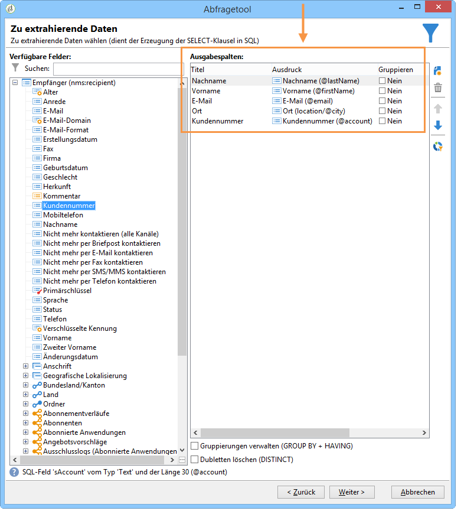
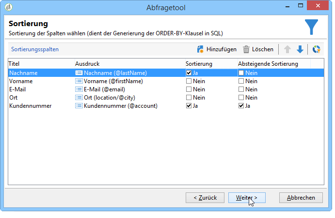
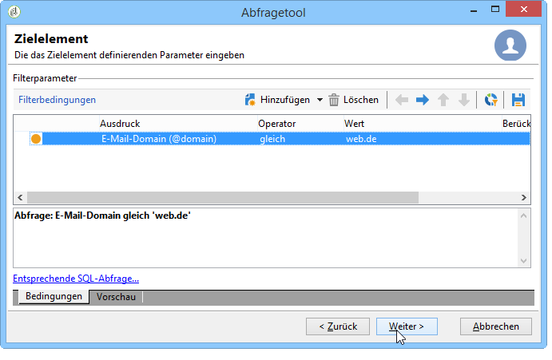
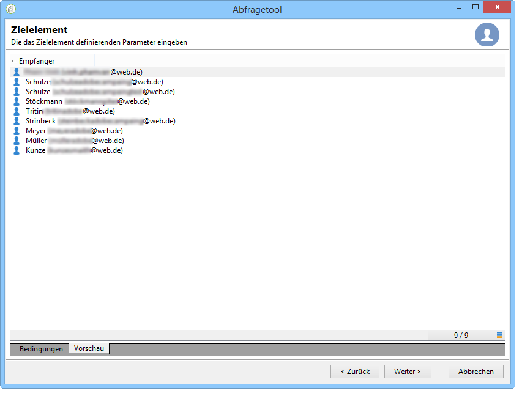
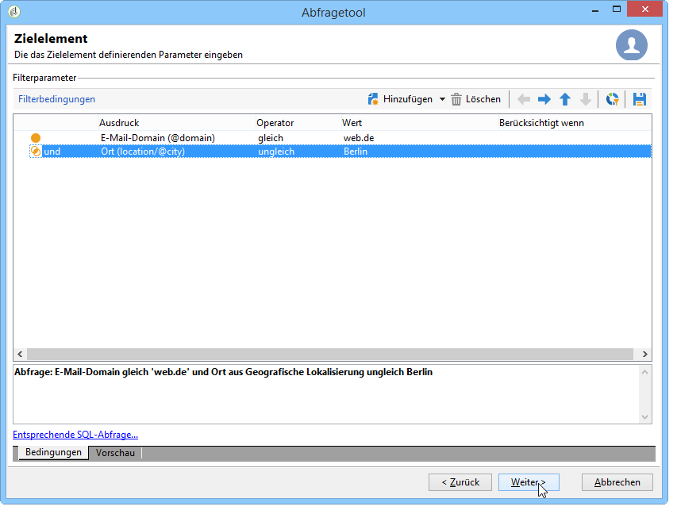
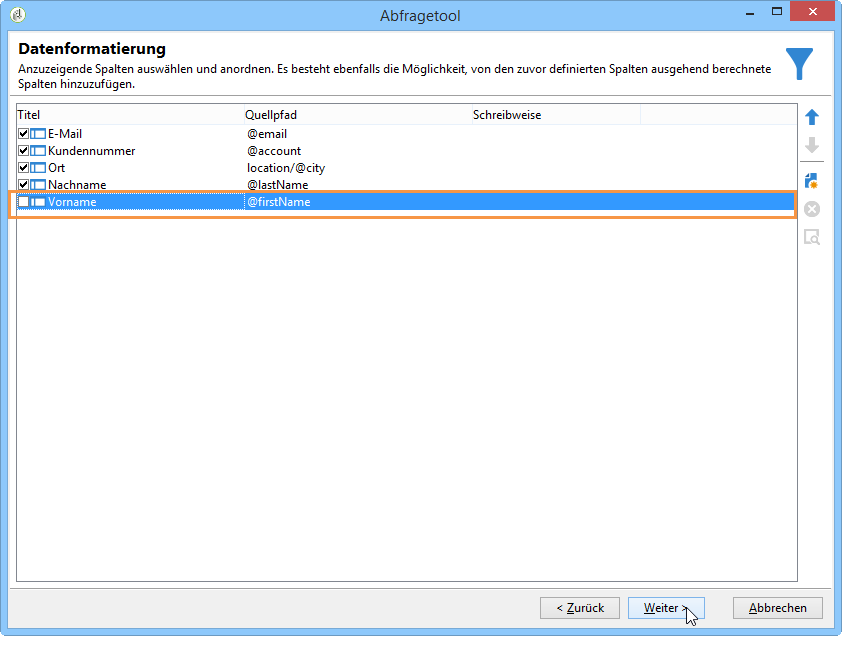
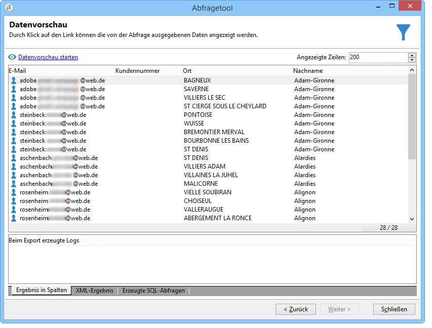
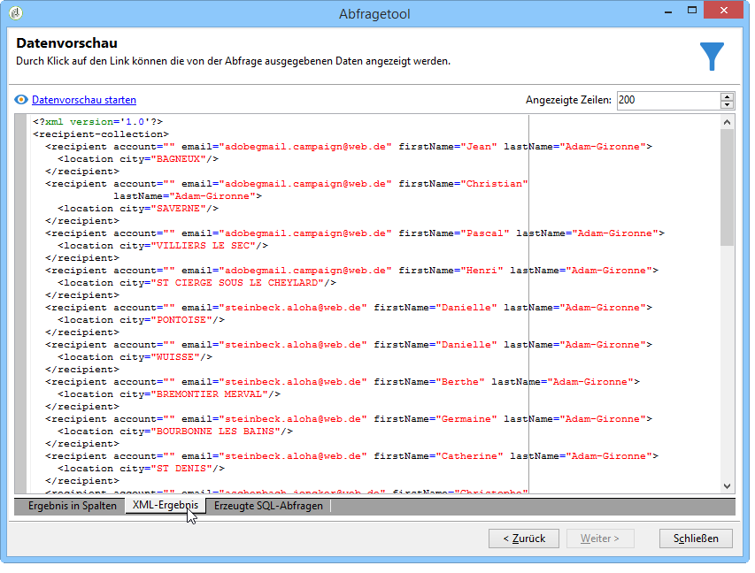
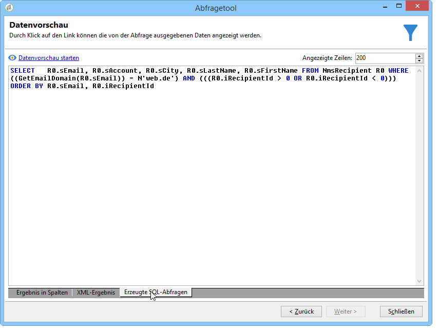

# Abfrage zur Empfängertabelle {#querying-recipient-table}

In diesem Beispiel werden die Namen und E-Mail-Adressen der Empfänger gesucht, deren E-Mail-Domain &quot;web.de&quot; ist und die nicht in Berlin wohnen.

* Welche Tabelle soll ausgewählt werden?

   Die Empfängertabelle (nms:recipient)

* Felder, die als Ausgabespalten verwendet werden sollen

   E-Mail, Name, Wohnort und Kundennummer

* Nach welchen Kriterien sind die Empfänger zu filtern?

   Nach Wohnort und E-Mail-Domain

* Wird das Ergebnis sortiert?

   Ja, basierend auf **[!UICONTROL Account number]** und **[!UICONTROL Last name]**

Gehen Sie wie folgt vor:

1. Klicken Sie auf **[!UICONTROL Tools > Generic query editor...]** und wählen Sie die **Tabelle Empfänger** (**nms:empfänger**). Klicken Sie dann auf **[!UICONTROL Next]**.
1. Wählen Sie: **[!UICONTROL Last name]**, **[!UICONTROL First name]**, **[!UICONTROL Email]**, **[!UICONTROL City]** und **[!UICONTROL Account number]**. Diese Felder werden hinzugefügt **[!UICONTROL Output columns]**. Klicken Sie dann auf **[!UICONTROL Next]**.

   

1. Sort the columns to display them in the right order. Here we want to sort account numbers in descending order and names in alphabetical order. Then click **[!UICONTROL Next]**.

   

1. Verfeinern Sie im **[!UICONTROL Data filtering]** Fenster die Suche: Wählen Sie **[!UICONTROL Filtering conditions]** und klicken Sie auf **[!UICONTROL Next]**.
1. The **[!UICONTROL Target element]** window lets you enter the filter settings.

   Definieren Sie die folgende Filterbedingung: Empfänger mit einer E-Mail-Domäne gleich &quot;orange.co.uk&quot;. Wählen Sie dazu in der **Spalte die Option** E-Mail-Domäne (@email)**[!UICONTROL Expression]** , wählen Sie **gleich** in der **[!UICONTROL Operator]** Spalte und geben Sie &quot;orange.co.uk&quot;in die **[!UICONTROL Value]** Spalte ein.

   

1. Klicken Sie bei Bedarf auf die **[!UICONTROL Distribution of values]** Schaltfläche, um eine Distribution anzuzeigen, die auf der E-Mail-Domäne der Interessenten basiert. Für jede E-Mail-Domäne in der Datenbank ist ein Prozentsatz verfügbar. Andere Domänen als &quot;orange.co.uk&quot;werden angezeigt, bis der Filter angewendet wird.

   Die Zusammenfassung der Abfrage wird unten im Fenster angezeigt, hier also **E-Mail-Domain gleich web.de**.

1. Click the **[!UICONTROL Preview]** to get an idea of the query result: only &quot;orange.co.uk&quot; email domains are displayed.

   

1. Ändern Sie die Abfrage, um nur die Empfänger anzuzeigen, die nicht in Berlin wohnen.

   Wählen Sie **[!UICONTROL City (location/@city)]** in der **[!UICONTROL Expression]** Spalte **[!UICONTROL different from]** als Operator und geben Sie **[!UICONTROL London]** in die **[!UICONTROL Value]** Spalte ein.

   

1. Das bringt dich zum **[!UICONTROL Data formatting]** Fenster. Überprüfen Sie die Spaltenreihenfolge. Verschieben Sie die Spalte &quot;Stadt&quot;unter der Spalte &quot;Kontonummer&quot; nach oben.

   Entfernen Sie das Kreuz aus der &quot;Vorname&quot;-Checkbox, um dieses Feld im Ergebnis nicht anzuzeigen.

   

1. Klicken Sie im **[!UICONTROL Data preview]** Fenster auf **[!UICONTROL Start the preview of the data]**. Diese Funktion berechnet das Ergebnis der Abfrage.

   The **[!UICONTROL Column results]** tab shows the query result in columns.

   Die Ergebnistabelle enthält alle Empfänger, deren E-Mail-Domain &quot;web.de&quot; ist, und die nicht in Berlin wohnen. Die Vornamen werden nicht angezeigt, da diese Spalte im verangehenden Schritt abgewählt wurde. Die Kundennummern wurden in absteigender Reihenfolge sortiert.

   

   The **[!UICONTROL XML result]** tab shows the result in XML format.

   

   Die **[!UICONTROL Generated QSL queries]** Registerkarte zeigt das Abfrageergebnis im SQL-Format an.

   
