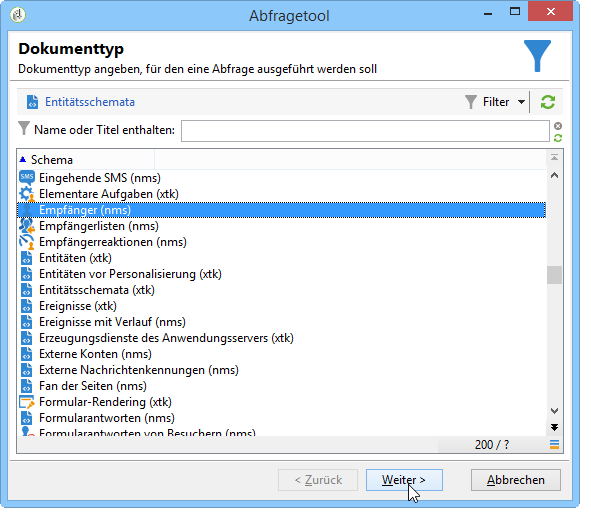
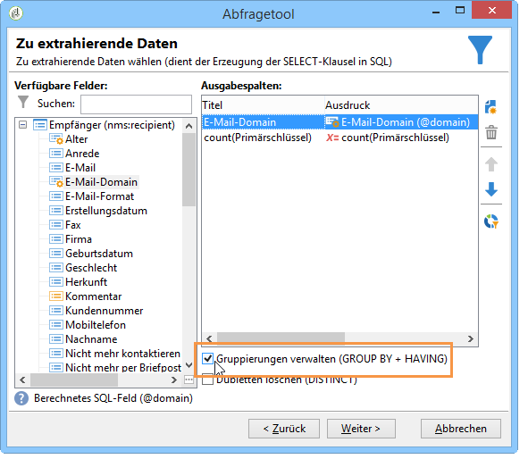
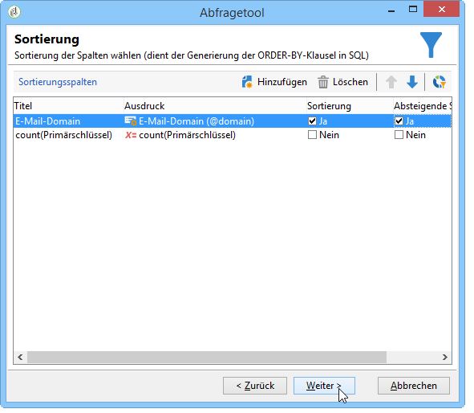
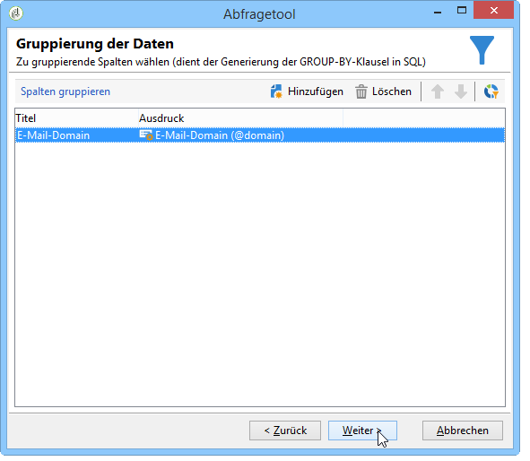
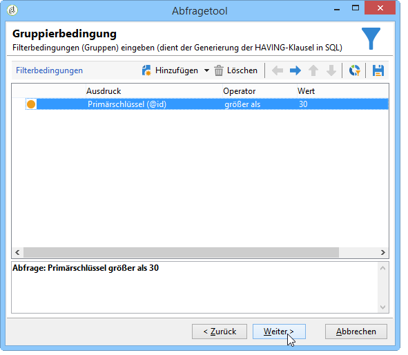
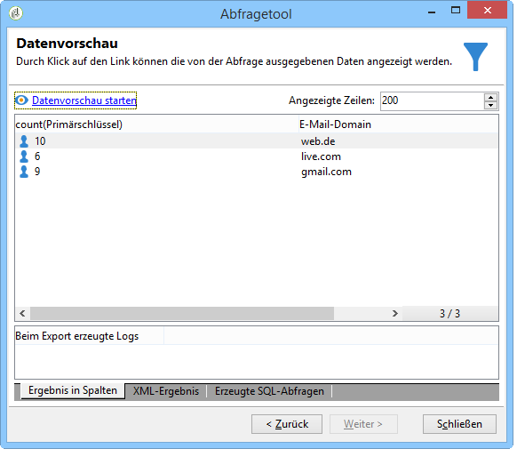

# Abfrage mit Gruppierungsbedingungen {#querying-using-grouping-management}

Im folgenden Beispiel werden die E-Mail-Domains gesucht, die bei früheren Sendungen mehr als 30-mal kontaktiert wurden.

* Welche Tabelle soll ausgewählt werden?

   Die Empfängertabelle (nms:recipient)

* Felder, die als Ausgabespalten verwendet werden sollen?

   E-Mail-Domain und Primärschlüssel (mit Zählung)

* Nach welchen Kriterien werden die Daten gruppiert?

   Basierend auf E-Mail-Domäne mit einer Anzahl von Primärschlüsseln über 30. Dieser Vorgang wird nach **[!UICONTROL Group by + Having]** Wahl durchgeführt. **[!UICONTROL Group by + Having]** können Sie Daten gruppieren (&quot;Gruppieren nach&quot;) und eine Auswahl dessen treffen, was gruppiert wurde (&quot;haben&quot;).

Gehen Sie wie folgt vor:

1. Open the **[!UICONTROL Generic query editor]** and choose the Recipient table (**nms:recipient**).

   

1. Wählen Sie im **[!UICONTROL Data to extract]** Fenster die Felder **[!UICONTROL Email domain]** und **[!UICONTROL Primary key]** aus. Führen Sie eine Zählung für das **[!UICONTROL Primary key]** Feld aus.

   Weiterführende Informationen zu Primärschlüsselzählungen finden Sie in [diesem Abschnitt](../../platform/using/defining-filter-conditions.md#building-expressions).

1. Markieren Sie das **[!UICONTROL Handle groupings (GROUP BY + HAVING)]** Kästchen.

   

1. Sortieren Sie im **[!UICONTROL Sorting]** Fenster E-Mail-Domänen in absteigender Reihenfolge. Dazu checken Sie **[!UICONTROL Yes]** die **[!UICONTROL Descending sort]** Spalte ein. Klicks **[!UICONTROL Next]**.

   

1. Wählen Sie **[!UICONTROL Data filtering]** in **[!UICONTROL Filtering conditions]**. Gehen Sie zum **[!UICONTROL Target elements]** Fenster und klicken Sie auf **[!UICONTROL Next]**.
1. Wählen Sie im **[!UICONTROL Data grouping]** Fenster die **[!UICONTROL Email domain]** durch Klicken auf **[!UICONTROL Add]**.

   Dieses Fenster für die Datengruppierung wird nur angezeigt, wenn das **[!UICONTROL Handle groupings (GROUP BY + HAVING]**)-Feld markiert wurde.

   

1. In the **[!UICONTROL Grouping condition]** window, indicate a primary key count greater than 30 since we only want email domains targeted more than 30 times to be returned as results.

   This window appears when the **[!UICONTROL Manage groupings (GROUP BY + HAVING)]** box was checked: this is where the grouping result is filtered (HAVING).

   

1. Klicken Sie im **[!UICONTROL Data formatting]** Fenster auf **[!UICONTROL Next]**: hier ist keine Formatierung erforderlich.
1. In the data preview window, click **[!UICONTROL Launch data preview]**: here, three different email domains targeted over 30 times are returned.

   
