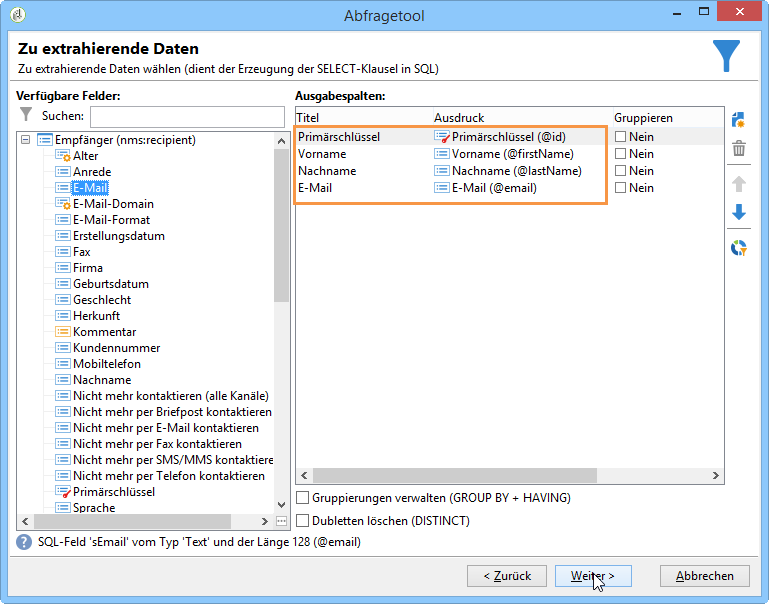
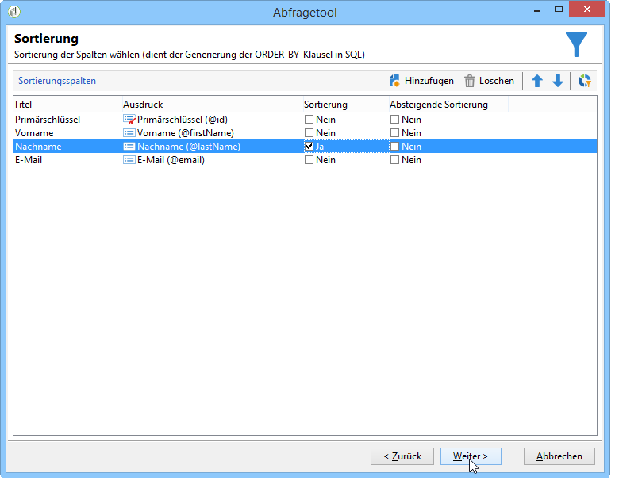
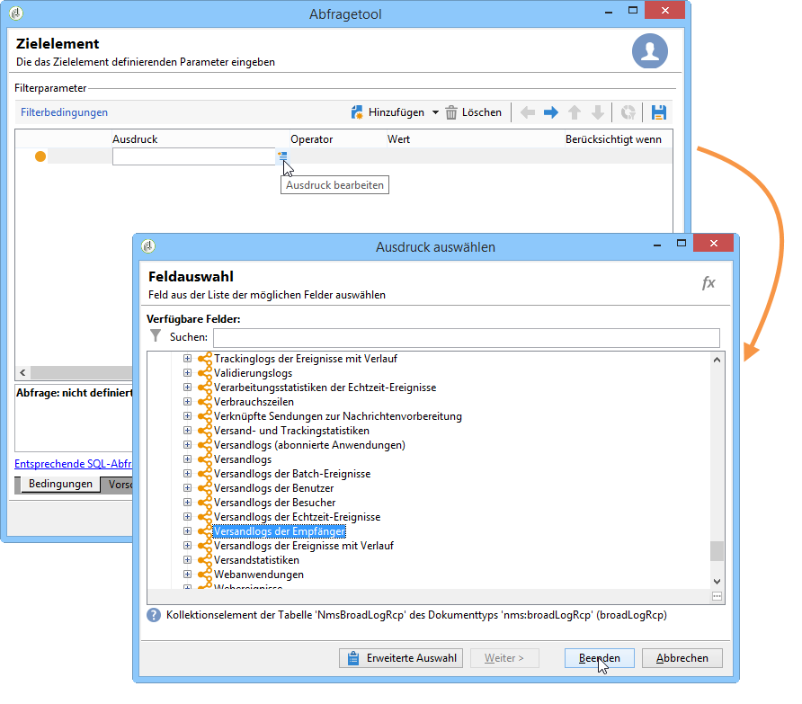
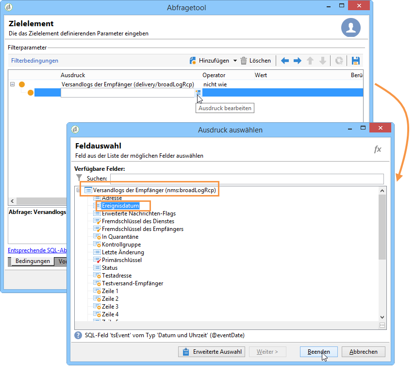
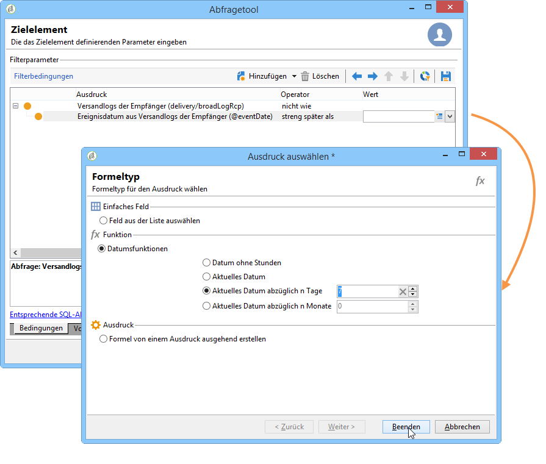
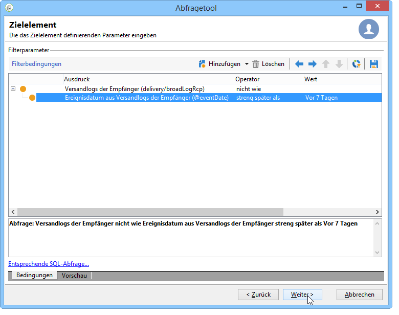
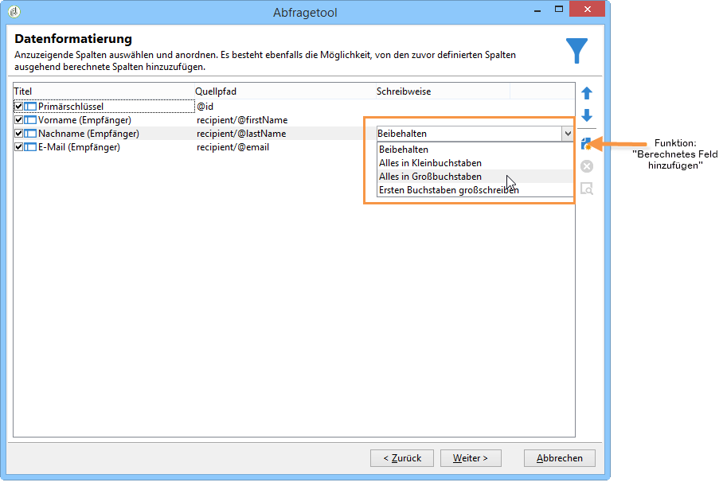
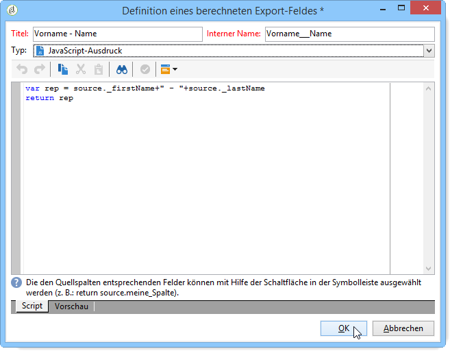
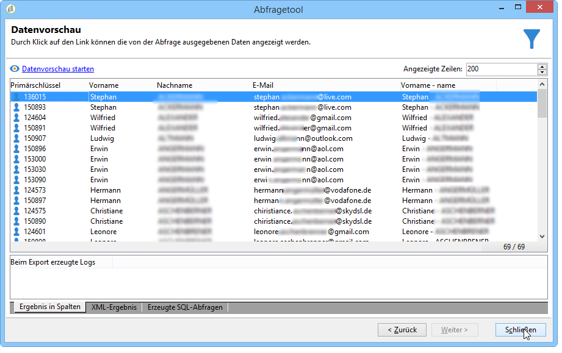

# Abfrage mit einer n:n-Relation {#querying-using-a-many-to-many-relationship}

In diesem Beispiel werden die Empfänger gesucht, die innerhalb der letzten sieben Tage nicht kontaktiert wurden.

Dieses Beispiel zeigt auch, wie ein Filter in Bezug auf die Auswahl eines Collection-Elements (oder eines orangefarbenen Knotens) konfiguriert wird. Sammlungselemente sind im **[!UICONTROL Field to select]** Fenster verfügbar.

* Welche Tabelle soll ausgewählt werden?

   Die Empfängertabelle (**nms:recipient**)

* Felder, die als Ausgabespalten verwendet werden sollen?

   Primärschlüssel, Nachname, Vorname und E-Mail

* Nach welchen Kriterien sind die Empfänger zu filtern?

   Nach den Versandlogs der Empfänger, bis 7 Tage vor dem Tagesdatum

Gehen Sie wie folgt vor:

1. Open the Generic query editor and select the Recipient table **[!UICONTROL (nms:recipient)]**.
1. Wählen Sie im **[!UICONTROL Data to extract]** Fenster **[!UICONTROL Primary key]**, **[!UICONTROL First name]** und **[!UICONTROL Last name]****[!UICONTROL Email]**.

   

1. Ordnen Sie im Sortierfenster die Nachnamen in alphabetischer Reihenfolge.

   

1. Wählen Sie im **[!UICONTROL Data filtering]** Fenster **[!UICONTROL Filtering conditions]**.
1. Im **[!UICONTROL Target element]** Fenster umfasst die Filterbedingung zum Extrahieren von Profilen ohne Verfolgungsprotokoll für die letzten 7 Tage zwei Schritte. Das Element, das Sie auswählen müssen, ist ein vielseitiger Link.

   * Wählen Sie zunächst das **[!UICONTROL Recipient delivery logs (broadlog)]** Collection-Element (orange-Node) für die erste **[!UICONTROL Value]** Spalte aus.

      

      Wählen Sie den **[!UICONTROL do not exist as]** Operator. Es ist nicht erforderlich, einen zweiten Wert in dieser Zeile auszuwählen.

   * Der Inhalt der zweiten Filterbedingung hängt von der ersten ab. Hier wird das **[!UICONTROL Event date]** Feld direkt in der **[!UICONTROL Recipient delivery logs]** Tabelle angeboten, da ein Link zu dieser Tabelle vorhanden ist.

      

      Wählen Sie **[!UICONTROL Event date]** mit dem **[!UICONTROL greater than or equal to]** Operator aus. Wählen Sie den **[!UICONTROL DaysAgo (7)]** Wert aus. Klicken Sie dazu auf **[!UICONTROL Edit expression]** das **[!UICONTROL Value]** Feld. Wählen Sie im **[!UICONTROL Formula type]** Fenster **[!UICONTROL Process on dates]** und **[!UICONTROL Current date minus n days]** geben Sie &quot;7&quot;als Wert ein.

      

      Hiermit ist die Konfiguration der Filterbedingung abgeschlossen.

      

1. Ändern Sie im **[!UICONTROL Data formatting]** Fenster die Nachnamen in Großbuchstaben. Klicken Sie auf die **[!UICONTROL Last name]** Zeile in der **[!UICONTROL Transformation]** Spalte und wählen Sie **[!UICONTROL Switch to upper case]** im Dropdown-Menü aus.

   

1. Verwenden Sie die **[!UICONTROL Add a calculated field]** Funktion, um eine Spalte in das Datenvorschaufenster einzufügen.

   Fügen Sie in diesem Beispiel ein berechnetes Feld mit dem Vor- und Nachnamen der Empfänger in einer einzigen Spalte hinzu. Klicken Sie auf die **[!UICONTROL Add a calculated field]** Funktion. Geben Sie im **[!UICONTROL Export calculated field definition]** Fenster eine Bezeichnung und einen internen Namen ein und wählen Sie den **[!UICONTROL JavaScript Expression]** Typ. Geben Sie dann den folgenden Ausdruck ein:

   ```
   var rep = source._firstName+" - "+source._lastName
   return rep
   ```

   

   Klicks **[!UICONTROL OK]**. Das **[!UICONTROL Data formatting]** Fenster ist konfiguriert.

   Weiterführende Informationen zum Hinzufügen berechneter Felder finden Sie in diesem Abschnitt.

1. Das Ergebnis wird im **[!UICONTROL Data preview]** Fenster angezeigt. Empfänger, die in den letzten 7 Tagen nicht kontaktiert wurden, werden in alphabetischer Reihenfolge angezeigt. Namen werden in Großbuchstaben angezeigt und die Spalte mit Vor- und Nachnamen wurde erstellt.

   
