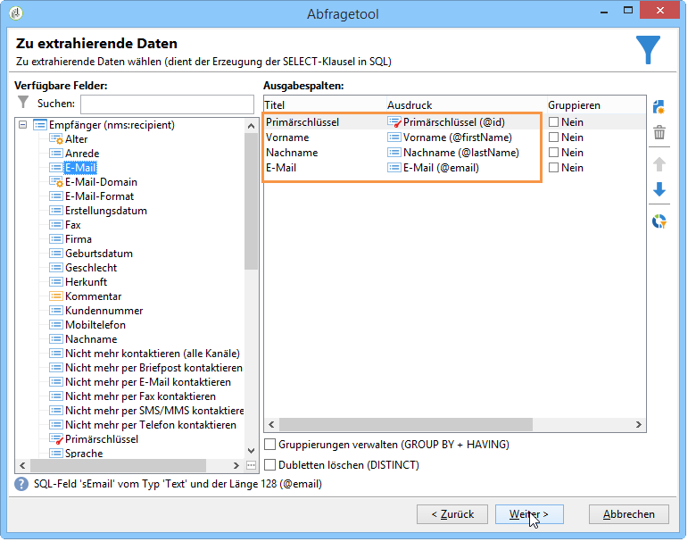
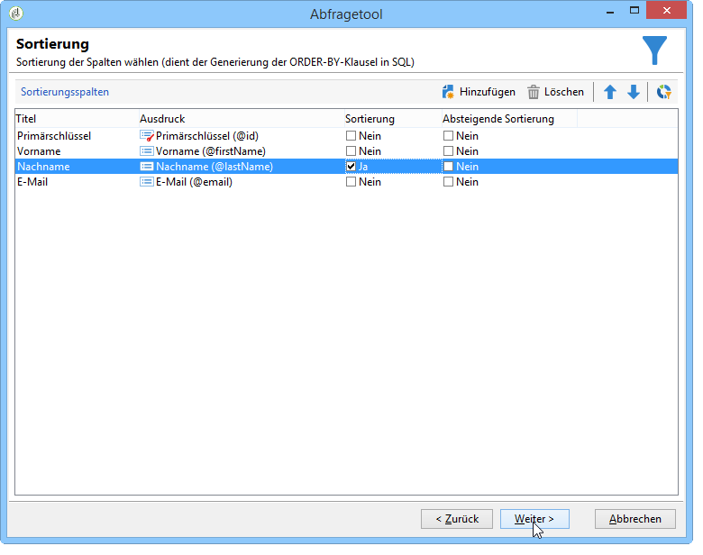
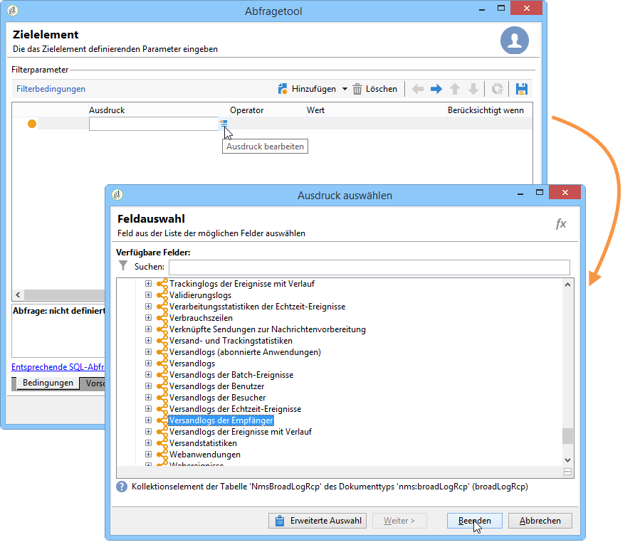
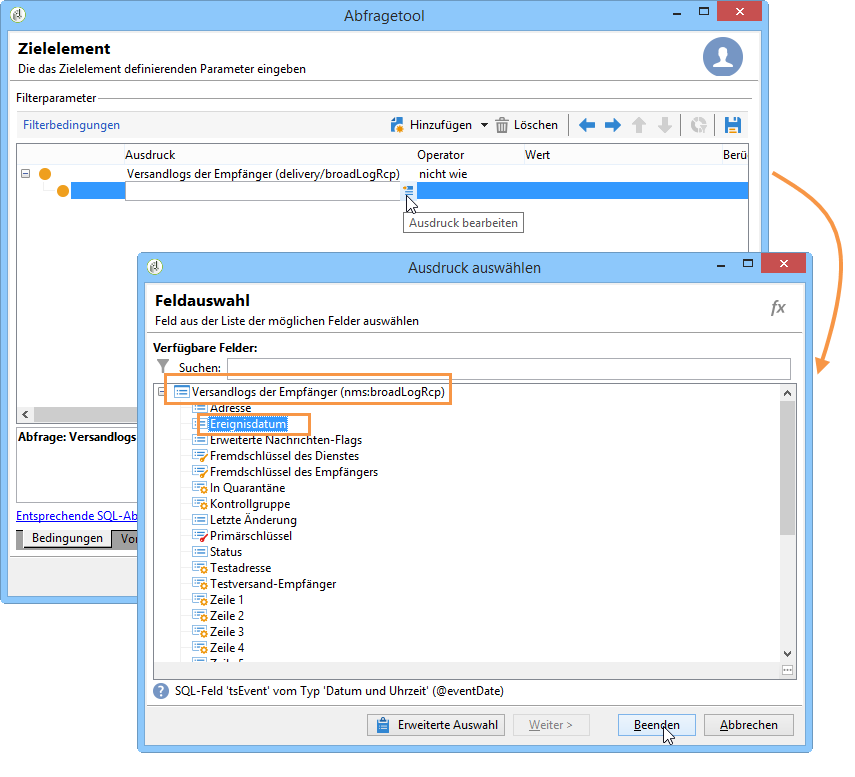
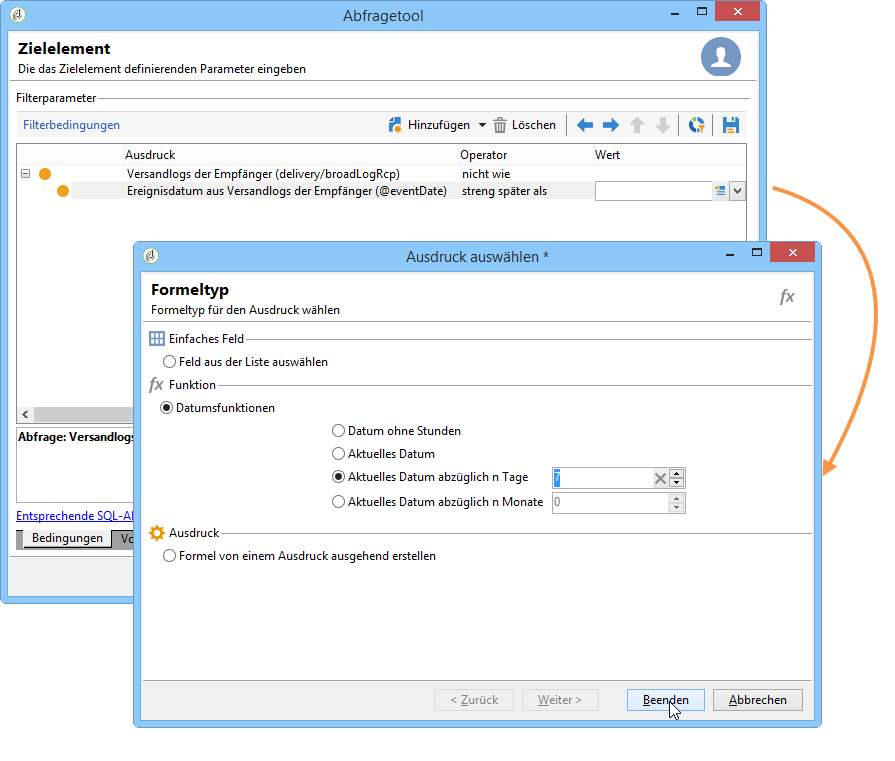
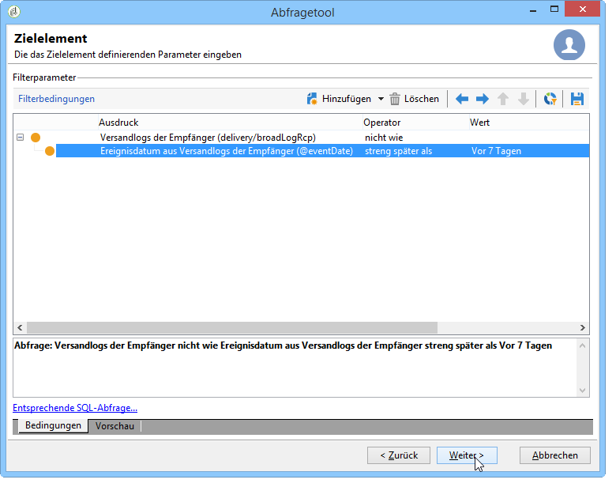
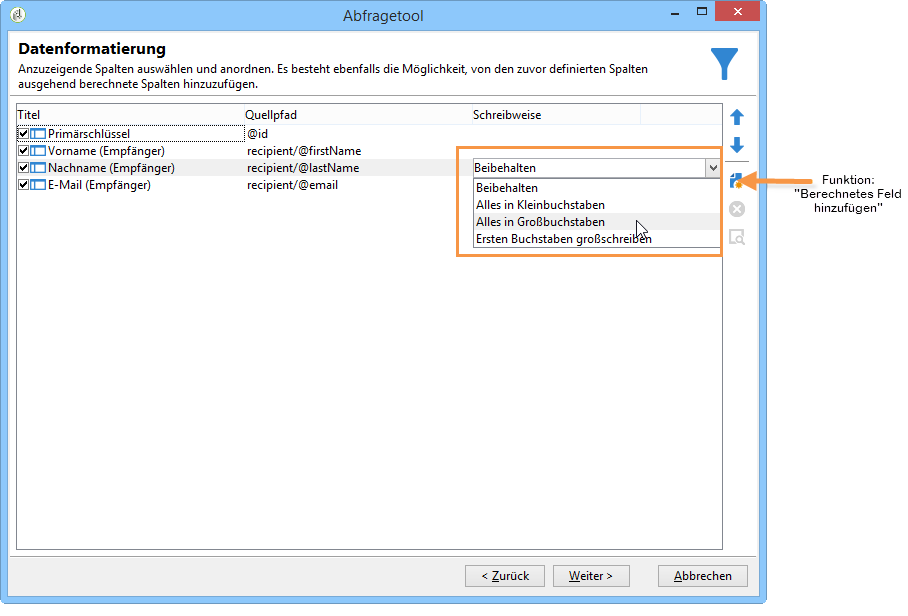
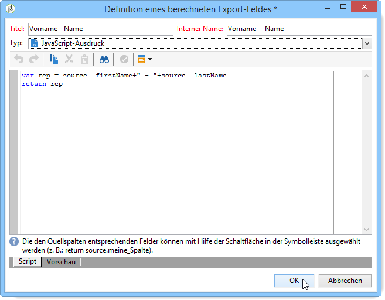
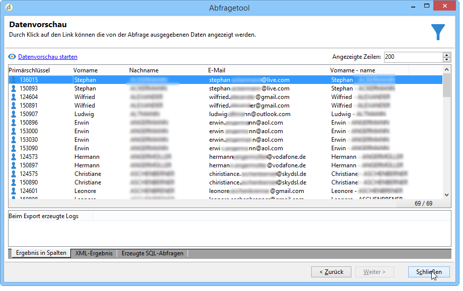

# Abfrage mit einer Viele-zu-viele-Beziehung {#querying-using-a-many-to-many-relationship}


In diesem Beispiel möchten wir Empfänger wiederherstellen, die in den letzten 7 Tagen nicht kontaktiert wurden. Diese Abfrage betrifft alle Sendungen.

Dieses Beispiel zeigt auch, wie Sie einen Filter konfigurieren, der mit der Auswahl eines Sammlungselements (oder orangefarbenen Knotens) verbunden ist. Sammlungselemente stehen im Fenster **[!UICONTROL Feld zur Auswahl]** zur Verfügung.

* Welche Tabelle soll ausgewählt werden?

  Die Empfängertabelle (**nms:recipient**)

* Felder, die als Ausgabespalten verwendet werden sollen?

  Primärschlüssel, Nachname, Vorname und E-Mail

* Nach welchen Kriterien sind die Empfänger zu filtern?

  Nach den Versandlogs der Empfänger, bis 7 Tage vor dem Tagesdatum

Gehen Sie wie folgt vor:

1. Öffnen Sie den generischen Abfrage-Editor und wählen Sie die Empfängertabellen-**[!UICONTROL (nms:recipient)]**.
1. Wählen Sie im Fenster **[!UICONTROL Zu extrahierende Daten]** die Felder **[!UICONTROL Primärschlüssel]**, **[!UICONTROL Vorname]**, **[!UICONTROL Nachname]** und **[!UICONTROL E-Mail]**.

   

1. Ordnen Sie im Sortierfenster die Nachnamen in alphabetischer Reihenfolge.

   

1. Wählen Sie dann im **[!UICONTROL Datenfilter]**-Fenster die Option **[!UICONTROL Filterbedingungen]**.
1. Im Fenster **[!UICONTROL Zielelement]** umfasst die Filterbedingung für die Extraktion von Profilen ohne Trackinglog für die letzten 7 Tage zwei Schritte. Bei dem Element, das Sie auswählen müssen, handelt es sich um einen n:n-Link.

   * Wählen Sie also im **[!UICONTROL Ausdruck]**-Feld das durch einen orangefarbenen Knoten symbolisierte Sammlungselement **[!UICONTROL Versandlogs der Empfänger (broadLog)]**.

     

     Wählen Sie den Operator **[!UICONTROL existiert nicht als]**. Es ist nicht erforderlich, einen zweiten Wert in dieser Zeile auszuwählen.

   * Der Inhalt der zweiten Filterbedingung hängt von der ersten ab. Hier wird das Feld **[!UICONTROL Ereignisdatum]** aus der Tabelle **[!UICONTROL Versandlogs der Empfänger]** vorgeschlagen, da eine Relation mit dieser Tabelle besteht.

     

     Wählen Sie also **[!UICONTROL Ereignisdatum]** und den Operator **[!UICONTROL größer als oder gleich]** aus. Wählen Sie den Wert **[!UICONTROL DaysAgo (7)]** aus. Klicken Sie hierzu im Feld **[!UICONTROL Wert]** auf **[!UICONTROL Ausdruck bearbeiten]**. Wählen Sie im Fenster **[!UICONTROL Formeltyp]** die Option **[!UICONTROL Datumsfunktionen]** und **[!UICONTROL Aktuelles Datum abzüglich n Tage]**. Geben Sie den Wert „7“ ein.

     

     Hiermit ist die Konfiguration der Filterbedingung abgeschlossen.

     

1. Im Fenster **[!UICONTROL Datenformatierung]** können Sie die Anzeige dahingehend ändern, dass alle Nachnamen in Großbuchstaben angezeigt werden. Klicken Sie hierfür in der Zeile **[!UICONTROL Nachname]** auf **[!UICONTROL Schreibweise]** und wählen Sie **[!UICONTROL Alles in Großbuchstaben]** aus der Dropdownliste.

   

1. Verwenden Sie die Funktion **[!UICONTROL Berechnetes Feld hinzufügen]**, um eine neue Spalte zu erstellen.

   Fügen Sie in diesem Beispiel ein berechnetes Feld mit dem Vor- und Nachnamen der Empfangenden in einer Spalte hinzu. Klicken Sie also auf **[!UICONTROL Berechnetes Feld hinzufügen]**. Geben Sie im Fenster **[!UICONTROL Definition eines berechneten Export-Feldes]** einen Titel und einen internen Namen für die neue Spalte ein. Wählen Sie den Typ **[!UICONTROL JavaScript-Ausdruck]** aus der Dropdown-Liste. Geben Sie folgenden Ausdruck ein:

   ```
   var rep = source._firstName+" - "+source._lastName
   return rep
   ```

   

   Klicken Sie auf **[!UICONTROL OK]**. Die Konfiguration des **[!UICONTROL Datenformatierung]**-Fensters ist abgeschlossen.

   Weiterführende Informationen zum Hinzufügen berechneter Felder finden Sie in diesem Abschnitt.

1. Das Ergebnis wird im Fenster **[!UICONTROL Datenvorschau“]**. Empfänger, die in den letzten 7 Tagen nicht kontaktiert wurden, werden in alphabetischer Reihenfolge angezeigt. Namen werden in Großbuchstaben angezeigt und die Spalte mit Vor- und Nachnamen wurde erstellt.

   
