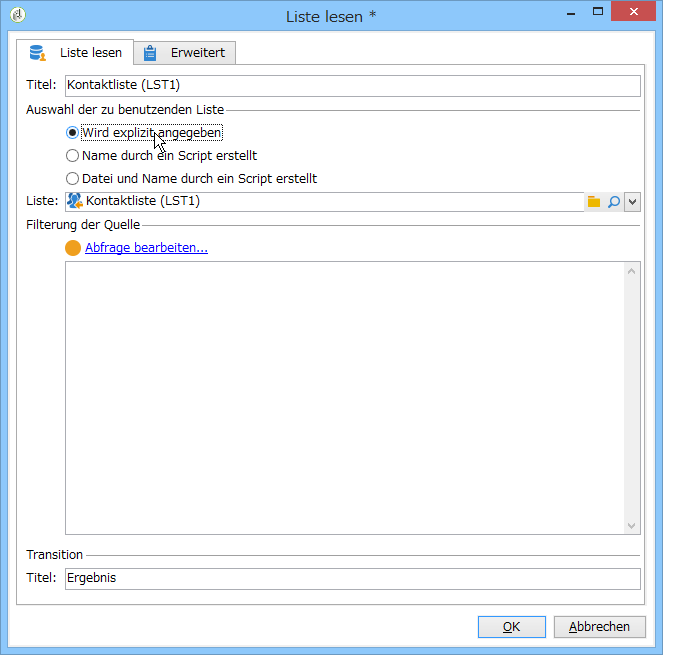
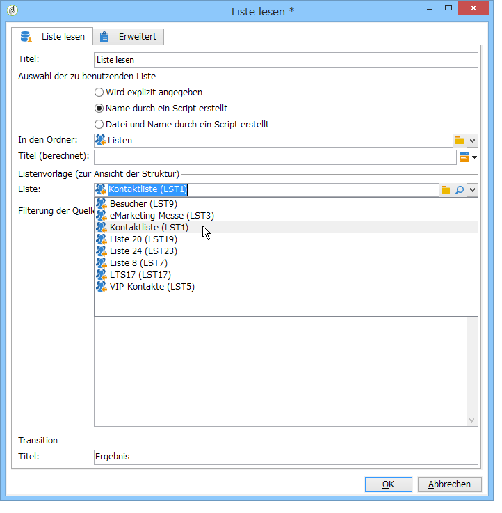
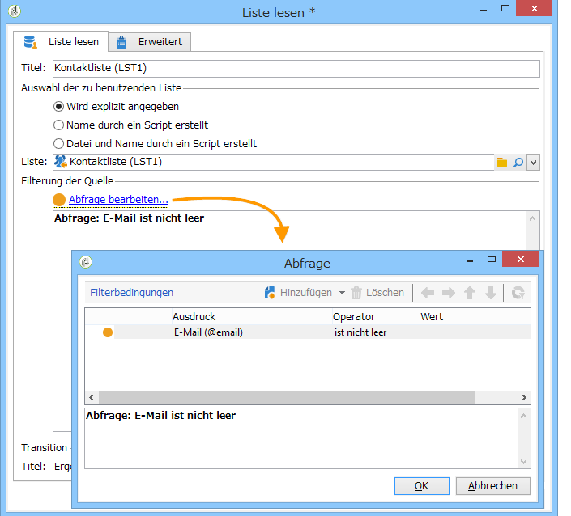
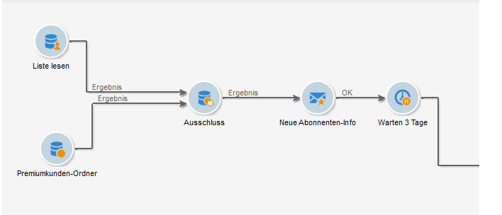
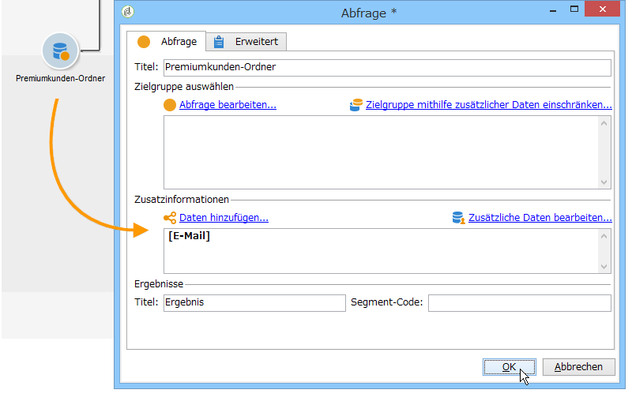
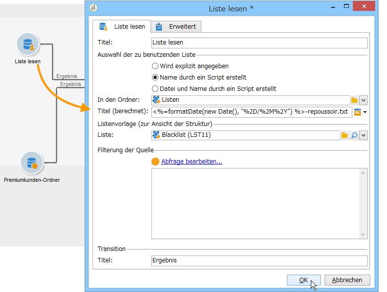
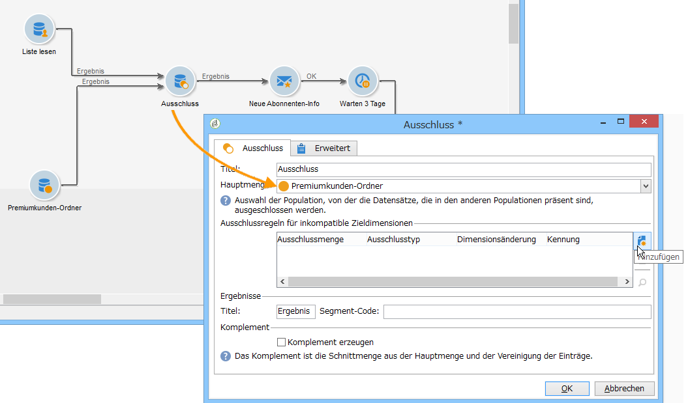
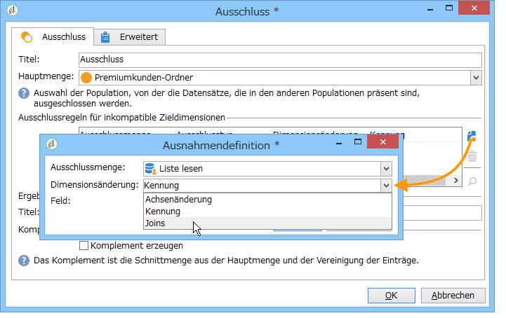

# Liste lesen{#read-list}

In Workflows genutzte Daten können aus Listen stammen, deren Daten zuvor aufbereitet und strukturiert wurden, beispielsweise in einer früheren Segmentierung oder im Zuge eines Datei-Ladevorgangs.

Mit der **[!UICONTROL Read list]** Aktivität können Sie die Daten aus einer Liste in der Workflow-Tabelle kopieren, z. B. Daten aus einer Abfrage. Er ist dann im gesamten Workflow verfügbar.

The list to be processed can be specified explicitly, computed by a script or localized dynamically, according to options selected and parameters defined in a **[!UICONTROL Read list]** activity.

Wenn die Liste nicht explizit bezeichnet wird, ist eine Beispielliste anzugeben, die als Strukturvorlage verwendet wird.

Once the list selection has been configured, you can add a filter using the **[!UICONTROL Edit query]** option to keep one part of the population for the next workflow.

>[!CAUTION]
>
>Um in einer Liste-lesen-Aktivität Filter verwenden zu können, muss die Liste als Datei vorliegen.

Die Listen können direkt in Adobe Campaign über den **[!UICONTROL Profiles and Targets > Lists]** Link der Homepage erstellt werden. Sie können auch in einem Workflow mithilfe der **[!UICONTROL List update]** Aktivität erstellt werden.

**Anwendungsbeispiel: Ausschluss einer Adressenliste von einem Versand**

Im folgenden Beispiel soll eine Datei mit Adressen importiert werden, die gundsätzlich vom E-Mail-Versand auszuschließen sind (beispielsweise, weil die Empfänger nicht mehr existieren).

Die im **Premiumkunden**-Ordner enthaltenen Profile sollen im Rahmen einer Marketingkampagne kontaktiert werden. Eine externe Liste enthält vom Versand auszuschließende Adressen. Für das vorliegende Beispiel werden nur die E-Mail-Adressen benötigt, um den Ausschluss vorzunehmen.

1. Die zum Laden der im **Premiumkunden**-Ordner enthaltenen Empfänger erstellte Abfrage muss die E-Mail-Adressen der Empfänger ausgeben, um die Abstimmung mit der Ausschlussliste zu ermöglichen.

   

1. Im vorliegenden Beispiel ist die Liste im Ordner **Listen** gespeichert und der Titel wird berechnet.

   

1. Konfigurieren Sie die Ausschlussaktivität, indem Sie den Ordner **Premiumkunden** als Hauptmenge angeben. Dies bedeutet, dass dieser Ordner die beizubehaltenden Daten enthält, dass jedoch alle Datensätze, die sowohl in diesem Ordner als auch in einer anderen in die Ausschlussaktivität eingehenden Datei enthalten sind, von der Zielgruppe ausgeschlossen werden.

   

   Ausschlussregeln werden im zentralen Bereich des Bearbeitungswerkzeugs konfiguriert. Klicken Sie auf die **[!UICONTROL Add]** Schaltfläche, um den anzuwendenden Ausschlusstyp zu definieren.

   Sie können für jede in die Aktivität eingehende Transition einen Ausschluss definieren.

1. In the **[!UICONTROL Exclusion set]** field, select the **[!UICONTROL Read list]** activity: the data in this activity is to be excluded from the main set.

   In unserem Beispiel haben wir einen Ausschluss von Joins: Die in der Liste enthaltenen Daten werden über das Feld mit der E-Mail-Adresse mit den Daten des Hauptsatzes abgeglichen. Um die Verbindung zu konfigurieren, wählen Sie **[!UICONTROL Joins]** im **[!UICONTROL Change dimension]** Feld aus.

   

1. Wählen Sie dann für die Quelle und das Bestimmungsziel das der E-Mail-Adresse entsprechende Feld aus. Die Spalten werden entsprechend zugeordnet und die Empfänger, deren E-Mail-Adresse in der importierten Liste enthalten ist, werden aus der Zielgruppe ausgeschlossen.

