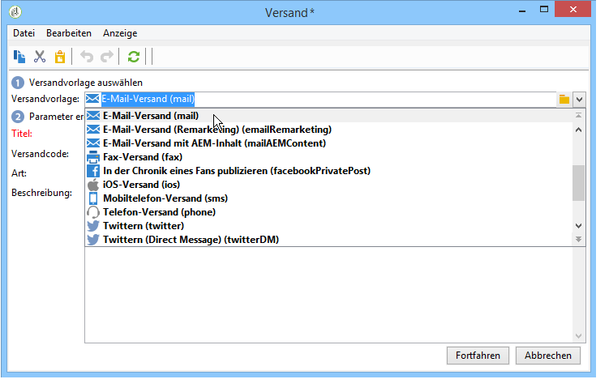

# Wiederkehrender Versand{#recurring-delivery}

Ein **[!UICONTROL wiederkehrender Versand]** dient der Konfiguration einer Versandvorlageninstanz im Rahmen einer Kampagne.

Diese Aktivität ist nur im Tab **[!UICONTROL Zielbestimmungen und Workflows]** von Kampagnen verfügbar.

Gehen Sie dazu wie folgt vor:

1. Wählen Sie die Versandvorlage aus, auf der die Aktivität basieren soll.

   

1. Konfigurieren Sie die Versandvorlage.

Die zur Verfügung stehenden Optionen entsprechen denen einer klassischen Versandvorlage. Weiterführende Informationen finden Sie in diesem [Abschnitt](../../delivery/using/about-templates.md).

Ein Anwendungsbeispiel für diese Aktivität ist in diesem [Abschnitt](../../workflow/using/sending-a-birthday-email.md#creating-a-recurring-delivery-in-a-targeting-workflow) enthalten.

>[!NOTE]
>
>Die Durchführung von Testsendungen ist in der Aktivität **[!UICONTROL Wiederkehrender Versand]** nicht möglich.\
>Nutzen Sie zur direkten Erstellung von Sendungen in Kampagnen-Workflows die vorkonfigurierten kanalspezifischen Versandaktionen, wie z. B. **[!UICONTROL E-Mail-Versand]**.

