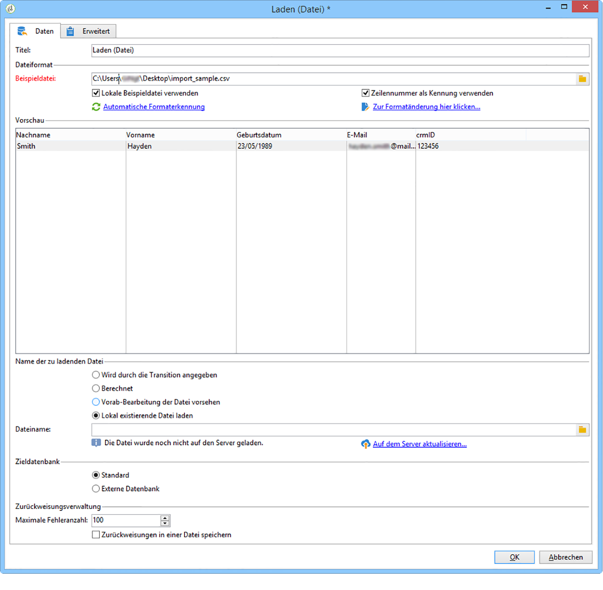
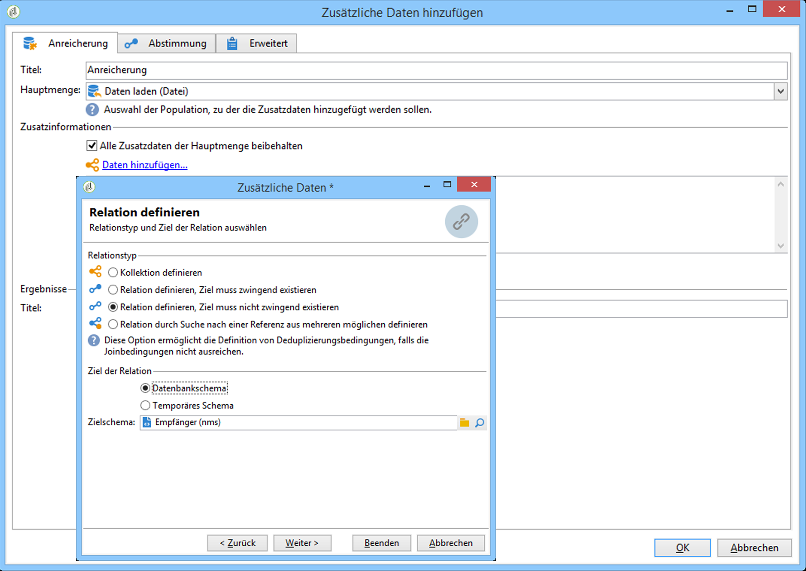
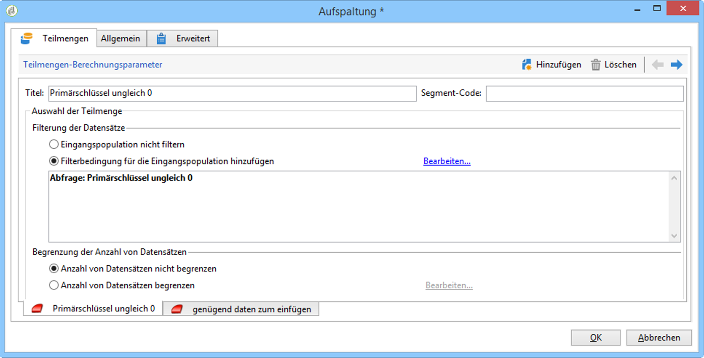
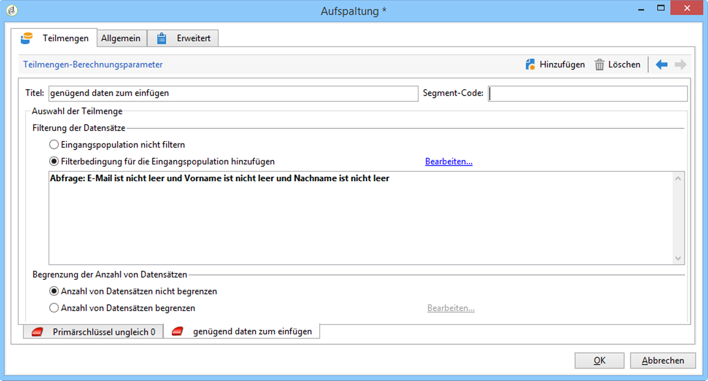
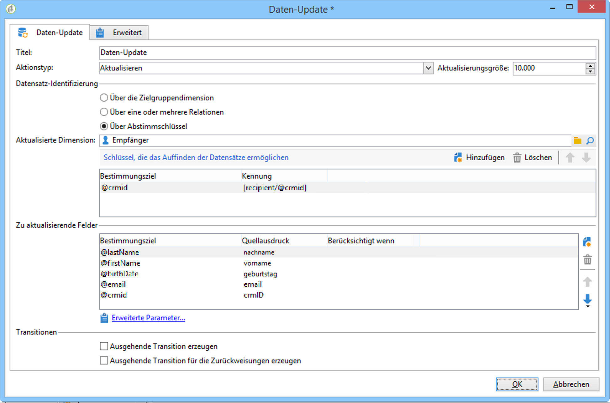

# Einrichten eines Workflows für den wiederkehrenden Import {#setting-up-a-recurring-import}


Für den regelmäßigen Import von Dateien derselben Struktur empfiehlt sich die Verwendung einer Workflow-Vorlage.

In diesem Beispiel wird gezeigt, wie ein Workflow für den wiederholten Import von Profilen aus einer CRM-Lösung in der Adobe Campaign-Datenbank erstellt wird. Weiterführende Informationen zu jeder Aktivität finden Sie in diesem [Abschnitt](about-activities.md).

1. Erstellen Sie eine neue Workflow-Vorlage unter **[!UICONTROL Ressourcen > Vorlagen > Workflow-Vorlagen]**.
1. Fügen Sie die folgenden Aktivitäten hinzu:

   * **[!UICONTROL Laden (Datei)]**: Definieren Sie die erwartete Struktur der Datei, die die zu importierenden Daten enthält.
   * **[!UICONTROL Anreicherung]**: Stimmen Sie die importierten Daten mit den Daten in der Datenbank ab.
   * **[!UICONTROL Aufspaltung]**: Erstellen Sie Filter, um Datensätze, die abgestimmt werden konnten, und jene, die nicht abgestimmt werden konnten, unterschiedlich zu verarbeiten.
   * **[!UICONTROL Deduplizierung]**: Deduplizieren Sie die Daten aus der eingehenden Datei, bevor sie zur Datenbank hinzugefügt werden.
   * **[!UICONTROL Daten-Update]**: Aktualisieren Sie die Datenbank mit den importierten Profilen.

   

1. Konfigurieren Sie die Aktivität **[!UICONTROL Laden (Datei)]**:

   * Definieren Sie die Struktur, die die Importdatei aufweisen soll, indem Sie eine Beispieldatei hochladen. Diese sollte nur einige wenige Zeilen aufweisen, aber alle für den Import erforderlichen Spalten. Prüfen und bearbeiten Sie das Dateiformat, um sicherzustellen, dass jeder Spaltentyp richtig eingerichtet ist: Text, Datum, Integer usw. Beispiel:

     ```
     lastname;firstname;birthdate;email;crmID
     Smith;Hayden;23/05/1989;hayden.smith@mailtest.com;123456
     ```

   * Wählen Sie im Bereich **[!UICONTROL Name der zu ladenden Datei]** die Option **[!UICONTROL Lokal existierende Datei laden]** und lassen Sie das Feld leer. Jedes Mal, wenn ein neuer Workflow von dieser Vorlage erstellt wird, können Sie hier die gewünschte Datei spezifizieren, solange sie der definierten Struktur entspricht.

     Sie können alle beliebigen Optionen verwenden, müssen aber die Vorlage entsprechend ändern. Wenn Sie beispielsweise **[!UICONTROL Wird durch die Transition angegeben]** auswählen, können Sie die Aktivität **[!UICONTROL Dateiübertragung]** hinzufügen, bevor Sie die zu importierende Datei von einem FTP-/SFTP-Server abrufen. Mit einer S3- oder SFTP-Verbindung können Sie auch Segmentdaten mit der Adobe-Echtzeit-Kundendatenplattform in Adobe Campaign importieren. Weitere Informationen hierzu finden Sie in [dieser Dokumentation](https://experienceleague.adobe.com/docs/experience-platform/destinations/catalog/email-marketing/adobe-campaign.html?lang=de).

     

1. Konfigurieren Sie die Aktivität **[!UICONTROL Anreicherung]**. Diese Aktivität hat in unserem Fall den Zweck, die eingehenden Daten zu identifizieren.

   * Wählen Sie im Tab **[!UICONTROL Anreicherung]** die Option **[!UICONTROL Daten hinzufügen]** und definieren Sie eine Verknüpfung zwischen den importierten Daten und der Zielgruppendimension der Empfänger. In unserem Beispiel wird diese Join-Bedingung mithilfe des benutzerdefinierten Feldes **Kennung im CRM** erstellt. Verwenden Sie das erforderliche Feld oder eine Kombination von Feldern, um eindeutige Datensätze zu identifizieren.
   * Lassen Sie im Tab **[!UICONTROL Abstimmung]** die Option **[!UICONTROL Dokument zur Zielgruppenbestimmung aufgrund der Arbeitsdaten identifizieren]** deaktiviert.

   

1. Konfigurieren Sie die Aktivität **[!UICONTROL Aufspaltung]**, um abgestimmte Empfänger in einer Transition abzurufen und Empfänger, die nicht abgestimmt werden konnten, aber genügend Daten enthalten, in einer anderen Transition abzurufen.

   Danach kann die Datenbank mit der Transition mit abgestimmten Empfängern aktualisiert werden. Mit der Transition mit unbekannten Empfängern können dann neue Empfängereinträge in der Datenbank erstellt werden, vorausgesetzt die Datei enthält ein Mindestmaß an Daten.

   Empfänger, die nicht abgestimmt werden können und nicht genügend Daten aufweisen, werden in einer komplementären ausgehenden Transition ausgewählt und können in einer separaten Datei exportiert oder einfach ignoriert werden.

   * Wählen Sie im Tab **[!UICONTROL Allgemein]** der Aktivität die Option **[!UICONTROL Nur zusätzliche Daten nutzen]** als Filterparameter und achten Sie darauf, dass für die **[!UICONTROL Zielgruppendimension]** automatisch **[!UICONTROL Anreicherung]** aktiviert wird.

     Aktivieren Sie die Option **[!UICONTROL Komplement erzeugen]**, um sich die Datensätze anzeigen zu lassen, die nicht in die Datenbank eingefügt werden können. Bei Bedarf können Sie dann für die komplementären Daten zusätzliche Verarbeitungsschritte setzen: Dateiexport, Listen-Update etc.

   * Fügen Sie der ersten Teilmenge des Tabs **[!UICONTROL Teilmengen]** eine Filterbedingung für die Eingangspopulation hinzu, um nur Datensätze auszuwählen, für die der Primärschlüssel der Empfänger nicht gleich 0 ist. Auf diese Weise werden in dieser Teilmenge Daten aus der Datei ausgewählt, die mit Empfängern aus der Datenbank abgestimmt sind.

     

   * Fügen Sie eine zweite Teilmenge hinzu, die nicht abgestimmte Datensätze enthält, die aber genügend Informationen für die Aufnahme in die Datenbank aufweisen. Beispiel: E-Mail-Adresse, Vor- und Nachname.

     Teilmengen werden in der Reihenfolge ihrer Erstellung verarbeitet. Bei der Verarbeitung dieser zweiten Teilmenge wurden deshalb alle in der Datenbank befindlichen Datensätze bereits in der ersten Teilmenge ausgewählt.

     

   * Alle nicht in den ersten beiden Teilmengen ausgewählten Datensätze werden im **[!UICONTROL Komplement]** ausgewählt.

1. Konfigurieren Sie die Aktivität **[!UICONTROL Daten-Update]**, die auf die erste ausgehende Transition der zuvor konfigurierten **[!UICONTROL Aufspaltung]** folgt.

   * Wählen Sie als **[!UICONTROL Kampagnentyp]** die Option **[!UICONTROL Aktualisieren]** aus, da die eingehende Transition nur bereits in der Datenbank vorhandene Empfänger enthält.
   * Wählen Sie im Bereich **[!UICONTROL Datensatz-Identifizierung]** die Option **[!UICONTROL Über Abstimmschlüssel]** aus und definieren Sie einen Schlüssel zwischen der Zielgruppendimension und der in der **[!UICONTROL Anreicherung]** erstellten Verknüpfung. In unserem Beispiel wird das benutzerdefinierte Feld **Kennung im CRM** verwendet.
   * Geben Sie im Bereich **[!UICONTROL Zu aktualisierende Felder]** an, welche Felder aus der Empfänger-Dimension mit dem Wert der entsprechenden Spalte in der Datei aktualisiert werden sollen. Wenn die Namen der Dateispalten mit den Namen der Dimensionsfelder der Empfänger übereinstimmen oder ihnen sehr ähnlich sind, können Sie die Felder mithilfe des Zauberstab-Symbols automatisch miteinander abstimmen.

     

1. Konfigurieren Sie die Aktivität **[!UICONTROL Deduplizierung]**, die auf die Transition nicht abgestimmter Empfänger folgt:

   * Wählen Sie **[!UICONTROL Konfiguration bearbeiten]** aus und danach für die Zielgruppendimension das temporäre Schema, das von der Aktivität **[!UICONTROL Anreicherung]** des Workflows erstellt wurde.

     

   * In diesem Beispiel wird das E-Mail-Feld zum Ermitteln eindeutiger Profile verwendet. Sie können aber auch jedes andere Feld verwenden, das ausgefüllt und Teil einer eindeutigen Kombination ist.
   * Wählen Sie im Bildschirm **[!UICONTROL Deduplizierungsmethode]** die Option **[!UICONTROL Erweiterte Parameter]** und aktivieren Sie die Option **[!UICONTROL Automatischen Filter der Datensätze mit ID=0 deaktivieren]**, um zu gewährleisten, dass Datensätze mit einem Primärschlüssel gleich 0 (d. h. alle Datensätze dieser Transition) nicht ausgeschlossen werden.

   

1. Konfigurieren Sie die Aktivität **[!UICONTROL Daten-Update]**, die auf die zuvor konfigurierte Aktivität **[!UICONTROL Deduplizierung]** folgt.

   * Wählen Sie als **[!UICONTROL Kampagnentyp]** die Option **[!UICONTROL Hinzufügen]** aus, da die eingehende Transition nur noch nicht in der Datenbank vorhandene Empfänger enthält.
   * Wählen Sie im Bereich **[!UICONTROL Datensatz-Identifizierung]** die Option **[!UICONTROL Über die Zielgruppendimension]** und dann die Dimension **[!UICONTROL Empfänger]** aus.
   * Geben Sie im Bereich **[!UICONTROL Zu aktualisierende Felder]** an, welche Felder aus der Empfänger-Dimension mit dem Wert der entsprechenden Spalte in der Datei aktualisiert werden sollen. Wenn die Namen der Dateispalten mit den Namen der Dimensionsfelder der Empfänger übereinstimmen oder ihnen sehr ähnlich sind, können Sie die Felder mithilfe des Zauberstab-Symbols automatisch miteinander abstimmen.

     

1. Fügen Sie nach der dritten Transition der Aktivität **[!UICONTROL Aufspaltung]** die Aktivität **[!UICONTROL Extraktion (Datei)]** und eine **[!UICONTROL Dateiübertragung]** hinzu, wenn Sie die noch nicht in die Datenbank übertragenen Daten verfolgen möchten. Konfigurieren Sie diese Aktivitäten, um die benötigte Spalte zu exportieren und die Datei auf einen FTP- oder SFTP-Server zu übertragen, wo Sie sie abrufen können.
1. Fügen Sie eine **[!UICONTROL Ende]**-Aktivität an und speichern Sie die Workflow-Vorlage.

Die Vorlage ist jetzt einsatzbereit und kann für jeden neuen Workflow verwendet werden. Dann muss nur noch die Datei spezifiziert werden, deren Daten in der Aktivität **[!UICONTROL Laden (Datei)]** importiert werden sollen.


