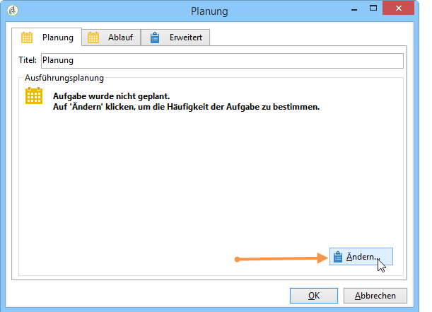
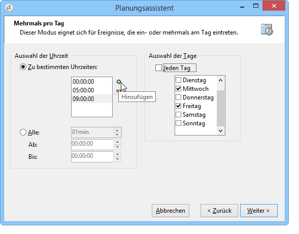
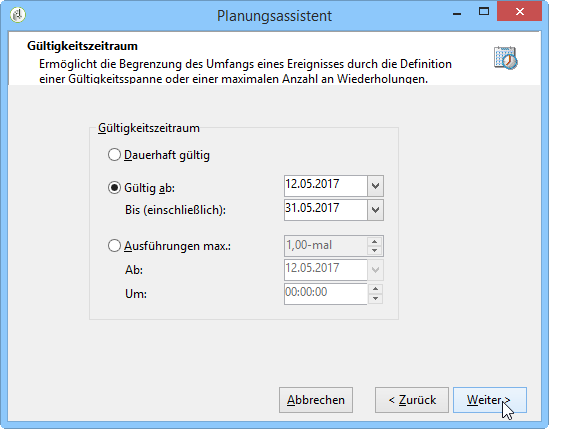
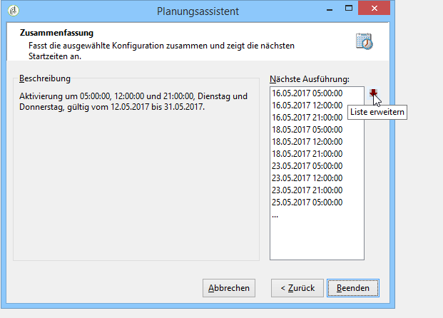

# Planung{#scheduler}

Die **Planung** ist eine persistente Aufgabe, die ihre ausgehende Transition zum konfigurierten Zeitpunkt aktiviert.

Eine **[!UICONTROL Planung]** entspricht einem programmierten Start, daher sind die gleichen Regeln zu beachten wie für die **[!UICONTROL Start]**-Aktivität. So darf die Planung beispielsweise keine eingehende Transition aufweisen.

Es wird empfohlen, Workflows nicht öfter als alle 15 Minuten auszuführen, da die Gesamtleistung des Systems beeinträchtigt werden kann und Blöcke in der Datenbank entstehen können.

Pro Workflow-Verzweigung darf nur eine einzige **[!UICONTROL Planung]** verwendet werden. Weitere Informationen hierzu finden Sie unter [Aktivitäten verwenden](../../workflow/using/workflow-best-practices.md#using-activities).

In der Planung wird die einmalige oder periodische Aktivierung der ausgehenden Transition geplant. Öffnen Sie hierzu die Aktivität und klicken Sie auf die Schaltfläche **[!UICONTROL Ändern...]**.

In den folgenden Schritten des Assistenten lassen sich die Frequenz der Ausführungen und die Gültigkeit der Aktivität festlegen. Gehen Sie wie folgt vor:

1. Kreuzen Sie die gewünschte Häufigkeit an und klicken Sie auf **[!UICONTROL Weiter]**.

   

1. Geben Sie die Tage und Uhrzeit der Ausführung an. Die zur Verfügung stehenden Parameter hängen von der im ersten Schritt ausgewählten Häufigkeit ab. Wenn Sie die Aktivität mehrmals täglich aktivieren, sind folgende Optionen verfügbar:

   

1. Definieren Sie im nächsten Schritt die Gültigkeit der Planung oder die maximale Anzahl an Ausführungen.

   

1. Prüfen Sie im letzten Schritt die Konfiguration und klicken Sie auf **[!UICONTROL Beenden]**, um sie zu speichern.

   

Die Verwendung einer Planungsaktivität kann dazu führen, dass mehrere Workflow-Ausführungen gleichzeitig vorgenommen werden. Beispielsweise könnte die Workflow-Ausführung stündlich ausgelöst werden, manchmal aber länger als eine Stunde dauern. Wenn der Workflow bereits ausgeführt wird, ist es empfehlenswert, den Start einer weiteren Ausführung zu überspringen. Weitere Informationen hierzu, wie Sie gleichzeitige Ausführungen eines Workflows verhindern können, finden Sie auf [dieser Seite](../../workflow/using/monitoring-workflow-execution.md#preventing-simultaneous-multiple-executions).

Es ist des Weiteren zu beachten, dass die Transition u. U. mit mehreren Stunden Verspätung aktiviert werden kann, wenn der Workflow eine Aufgabe ausführt, die über einen längeren Zeitraum läuft (z. B. ein Import) oder wenn das wfserver-Modul für eine gewisse Dauer inaktiv war. In diesem Fall ist es empfehlenswert, die Ausführung der von der Planung aktivierten Aufgabe auf einen bestimmten Zeitraum zu beschränken.
