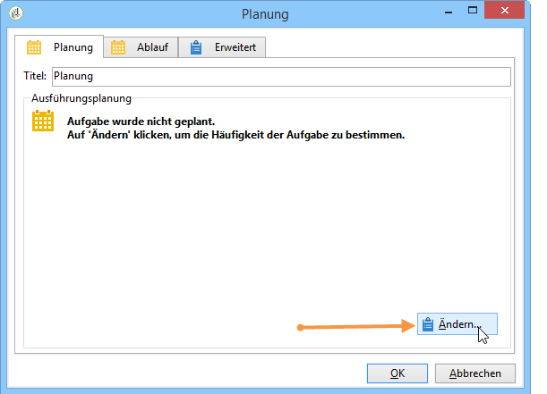
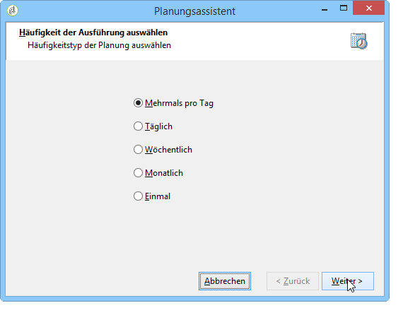
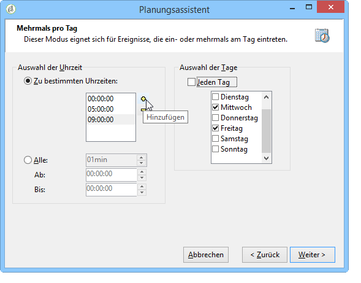
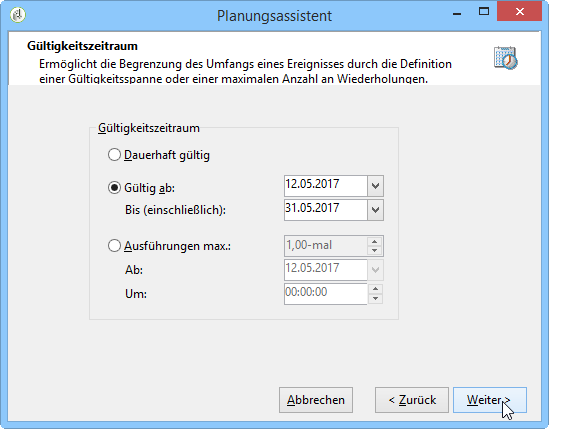
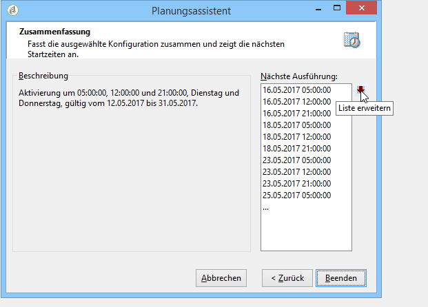

# Planung {#scheduler}

Die **Planung** ist eine persistente Aufgabe, die ihre ausgehende Transition zum konfigurierten Zeitpunkt aktiviert.

Eine **[!UICONTROL Planung]** entspricht einem programmierten Start, daher sind die gleichen Regeln zu beachten wie für die **[!UICONTROL Start]**-Aktivität. So darf die Planung beispielsweise keine eingehende Transition aufweisen.

## Best Practices {#best-practices}

* Es wird empfohlen, Workflows nicht öfter als alle 15 Minuten auszuführen, da die Gesamt-Performance des Systems beeinträchtigt werden kann und Blöcke in der Datenbank entstehen können.

* Verwenden Sie in einem Workflow nie mehr als eine **[!UICONTROL Planungs]**-Aktivität pro Verzweigung. Siehe [Verwenden von Aktivitäten](workflow-best-practices.md#using-activities).

* Die Verwendung einer Planungsaktivität kann dazu führen, dass mehrere Workflow-Ausführungen gleichzeitig vorgenommen werden. Beispielsweise kann eine Planung die Workflow-Ausführung stündlich auslösen, während die Ausführung des gesamten Workflows aber mehr als eine Stunde dauert.

  Sie können die Ausführung ggf. überspringen, wenn der Workflow bereits ausgeführt wird. Weitere Informationen hierzu, wie Sie gleichzeitige Ausführungen eines Workflows verhindern können, finden Sie auf [dieser Seite](monitoring-workflow-execution.md#preventing-simultaneous-multiple-executions).

* Beachten Sie, dass die Transition mehrere Stunden später aktiviert werden kann, wenn der Workflow eine langfristige Aufgabe ausgeführt hat, wie z. B. einen Import, oder wenn das wfserver-Modul eine bestimmte Zeit lang angehalten wurde. In diesem Fall kann es erforderlich sein, die Ausführung der von der Planung aktivierten Aufgabe auf einen bestimmten Zeitraum zu beschränken.

## Konfigurieren der Planungsaktivität {#configuring-scheduler-activity}

Die Planung definiert die Aktivierungsplanung der Transition. Doppelklicken Sie zur Konfiguration auf das grafische Objekt und klicken Sie auf **[!UICONTROL Ändern...]**

In den folgenden Schritten des Assistenten lassen sich die Frequenz der Ausführungen und die Gültigkeit der Aktivität festlegen. Die Konfiguration stellt sich wie folgt dar:

1. Kreuzen Sie die gewünschte Häufigkeit an und klicken Sie auf **[!UICONTROL Weiter]**.

   

1. Geben Sie die Aktivierungszeiten und -tage an. Die Parameter für diesen Schritt hängen von der im vorherigen Schritt ausgewählten Häufigkeit ab. Wenn Sie die Aktivität mehrmals täglich starten möchten, sind folgende Konfigurationsoptionen verfügbar:

   

1. Definieren Sie im nächsten Schritt die Gültigkeit der Planung oder die maximale Anzahl an Ausführungen.

   

1. Prüfen Sie im letzten Schritt die Konfiguration und klicken Sie auf **[!UICONTROL Beenden]**, um sie zu speichern.

   
