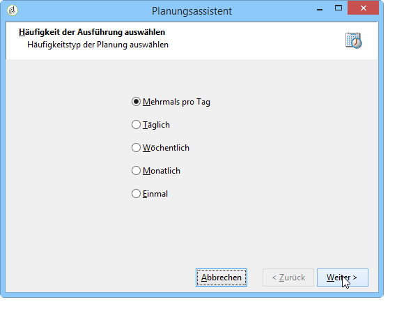

# Planung {#scheduler}

Die **Planung** ist eine persistente Aufgabe, die ihre ausgehende Transition zum konfigurierten Zeitpunkt aktiviert.

Eine **[!UICONTROL Planung]** entspricht einem programmierten Start, daher sind die gleichen Regeln zu beachten wie für die **[!UICONTROL Start]**-Aktivität. So darf die Planung beispielsweise keine eingehende Transition aufweisen.

## Best Practices {#best-practices}

* Planen Sie die Ausführung eines Workflows nicht länger als alle 15 Minuten, da dies die Gesamtleistung des Systems beeinträchtigen und Blöcke in der Datenbank erstellen kann.

* Verwenden Sie in einem Workflow nie mehr als eine **[!UICONTROL Planung]** -Aktivität pro Verzweigung. Siehe [Verwenden von Aktivitäten](../../workflow/using/workflow-best-practices.md#using-activities).

* Die Verwendung einer Planungsaktivität kann dazu führen, dass mehrere Workflow-Ausführungen gleichzeitig vorgenommen werden. Beispielsweise kann eine Planung die Ausführung des Workflows stündlich auslösen, manchmal dauert die Ausführung des gesamten Workflows jedoch mehr als eine Stunde.

   Sie können die Ausführung überspringen, wenn der Workflow bereits ausgeführt wird. Weitere Informationen hierzu, wie Sie gleichzeitige Ausführungen eines Workflows verhindern können, finden Sie auf [dieser Seite](../../workflow/using/monitoring-workflow-execution.md#preventing-simultaneous-multiple-executions).

* Beachten Sie, dass die Transition mehrere Stunden später aktiviert werden kann, wenn der Workflow eine langfristige Aufgabe wie z. B. einen Import ausführt oder wenn das Webserver-Modul für einen bestimmten Zeitraum beendet wurde. In diesem Fall kann es erforderlich sein, die Ausführung der von der Planung aktivierten Aufgabe auf einen bestimmten Zeitraum zu beschränken.

## Configuring the Scheduler activity {#configuring-scheduler-activity}

In der Planung wird die einmalige oder periodische Aktivierung der ausgehenden Transition geplant. Öffnen Sie hierzu die Aktivität und klicken Sie auf die Schaltfläche **[!UICONTROL Ändern...]**.

In den folgenden Schritten des Assistenten lassen sich die Frequenz der Ausführungen und die Gültigkeit der Aktivität festlegen. Gehen Sie wie folgt vor:

1. Kreuzen Sie die gewünschte Häufigkeit an und klicken Sie auf **[!UICONTROL Weiter]**.

   

1. Geben Sie die Tage und Uhrzeit der Ausführung an. Die zur Verfügung stehenden Parameter hängen von der im ersten Schritt ausgewählten Häufigkeit ab. Wenn Sie die Aktivität mehrmals täglich aktivieren, sind folgende Optionen verfügbar:

   

1. Definieren Sie im nächsten Schritt die Gültigkeit der Planung oder die maximale Anzahl an Ausführungen.

   

1. Prüfen Sie im letzten Schritt die Konfiguration und klicken Sie auf **[!UICONTROL Beenden]**, um sie zu speichern.

   
