# Geburtstags-E-Mail senden{#sending-a-birthday-email}

## Einleitung {#introduction}

Im folgenden Anwendungsbeispiel wird aufgezeigt, wie sich der wiederkehrende Versand einer E-Mail an Empfänger zu deren Geburtstag planen lässt.

Der Workflow für dieses Anwendungsbeispiel stellt sich wie folgt dar:

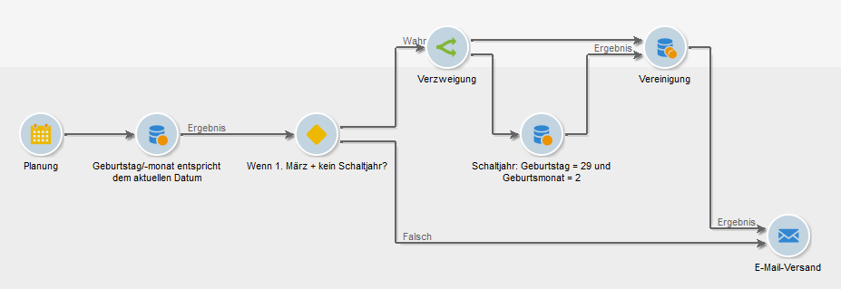

In diesem täglich ausgeführten Workflow werden alle Empfänger ausgewählt, deren Geburtstag dem aktuellen Datum entspricht.

Dieses Anwendungsbeispiel ist auch als Video unter [Creating a workflow](https://docs.campaign.adobe.com/doc/AC/en/Videos/Videos.html) verfügbar.

Erstellen Sie dazu eine Kampagne und klicken Sie auf die **[!UICONTROL Targeting and workflows]** Registerkarte. For more on this, refer to the [Building the main target in a workflow](../../campaign/using/marketing-campaign-deliveries.md#building-the-main-target-in-a-workflow) section.

Gehen Sie dann wie folgt vor:

## Planen des Sendens {#configuring-the-scheduler}

1. Fügen Sie zunächst einen **Zeitplan** hinzu, um das Senden der Bereitstellung jeden Tag auszulösen. Im Beispiel unten wird die Bereitstellung jeden Tag um 6 Uhr erstellt.

   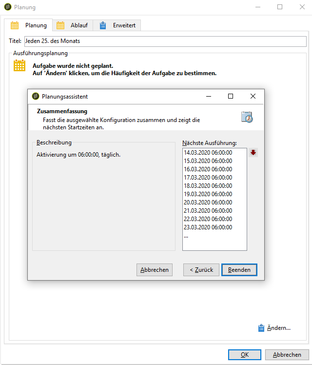


## Identifizieren von Empfängern, die Geburtstag haben {#identifying-recipients-whose-birthday-it-is}

After configuring the **[!UICONTROL Scheduler]** activity so that the workflow starts every day, identify all of the recipients whose date of birth equals the current date.

Gehen Sie hierzu wie folgt vor:

1. Drag and drop a **[!UICONTROL Query]** activity into the workflow and double-click it.
1. Click the **Edit query** link and select **[!UICONTROL Filtering conditions]**.

   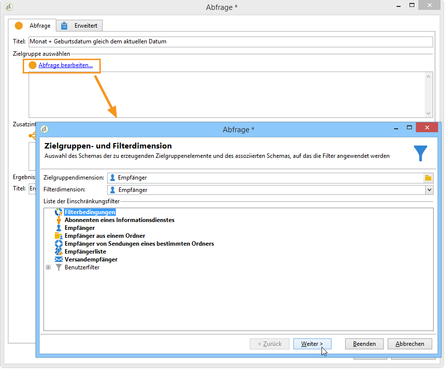

1. Click the first cell of the **[!UICONTROL Expression]** column and click **[!UICONTROL Edit expression]** to open the expression editor.

   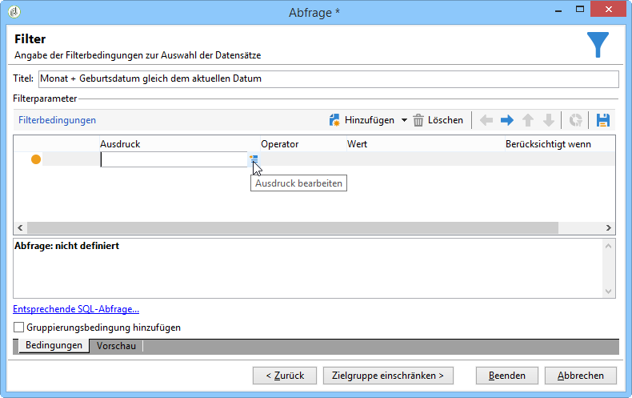

1. Klicken Sie auf **[!UICONTROL Advanced selection]** , um den Filtermodus auszuwählen.

   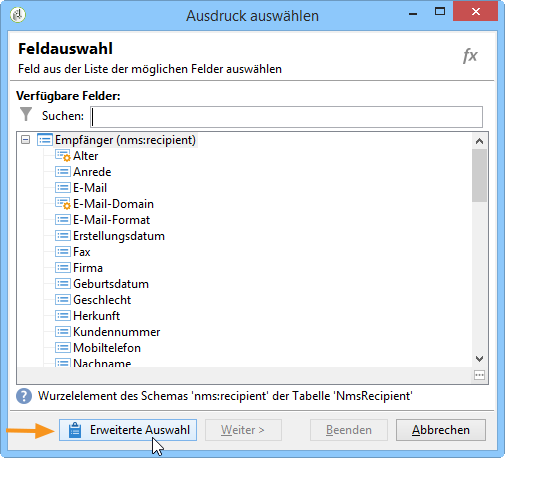

1. Wählen Sie **[!UICONTROL Edit the formula using an expression]** und klicken Sie auf **[!UICONTROL Next]** , um den Ausdruckseditor anzuzeigen.
1. In the list of functions, double-click **[!UICONTROL Day]**, which is accessible via the **[!UICONTROL Date]** node. Diese Funktion gibt die Zahl zurück, die den Tag darstellt, der dem als Parameter übergebenen Datum entspricht.

   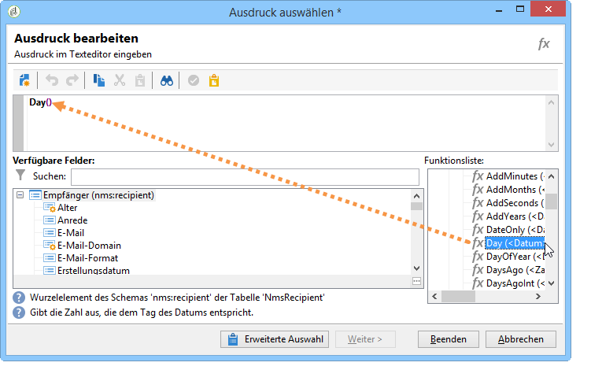

1. In the list of available fields, double-click **[!UICONTROL Birth date]**. The upper section of the editor then displays the following formula:

   ```
   Day(@birthDate)
   ```

   Klicken Sie **[!UICONTROL Finish]** zur Bestätigung.

1. In the query editor, in the first cell of the **[!UICONTROL Operator]** column, select **[!UICONTROL equal to]**.

   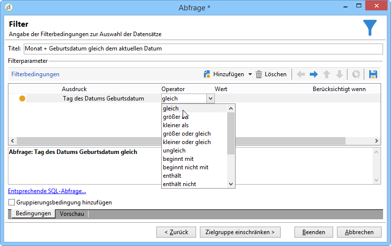

1. Next, click the first cell of the second column (**[!UICONTROL Value]**), and click **[!UICONTROL Edit expression]** to open the expression editor.
1. In the list of functions, double-click **[!UICONTROL Day]**, which is accessible via the **[!UICONTROL Date]** node.
1. Wählen Sie anschließend mit einem Doppelklick die Funktion **[!UICONTROL GetDate]** aus, um das aktuelle Datum abzurufen.

   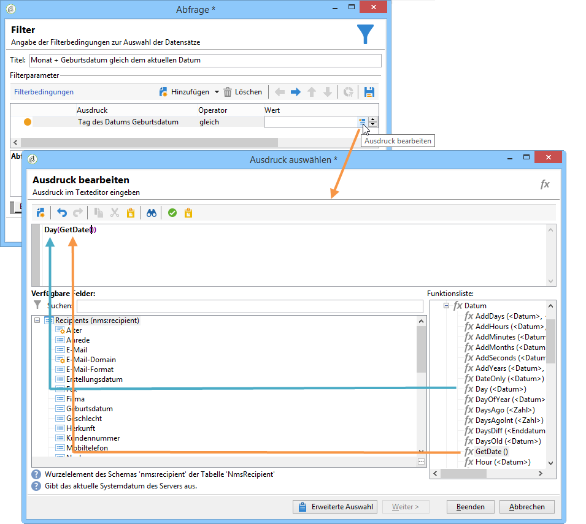

   Im oberen Abschnitt des Ausdruckseditors wird nun folgende Formel angezeigt:

   ```
   Day(GetDate())
   ```

   Klicken Sie **[!UICONTROL Finish]** zur Bestätigung.

1. Wiederholen Sie diesen Vorgang, um den Geburtsmonat des aktuellen Monats abzurufen. Klicken Sie dazu auf die **[!UICONTROL Add]** Schaltfläche und wiederholen Sie die Schritte 3 bis 10 und ersetzen Sie **[!UICONTROL Day]** durch **[!UICONTROL Month]**.

   Die vollständige Formel lautet wie folgt:

   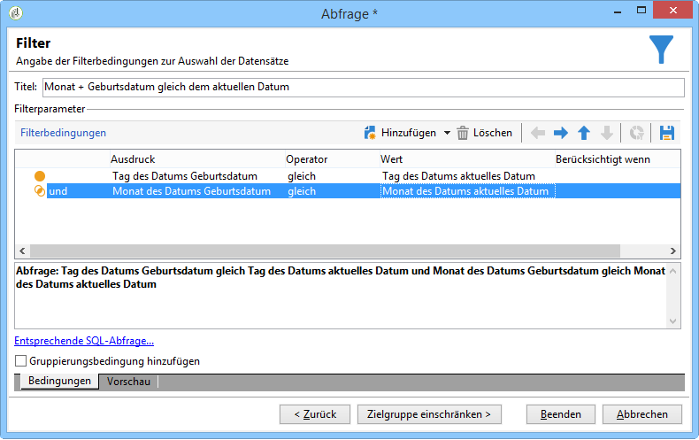

Link the result of the **[!UICONTROL Query]** activity to an **[!UICONTROL Email delivery]** activity to send an email to the list of all of your recipients on their birthday.

## Einschluss von Abonnenten, die am 29. Februar Geburtstag haben (optional) {#including-recipients-born-on-february-29th--optional-}

Wenn Sie alle Abonnenten einschließen möchten, die am 29. Februar Geburtstag haben, sehen Sie in diesem Anwendungsbeispiel, wie Sie den Versand einer wiederkehrenden Geburtstags-E-Mail an eine Liste von Empfängern planen können – unabhängig davon ob es sich um ein Schaltjahr handelt oder nicht.

Die Umsetzung des Anwendungsbeispiels gliedert sich in folgende Schritte:

* Auswahl der Empfänger, die am aktuellen Datum Geburtstag haben.
* Test, ob ein Schaltjahr vorliegt.
* Auswahl der Empfänger, die am 29. Februar Geburtstag haben.

Der Workflow für dieses Anwendungsbeispiel stellt sich wie folgt dar:


Sollte es sich bei dem laufenden Jahr **nicht um ein Schaltjahr handeln**, müssen bei der Workflow-Ausführung am 1. März auch die Empfänger ausgewählt und zu der Empfängerliste hinzugefügt werden, deren Geburtstag am 29. Februar ist. In allen anderen Fällen ist keinerlei zusätzliche Maßnahme notwendig.

### 1. Schritt: Auswahl der Empfänger, die am aktuellen Datum Geburtstag haben {#step-1--selecting-the-recipients}

After configuring the **[!UICONTROL Scheduler]** activity so that the workflow starts every day, identify all of the recipients whose anniversary is the current day.

>[!NOTE]
>
>Sollte es sich bei dem laufenden Jahr um ein Schaltjahr handeln, werden alle Empfänger, deren Geburtstag auf den 29. Februar fällt, automatisch mit eingeschlossen.

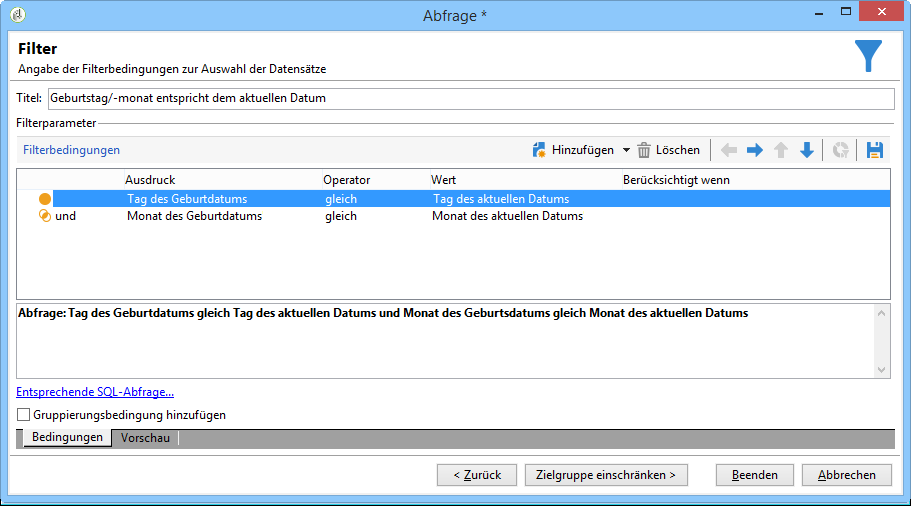

Die Auswahl der Empfänger, deren Geburtstag dem aktuellen Datum entspricht, wird im Abschnitt [Identifizierende Empfänger, deren Geburtstag es ist](#identifying-recipients-whose-birthday-it-is) , angezeigt.

### 2. Schritt: Test, ob ein Schaltjahr vorliegt {#step-2--select-whether-or-not-it-is-a-leap-year}

Prüfen Sie mithilfe einer **[!UICONTROL Test]**-Aktivität, ob das aktuelle Jahr ein Schaljahr und ob das aktuelle Datum der 1. März ist.

Wenn der Test überprüft wird (das Jahr ist kein Schaltjahr - es gibt keinen 29. Februar - und das aktuelle Datum ist in der Tat der 1. März), wird der **[!UICONTROL True]** Übergang aktiviert und die Empfänger, die am 29. Februar geboren werden, werden zur Lieferung am 1. März hinzugefügt. Andernfalls wird der **[!UICONTROL False]** Übergang aktiviert und nur die am aktuellen Datum geborenen Empfänger erhalten die Lieferung.

Copy and paste the code below into the **[!UICONTROL Initialization script]** section of the **[!UICONTROL Advanced]** tab.

```
function isLeapYear(iYear)
{
    if(iYear/4 == Math.floor(iYear/4))
    {
        if(iYear/100 != Math.floor(iYear/100))
        {
            // Divisible by 4 only -> Leap Year
            return 1;
        }
        else
        {
            if(iYear/400 == Math.floor(iYear/400))
            {
                // Divisible by 4, 100 and 400 -> Leap year
                return 1;
            }
        }
    }
    // all others: no leap year
    return 0;
}

// Return today's date and time
var currentTime = new Date()
// returns the month (from 0 to 11)
var month = currentTime.getMonth() + 1
// returns the day of the month (from 1 to 31)
var day = currentTime.getDate()
// returns the year (four digits)
var year = currentTime.getFullYear()

// is current year a leap year?
vars.currentIsALeapYear = isLeapYear(year);

// is current date the first of march?
if(month == 3 && day == 1) {
  // today is 1st of march
vars.firstOfMarch = 1;
}
```

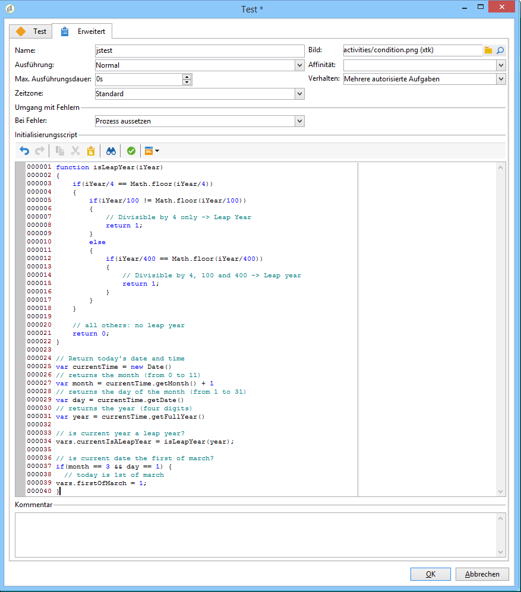

Add the following condition in the **[!UICONTROL Conditional forks]** section:

```
vars.currentIsALeapYear == 0 && vars.firstOfMarch == 1
```

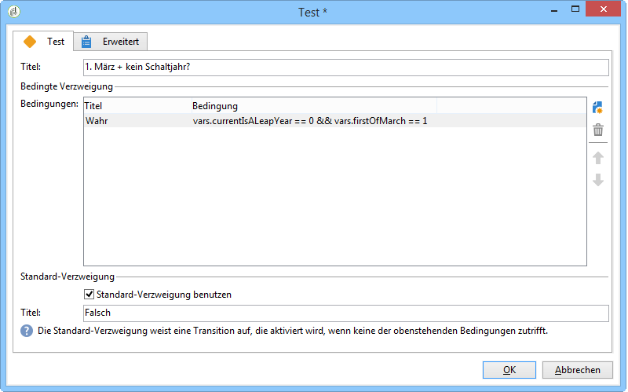

### 3. Schritt: Auswahl der Empfänger, die am 29. Februar Geburtstag haben {#step-3--select-any-recipients-born-on-february-29th}

Create a **[!UICONTROL Fork]** activity and link one of the outbound transitions to a **[!UICONTROL Query]** activity.

Wählen Sie in dieser Abfrage alle Empfänger aus, die am 29. Februar Geburtstag haben.

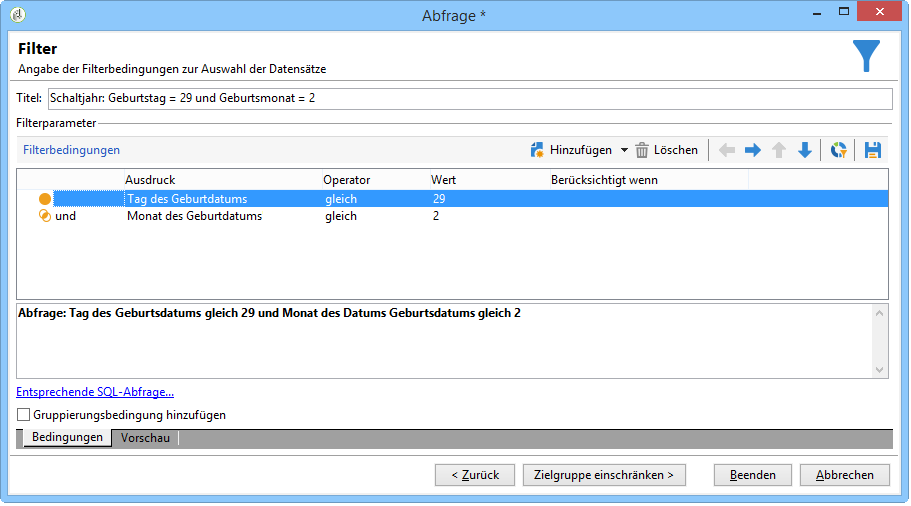

Combine the results with a **[!UICONTROL Union]** activity.

Link the results of the two **[!UICONTROL Test]** activity branches to an **[!UICONTROL Email delivery]** activity to send an email to the list of all of your recipients on their birthday, even to those born on February 29th during a non-leap year.

## Creating a recurring delivery {#creating-a-recurring-delivery-in-a-targeting-workflow}

Fügen Sie für die gewünschte Geburtstags-E-Mail-Vorlage einen **wiederkehrenden Versand** hinzu.

>[!CAUTION]
>
>Damit die Workflows ausgeführt werden, müssen die technischen Arbeitsabläufe im Zusammenhang mit dem Kampagnenprozess gestartet werden. For more on this, refer to the [List of campaign process workflows](../../workflow/using/campaign.md) section.
>
>Wenn die Genehmigungsschritte für die Kampagne aktiviert sind, werden die Auslieferungen erst gesendet, nachdem diese Schritte bestätigt wurden. Weitere Informationen finden Sie im Abschnitt [Auswahl der zu genehmigenden](../../campaign/using/marketing-campaign-approval.md#choosing-the-processes-to-be-approved) Prozesse.


