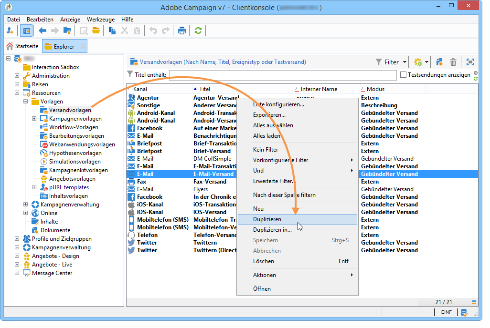

# Bericht-Versand an eine Liste{#sending-a-report-to-a-list}

This use case details how to generate a monthly out-of-the-box **[!UICONTROL Tracking indicators]** report in PDF format and how to send it to a list of recipients.


Die Umsetzung des Anwendungsbeispiels gliedert sich in folgende Schritte:

* Erstellen einer Liste der Empfänger, die die Bereitstellung erhalten werden (siehe: [Schritt 1: Erstellen der Empfängerliste](#step-1--creating-the-recipient-list)).
* Creating a delivery template that will let you generate a new delivery each time the workflow is executed (refer to: [Step 2: Creating the delivery template](#step-2--creating-the-delivery-template)).
* Creating a workflow that will let you generate the report in PDF format and send it to the list of recipients (refer to: [Step 3: Creating the workflow](#step-3--creating-the-workflow)).

## 1. Schritt: Erstellung der Empfängerliste {#step-1--creating-the-recipient-list}

Gehen Sie zum **[!UICONTROL Profiles and targets]** Universum, klicken Sie auf den **[!UICONTROL Lists]** Link und dann auf die **[!UICONTROL Create]** Schaltfläche. Wählen Sie **[!UICONTROL New list]** und erstellen Sie eine neue Empfängerliste für den Bericht, an den gesendet werden soll.


Weiterführende Informationen zum Erstellen von Listen finden Sie in diesem [Abschnitt](../../platform/using/creating-and-managing-lists.md).

## 2. Schritt: Erstellung der Versandvorlage {#step-2--creating-the-delivery-template}

1. Wechseln Sie zum **[!UICONTROL Resources > Templates > Delivery templates]** Knoten des Adobe Campaign-Explorers und duplizieren Sie die **[!UICONTROL Email delivery]** vordefinierte Vorlage.

   

   Weiterführende Informationen zur Erstellung von Versandvorlagen finden Sie in diesem [Abschnitt](../../delivery/using/about-templates.md).

1. Konfigurieren Sie die Vorlage, indem Sie Titel, Zielgruppe (d. h. die zuvor erstellte Empfängerliste), Betreff und Inhalt angeben.

   

1. Bei jeder Ausführung des Workflows wird der **[!UICONTROL Tracking indicators]** Bericht aktualisiert (siehe [Schritt 3: Erstellen des Workflows](#step-3--creating-the-workflow)). Um die neueste Version des Berichts in die Bereitstellung einzubeziehen, müssen Sie eine hinzufügen **[!UICONTROL Calculated attachment]**:

   Weiterführende Informationen zur Erstellung eines berechneten Anhangs finden Sie in diesem [Abschnitt](../../delivery/using/attaching-files.md#creating-a-calculated-attachment).

   * Klicken Sie auf den **[!UICONTROL Attachments]** Link und dann **[!UICONTROL Add]** auf **[!UICONTROL Calculated attachment]**.

      

   * Gehen Sie zum **[!UICONTROL Type]** Feld und wählen Sie die vierte Option aus: **[!UICONTROL File name is computed during delivery of each message (it may then depend on the recipient profile)]**.

      

      The value entered in the **[!UICONTROL Label]** field will not appear in the final delivery.

   * Geben Sie im Eingabefeld den Pfad und den genauen Namen der Datei ein.

      

      >[!CAUTION]
      >
      >Die Datei muss sich auf dem Server befinden. Pfad und Name müssen mit denen identisch sein, die in der **[!UICONTROL JavaScript code]** Typaktivität des Workflows eingegeben wurden (siehe: [Schritt 3: Erstellen des Workflows](#step-3--creating-the-workflow)).

   * Wählen Sie die **[!UICONTROL Advanced]** Registerkarte und aktivieren Sie **[!UICONTROL Script the name of the file name displayed in the mails sent]**. Gehen Sie zur Bearbeitungszone und geben Sie den Namen ein, den Sie der Anlage bei der endgültigen Auslieferung geben möchten.

      

## 3. Schritt: Erstellung des Workflows {#step-3--creating-the-workflow}

Für das Anwendungsbeispiel ist ein Workflow mit drei Aktivitäten zu erstellen:

* One **[!UICONTROL Scheduler]** type activity that lets you execute the workflow once a month,
* One **[!UICONTROL JavaScript code]** type activity that lets you generate the report in PDF format,
* one **[!UICONTROL Delivery]** type activity that uses the previously created delivery template.


1. Wechseln Sie nun zum **[!UICONTROL Administration > Production > Technical workflows]** Knoten und erstellen Sie einen neuen Workflow.

   

1. Start by adding a **[!UICONTROL Scheduler]** type activity and configure it so that the workflow executes on the first Monday of the month.

   

   For more on configuring the scheduler, refer to [Scheduler](../../workflow/using/scheduler.md).

1. Fügen Sie dann eine **[!UICONTROL JavaScript code]** Typaktivität hinzu.

   

   Geben Sie folgenden Code ein:

   ```
   var reportName = "deliveryFeedback";
   var path = "/tmp/deliveryFeedback.pdf";
   var exportFormat = "PDF";
   var reportURL = "<PUT THE URL OF THE REPORT HERE>";
   var _ctx = <ctx _context="global" _reportContext="deliveryFeedback" />
   var isAdhoc = 0;
   
   xtk.report.export(reportName, _ctx, exportFormat, path, isAdhoc);
   ```

   Hierbei werden folgende Variablen verwendet:

   * **var reportName**: der interne Name des Berichts in Anführungsstrichen. Im vorliegenden Beispiel lautet der interne Name des **Trackingindikatoren**-Berichts &quot;deliveryFeedback&quot;.
   * **var path**: Speicherpfad der Datei (&quot;tmp/files/&quot;), Name des Anhangs (&quot;deliveryFeedback&quot;) und Dateiendung (&quot;.pdf&quot;). Im vorliegenden Beispiel ist der Name des Anhangs mit dem internen Namen des Berichts identisch. Die Werte müssen in Anführungszeichen gesetzt und durch das Zeichen &quot;+&quot; verbunden werden.

      >[!CAUTION]
      >
      >Die Datei muss auf dem Server gespeichert werden. Sie müssen denselben Pfad und denselben Namen auf der **[!UICONTROL General]** Registerkarte des Bearbeitungsfensters für die berechnete Anlage eingeben (siehe: [Schritt 2: Erstellen der Bereitstellungsvorlage](#step-2--creating-the-delivery-template)).

   * **var exportFormat**: Format des Anhangs (&quot;PDF&quot;).
   * **var_ctx** (context): In diesem Fall nutzen wir den **[!UICONTROL Tracking indicators]** Bericht in seinem globalen Kontext.

1. Finish by adding a **[!UICONTROL Delivery]** type activity with the following options:

   * **[!UICONTROL Delivery]**: Wählen Sie **[!UICONTROL New, created from a template]** die zuvor erstellte Bereitstellungsvorlage aus.
   * Wählen Sie für die **[!UICONTROL Recipients]** und **[!UICONTROL Content]** die Felder **[!UICONTROL Specified in the delivery]**.
   * **[!UICONTROL Action to execute]**: auswählen **[!UICONTROL Prepare and start]**.
   * Deaktivieren **[!UICONTROL Generate an outbound transition]** und **[!UICONTROL Process errors]**.
   

