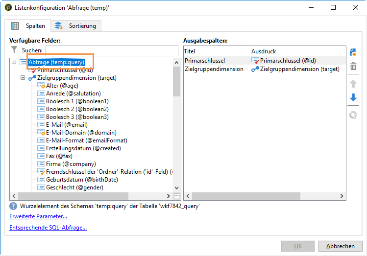

# Benutzern personalisierte Warnungen senden{#sending-personalized-alerts-to-operators}

In diesem Beispiel möchten wir einem Benutzer eine Warnung senden, die den Namen der Profile enthält, die einen Newsletter geöffnet, aber nicht auf den darin enthaltenen Link geklickt haben.

Die Vor- und Nachname-Felder der Profile sind mit der Zielgruppendimension **[!UICONTROL Empfänger]** verknüpft, während die Aktivität **[!UICONTROL Warnung]** mit der Zielgruppendimension **[!UICONTROL Operator]** verknüpft ist. Deshalb ist bei den beiden Zielgruppendimensionen kein Feld verfügbar, um eine Abstimmung vorzunehmen, die Vor- und Nachname-Felder abzurufen und in der Warnungsaktivität anzuzeigen.

Deshalb muss der folgende Workflow erstellt werden:

1. Wählen Sie mit der Aktivität **[!UICONTROL Abfrage]** die gewünschten Daten aus.
1. Fügen Sie die Aktivität **[!UICONTROL JavaScript-Code]** in den Workflow ein, um die Population aus der Abfrage in der Instanzvariablen zu speichern.
1. Verwenden Sie die Aktivität **[!UICONTROL Test]**, um die Populationsgröße festzustellen.
1. Verwenden Sie die Aktivität **[!UICONTROL Warnung]**, um je nach Ergebnis der **[!UICONTROL Test]**-Aktivität eine Warnung an einen Benutzer zu senden.


## Die Population in der Instanzvariablen speichern {#saving-the-population-to-the-instance-variable}

Fügen Sie den unten stehenden Code zur Aktivität **[!UICONTROL JavaScript-Code]** hinzu.

```
var query = xtk.queryDef.create(  
    <queryDef schema="temp:query" operation="select">  
      <select>  
       <node expr="[target/recipient.@firstName]"/>  
       <node expr="[target/recipient.@lastName]"/>  
      </select>  
     </queryDef>  
  );  
  var items = query.ExecuteQuery();
```

Achten Sie darauf, dass der JavaScript-Code mit Ihren Workflow-Informationen übereinstimmt.

* Das Tag **[!UICONTROL queryDef schema]** sollte mit dem Namen der in der Abfrageaktivität verwendeten Zielgruppendimension übereinstimmen.
* Das Tag **[!UICONTROL node expr]** sollte mit dem Namen der Felder übereinstimmen, die Sie abrufen möchten.


Um diese Informationen abzurufen, gehen Sie wie folgt vor:

1. Klicken Sie in der **[!UICONTROL Abfrage]**-Aktivität mit der rechten Maustaste auf die ausgehende Transition und wählen Sie dann **[!UICONTROL Ergebnis anzeigen...]**.

   

1. Klicken Sie mit der rechten Maustaste auf die Liste und wählen Sie dann **[!UICONTROL Liste konfigurieren]** aus.

   

1. Die Zielgruppendimension der Abfrage und die Feldnamen werden in der Liste angezeigt.

   

## Populationsgröße überprüfen {#testing-the-population-count}

Fügen Sie den unten stehenden Code in die **[!UICONTROL Test]**-Aktivität ein, um zu überprüfen, ob die ausgewählte Population zumindest 1 Profil enthält.

```
var.recCount>0
```


## Warnung einrichten {#setting-up-the-alert}

Nachdem die Population zur Instanzvariablen mit den gewünschten Feldern hinzugefügt wurde, können Sie jetzt diese Informationen zur Aktivität **[!UICONTROL Warnung]** hinzufügen.

Fügen Sie zu diesem Zweck den unten stehenden Code in das Tab **[!UICONTROL Quelle]** ein:

```
<ul>
<%
var items = new XML(instance.vars.items)
for each (var item in items){
%>
<li><%= item.target.@firstName %> <%= item.target.@lastName %></li>
<%
} %></ul>
```

>[!NOTE]
>
>Mit dem Befehl **[!UICONTROL &lt;%= item.target.recipient.@fieldName %>]** können Sie eines der Felder hinzufügen, die mit der Aktivität **[!UICONTROL JavaScript-Code]** in der Instanzvariablen gespeichert wurden.\
>Sie können beliebig viele Felder hinzufügen, vorausgesetzt diese wurden in den JavaScript-Code eingefügt.


