# Aufspaltung{#split}

Über die **Aufspaltung** lässt sich eine Population in verschiedene Teilmengen splitten. Die Zielgruppe wird aus allen eingehenden Ergebnissen erstellt, dies bedeutet, dass die vorgeschalteten Aktivitäten beendet sein müssen, bevor die Aufspaltung ausgeführt werden kann.

Diese Aktivität löst keine Vereinigung einheimischer Bevölkerungen aus. Wenn mehrere Übergänge in einer getrennten Aktivität landen, empfehlen wir, eine **[!UICONTROL Union]** Aktivität davor einzufügen.

Ein Beispiel der verwendeten geteilten Aktivität finden Sie unter [Erstellen von Untergruppen mithilfe der Teilungsaktivität](../../workflow/using/targeting-data.md#creating-subsets-using-the-split-activity).

Ein Beispiel für die Verwendung der Aufspaltungs-Aktivität zur Segmentierung der Zielgruppe in unterschiedliche Populationen mithilfe von Filterbedingungen finden Sie in [diesem Abschnitt](../../workflow/using/cross-channel-delivery-workflow.md).

An example showing how to use an instance variable in a Split activity is available in [this section](../../workflow/using/javascript-scripts-and-templates.md).

To configure this activity, define the subset content and label in the **[!UICONTROL Subsets]** tab, then choose the target dimension in the **[!UICONTROL General]** tab.

## Teilmengen erstellen {#creating-subsets}

Gehen Sie wie folgt vor:

1. Bennennen Sie die Teilmenge und geben Sie den Auswahlmodus an.
1. Um die eingehende Population zu filtern, wählen Sie die **[!UICONTROL Add a filtering condition]** Option aus und klicken Sie auf den **[!UICONTROL Edit...]** Link.

   Wählen Sie nun den Filtertyp aus.

   Die Vorgehensweise ist mit der der Abfrageaktivität identisch.****

   >[!CAUTION]
   >
   >Es können maximal Daten aus zwei externen Datenbanken gefiltert werden.

1. Sie können festlegen, wie viele Datensätze maximal aus dem Ziel extrahiert werden sollen, um die Untergruppe zu erstellen. Markieren Sie dazu die **[!UICONTROL Limit the selected records]** Option und klicken Sie auf den **[!UICONTROL Edit...]** Link.

   Mit einem Assistenten können Sie den Auswahlmodus für Datensätze dieser Untergruppe auswählen. Die Schritte finden Sie unter [Begrenzung der Anzahl der Untergruppen-Datensätze](#limiting-the-number-of-subset-records).

   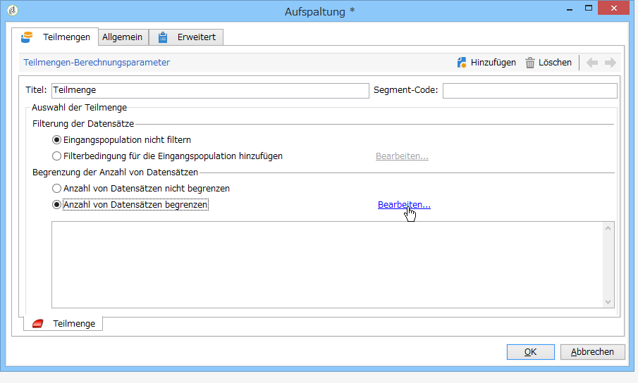

1. If you wish, you can **add other subsets** using the **[!UICONTROL Add]** button.

   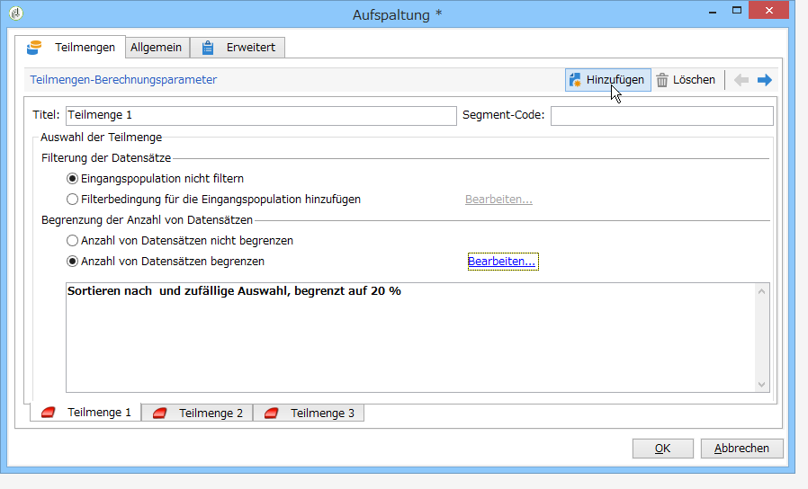

   >[!CAUTION]
   >
   >Wenn die **[!UICONTROL Enable overlapping of output populations]** Option nicht aktiviert ist, werden die Untergruppen in der Reihenfolge der Registerkarten erstellt. Verwenden Sie die Pfeile oben rechts in diesem Fenster, um sie zu verschieben. Wenn die erste Untergruppe beispielsweise 70 % der ursprünglichen Population wiederherstellt, wendet die nächste Untergruppe ihre Auswahlkriterien nur auf die verbleibenden 30 % an usw.

   Für jede Teilmenge weist die Aufspaltung standardmäßig eine ausgehende Transition auf.

   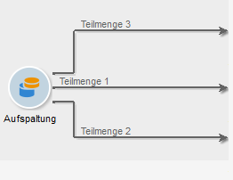

   You can choose to generate a single outbound transition (and identify sets using the segment code, for example): to do this, select the **[!UICONTROL Generate subsets in the same table]** option in the **[!UICONTROL General]** tab.

   Falls angegeben, wird der Segment-Code aller Teilmengen automatisch in einer Zusatzspalte gespeichert. Auf diese Spalte kann im Rahmen eines Versands über die Personalisierungsfelder zugegriffen werden.

## Anzahl an Datensätzen in Teilmengen begrenzen {#limiting-the-number-of-subset-records}

Es besteht die Möglichkeit, die Anzahl an Datensätzen in Teilmengen zu begrenzen, wenn Sie nicht alle potentiellen Empfänger ansprechen wollen.

1. Markieren Sie im Fenster zum Bearbeiten von Untergruppen die **[!UICONTROL Limit the selected records]** Option und klicken Sie auf den **[!UICONTROL Edit...]** Link.
1. Wählen Sie den Begrenzungstyp aus:

   * **[!UICONTROL Activate random sampling]**: Diese Option nimmt eine zufällige Stichprobe der Datensätze. Die Art des Stichprobenverfahrens hängt von der Datenbank-Engine ab.
   * **[!UICONTROL Keep only the first records after sorting]**: Mit dieser Option können Sie eine Beschränkung festlegen, die auf einer oder mehreren Sortierreihenfolgen basiert. Wenn Sie das **[!UICONTROL Age]** Feld als Sortierkriterium und 100 als Grenzwert auswählen, werden nur die kleinsten 100 Empfänger beibehalten.
   * **[!UICONTROL Keep the first ones after sorting (criteria, random)]**: Diese Option kombiniert die beiden vorherigen Optionen. Damit können Sie eine Beschränkung festlegen, die auf einer oder mehreren Sortierreihenfolgen basiert, und dann eine zufällige Auswahl auf die ersten Datensätze anwenden, wenn einige der Datensätze dieselben Werte wie die definierten Kriterien aufweisen.

      For example, if you select the **[!UICONTROL Age]** field as a sorting criteria, and you then define a limit of 100, but the 2000 youngest recipients in the database are all 18, then 100 recipients will be randomly selected out of those 2000.
   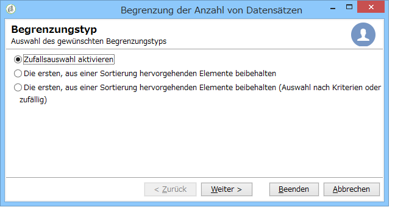

1. Wenn Sie sich für die Definition von Sortierungskriterien entscheiden, können Sie im darauffolgenden Schritt die Spalten und die Reihenfolge der Sortierung bestimmen.

   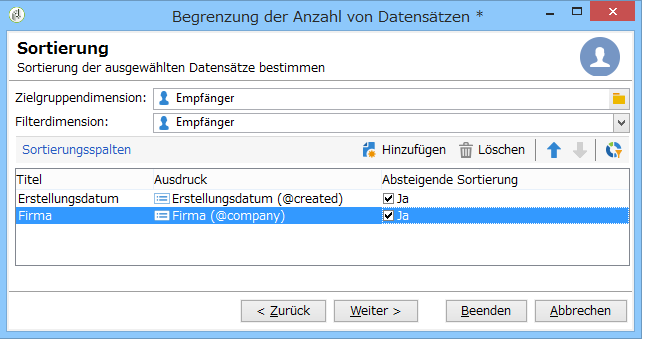

1. Wählen Sie dann die Begrenzungsmethode aus.

   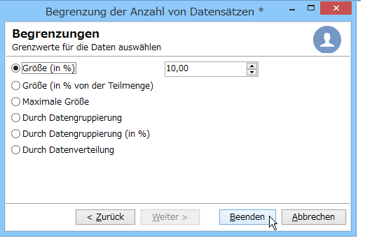

   Verschiedene Möglichkeiten bieten sich Ihnen:

   * **[!UICONTROL Size (in %)]**: ein Prozentsatz der Datensätze. Beispielsweise werden mit der folgenden Konfiguration 10 % der Gesamtpopulation extrahiert.

      Der prozentuale Anteil bezieht sich auf die Eingangspopulation und nicht auf das Ergebnis der Aktivität.

   * **[!UICONTROL Size (as a % of the segment)]**: einen Prozentsatz der Datensätze, die sich nur auf die Teilmengen und nicht auf die ursprüngliche Population beziehen.
   * **[!UICONTROL Maximum size]**: eine maximale Anzahl von Datensätzen.
   * **[!UICONTROL By data grouping]**: Sie können abhängig von den Werten in einem bestimmten Feld der eingehenden Population eine Beschränkung der Anzahl der Datensätze festlegen. Weitere Informationen zu diesem Thema finden Sie unter [Begrenzung der Anzahl der Unterdatensätze nach Datengruppierung](#limiting-the-number-of-subset-records-by-data-grouping).
   * **[!UICONTROL By data grouping (in %)]**: Sie können abhängig von den Werten in einem bestimmten Feld der eingehenden Population einen Grenzwert für die Anzahl der Datensätze mit einem Prozentwert festlegen. Weitere Informationen zu diesem Thema finden Sie unter [Begrenzung der Anzahl der Unterdatensätze nach Datengruppierung](#limiting-the-number-of-subset-records-by-data-grouping).
   * **[!UICONTROL By data distribution]**: Wenn Ihre Gruppierungsfelder zu viele Werte haben oder Sie vermeiden möchten, die Werte für jede neue aufgeteilte Aktivität erneut einzugeben, können Sie mit Adobe Campaign eine **[!UICONTROL By data distribution]** Einschränkung konfigurieren (optionales verteiltes Marketing-Modul). Weitere Informationen finden Sie unter [Begrenzung der Anzahl der untergeordneten Datensätze pro Datenverteilung](#limiting-the-number-of-subset-records-per-data-distribution).

1. Klicken Sie auf , **[!UICONTROL Finish]** um die Kriterien zur Datensatzauswahl zu genehmigen. Die definierte Konfiguration wird dann im mittleren Fenster des Editors angezeigt.

## Anzahl an Datensätzen in Teilmengen durch Datengruppierung begrenzen {#limiting-the-number-of-subset-records-by-data-grouping}

Die Anzahl an Datensätzen kann mithilfe einer Datengruppierung begrenzt werden. Dies kann entweder über einen prozentualen Anteil oder eine feste Größe geschehen.

For instance, if you select the **[!UICONTROL Language]** field as a group field, you can define a list of records for each language.

1. Nach Auswahl der Datenbegrenzungswerte wählen Sie **[!UICONTROL By data grouping]** oder **[!UICONTROL By data grouping (as a %)]** klicken Sie auf **[!UICONTROL Next]**.

   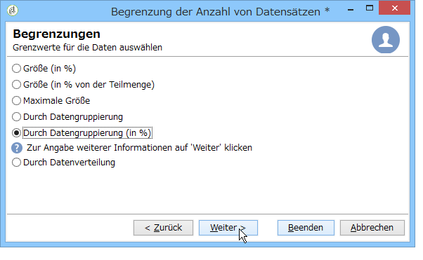

1. Then select the grouping field(s) (the **[!UICONTROL Language]** field for instance) and click **[!UICONTROL Next]**.

   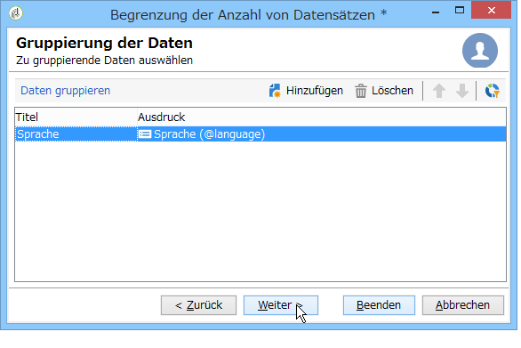

1. Geben Sie abschließend die Schwellenwerte für die Datengruppierung an (unter Verwendung der festen Werte oder Prozentsätze, die von der zuvor ausgewählten Gruppierungsmethode abhängen). Wenn Sie für jeden Wert denselben Schwellenwert festlegen möchten, z. B. wenn Sie die Anzahl der Datensätze für jede Sprache auf 10 festlegen möchten, wählen Sie die **[!UICONTROL All data groupings are the same size]** Option aus. Wenn Sie für jeden Wert eine andere Beschränkung festlegen möchten, wählen Sie die **[!UICONTROL Limitations by grouping value]** Option aus. Dadurch können Sie eine andere Einschränkung für Englisch, Französisch usw. wählen.

   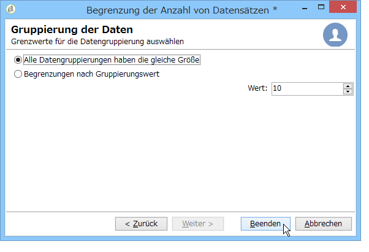

1. Click **[!UICONTROL Finish]** to approve the limitation and return to editing the split activity.

## Anzahl an Datensätzen in Teilmengen durch Datenverteilung begrenzen {#limiting-the-number-of-subset-records-per-data-distribution}

Wenn Ihre Gruppierungsfelder zu viele Werte enthalten oder Sie vermeiden möchten, dass Werte für jede neue aufgeteilte Aktivität zurückgesetzt werden, können Sie mit Adobe Campaign eine Beschränkung für die Datenverteilung erstellen. Wählen Sie bei der Auswahl von Datenbegrenzungswerten (weitere Informationen zu diesem Thema finden Sie im Abschnitt [Erstellen von Untergruppen](#creating-subsets) ) die **[!UICONTROL By data distribution]** Option und wählen Sie eine Vorlage aus dem Dropdown-Menü. Die Erstellung einer Datenverteilungsvorlage wird nachfolgend erläutert.

Ein Beispiel für die **[!UICONTROL Local approval]** Aktivität mit einer Verteilungsvorlage finden Sie unter [Verwenden der lokalen Genehmigungsaktivität](../../workflow/using/using-the-local-approval-activity.md).

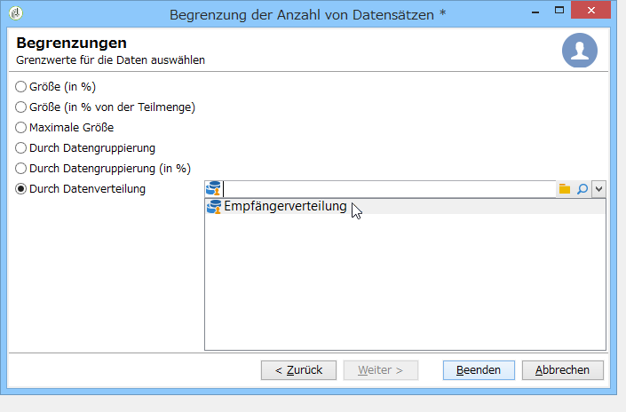

>[!CAUTION]
>
>Zur Verwendung dieser Funktion benötigen Sie das Modul Distributed Marketing (Campaign-Option). Bitte prüfen Sie Ihren Lizenzvertrag.

Eine Verteilungsvorlage ermöglicht die Begrenzung der Datensatzanzahl mithilfe einer Gruppierungswertliste. Gehen Sie wie folgt vor, um eine entsprechende Vorlage zu erstellen:

1. Um die Datenverteilungsvorlage zu erstellen, gehen Sie zum **[!UICONTROL Resources > Campaign management > Data distribution]** Knoten und klicken Sie auf **[!UICONTROL New]**.

   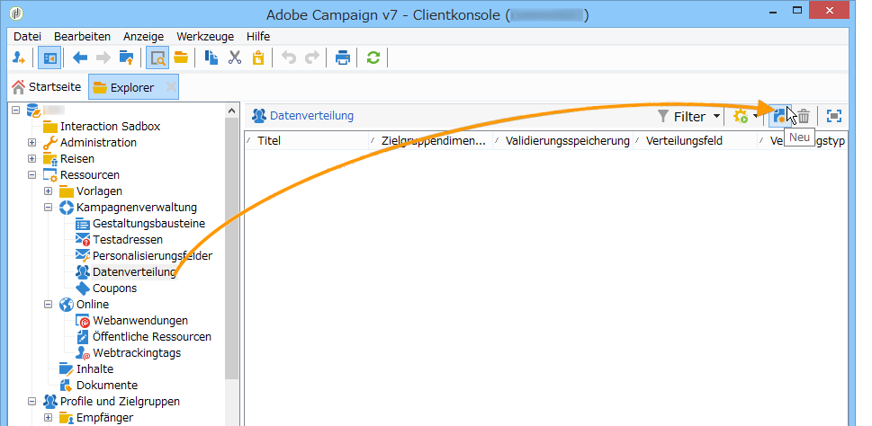

1. The **[!UICONTROL General]** tab lets you enter the label and the execution context of the distribution (targeting dimension, distribution field).

   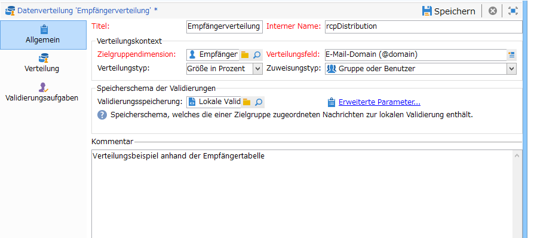

   Folgende Angaben sind erforderlich:

   * **[!UICONTROL Label]**: für die Distributionsvorlage.
   * **[!UICONTROL Targeting dimension]**: Geben Sie die Targeting-Dimension ein, auf die die Datenverteilung angewendet werden soll, **[!UICONTROL Recipient]** z. B. Dieses Schema muss immer mit den im Targeting-Workflow verwendeten Daten kompatibel sein.
   * **[!UICONTROL Distribution field]**: Wählen Sie ein Feld über die Targeting-Dimension aus. Wenn Sie beispielsweise das **[!UICONTROL Email domain]** Feld auswählen, wird die Liste der Empfänger nach Domäne aufgeschlüsselt.
   * **[!UICONTROL Distribution type]**: wählen Sie die Art und Weise aus, wie der Grenzwert des Ziels auf der **[!UICONTROL Distribution]** Registerkarte aufgeschlüsselt wird: **[!UICONTROL Percentage]** oder **[!UICONTROL Set]**.
   * **[!UICONTROL Assignment type]**: Wählen Sie den Zuordnungstyp für die Datenverteilung aus. Sie können zwischen Zuweisungen nach Gruppe oder Operator oder Zuweisungen nach lokaler Entität wählen. Die Zuweisung durch eine lokale Entität wird im **verteilten Marketing** verwendet. For more information, refer to this [section](../../campaign/using/about-distributed-marketing.md).
   * **[!UICONTROL Approval storage]**: Wenn Sie eine **[!UICONTROL Local approval]** Aktivität in Ihrem Targeting-Arbeitsablauf verwenden (siehe [Lokale Genehmigung](../../workflow/using/local-approval.md)), geben Sie das Schema ein, in dem die Genehmigungsergebnisse gespeichert werden. Sie müssen ein Speicherschema pro Targeting-Schema angeben. Wenn Sie das **[!UICONTROL Recipients]** Targeting-Schema verwenden, geben Sie das Standard- **[!UICONTROL Local approval of recipients]** Speicherschema ein.

      In case of a simple limitation by data grouping without local approval, you do not need to enter the **[!UICONTROL Approvals storage]** field.

1. Wenn Sie eine **[!UICONTROL Local approval]** Aktivität verwenden (siehe [Lokale Genehmigung](../../workflow/using/local-approval.md)), geben Sie die **[!UICONTROL Advanced settings]** für die Verteilungsvorlage ein:

   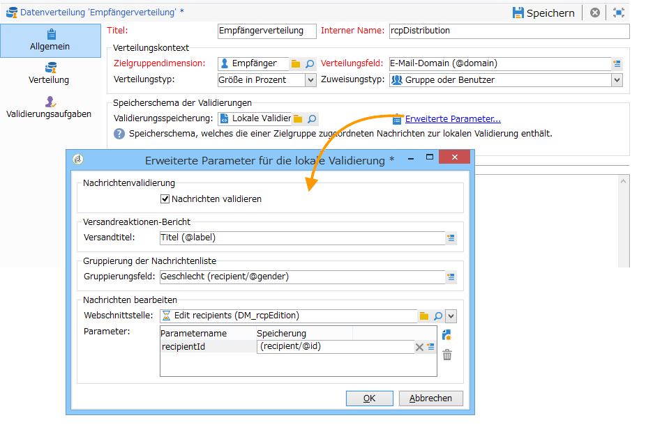

   Folgende Angaben sind erforderlich:

   * **[!UICONTROL Approve targeted messages]**: Aktivieren Sie diese Option, wenn alle Empfänger in der Liste der zu genehmigenden Empfänger vorausgewählt werden sollen. Wenn diese Option deaktiviert ist, wird kein Empfänger vorausgewählt.

      >[!NOTE]
      >
      >Diese Option ist standardmäßig aktiviert.

      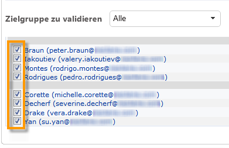

   * **[!UICONTROL Delivery label]**: können Sie einen Ausdruck definieren, um die Bereitstellungsbeschriftung in der Rückgabebenachrichtigung anzuzeigen. Der Standardausdruck enthält Informationen zur Standardbeschriftung der Bereitstellung (Zeichenfolge berechnen). Sie können diesen Ausdruck ändern.

      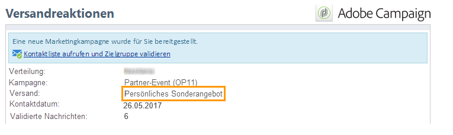

   * **[!UICONTROL Grouping field]**: In diesem Feld können Sie die Gruppierung definieren, mit der Empfänger in Genehmigungs- und Rückkehrbenachrichtigungen angezeigt werden.

      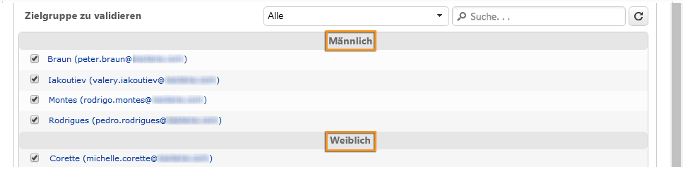

   * **[!UICONTROL Web Interface]**: ermöglicht die Verknüpfung einer Webanwendung mit der Empfängerliste. In der Genehmigungs- und Rückgabebenachrichtigung wird jeder Empfänger angeklickt und mit der ausgewählten Webanwendung verknüpft. Im **[!UICONTROL Parameters]** Feld (z. B. **[!UICONTROL recipientId]**) können Sie den zusätzlichen Parameter konfigurieren, der in der URL und in der Webanwendung verwendet werden soll.

      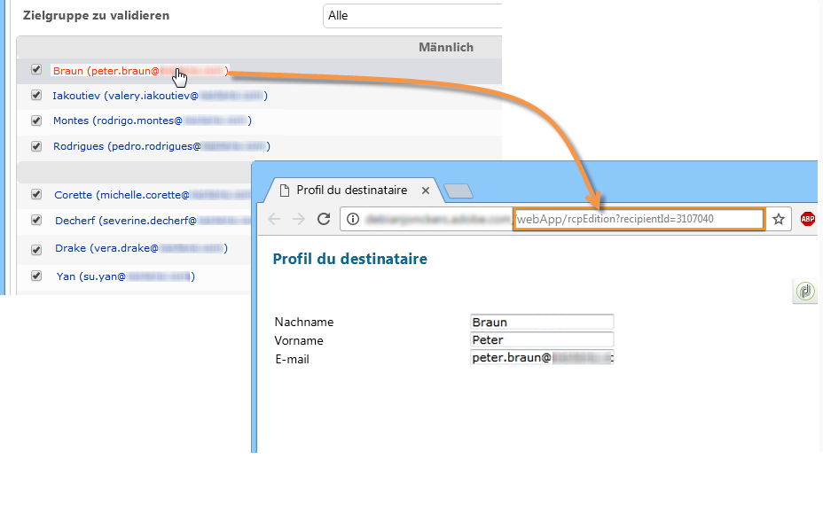

1. The **[!UICONTROL Breakdown]** tab lets you define the list of distribution values.

   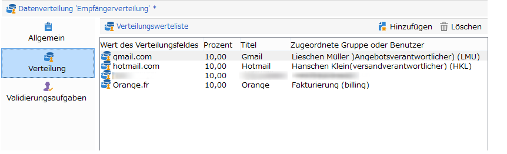

   * **[!UICONTROL Value]**: Geben Sie die Verteilungswerte ein.
   * **[!UICONTROL Percentage / Set]**: gibt die Datensatzgrenze (fest oder prozentual) ein, die mit jedem Wert verknüpft ist.

      This column is defined by the **[!UICONTROL Distribution type]** field within the **[!UICONTROL General]** tab.

   * **[!UICONTROL Label]**: Geben Sie die mit jedem Wert verknüpfte Beschriftung ein.
   * **[!UICONTROL Group or operator]**: Wenn Sie eine **[!UICONTROL Local approval]** Aktivität verwenden (siehe [Lokale Genehmigung](../../workflow/using/local-approval.md)), wählen Sie den Operator oder die Gruppe der Operatoren aus, die bzw. die jedem Verteilungswert zugewiesen sind.

      In case of a simple limitation by data grouping without local approval, you do not need to enter the **[!UICONTROL Group or operator]** field.

      >[!CAUTION]
      >
      >Stellen Sie sicher, dass die Benutzer über die nötigen Berechtigungen verfügen.

   * **[!UICONTROL Local entity]**: Wählen Sie die lokale Entität, die jedem Verteilungswert zugewiesen ist. Lokale Entitäten werden im **verteilten Marketing** verwendet. For more information, refer to this [section](../../campaign/using/about-distributed-marketing.md).

## Filterparameter {#filtering-parameters}

Klicken Sie auf die **[!UICONTROL General]** Registerkarte, um die Aktivitätsbezeichnung einzugeben. Wählen Sie die Ziel- und Filterabmessungen für diese Aufteilung aus. Bei Bedarf können Sie diese Dimensionen für eine bestimmte Untergruppe ändern.

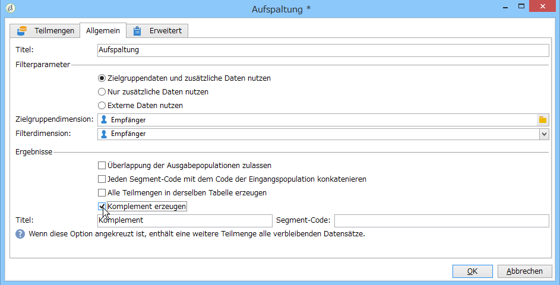

Aktivieren Sie die **[!UICONTROL Generate complement]** Option, wenn Sie die verbleibende Population ausnutzen möchten. Die Ergänzung ist das eingehende Ziel abzüglich der Vereinigung der Untergruppen. Anschließend wird der Aktivität ein zusätzlicher Auslandsübergang wie folgt hinzugefügt:

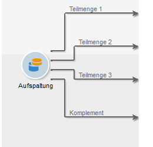

Damit diese Option korrekt arbeiten kann, müssen die eingehenden Daten einen Primärschlüssel aufweisen.

For example, if the data is read directly from an external database such as Netezza (which does not support the notion of an index) via a **[!UICONTROL Data loading (RDBMS)]** activity, the complement generated by the **[!UICONTROL Split]** activity will be incorrect.

Um dies zu vermeiden, können Sie eine **[!UICONTROL Enrichment]** Aktivität direkt vor der **[!UICONTROL Split]** Aktivität ziehen und ablegen. Überprüfen Sie in der **[!UICONTROL Enrichment]** Aktivität die Spalten **[!UICONTROL Keep all additional data from the main set]** und geben Sie in den zusätzlichen Daten die Spalten an, die Sie zum Konfigurieren der Filter der **[!UICONTROL Split]** Aktivität verwenden möchten. Die Daten aus dem eingehenden Übergang der **[!UICONTROL Split]** Aktivität werden dann lokal in einer temporären Tabelle auf dem Adobe Campaign-Server gespeichert und die Ergänzung kann korrekt generiert werden.

Mit der **[!UICONTROL Enable overlapping of output populations]** Option können Sie Populationen verwalten, die zu mehreren Untergruppen gehören:

* Wenn diese Option deaktiviert ist, stellt die Aufspaltung sicher, dass ein Profil nur in einer Ergebnismenge enthalten ist, auch wenn es den Kriterien anderer Teilmengen entspricht. Das Profil ist in der ersten Teilmenge enthalten, dessen Kriterien es entspricht.
* Wenn die Option aktiviert ist, sind die Profile in allen Teilmengen enthalten, deren Kriterien sie erfüllen. Es wird jedoch empfohlen, keine Überlappungen zuzulassen.

## Eingabeparameter {#input-parameters}

* tableName
* schema

Jedes eingehende Ereignis muss eine durch diese Parameter definierte Zielgruppe angeben.

## Ausgabeparameter {#output-parameters}

* tableName
* schema
* recCount

Dieser Satz von drei Werten identifiziert das Ziel, das sich aus dem Ausschluss ergibt. **[!UICONTROL tableName]** ist der Name der Tabelle, in der die Zielkennungen aufgezeichnet werden, das Schema der Population (normalerweise nms:empfänger) und die Anzahl der Elemente in der Tabelle **[!UICONTROL schema]** ist **[!UICONTROL recCount]** dies.

Die Transition des Komplements weist die gleichen Parameter auf.
