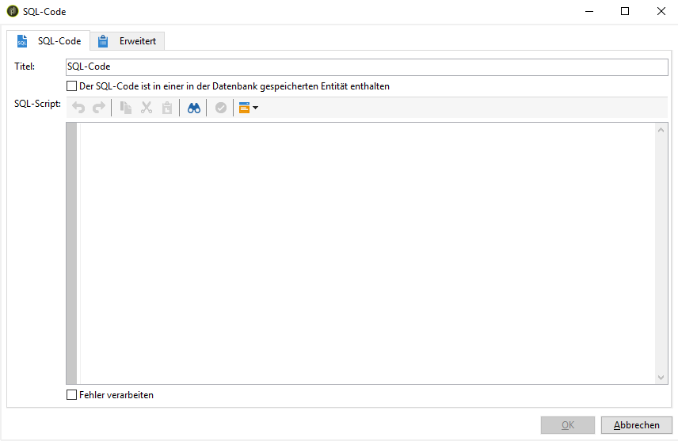
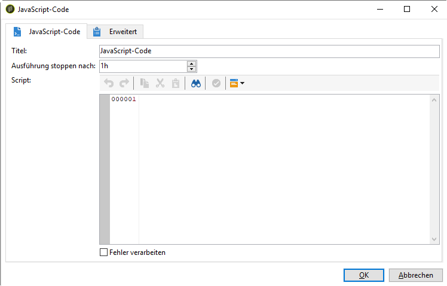
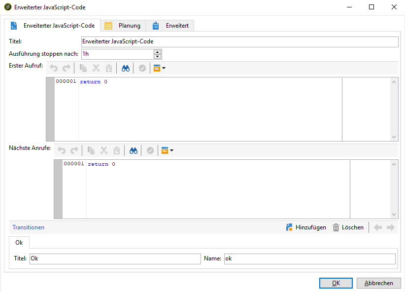

# SQL-Code und JavaScript-Code{#sql-code-and-javascript-code}

## SQL-Code {#sql-code}

Die Aktivität **[!UICONTROL SQL-Code]** führt ein SQL-Script in Form eines JST-Templates aus.

* **[!UICONTROL Script]**

   Das Skript wird in den zentralen Bereich des Editors eingefügt. Da es sich beim Skript um ein JST-Template handelt, kann es dem Workflow-Kontext entsprechend konfiguriert werden.

* **[!UICONTROL Fehler verarbeiten]**

   Siehe [Fehler verarbeiten](../../workflow/using/monitoring-workflow-execution.md#processing-errors).

## JavaScript-Code und erweiterter JavaScript-Code {#javascript-code}

Aktivitäten mit **[!UICONTROL JavaScript-Code]** und **[!UICONTROL erweitertem JavaScript-Code]** führen im Kontext von Workflows ein JavaScript-Skript aus. Weitere Informationen zur Skripterstellung finden Sie im Abschnitt [Scripts/JavaScript-Templates](../../workflow/using/javascript-scripts-and-templates.md).

>[!NOTE]
>
>Standardmäßig darf die Ausführungsphase von **[!UICONTROL JavaScript-Code]**- und **[!UICONTROL erweiterten JavaScript-Code]**-Aktivitäten nicht länger als 1 Stunde dauern. Nach diesem Zeitraum wird der Vorgang mit einer Fehlernachricht abgebrochen und die Ausführung der Aktivität schlägt fehl.
>
>Sie können diesen Zeitraum im Feld **[!UICONTROL Ausführung stoppen nach]** ändern. Dieses Feld befindet sich in den Eigenschaften der Aktivitäten.

* **[!UICONTROL JavaScript-Code]**

   

   * **[!UICONTROL Script]**: Das auszuführende Skript wird in den zentralen Bereich des Editors eingefügt.
   * **[!UICONTROL Fehler verarbeiten]**: Siehe [Fehler verarbeiten](../../workflow/using/monitoring-workflow-execution.md#processing-errors).

* **[!UICONTROL Erweiterter JavaScript-Code]**

   

   * **[!UICONTROL Erster Aufruf]**: Das beim ersten Aufruf auszuführende Skript wird im oberen Bereich des Editors eingefügt.
   * **[!UICONTROL Nächste Aufrufe]**: Das bei allen weiteren Aufrufen auszuführende Skript wird im unteren Bereich des Editors eingefügt.
   * **[!UICONTROL Transitionen]**: Es ist möglich, mehrere aus dieser Aktivität ausgehende Transitionen zu definieren.
   * **[!UICONTROL Zeitplan]** Im Tab **[!UICONTROL Planung]** können der Ausführungszeitpunkt und -rhythmus der Aktivität definiert werden.
