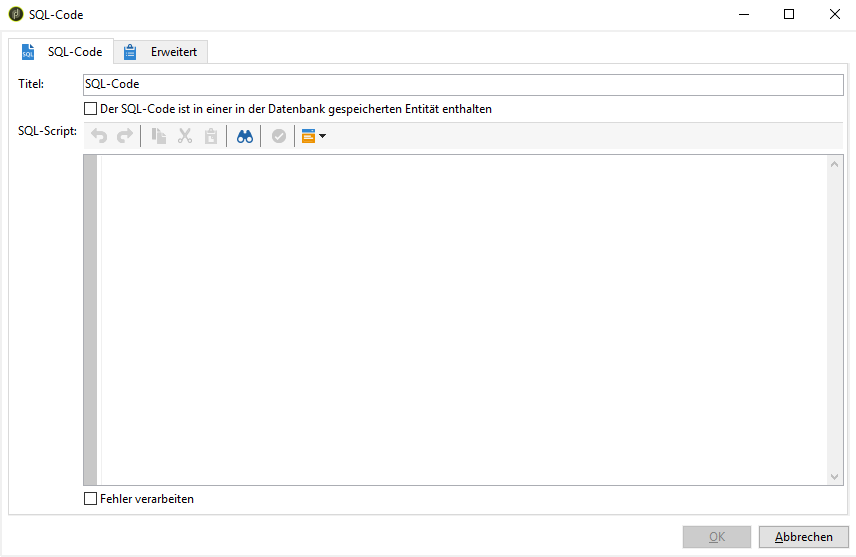
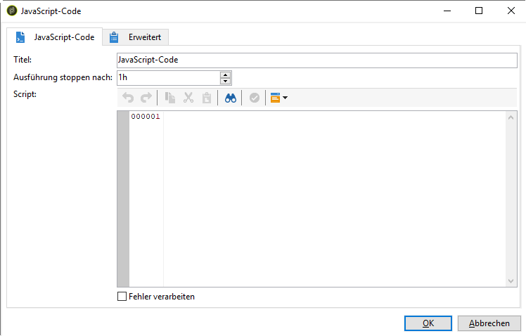
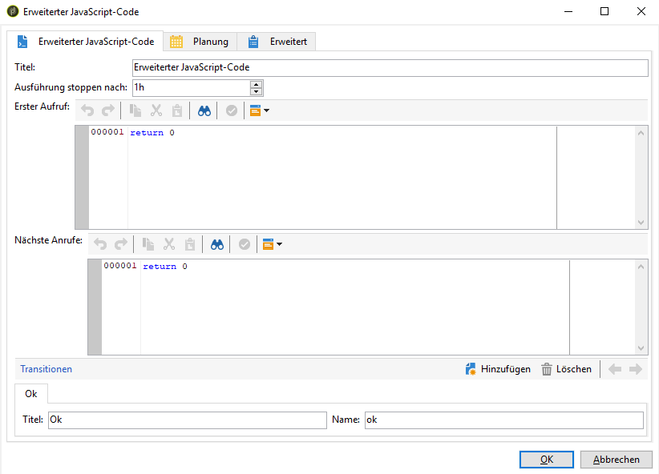

# SQL-Code und JavaScript-Code{#sql-code-and-javascript-code}


## SQL-Code {#sql-code}

Die Aktivität **[!UICONTROL SQL-Code]** führt ein SQL-Skript aus. Das Skript ist eine JST-Vorlage.



* **[!UICONTROL Script]**

  Das auszuführende Skript wird im zentralen Bereich des Editors angezeigt. Da es sich beim Skript um eine JST-Vorlage handelt, kann es entsprechend dem Workflow-Kontext konfiguriert werden.

* **[!UICONTROL Fehler verarbeiten]**

  Siehe [Fehler verarbeiten](monitoring-workflow-execution.md#processing-errors).

## JavaScript-Code und erweiterter JavaScript-Code {#javascript-code}

Aktivitäten mit **[!UICONTROL JavaScript-Code]** und **[!UICONTROL erweitertem JavaScript-Code]** führen im Kontext von Workflows ein JavaScript-Script aus. Weitere Informationen zur Scripterstellung finden Sie in diesen Abschnitten:

* [JavaScript-Scripte und -Vorlagen](javascript-scripts-and-templates.md)
* [Beispiele für JavaScript-Code in Workflows](javascript-in-workflows.md)

### Ausführungsverzögerung {#exec-delay}

Ab Version 20.2 wurde eine Ausführungsverzögerung zu den Aktivitäten **[!UICONTROL JavaScript-Code]** und **[!UICONTROL Erweiterter JavaScript-Code]** hinzugefügt. Standardmäßig darf die Ausführungsphase nicht länger als eine Stunde sein. Nach dieser Verzögerung wird der Vorgang mit einer Fehlermeldung abgebrochen und die Ausführung der Aktivität schlägt fehl.

Sie können diese Verzögerung im Feld **[!UICONTROL Ausführung stoppen nach]** in diesen Aktivitäten ändern.

Um diese Begrenzung zu ignorieren, müssen Sie den Wert auf **0** setzen.

### JavaScript-Code {#js-code-desc}



* **[!UICONTROL Script]**: Das auszuführende Script wird in den zentralen Bereich des Editors eingefügt.

* **[!UICONTROL Fehler verarbeiten]**: Siehe [Fehler verarbeiten](monitoring-workflow-execution.md#processing-errors).

### Erweiterter JavaScript-Code {#adv-js-code-desc}



* **[!UICONTROL Erster Aufruf]**: Das beim ersten Aufruf auszuführende Script wird im oberen Bereich des Editors eingefügt.
* **[!UICONTROL Nächste Aufrufe]**: Das bei allen weiteren Aufrufen auszuführende Script wird im unteren Bereich des Editors eingefügt.
* **[!UICONTROL Transitionen]**: Es ist möglich, mehrere aus dieser Aktivität ausgehende Transitionen zu definieren.
* **[!UICONTROL Zeitplan]** Im Tab **[!UICONTROL Planung]** können der Ausführungszeitpunkt und -rhythmus der Aktivität definiert werden.

Erweitertes JavaScript ist eine persistente Aufgabe und wird in regelmäßigen Abständen zurückgerufen, wenn es nicht als abgeschlossen markiert wurde. Um die Aufgabe zu beenden und künftige Rückrufe zu verhindern, müssen Sie die **task.setCompleted()**-Methode im Abschnitt **[!UICONTROL Nächste Aufrufe]** verwenden:

```
task.postEvent(task.transitionByName("ok")); // to transition to Ok branch
task.setCompleted();

return 0;
```

