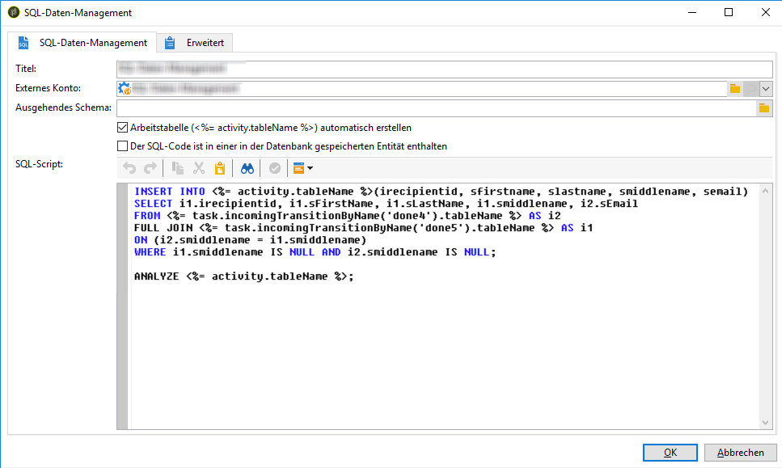

# SQL Data Management{#sql-data-management}

Die Aktivität **SQL Data Management** ermöglicht Ihnen das Schreiben eigener SQL-Abfragen zum Erstellen und Auffüllen von Arbeitstabellen.

## Voraussetzungen {#prerequisites}

Vor der Konfiguration der Aktivität müssen folgende Voraussetzungen gegeben sein:

* Die Aktivität ist nur für Remote-Datenquellen verfügbar. Deshalb muss das **[!UICONTROL FDA]**-Package (Federated Data Access) auf Ihrer Instanz installiert sein. [Weitere Informationen](../../installation/using/about-fda.md).
* Das ausgehende Schema muss in der Datenbank vorhanden und mit einer FDA-Datenbank verknüpft sein. [Weitere Informationen](../../configuration/using/about-schema-reference.md).
* Für den Operator, der den Workflow ausführt, muss die **[!UICONTROL ANGEBOTSAKTIVITÄT SQL-DATEN-MANAGEMENT VERWENDEN (useSqlDmActivity)]** richtig benannt sein. [Weitere Informationen](../../platform/using/access-management-named-rights.md).

## SQL-Data-Management-Aktivität konfigurieren {#configuring-the-sql-data-management-activity}

1. Spezifizieren Sie die Aktivität in **[!UICONTROL Titel]**.
1. Wählen Sie das zu verwendende **[!UICONTROL externe Konto]** aus und danach das mit diesem externen Konto verknüpfte **[!UICONTROL Outbound-Schema]**.

   >[!CAUTION]
   >
   >Das Outbound-Schema ist unveränderlich und kann nicht bearbeitet werden.

1. Fügen Sie das SQL-Skript hinzu.

   >[!CAUTION]
   >
   >Der Codierer des SQL-Skripts ist dafür verantwortlich, dass das SQL-Skript funktioniert und seine Referenzen (Feldnamen etc.) dem Outbound-Schema entsprechen.

   Wenn Sie einen vorhandenen SQL-Code laden möchten, wählen Sie die Option **[!UICONTROL Der SQL-Code ist in einer in der Datenbank gespeicherten Entität enthalten]** aus. SQL-Skripts müssen im Menü **[!UICONTROL Administration]** / **[!UICONTROL Konfiguration]** / **[!UICONTROL SQL-Scripts]** erstellt und gespeichert werden.

   Andernfalls können Sie Ihr SQL-Skript auch in den dafür vorgesehenen Bereich kopieren.

   

   Mithilfe der Aktivität können Sie die folgenden Variablen im Skript verwenden:

   * **activity.tableName**: SQL-Name der ausgehenden Arbeitstabelle.
   * **task.incomingTransitionByName(‘name’).tableName**: SQL-Name der Arbeitstabelle der zu verwendenden eingehenden Transition (die Transition wird durch den Namen identifiziert).

      >[!NOTE]
      >
      >Der Wert (&#39;name&#39;) entspricht dem Feld **[!UICONTROL Name]** in den Transition-Eigenschaften.

1. Wenn das SQL-Skript bereits Befehle zum Erstellen einer ausgehenden Arbeitstabelle enthält, deselektieren Sie die Option **[!UICONTROL Arbeitstabelle automatisch erstellen]**. Andernfalls wird automatisch eine Arbeitstabelle erstellt, wenn der Workflow ausgeführt wird.
1. Wählen Sie **[!UICONTROL Ok]** aus, um die Konfiguration der Aktivität zu bestätigen.

Die Aktivität ist jetzt konfiguriert und kann im Workflow ausgeführt werden.

>[!CAUTION]
>
>Nachdem die Aktivität ausgeführt wurde, ist die Anzahl der gezählten Datensätze in der ausgehenden Transition nur als Richtwert zu erachten. Dieser kann je nach Komplexität des SQL-Skripts variieren.
>  
>Wenn die Aktivität erneut gestartet wird, wird das gesamte Skript unabhängig vom Ausführungsstatus von vorn ausgeführt.

## Muster für SQL-Skripts {#sql-script-samples}

>[!NOTE]
>
>Die Skript-Muster in diesem Abschnitt müssen unter PostgreSQL ausgeführt werden.

Mit diesem Skript können Sie eine Arbeitstabelle erstellen und Daten darin einfügen.

```
CREATE UNLOGGED TABLE <%= activity.tableName %> (
  iRecipientId INTEGER DEFAULT 0,
  sFirstName VARCHAR(100),
  sMiddleName VARCHAR(100),
  sLastName VARCHAR(100),
  sEmail VARCHAR(100)
);

INSERT INTO <%= activity.tableName %>
SELECT iRecipientId, sFirstName, sMiddleName, sLastName, sEmail
FROM nmsRecipient
GROUP BY iRecipientId, sFirstName, sMiddleName, sLastName, sEmail;
```

Mit diesem Skript können Sie eine CTAS-Operation ausführen (CREATE TABLE AS SELECT) und einen Arbeitstabellenindex erstellen:

```
CREATE TABLE <%= activity.tableName %>
AS SELECT iRecipientId, sEmail, sFirstName, sLastName, sMiddleName
FROM nmsRecipient
WHERE sEmail IS NOT NULL
GROUP BY iRecipientId, sEmail, sFirstName, sLastName, sMiddleName;

CREATE INDEX ON <%= activity.tableName %> (sEmail);

ANALYZE <%= activity.tableName %> (sEmail);
```

Mit diesem Skript können Sie zwei Arbeitstabellen verbinden:

```
CREATE TABLE <%= activity.tableName %>
AS SELECT i1.sFirstName, i1.sLastName, i2.sEmail
FROM <%= task.incomingTransitionByName('input1').tableName %> i1
JOIN <%= task.incomingTransitionByName('input2').tableName %> i2 ON (i1.id = i2.id)
```

