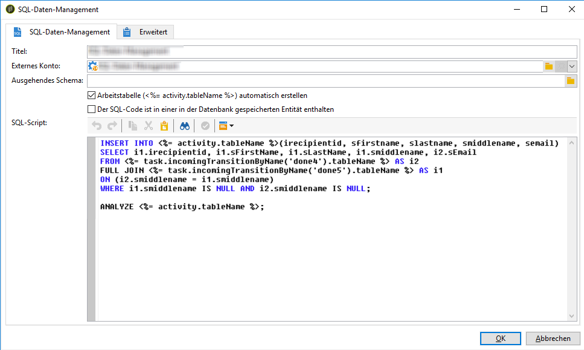

# SQL-Daten-Management{#sql-data-management}


Die Aktivität **SQL-Daten-Management** ermöglicht Ihnen das Schreiben eigener SQL-Scripts zum Erstellen und Auffüllen von Arbeitstabellen.

## Voraussetzungen {#prerequisites}

Vor der Konfiguration der Aktivität müssen folgende Voraussetzungen gegeben sein:

* Die Aktivität ist nur für Remote-Datenquellen verfügbar. Deshalb muss das **[!UICONTROL FDA]**-Package (Federated Data Access) auf Ihrer Instanz installiert sein. [Weitere Informationen](../../installation/using/about-fda.md).

  Weitere Informationen hierzu finden Sie je nach Campaign-Version in den folgenden Abschnitten:

  [Dokumentation zu Campaign v7](../../installation/using/about-fda.md)

  [Dokumentation zu Campaign v8](https://experienceleague.adobe.com/docs/campaign/campaign-v8/connect/fda.html?lang=de)

* Das ausgehende Schema muss in der Datenbank vorhanden und mit einer FDA-Datenbank verknüpft sein.
* Für den Operator, der den Workflow ausführt, muss die **[!UICONTROL ANGEBOTSAKTIVITÄT SQL-DATEN-MANAGEMENT VERWENDEN (useSqlDmActivity)]** richtig benannt sein. [Weitere Informationen](../../platform/using/access-management-named-rights.md).

## SQL-Daten-Management-Aktivität konfigurieren {#configuring-the-sql-data-management-activity}

1. Spezifizieren Sie die Aktivität in **[!UICONTROL Titel]**.
1. Wählen Sie das zu verwendende **[!UICONTROL externe Konto]** aus und danach das mit diesem externen Konto verknüpfte **[!UICONTROL Outbound-Schema]**.

   >[!CAUTION]
   >
   >Das Outbound-Schema ist unveränderlich und kann nicht bearbeitet werden.

1. Fügen Sie das SQL-Script hinzu.

   >[!CAUTION]
   >
   >Es liegt in der Verantwortung des SQL-Skriptverfassers, sicherzustellen, dass das SQL-Skript funktionsfähig ist und dass seine Referenzen (Feldnamen usw.) sind mit dem Outbound-Schema konform.

   Wenn Sie einen vorhandenen SQL-Code laden möchten, wählen Sie die Option **[!UICONTROL Der SQL-Code ist in einer in der Datenbank gespeicherten Entität enthalten]** aus. SQL-Scripts müssen im Menü **[!UICONTROL Administration]** / **[!UICONTROL Konfiguration]** / **[!UICONTROL SQL-Scripts]** erstellt und gespeichert werden.

   Andernfalls können Sie Ihr SQL-Script auch in den dafür vorgesehenen Bereich kopieren.

   

   Mithilfe der Aktivität können Sie die folgenden Variablen im Script verwenden:

   * **activity.tableName**: SQL-Name der ausgehenden Arbeitstabelle.
   * **task.incomingTransitionByName(‘name’).tableName**: SQL-Name der Arbeitstabelle der zu verwendenden eingehenden Transition (die Transition wird durch den Namen identifiziert).

     >[!NOTE]
     >
     >Der Wert (&#39;name&#39;) entspricht dem Feld **[!UICONTROL Name]** in den Transition-Eigenschaften.

1. Wenn das SQL-Script bereits Befehle zum Erstellen einer ausgehenden Arbeitstabelle enthält, deaktivieren Sie die Option **[!UICONTROL Arbeitstabelle automatisch erstellen]**. Andernfalls wird automatisch eine Arbeitstabelle erstellt, sobald der Workflow ausgeführt wird.
1. Wählen Sie **[!UICONTROL Ok]** aus, um die Konfiguration der Aktivität zu bestätigen.

Der Aktivität ist jetzt konfiguriert. Sie kann jetzt im Workflow ausgeführt werden.

>[!CAUTION]
>
>Nachdem die Aktivität ausgeführt wurde, ist die Anzahl der Datensätze in der ausgehenden Transition nur als Hinweis zu verstehen. Er kann je nach Komplexität des SQL-Scripts variieren.
>  
>Wenn die Aktivität neu gestartet wird, wird das gesamte Script unabhängig vom Ausführungsstatus von vorn ausgeführt.

## Muster für SQL-Scripts {#sql-script-samples}

>[!NOTE]
>
>Die Script-Muster in diesem Abschnitt müssen unter PostgreSQL ausgeführt werden.

Mit diesem Script können Sie eine Arbeitstabelle erstellen und Daten darin einfügen.

```
CREATE UNLOGGED TABLE <%= activity.tableName %> (
  iRecipientId INTEGER DEFAULT 0,
  sFirstName VARCHAR(100),
  sMiddleName VARCHAR(100),
  sLastName VARCHAR(100),
  sEmail VARCHAR(100)
);

INSERT INTO <%= activity.tableName %>
SELECT iRecipientId, sFirstName, sMiddleName, sLastName, sEmail
FROM nmsRecipient
GROUP BY iRecipientId, sFirstName, sMiddleName, sLastName, sEmail;
```

Mit diesem Script können Sie eine CTAS-Operation ausführen (CREATE TABLE AS SELECT) und einen Arbeitstabellenindex erstellen:

```
CREATE TABLE <%= activity.tableName %>
AS SELECT iRecipientId, sEmail, sFirstName, sLastName, sMiddleName
FROM nmsRecipient
WHERE sEmail IS NOT NULL
GROUP BY iRecipientId, sEmail, sFirstName, sLastName, sMiddleName;

CREATE INDEX ON <%= activity.tableName %> (sEmail);

ANALYZE <%= activity.tableName %> (sEmail);
```

Mit diesem Skript können Sie zwei Arbeitstabellen zusammenführen:

```
CREATE TABLE <%= activity.tableName %>
AS SELECT i1.sFirstName, i1.sLastName, i2.sEmail
FROM <%= task.incomingTransitionByName('input1').tableName %> i1
JOIN <%= task.incomingTransitionByName('input2').tableName %> i2 ON (i1.id = i2.id)
```
