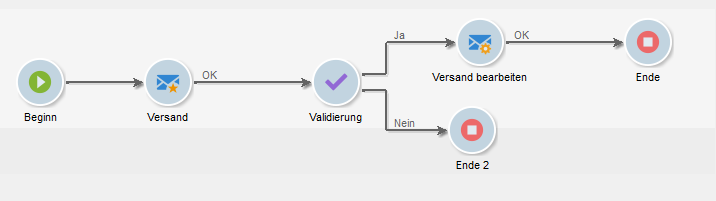
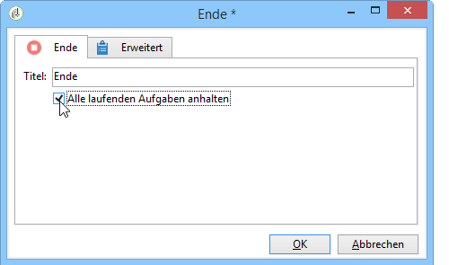
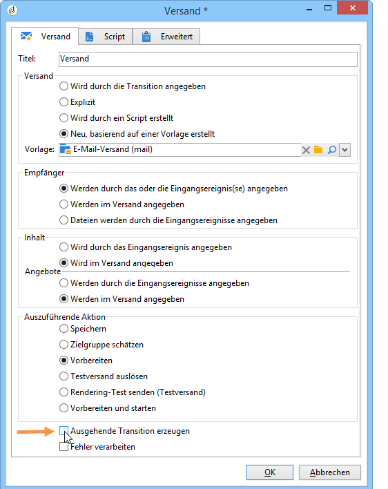

# Start und Ende{#start-and-end}

**[!UICONTROL Beginn]**- und **[!UICONTROL Ende]**-Aktivitäten markieren grafisch den Anfangs- bzw. Endpunkt eines Workflows. Sie haben keine funktionale Auswirkung und sind daher optional.

* **[!UICONTROL Starten]**

   Die Ausführung eines Workflows beginnt mit Aktivitäten ohne eingehende Transition oder mit einer Beginnaktivität.

   

* **[!UICONTROL Ende]**

   Das **[!UICONTROL Ende]** kann dahingehend konfiguriert werden, dass es alle laufenden Aufgaben unterbricht. Öffnen Sie hierzu die Aktivität und kreuzen Sie die entsprechende Option an.

   

   Die Daten der Arbeitstabelle werden automatisch gelöscht, sobald die Endeaktivität aktiviert wird. Sollte dies nicht erforderlich sein und um eine unnötige Inanspruchnahme von Ressourcen zu vermeiden, kann die ausgehende Transition der letzten Workflow-Aktivität deaktiviert werden. Wenn beispielsweise ein Versand die letzte Aktivität eines Workflows ist, können Sie, wie unten abgebildet, die entsprechende Option deaktivieren:

   

