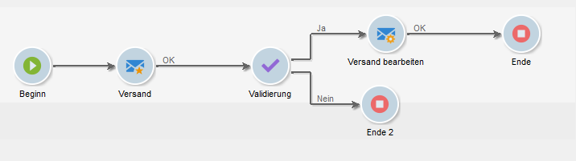
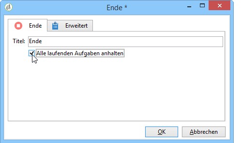
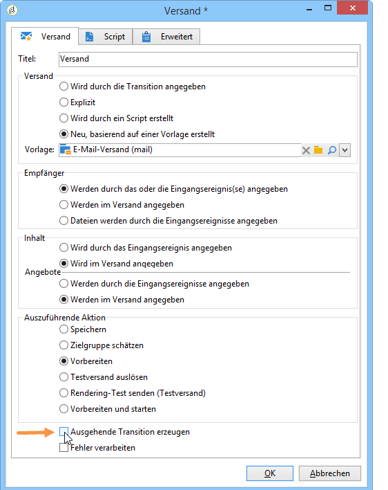

# Start und Ende{#start-and-end}

Mit **[!UICONTROL Start]** und **[!UICONTROL End]**-Aktivitäten können Sie den Start und das Ende eines Workflows grafisch markieren. Diese Aktivitäten haben keine funktionalen Auswirkungen und sind daher optional.

* **[!UICONTROL Starten]**

  Die Ausführung eines Workflows beginnt mit Aktivitäten ohne eingehende Transition oder mit einer Beginnaktivität.

  

* **[!UICONTROL Ende]**

  Sie können die Aktivität **[!UICONTROL Ende]** so konfigurieren, dass alle laufenden Aufgaben unterbrochen werden. Doppelklicken Sie dazu auf die Aktivität, um deren Eigenschaften anzuzeigen, und aktivieren Sie die entsprechende Option.

  

  Die Daten in der Arbeitstabelle werden automatisch gelöscht, wenn die Endaktivität aktiviert ist. Wenn dies nicht erforderlich ist, können Sie zur Vermeidung unnötiger Lasten die Transition bei der letzten Aktivitätsausgabe deaktivieren. Wenn beispielsweise an einer Versandausgabe kein Prozess geplant ist, deaktivieren Sie die entsprechende Option wie unten dargestellt:

  
