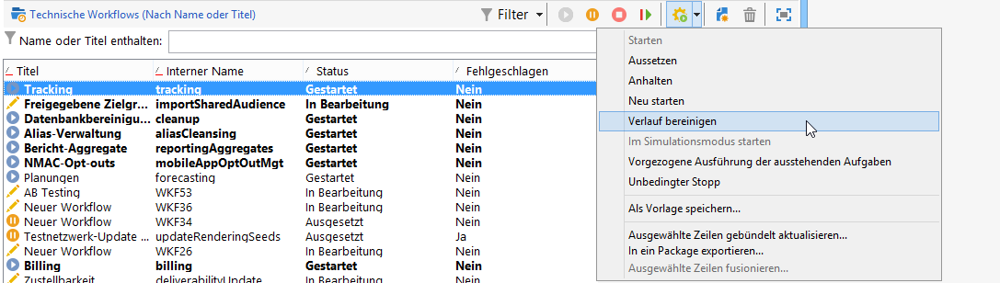
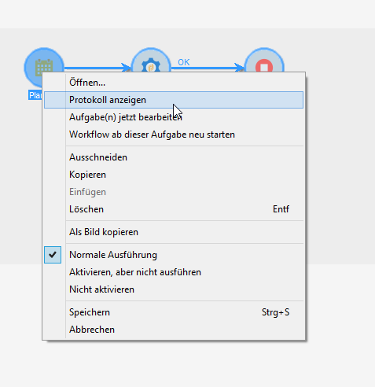

# Workflow starten {#starting-a-workflow}

Workflows werden grundsätzlich manuell gestartet, Nach dem Starten können sie jedoch inaktiv bleiben, je nachdem, welche Informationen über eine Planung (siehe [Planung](../../workflow/using/scheduler.md)) oder Aktivitätsplanung angegeben wurden.

Die mit der Workflow-Ausführung in Zusammenhang stehenden Prozesse (starten, anhalten, aussetzen etc.) laufen **asynchron** ab, d. h. der jeweilige Befehl wird gespeichert und erst dann ausgeführt, wenn ein Server verfügbar ist.

Anhand der Schaltflächen der Symbolleiste kann die Ausführung des Workflows gesteuert und überwacht werden.

Die im Menü **[!UICONTROL Aktionen]** und im Kontextmenü verfügbaren Befehle werden nachstehend erläutert.

>[!IMPORTANT]
>
>Keep in mind that, when an operator performs an action on a workflow (start, stop, pause, etc.), the action is not executed straightaway, but instead placed in a queue in order to be processed by the [workflow module](../../workflow/using/architecture.md).

## Aktionen-Symbolleiste {#actions-toolbar}

Die Symbolleiste wird in diesem [Abschnitt](../../campaign/using/marketing-campaign-deliveries.md#building-the-main-target-in-a-workflow) beschrieben. Die Schaltfläche **[!UICONTROL Aktionen]** bietet weiterführende Optionen, um auf die Ausführung eines oder mehrerer Workflows Einfluss zu nehmen. Auf die Aktionen können Sie außerdem über das Menü **[!UICONTROL Datei > Aktionen]** oder durch Rechtsklick und Auswahl der Option **[!UICONTROL Aktionen]** im Kontextmenü zugreifen.

* **[!UICONTROL Starten]**

   Dieser Befehl startet die Ausführung eines Workflows. Sein Status wechselt von **In Bearbeitung**, **Ausgesetzt** oder **Abgeschlossen** in **Gestartet**. Die Workflow-Engine übernimmt die Ausführung des Workflows. Bei zuvor ausgesetzten Workflows wird die Ausführung an der Stelle wieder aufgenommen, wo sie ausgesetzt wurde. In den anderen Fällen starten die Workflows jeweils mit der ersten Aktivität.

   Der Start eines Workflows ist ein asynchroner Prozess, d. h. der jeweilige Befehl wird gespeichert und erst dann ausgeführt, wenn ein Server verfügbar ist.

* **[!UICONTROL Aussetzen]**

   Dieser Befehl überführt den Workflow in den Status **Ausgesetzt**. Bis zur Wiederaufnahme werden keine weiteren Aktivitäten gestartet, laufende Vorgänge werden jedoch nicht unterbrochen.

* **[!UICONTROL Anhalten]**

   Dieser Befehl hält die Ausführung eines laufenden Workflows an. Der Status der Workflow-Instanz wechselt zu **Abgeschlossen**. Laufende Vorgänge werden nach Möglichkeit unterbrochen. Gestartete Importe oder SQL-Abfragen werden sofort abgebrochen.

   Das Anhalten eines Workflows ist ein asynchroner Prozess, d. h. der jeweilige Befehl wird gespeichert und der oder die Server brechen die laufenden Vorgänge ab. Das Anhalten einer Workflow-Instanz kann daher eine geraume Zeit dauern, insbesondere wenn der Workflow über verschiedene Server verteilt ist. In diesem Fall muss jeder Server den Prozess übernehmen und die laufenden Aufgaben abbrechen.

* **[!UICONTROL Neu starten]**

   Dieser Befehl hält einen Workflow zunächst an und startet ihn dann erneut.In den meisten Fällen ermöglicht diese Vorgehensweise einen schnelleren Neustart als die separate Verwendung der Anhalten- und Starten-Schaltflächen. Dies ist insbesondere dann nützlich, wenn das Anhalten eines Workflows geraume Zeit in Anspruch nimmt, da der Befehl &quot;Starten&quot; erst wieder verfügbar ist, wenn der Workflow tatsächlich angehalten wurde.

   Die Befehle **[!UICONTROL Starten/Aussetzen/Anhalten/Neu starten]** sind auch über die entsprechenden Schaltflächen der Symbolleiste verfügbar. Weiterführende Informationen finden Sie in diesem [Abschnitt](../../campaign/using/marketing-campaign-deliveries.md#creating-a-targeting-workflow).

* **[!UICONTROL Verlaufsbereinigung]**

   Mit dieser Aktion können Sie den Workflow-Verlauf bereinigen. Weitere Informationen finden Sie unter [Verläufe bereinigen](../../workflow/using/monitoring-workflow-execution.md#purging-the-logs).

* **[!UICONTROL Im Simulationsmodus starten]**

   Mithilfe dieses Befehls wird der Workflow im Simulationsmodus gestartet. In diesem Modus werden nur die Aktivitäten ausgeführt, die keine Auswirkungen auf die Datenbank oder das Dateisystem haben. Dies können Aktivitäten vom Typ **[!UICONTROL Abfrage]**, **[!UICONTROL Vereinigung]**, **[!UICONTROL Schnittmenge]** usw. sein. Aktivitäten mit Auswirkungen (beispielsweise **[!UICONTROL Export]**, **[!UICONTROL Import]** usw.) sowie die darauf folgenden Aktivitäten im selben Zweig werden nicht ausgeführt.

* **[!UICONTROL Vorgezogene Ausführung der ausstehenden Aufgaben]**

   Dieser Befehl bietet die Möglichkeit, so schnell wie möglich alle ausstehenden Aufgaben zu starten. Wenn Sie eine bestimmte Aufgabe starten möchten, klicken Sie auf die entsprechende Aktivität und wählen Sie **[!UICONTROL Aufgabe(n) jetzt bearbeiten]**.

* **[!UICONTROL Unbedingter Stopp]**

   Bei Auswahl dieses Befehls wechselt der Workflow-Status zu **[!UICONTROL Abgeschlossen]**. Dieser Befehl darf nur als letztes Mittel eingesetzt werden, wenn das normale Anhalten auch nach mehreren Minuten keine Wirkung zeigt. Verwenden Sie den unbedingten Stopp nur, wenn Sie sicher sind, dass der Workflow keine reellen laufenden Prozesse aufweist.

   >[!CAUTION]
   >
   >Die Verwendung dieses Befehls sollte erfahrenen Benutzern vorbehalten bleiben.

* **[!UICONTROL Als Vorlage speichern]**

   Dieser Befehl erstellt eine neue, auf dem markierten Workflow basierende Workflow-Vorlage. Geben Sie im Feld **[!UICONTROL Ordner]** den gewünschten Speicherordner an.

   Die Optionen **[!UICONTROL Ausgewählte Zeilen gebündelt aktualisieren...]** und **[!UICONTROL Ausgewählte Zeilen fusionieren...]** sind allgemeine Optionen der Plattform, die in allen **[!UICONTROL Aktionen]**-Menüs zur Verfügung stehen. Lesen Sie diesbezüglich diesen [Abschnitt](../../platform/using/updating-data.md).

## Kontextmenü {#right-click-menu}

Durch Markierung und Rechtsklick auf eine oder mehrere Aktivitäten eines Workflows können Sie speziell auf diese einwirken.

Im Kontextmenü stehen folgende Optionen zur Verfügung:

**[!UICONTROL Öffnen...]** - ermöglicht den Zugriff auf die Eigenschaften der Aktivität.

**[!UICONTROL Protokoll anzeigen]** - zeigt das Ausführungsprotokoll der Aufgaben der ausgewählten Aktivität an. Weitere Informationen finden Sie unter [Protokoll anzeigen](../../workflow/using/monitoring-workflow-execution.md#displaying-logs).

**[!UICONTROL Aufgabe(n) jetzt bearbeiten]** - startet so schnell wie möglich alle ausstehenden Aufgaben der Aktivität.

**[!UICONTROL Workflow ab dieser Aufgabe neu starten]** - startet den Workflow ab der ausgewählten Aufgabe neu und verwendet dabei die durch die vorangehende Ausführung in der Aktivität gespeicherten Ergebnisse.

**[!UICONTROL Ausschneiden/Kopieren/Einfügen/Löschen]** - ermöglicht das Ausschneiden, Kopieren, Einfügen oder Löschen der ausgewählten Aktivität(en).

**[!UICONTROL Als Bild kopieren]** - erstellt einen Screenshot sämtlicher Aktivitäten des Workflows.

**[!UICONTROL Normale Ausführung/Aktivieren, aber nicht ausführen/Nicht aktivieren]** - sind auch im Tab **[!UICONTROL Erweitert]** der Aktivitätseigenschaften verfügbar. Sie werden unter [Ausführung](../../workflow/using/advanced-parameters.md#execution) ausführlich beschrieben.

**[!UICONTROL Speichern/Abbrechen]** - speichert oder verwirft die im Workflow vorgenommenen Änderungen.

>[!NOTE]
>
>Es ist möglich, mehrere Aktivitäten zu markieren, um einen der genannten Befehle auf sie anzuwenden.

Das Kontextmenü wird in diesem [Abschnitt](../../campaign/using/marketing-campaign-deliveries.md#executing-a-workflow) näher erläutert.
