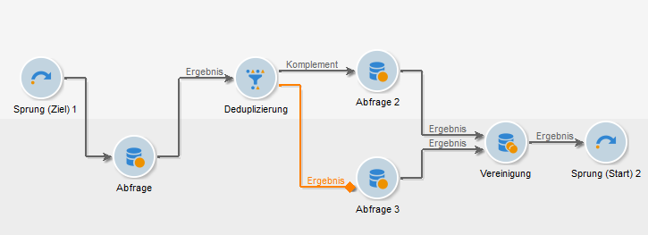
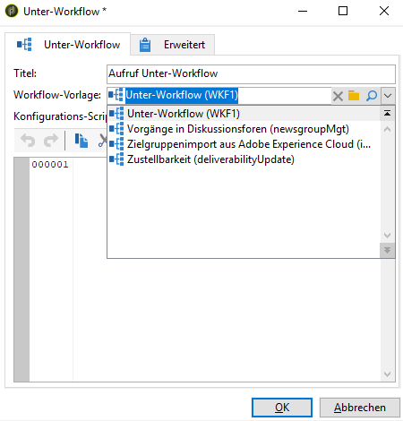
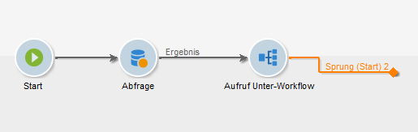

# Unter-Workflow{#sub-workflow}

Mit der Aktivität **[!UICONTROL Unter-Workflow]** kann die Ausführung eines anderen Workflows gestartet und dessen Ergebnis zur weiteren Verwendung abgerufen werden. Dies ermöglicht komplexe, aber dennoch übersichtliche Workflow-Konstruktionen.

Sie können in einem einzigen Workflow mehrere Unter-Workflows starten. Unter-Workflows werden synchron ausgeführt.

Im folgenden Beispiel ruft ein &quot;Master&quot;-Workflow einen Unter-Workflow mit Jumps auf. Weitere Informationen zu grafischen Objekten mit Sprungtyp finden Sie in [diesem Abschnitt](../../workflow/using/jump--start-point-and-end-point-.md).

1. Erstellen Sie einen Workflow, den Sie als Unter-Workflow in einem anderen Workflow verwenden möchten.
1. Fügen Sie am Anfang des Workflows eine **[!UICONTROL Aktivität mit der Priorität 1 ein (Endpunkt)]** . Wenn mehrere &quot;Endpunkt&quot;-Jumps vorhanden sind, verwendet Adobe Campaign den &quot;Endpunkt&quot;-Sprung mit der niedrigsten Zahl.
1. Fügen Sie am Ende des Workflows eine **[!UICONTROL Sprung (Beginn-Point)]** -Aktivität mit der Priorität 2 ein. Wenn Sie mehrere Jumps vom Typ &quot;Beginn-Point&quot;haben, verwendet Adobe Campaign den &quot;Beginn-Point&quot;-Sprung mit der höchsten Anzahl.

   

   >[!NOTE]
   >
   >If the sub-workflow activity references a workflow with several **[!UICONTROL Jump]** activities, the sub-workflow is executed between the &quot;end point&quot; type jump with the lowest number and the &quot;start point&quot; type jump with the highest number.
   >
   >Damit der Unter-Workflow korrekt ausgeführt werden kann, muss nur ein &quot;Endpunkt&quot;-Typsprung mit der niedrigsten Zahl und nur ein &quot;Beginn-Point&quot;-Typsprung mit der höchsten Zahl vorhanden sein.

1. Vervollständigen und speichern Sie diesen Unter-Workflow.
1. Erstellen Sie einen &quot;Master&quot;-Workflow.
1. Fügen Sie die Aktivität **[!UICONTROL Unter-Workflow]** ein und öffnen Sie sie.
1. Wählen Sie in der Dropdown-Liste der **[!UICONTROL Workflow-Vorlagen]** den gewünschten Workflow aus.

   

1. Es besteht auch die Möglichkeit, ein Konfigurationsscript hinzuzufügen, um die Funktionsweise des referenzierten Workflows anzupassen.
1. Wählen Sie **[!UICONTROL OK]** aus. Aus dem ausgewählten Workflow wird automatisch eine ausgehende Transition mit dem Titel der Aktivität **[!UICONTROL Sprung (Start)]** erstellt.

   

1. Führen Sie den Workflow aus.

Nach Ausführung befindet sich der Workflow, der als Unter-Workflow gestartet wurde, im Status **[!UICONTROL In Bearbeitung]**, was Folgendes bedeutet:

* Sie können mit der rechten Maustaste nicht auf die Transitionen klicken, um die Zielgruppe anzuzeigen.
* Es kann kein Zwischenergebnis der Populationsgröße angezeigt werden.
* Logs werden im Master-Workflow unter der Bezeichnung &quot;subworkflow&quot; aufgeführt.

Dieser Workflow ist nur eine Vorlage. Beim Aufruf im Master-Workflow wird ein neuer Unter-Workflow auf Basis dieser Vorlage angelegt.

## Eingabeparameter (optional) {#input-parameters--optional-}

* tableName
* schema

Jedes eingehende Ereignis muss eine durch diese Parameter definierte Zielgruppe angeben.

## Ausgabeparameter {#output-parameters}

* tableName
* schema
* recCount

Anhand der drei Werte lässt sich die durch den Ausschluss ermittelte Zielgruppe identifizieren. **[!UICONTROL tableName]** ist der Name der Tabelle, welche die Kennungen der Zielgruppenempfänger enthält, **[!UICONTROL schema]** ist das Schema der Population, (i. d. R. nms:recipient) und **[!UICONTROL recCount]** ist die Anzahl an Elementen in der Tabelle.

* targetSchema: Dieser Wert ist das Schema der Arbeitstabelle. Dieser Parameter ist für alle Transitionen mit **[!UICONTROL tableName]** und **[!UICONTROL Schema]** gültig.
