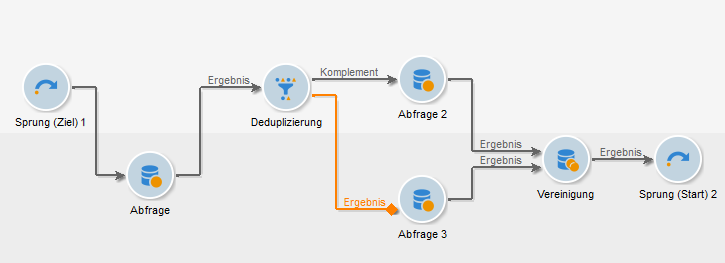
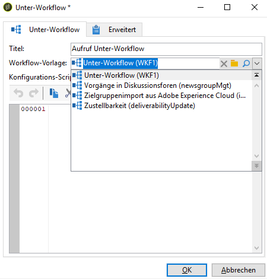
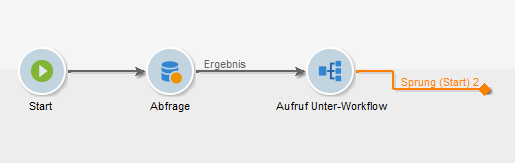
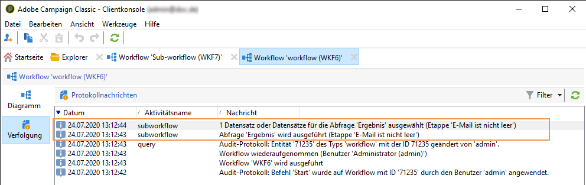

# Unter-Workflow{#sub-workflow}

Mit der Aktivität **[!UICONTROL Unter-Workflow]** kann die Ausführung eines anderen Workflows ausgelöst und dessen Ergebnis abgerufen werden. Diese Aktivität ermöglicht die Verwendung komplexer Workflows in einer vereinfachten Benutzeroberfläche.

Sie können in einem einzigen Workflow mehrere Unter-Workflows aufrufen. Unter-Workflows werden synchron ausgeführt.

Im folgenden Beispiel ruft ein primärer Workflow einen Unter-Workflow mithilfe von Sprüngen auf. Weiterführende Informationen zu grafischen Objekten vom Typ &quot;Sprung&quot; finden Sie in [diesem Abschnitt](jump-start-point-and-end-point.md).

1. Erstellen Sie einen Workflow, den Sie als Unter-Workflow in einem anderen Workflow verwenden möchten.
1. Fügen Sie am Anfang des Workflows eine Aktivität vom Typ **[!UICONTROL Sprung (Ziel)]** mit der Priorität 1 ein. Wenn mehrere &quot;Ziel&quot;-Sprünge vorhanden sind, verwendet Adobe Campaign den &quot;Ziel&quot;-Sprung mit der niedrigsten Nummer.
1. Fügen Sie am Ende des Workflows eine Aktivität vom Typ **[!UICONTROL Sprung (Start)]** mit der Priorität 2 ein. Wenn mehrere &quot;Start&quot;-Sprünge vorhanden sind, verwendet Adobe Campaign den &quot;Start&quot;-Sprung mit der höchsten Nummer.

   

   >[!NOTE]
   >
   >Wenn die Unter-Workflow-Aktivität einen Workflow startet, der mehrere **[!UICONTROL Sprung]**-Aktivitäten aufweist, wird der Unter-Workflow zwischen dem &quot;Ziel&quot;-Sprung mit der kleinsten Nummer und dem &quot;Start&quot;-Sprung mit der höchsten Nummer ausgeführt.
   >
   >Damit sich der Unter-Workflow richtig ausführen lässt, dürfen Sie nur einen &quot;Ziel&quot;-Sprung mit der niedrigsten Nummer und einen &quot;Start&quot;-Sprung mit der höchsten Nummer verwenden.

1. Vervollständigen und speichern Sie diesen Unter-Workflow.
1. Erstellen Sie einen primären Workflow.
1. Fügen Sie die Aktivität **[!UICONTROL Unter-Workflow]** ein und öffnen Sie sie.
1. Wählen Sie in der Dropdown-Liste der **[!UICONTROL Workflow-Vorlagen]** den gewünschten Workflow aus.

   

1. Es besteht auch die Möglichkeit, ein Konfigurationsscript hinzuzufügen, um die Funktionsweise des referenzierten Workflows anzupassen.
1. Klicken Sie auf **[!UICONTROL OK]**. Dadurch wird automatisch eine ausgehende Transition mit dem Titel der Aktivität **[!UICONTROL Sprung (Start)]** aus dem ausgewählten Workflow erstellt.

   

1. Führen Sie den Workflow aus.

Nach der Ausführung befindet sich der Workflow, der als Unter-Workflow gestartet wurde, weiter im Status **[!UICONTROL In Bearbeitung]**, was Folgendes bedeutet:

* Sie können mit der rechten Maustaste nicht auf die Transitionen klicken, um die Zielgruppe anzuzeigen.
* Es kann kein Zwischenergebnis der Populationsgröße angezeigt werden.
* Die Logs des Unter-Workflows werden im primären Workflow angezeigt.

  

>[!NOTE]
>
>Wenn im Unter-Workflow ein Fehler auftritt, wird der primäre Workflow angehalten und eine Kopie des Unter-Workflows erstellt.

## Eingabeparameter (optional) {#input-parameters--optional-}

* tableName
* schema

Jedes eingehende Ereignis muss eine durch diese Parameter definierte Zielgruppe angeben.

## Ausgabeparameter {#output-parameters}

* tableName
* schema
* recCount

Anhand der drei Werte lässt sich die durch die Abfrage ermittelte Population identifizieren. **[!UICONTROL tableName]** ist der Name der Tabelle, die die Zielgruppen-IDs enthält, **[!UICONTROL schema]** ist das Schema der Population, (i. d. R. nms:recipient) und **[!UICONTROL recCount]** ist die Anzahl der Elemente in der Tabelle.

* targetSchema: Dieser Wert ist das Schema der Arbeitstabelle. Dieser Parameter ist für alle Transitionen mit **[!UICONTROL tableName]** und **[!UICONTROL schema]** gültig.

