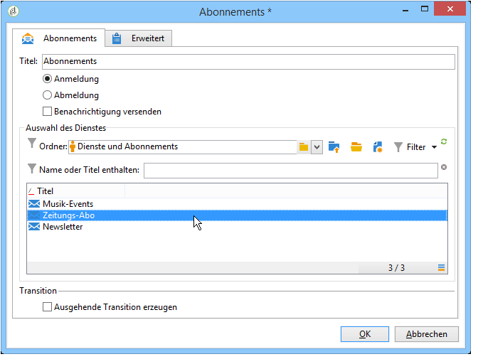
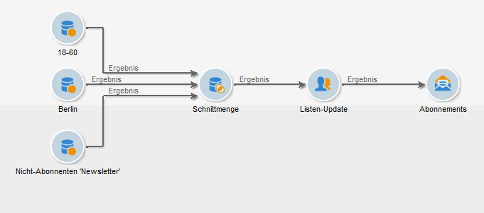

# An-/Abmeldedienst{#subscription-services}

Über die **Abonnementaktivität** kann eine durch die eingehende Transition bezeichnete Population für einen Informationsdienst angemeldet oder von einem Dienst abgemeldet werden.

Die Konfiguration der Aktivität besteht in der Angabe eines Titels, die Auswahl von Anmeldung oder Abmeldung sowie des betroffenen Informationsdienstes, wie unten abgebildet:

1. Benennen Sie die Aktivität.
1. Kreuzen Sie die Option **[!UICONTROL Ausgehende Transition erzeugen an]**, wenn sich weitere Aktivitäten anschließen.

   Im Allgemeinen bildet die Abonnementaktivität den Schlusspunkt eines Workflows. Aus diesem Grund, wird die ausgehende Transition nicht standardmäßig erzeugt.

1. Kreuzen Sie je nach Bedarf **[!UICONTROL Anmeldung]** oder **[!UICONTROL Abmeldung]** an.
1. Aktivieren Sie die Option **[!UICONTROL Benachrichtigung versenden]**, um den Empfänger von seiner An- oder Abmeldung in Kenntnis zu setzen.

   Der Benachrichtigungsinhalt wird in der Versandvorlage des entsprechenden Informationsdienstes definiert. Weiterführende Informationen hierzu finden Sie in diesem [Abschnitt](../../delivery/using/managing-subscriptions.md).

## Anwendungsbeispiel: Empfänger einer Liste für einen Newsletter anmelden {#example--subscribe-a-list-of-recipients-to-a-newsletter}

Im folgenden Beispiel sollen Empfänger der Altersgruppe zwischen 18 und 60 Jahre, die in Berlin leben, für einen speziellen Newsletter angemeldet werden.

Dabei sollen die Profile, die den Newsletter bereits erhalten, ausgeschlossen werden.

>[!CAUTION]
>
>Bevor Sie Empfänger manuell für einen Dienst anmelden, ist sicherzustellen, dass Letztere mit dem Erhalt von Nachrichten Ihrerseits einverstanden sind.

1. Erstellen Sie drei Abfragen:

   * Die erste Abfrage ruft alle Empfänger zwischen 18 und 60 Jahre ab.
   * Die zweite Abfrage ruft die in Berlin lebenden Empfänger ab.
   * Die dritte Abfrage ruft die Empfänger ab, die den Newsletter bisher nicht abonniert haben.

1. Schließen Sie eine Schnittmenge an, um die verschiedenen Ergebnisse zu kreuzen.
1. Fügen Sie bei Bedarf ein Listen-Update ein, um stets über eine aktuelle Liste der neuesten Abonnenten zu verfügen.
1. Positionnieren Sie im Anschluss eine Abonnementaktivität und öffnen Sie diese.
1. Benennen Sie die Aktivität und kreuzen Sie die Option **[!UICONTROL Anmeldung]** an.

   Es besteht die Möglichkeit, die neuen Newsletter-Empfänger von ihrer Anmeldung zu informieren, indem Sie die Option **[!UICONTROL Benachrichtigung versenden]** aktivieren.

1. Geben Sie den Ordner an, der den Newsletter enthält und wählen Sie diesen dann aus der Liste der verfügbaren Kommunikationen aus.
1. Lassen Sie die Option **[!UICONTROL Ausgehende Transition erzeugen]** deaktiviert, damit der Workflow mit der Abonnementaktivität endet. Bestätigen Sie die Konfiguration durch Klick auf **[!UICONTROL OK]**.

Bei Ausführung des Workflows werden die Profile, die allen drei Abfragebedingungen entsprechen, zur Abonnentenliste hinzugefügt und für den Newsletter angemeldet.

Im Tab **[!UICONTROL Abonnements]** der Empfängerprofile können Sie prüfen, ob der Workflow das gewünschte Ergebnis erzielt hat.

## Eingabeparameter {#input-parameters}

* tableName
* schema

Jedes eingehende Ereignis muss eine durch diese Parameter definierte Zielgruppe angeben.
