# Zielgruppendaten{#targeting-data}

## Abfragen erstellen   {#creating-queries}

### Datenauswahl {#selecting-data}

Mit einer **[!UICONTROL Abfrageaktivität]** können Sie grundlegende Daten zum Aufbau der Zielpopulation auswählen. Weitere Informationen hierzu finden Sie unter [Abfragen erstellen](../../workflow/using/query.md#creating-a-query).

Sie können auch mithilfe der folgenden Aktivitäten Daten aus der Datenbank abfragen und weiter filtern: [Inkrementelle Abfrage ](../../workflow/using/incremental-query.md), [Liste lesen](../../workflow/using/read-list.md).

Es ist möglich, zusätzliche Daten zu sammeln, die während des gesamten Lebenszyklus des Workflows weitergeleitet und verarbeitet werden. Weitere Informationen hierzu finden Sie unter [Daten hinzufügen ](../../workflow/using/query.md#adding-data)und [Zusätzliche Daten bearbeiten](#editing-additional-data).

### Zusätzliche Daten bearbeiten {#editing-additional-data}

Nach Hinzufügung der zusätzlichen Daten können Sie diese bearbeiten oder zur Verfeinerung der in der Abfrageaktivität definierten Zielgruppe verwenden.

Über den Link **[!UICONTROL Zusätzliche Daten bearbeiten...]** können Sie die hinzugefügten Daten anzeigen und sie gegebenenfalls ändern oder ergänzen.

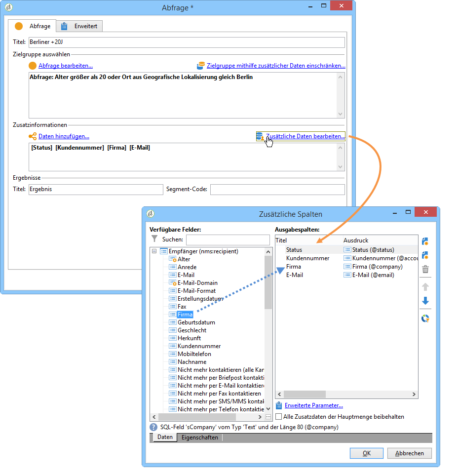

Um den zuvor definierten Ausgabespalten Daten hinzuzufügen, müssen Sie diese aus der Liste der verfügbaren Felder auswählen. Klicken Sie zur Erstellung einer neuen Ausgabespalte auf die Schaltfläche **[!UICONTROL Hinzufügen]**, wählen Sie das neue Feld aus und klicken Sie dann auf **[!UICONTROL Ausdruck bearbeiten]**.

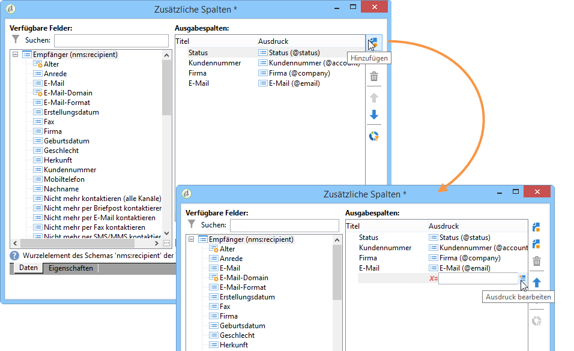

Kreuzen Sie den gewünschten Formeltyp an, beispielsweise Aggregat.

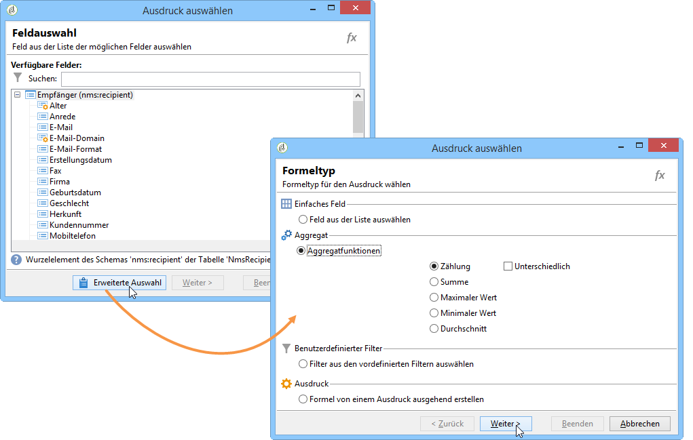

Über die Option **[!UICONTROL Unterelement hinzufügen]** können die berechneten Daten in die Kollektion eingefügt werden. Sie können also aus der Kollektion stammende Zusatzdaten auswählen oder aus den Kollektionselementen Aggregate berechnen.

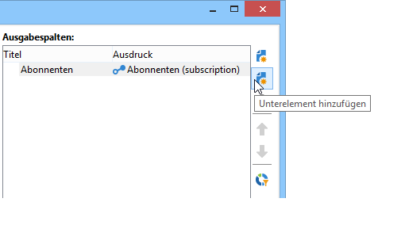

Die Unterelemente erscheinen als Unterordner der Kollektion, der sie angehören.

Kollektionen werden im gleichnamigen Untertab angezeigt. Durch Klick auf die Schaltfläche **[!UICONTROL Details...]** ... können Sie die abgerufenen Elemente filtern. Wählen Sie im Filterassistenten anhand der Dropdown-Liste zunächst die gesammelten Daten aus und geben Sie dann die auf die Kollektion anzuwendenden Filterbedingungen an.****

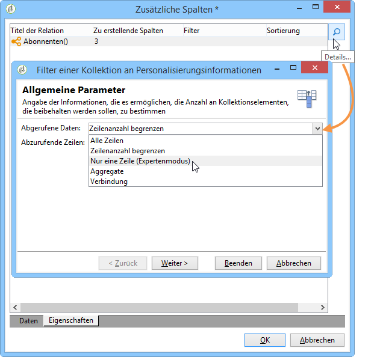

### Zielgruppe mithilfe zusätzlicher Daten einschränken {#refining-the-target-using-additional-data}

Die abgerufenen Zusatzdaten können zur weiteren Einschränkung der Daten aus der Datenbank herangezogen werden. Klicken Sie hierzu auf den Link **[!UICONTROL Zielgruppe mithilfe zusätzlicher Daten einschränken...]**.

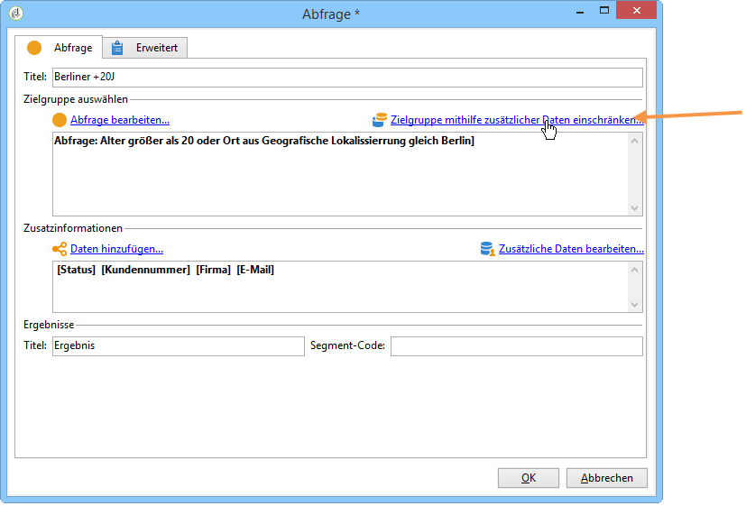

### Daten vereinheitlichen {#homogenizing-data}

In den Aktivitäten vom Typ **[!UICONTROL Vereinigung]** und **[!UICONTROL Schnittmenge]** haben Sie die Möglichkeit, nur die gemeinsamen Zusatzdaten beizubehalten, um eine homogene Datenbasis zu erhalten. In diesem Fall enthält die resultierende temporäre Arbeitstabelle der entsprechenden Aktivität nur die Zusatzdaten, die in allen eingehenden Mengen enthalten sind.

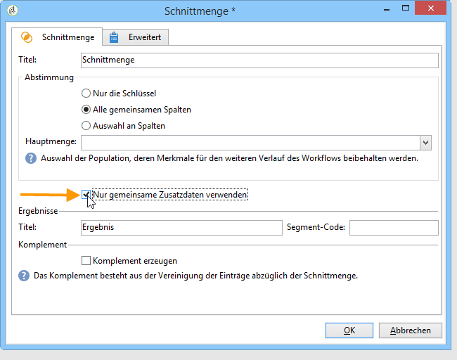

### Mit Zusatzdaten abstimmen {#reconciliation-with-additional-data}

In den Aktivitäten **[!UICONTROL Vereinigung]**, **[!UICONTROL Schnittmenge]** etc. besteht die Möglichkeit, die zur Abstimmung zu verwendenden Spalten aus den Zusatzdaten auszuwählen. Konfigurieren Sie hierzu die Abstimmung über eine Auswahl an Spalten und geben Sie die Hauptmenge an. Wählen Sie dann im unteren Fensterbereich wie dargestellt die entsprechenden Spalten aus:

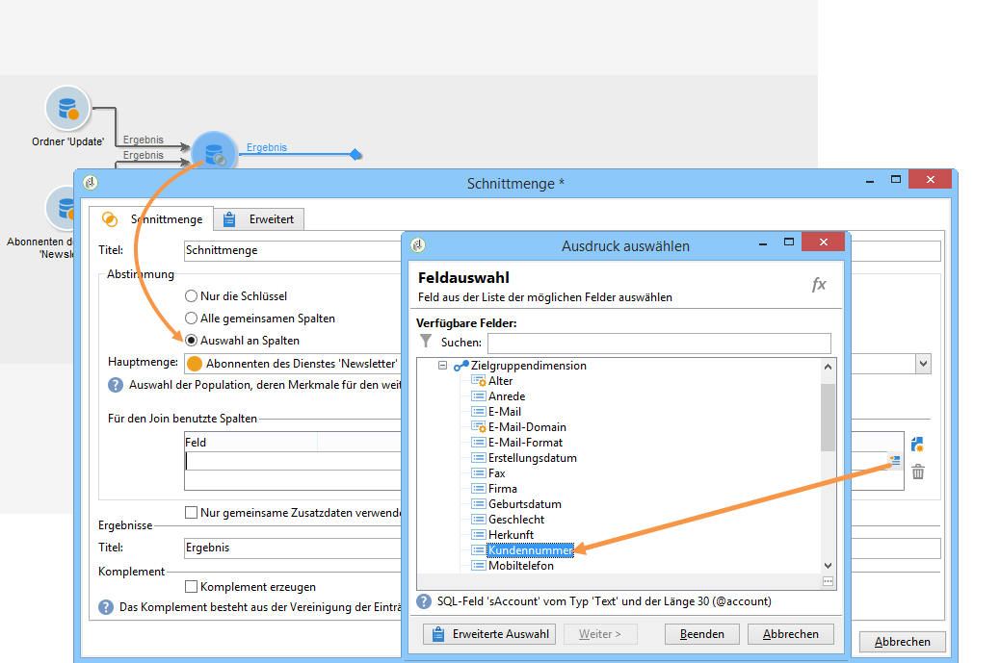

### Teilmengen erstellen {#creating-subsets}

Über die **[!UICONTROL Aufspaltungsaktivität]** lassen sich gemäß bestimmten Kriterien entsprechende Teilmengen erstellen. Aktivieren Sie hierfür in der Teilmenge die Option zur Erstellung von Filterbedingungen und definieren Sie im sich öffnenden Abfragefenster die Kriterien zur Zielgruppensegmentierung.

Als Filterbedingungen können hier entweder nur die Zusatzdaten oder Zusatzdaten und Zielgruppendaten verwendet werden. Wenn Sie über die Option **Federated Data Access** verfügen, können außerdem externe Daten herangezogen werden.

Weitere Informationen hierzu finden Sie unter [Teilmengen mithilfe der Aufspaltungs-Aktivität erstellen](#creating-subsets-using-the-split-activity).

## Daten segmentieren {#segmenting-data}

### Populationen vereinen (Vereinigung) {#combining-several-targets--union-}

Über die Vereinigungsaktivität lassen sich die Ergebnisse verschiedener Aktivitäten in einer Transition zusammenfassen. Dabei müssen die Mengen nicht zwingend homogen sein.

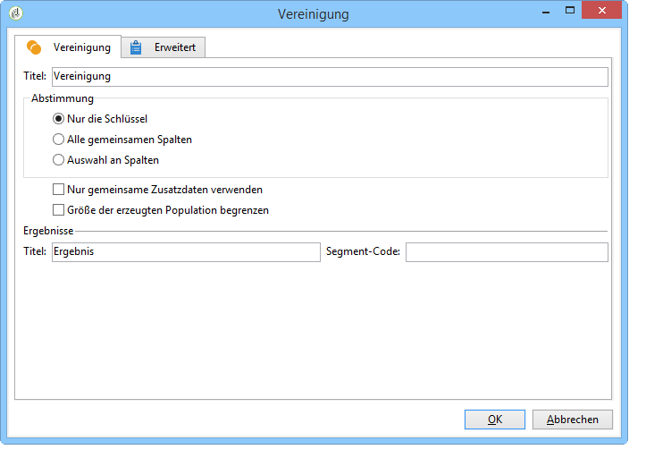

Zur Abstimmung der Daten stehen folgende Optionen zur Verfügung:

* **[!UICONTROL Nur die Schlüssel]**

   Diese Option kann bei homogenen Eingangspopulationen verwendet werden.

* **[!UICONTROL Alle gemeinsamen Spalten]**

   Diese Option ermöglicht die Abstimmung der Datensätze über alle den verschiedenen Zielpopulationen gemeinsamen Spalten.

   Spalten werden in Adobe Campaign anhand der Spaltentitel identifiziert. Dabei werden geringfügige Unterschiede akzeptiert. Der Spaltentitel &#39;Email&#39; wird als identisch mit dem Titel &#39;@email&#39; gewertet.

* **[!UICONTROL Auswahl an Spalten]**

   Diese Option ermöglicht die Auswahl der Spalten, die zur Abstimmung herangezogen werden sollen.

   Wählen Sie zunächst die die Quelldaten enthaltende Hauptmenge aus und anschließend die Spalten, die den Join herstellen sollen.

   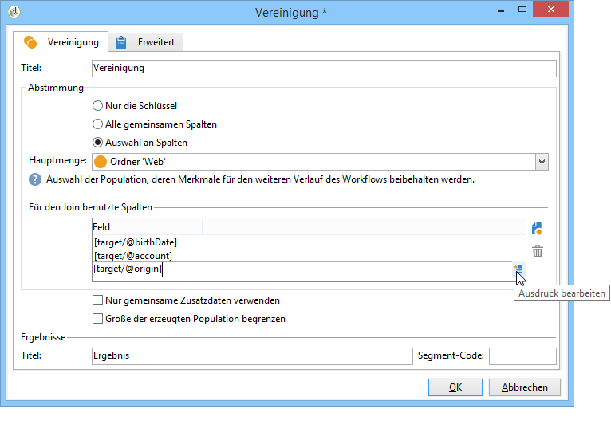

   >[!CAUTION]
   >
   >Die Populationen werden im Rahmen der Abstimmung nicht auf Dubletten geprüft.

   Sie können die Populationsgröße auf eine gewisse Anzahl an Datensätzen begrenzen. Kreuzen Sie hierfür die entsprechende Option an und geben Sie die Anzahl an beizubehaltenden Datensätzen an.

   Geben Sie außerdem die Priorität der Eingangspopulationen an. Im unteren Bereich des Fensters werden die in die Vereinigungsaktivität eingehenden Transitionen aufgelistet. Die Reihenfolge kann mithilfe der blauen Pfeile rechts verändert werden.

   Die beibehaltenen Datensätze stammen zunächst aus der ersten eingehenden Transition und werden, falls die gewünschte Anzahl noch nicht erreicht ist, durch die Population der folgenden Transitionen ergänzt.

   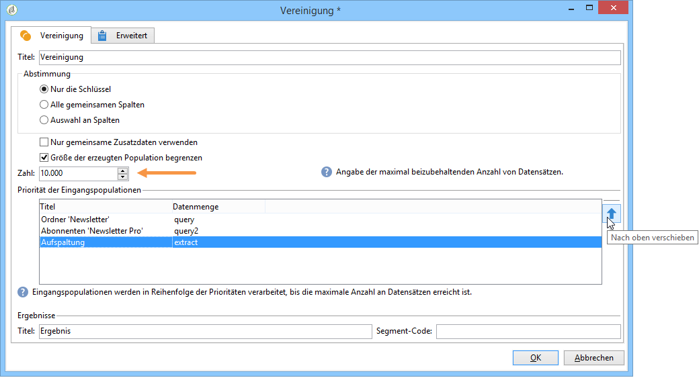

### Gemeinsame Daten aus Populationen extrahieren (Schnittmenge) {#extracting-joint-data--intersection-}

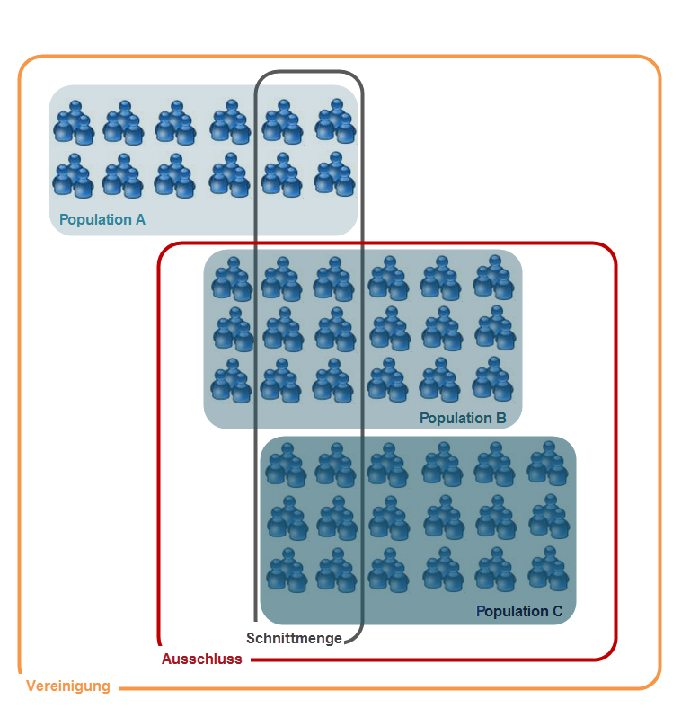

Über die Schnittmengenaktivität lassen sich die Datensätze abrufen, die in allen eingehenden Populationen enthalten sind. Die Abstimmparameter dieser Aktivität sind dieselben wie im Abschnitt für die Vereinigung beschrieben.

Es ist außerdem möglich, nur eine Auswahl an Spalten oder nur die Spalten, die in allen eingehenden Populationen enthalten sind, abzurufen.

Die Schnittmengenaktivität wird im Abschnitt [Schnittmenge](../../workflow/using/intersection.md) detailliert beschrieben.

### Populationen ausschließen (Ausschluss) {#excluding-a-population--exclusion-}

Über die Ausschlussaktivität lassen sich Elemente aus einer Population ausschließen, die auch in mindestens einer anderen Population enthalten sind. Die Zielgruppendimension am Aktivitätsausgang entspricht der der Hauptmenge.

Bei Bedarf können die eingehenden Tabellen angepasst werden. Dies ist beispielsweise erforderlich, wenn eine Population einer anderen Dimension ausgeschlossen werden soll. In diesem Fall muss sie in die Dimension der Hauptmenge überführt werden. Klicken Sie hierfür auf die Schaltfläche **[!UICONTROL Hinzufügen]** und geben Sie die Bedingungen des Dimensionswechsels an.

Die Abstimmung der Daten kann über die Kennungen, eine Achsenänderung oder einen Join erfolgen. Ein Beispiel finden Sie unter [Verwendung von Daten aus einer Liste: Liste lesen](../../workflow/using/importing-data.md#using-data-from-a-list--read-list).

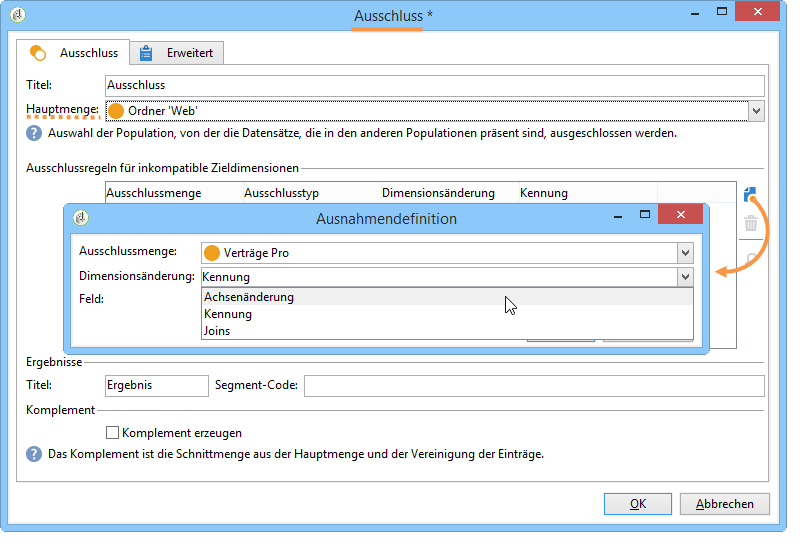

### Teilmengen mithilfe der Aufspaltungs-Aktivität erstellen {#creating-subsets-using-the-split-activity}

Bei der Aktivität **[!UICONTROL Aufspaltung]** handelt es sich um eine Standardaktivität, die die unbegrenzte Erstellung von Teilmengen mit einer oder mehreren Filterdimensionen ermöglicht. Es kann eine gemeinsame ausgehende Transition oder eine Transition pro Teilmenge erzeugt werden.

Dabei können von der Transition übermittelte Zusatzdaten in den Filterbedingungen verwendet werden.

Zur Konfiguration wählen Sie zunächst die Bedingungen aus:

1. Ziehen Sie in Ihren Workflow die Aktivität **[!UICONTROL Aufspaltung]**.
1. Wählen Sie im Tab **[!UICONTROL Allgemein]** die gewünschte Option aus: **[!UICONTROL Zielgruppendaten und zusätzliche Daten nutzen]**, **[!UICONTROL Nur zusätzliche Daten nutzen]** oder **[!UICONTROL Externe Daten nutzen]**.
1. Bei Auswahl der Option **[!UICONTROL Zielgruppendaten und zusätzliche Daten nutzen]** erlaubt die Zielgruppendimension die Verwendung aller von der eingehenden Transition übermittelten Daten.

   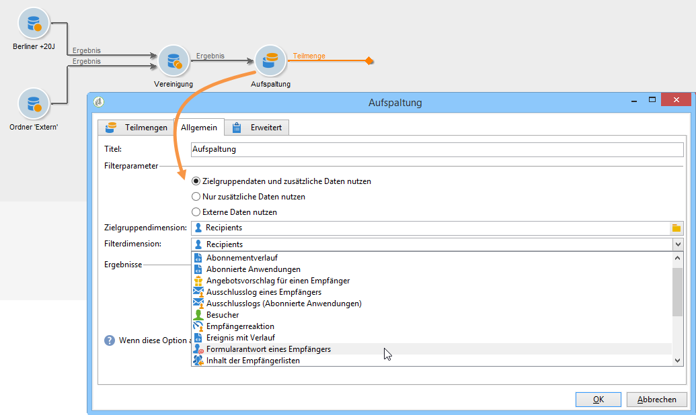

   Bei der Erstellung von Teilmengen werden die zuvor definierten Filterparameter genutzt.

   Kreuzen Sie zur Definition von Filterbedingungen die Option **[!UICONTROL Filterbedingung für Eingangspopulation hinzufügen]** an und klicken Sie auf den Link **[!UICONTROL Bearbeiten...]**. Geben Sie dann die Kriterien zur Erstellung der Teilmenge an.

   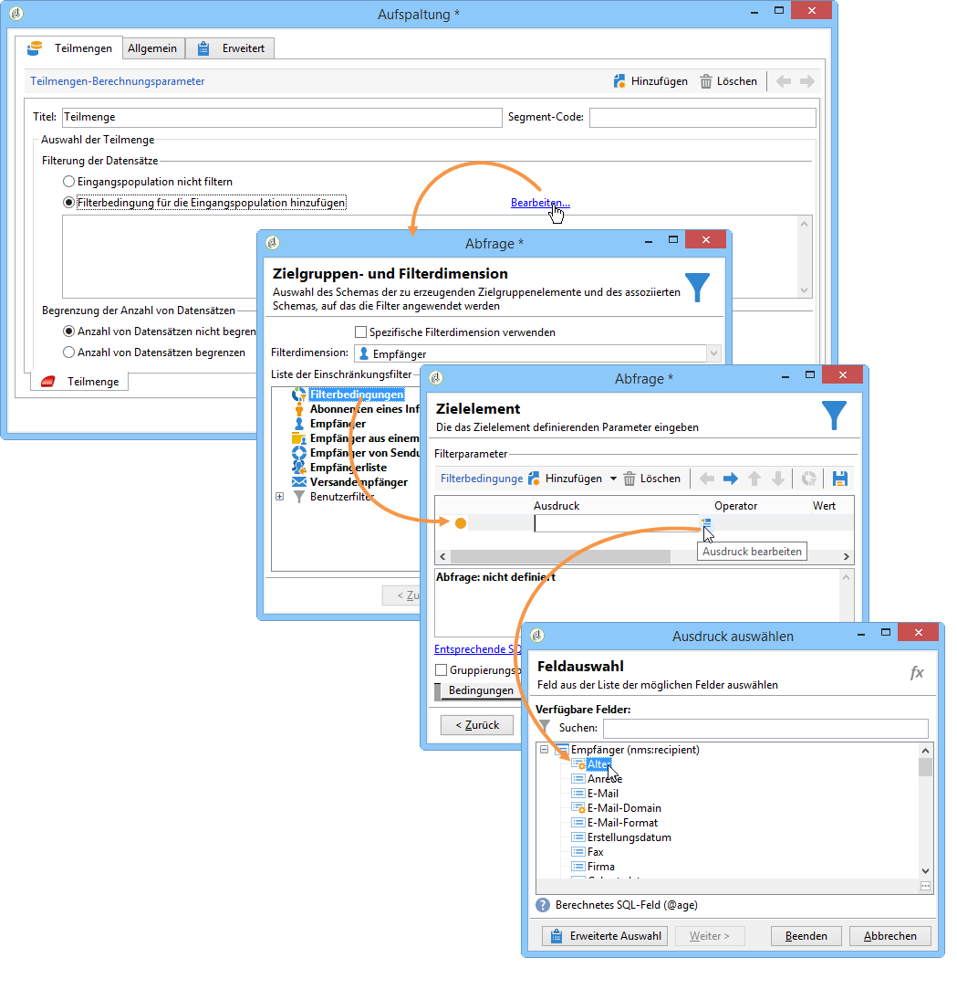

   Ein Beispiel für die Verwendung der Aktivität **[!UICONTROL Aufspaltung]** zur Segmentierung der Zielgruppe in unterschiedliche Populationen finden Sie in [diesem Abschnitt](../../workflow/using/cross-channel-delivery-workflow.md).

   Im Feld **[!UICONTROL Titel]** können Sie die erstellte Teilmenge benennen. Der Titel wird auf der ausgehenden Transition angezeigt.

   Sie können der Teilmenge außerdem einen Segment-Code zuweisen, welcher ihre Identifizierung und ihre Verwendung als Zielgruppe ermöglicht.

   Bei Bedarf können die Zielgruppendimension und die Filterdimension separat für jede zu erstellende Teilmenge angepasst werden. Öffnen Sie hierzu die Filterbedingung der Teilmenge und kreuzen Sie die Option **[!UICONTROL Spezifische Filterdimension verwenden]** an.

   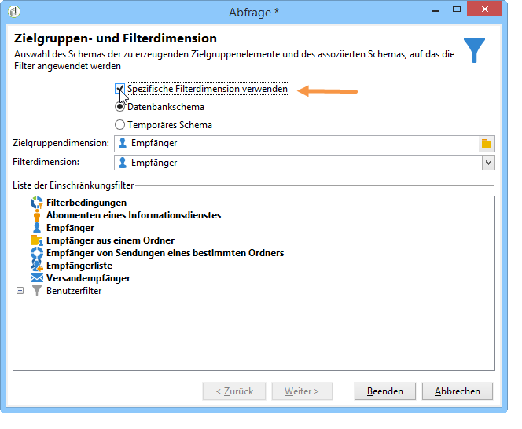

1. Wenn die Option **[!UICONTROL Nur Zusatzdaten verwenden]** aktiviert wurde, stehen nur die zusätzlichen Daten zur Filterung der Teilmengen zur Verfügung.

   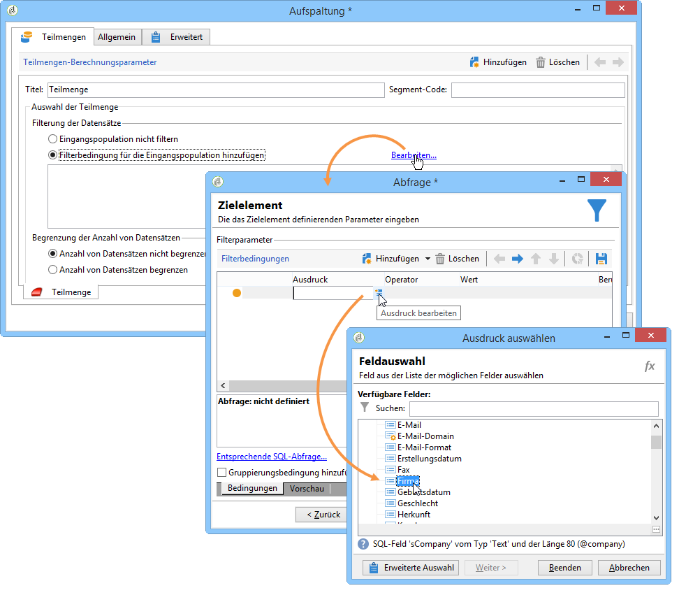

1. Wenn die Option **Federated Data Access** aktiviert wurde, bietet die Option **[!UICONTROL Externe Daten verwenden]** die Möglichkeit, Daten einer bereits verbundenen externen Datenbank zu verwenden oder eine neue Verbindung herzustellen.

   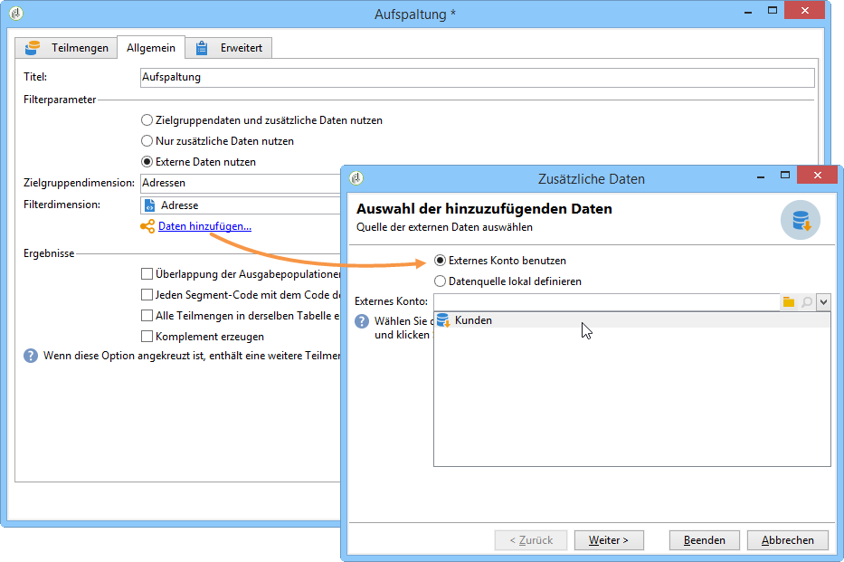

   Weiterführende Informationen hierzu finden Sie in diesem [Abschnitt](../../platform/using/about-fda.md).

Danach müssen neue Teilmengen hinzugefügt werden:

1. Klicken Sie auf die Schaltfläche **[!UICONTROL Hinzufügen]** und definieren Sie die Filterbedingungen.

   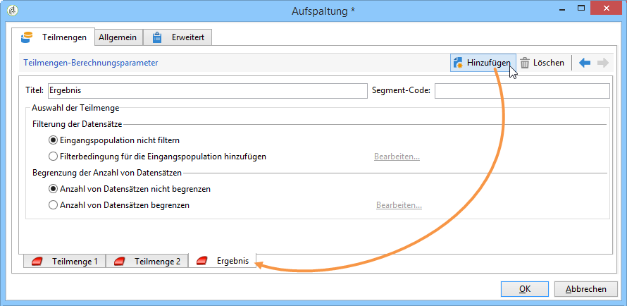

1. Definieren Sie die Filterdimension im **[!UICONTROL Allgemein]**-Tab (siehe oben). Sie gilt automatisch für alle Teilmengen.

   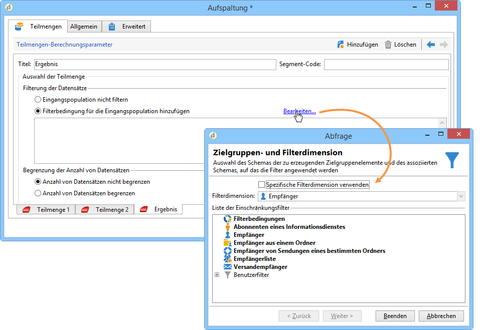

1. Bei Bedarf können für jede Teilmenge verschiedene Filterdimensionen definiert werden. Auf diese Weise können Sie ausgehend von einer einzigen Aufspaltungsaktivität beispielsweise eine Teilmenge für alle Kunden mit einer Gold-Police erzeugen, eine zweite mit Empfängern, die im letzten Newsletter geklickt haben, und eine dritte für Kunden zwischen 18 und 25 Jahren, die in den letzten 30 Tagen einen Kauf in einem Ihrer POS getätigt haben. Kreuzen Sie hierzu die Option **[!UICONTROL Spezifische Filterdimension verwenden]** an und wählen sie den Kontext zur Filterung der Daten aus.

   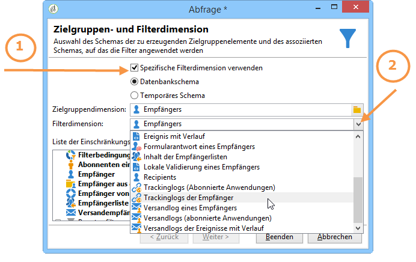

   >[!NOTE]
   >
   >Wenn Sie über die Option **Federated Data Access** verfügen, können Sie Teilmengen unter Hinzuziehung von in externen Datenbanken enthaltenen Informationen erstellen. Wählen Sie hierzu im Feld **[!UICONTROL Zielgruppendimension]** das Schema der entsprechenden externen Tabelle aus. Weitere Informationen hierzu finden Sie unter [Zugriff auf externe Datenbanken (FDA)](../../workflow/using/accessing-an-external-database--fda-.md).

Standardmäßig erzeugt die Aufspaltungsaktivität für jede Teilmenge eine ausgehende Transition:

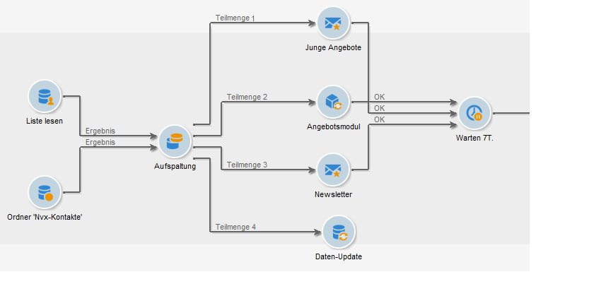

Es besteht jedoch die Möglichkeit, alle Teilmengen in einer ausgehenden Transition zusammenzufassen. Der Segment-Code kann dann beispielsweise die Zugehörigkeit zu einer bestimmten Teilmenge anzeigen. Kreuzen Sie in diesem Fall im Allgemein-Tab die Option **[!UICONTROL Alle Teilmengen in derselben Tabelle erzeugen]** an.

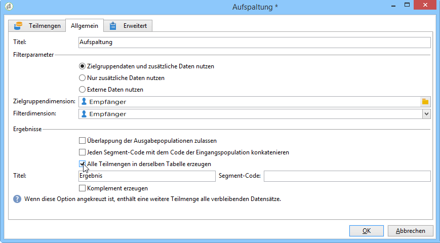

Dies ist beispielsweise dann interessant, wenn Sie eine einzige Versandaktivität anschließen, den Inhalt aber je nach Segment-Code der Teilmenge personalisieren möchten:

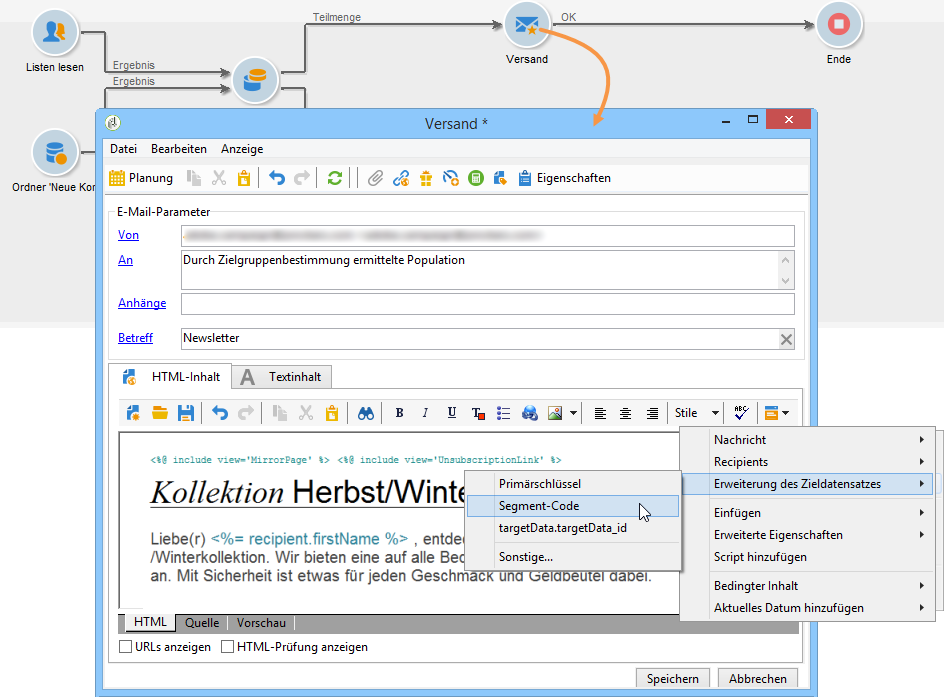

Teilmengen können auch mithilfe der Aktivität **[!UICONTROL Segmente]** erstellt werden. Weitere Informationen hierzu finden Sie im Abschnitt [Segmente](../../workflow/using/cells.md).

### Verwendung der gefilterten Daten {#using-targeted-data}

Nach Identifizierung und Aufbereitung der Daten können diese in folgenden Kontexten verwendet werden:

* Update der Datenbank im Anschluss an die verschiedenen Workflow-Aktivitäten.

   Weitere Informationen hierzu finden Sie unter [Daten aktualisieren](../../workflow/using/update-data.md).

* Update von existierenden Listen.

   Weitere Informationen hierzu finden Sie unter [Listen-Update](../../workflow/using/list-update.md).

* Vorbereitung und/oder Start von Sendungen direkt im Workflow.

   Weitere Informationen hierzu finden Sie unter [Versand](../../workflow/using/delivery.md), [Versand bearbeiten](../../workflow/using/delivery-control.md) und [Versand (fortlaufend)](../../workflow/using/continuous-delivery.md).

## Data Management {#data-management}

In Adobe Campaign umfasst das Data Management eine Reihe von Aktivitäten, die mithilfe effizienterer und flexiblerer Tools komplexe Zielgruppenbestimmungen und Anreicherungen ermöglichen. Auf diese Weise ist es möglich, eine kohärente und individuelle Kommunikation mit Kontakten zu gewährleisten, indem beispielsweise Informationen zu Verträgen, Abonnements oder Reaktionen auf vorhergehende Sendungen verwendet werden. Das Data Management erlaubt es darüber hinaus, den Lebenszyklus von Daten während der Segmentierungsprozesse zu verfolgen, insbesondere werden:

* Zielbestimmungen vereinfacht, u. a. durch Einschluss von nicht im Datamart modelisierten Daten (Erstellung neuer Tabellen: lokale Ausdehnung auf jeden Zielgruppen-Workflow in Abhängigkeit von seiner Konfiguration);
* Zwischenergebnisse gespeichert und weitergegeben (interessant im Zuge der Zielbestimmung oder der Datenbankadministration);
* Zugriffe auf externe Datenbanken ermöglicht (optional), was die Berücksichtigung heterogener Datenbanken bei Zielbestimmungsprozessen zulässt.

Hierfür bietet Adobe Campaign:

* Datenerfassungsaktivitäten: [Dateiübertragung](../../workflow/using/file-transfer.md), [Laden (Datei)](../../workflow/using/data-loading--file-.md), [Laden (DBMS)](../../workflow/using/data-loading--rdbms-.md), [Daten-Update](../../workflow/using/update-data.md). Dieser erste Schritt der Datenerfassung bereitet die Daten so vor, dass sie in anderen Aktivitäten verarbeitet werden können. Mehrere Parameter müssen überwacht werden, um sicherzustellen, dass der Workflow korrekt ausgeführt wird und die erwarteten Ergebnisse liefert. Wenn Sie beispielsweise Daten importieren, muss der Primärschlüssel (Pkey) für diese Daten für jeden Datensatz eindeutig sein.
* Aktivitäten mit Data Management-Optionen ([Abfrage](../../workflow/using/query.md), [Vereinigung](../../workflow/using/union.md), [Schnittmenge](../../workflow/using/intersection.md), [Aufspaltung](../../workflow/using/split.md)). Dies ermöglicht beispielsweise die Konfiguration einer Vereinigung oder einer Schnittmenge mit Daten, die unterschiedliche Zielgruppendimensionen aufweisen, vorausgesetzt eine Abstimmung der Daten ist möglich.
* Formatierungsaktivitäten: [Anreicherung](../../workflow/using/enrichment.md), [Dimensionsänderung](../../workflow/using/change-dimension.md).

>[!CAUTION]
>
>In Workflows löst bei in Relation stehenden Tabellen das Löschen eines Elements der Quelltabelle nicht das Löschen der verbundenen Elemente aus.
>  
>Zum Beispiel zieht das Löschen eines Empfängers mithilfe eines Workflows nicht das Löschen seines Versandverlaufs nach sich. Wird ein Empfänger jedoch direkt im &#39;Empfänger&#39;-Ordner des Navigationsbaums gelöscht, werden auch alle anderen auf ihn bezogenen Daten gelöscht.

### Daten anreichern und ändern {#enriching-and-modifying-data}

Ergänzend zur Zielgruppendimension ermöglicht es die Filterdimension, die Art der abgerufenen Daten zu präzisieren. Siehe [Zielgruppen- und Filterdimensionen](../../workflow/using/building-a-workflow.md#targeting-and-filtering-dimensions).

Identifizierte und abgerufene Daten können angereichert, zusammengefasst und bearbeitet werden, um die Zielgruppenerstellung zu optimieren. Verwenden Sie dazu zusätzlich zu den im Abschnitt [Daten segmentieren](#segmenting-data) beschriebenen Datenbearbeitungstätigkeiten Folgendes:

* Mit der Aktivität **[!UICONTROL Anreicherung]** können Sie vorübergehend Spalten zu einem Schema sowie Informationen zu bestimmten Elementen hinzufügen. Weitere Informationen hierzu finden Sie im Abschnitt [Anreicherung](../../workflow/using/enrichment.md) des Aktivitäten-Repositorys.
* Mit der Aktivität **[!UICONTROL Schema-Bearbeitung]** können Sie die Struktur eines Schemas ändern. Weitere Informationen hierzu finden Sie im Abschnitt [Schema-Bearbeitung](../../workflow/using/edit-schema.md) des Aktivitäten-Repositorys.
* Mit der Aktivität **[!UICONTROL Dimensionsänderung]** können Sie die Zielgruppendimension beim Erstellen der Zielgruppe ändern. Weitere Informationen hierzu finden Sie im Abschnitt [Dimensionsänderung](../../workflow/using/change-dimension.md).

