# Zielgruppendaten{#targeting-data}

## Erstellen von Abfragen {#creating-queries}

### Auswählen von Daten {#selecting-data}

Mit einer **[!UICONTROL Abfrageaktivität]** können Sie grundlegende Daten zum Aufbau der Zielpopulation auswählen. Weitere Informationen hierzu finden Sie unter [Abfragen erstellen](query.md#creating-a-query).

Sie können auch mithilfe der folgenden Aktivitäten Daten aus der Datenbank abfragen und weiter filtern: [Inkrementelle Abfrage ](incremental-query.md), [Liste lesen](read-list.md).

Es ist möglich, zusätzliche Daten zu sammeln, die während des gesamten Lebenszyklus des Workflows weitergeleitet und verarbeitet werden. Weitere Informationen hierzu finden Sie unter [Daten hinzufügen ](query.md#adding-data)und [Zusätzliche Daten bearbeiten](#editing-additional-data).

### Bearbeiten zusätzlicher Daten {#editing-additional-data}

Nach Hinzufügung der zusätzlichen Daten können Sie diese bearbeiten oder zur Verfeinerung der in der Abfrageaktivität definierten Zielgruppe verwenden.

Über den Link **[!UICONTROL Zusätzliche Daten bearbeiten...]** können Sie die hinzugefügten Daten anzeigen und sie gegebenenfalls ändern oder ergänzen.

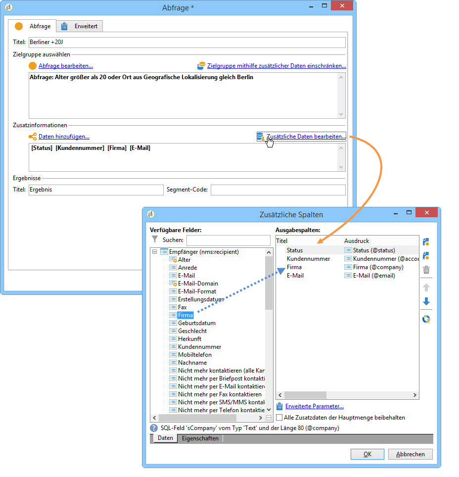

Um Daten zu den zuvor definierten Ausgabespalten hinzuzufügen, wählen Sie sie in der Liste der verfügbaren Felder aus. Um eine neue Ausgabespalte zu erstellen, klicken Sie auf das Symbol **[!UICONTROL Hinzufügen]**, wählen Sie das Feld aus und klicken Sie auf **[!UICONTROL Ausdruck bearbeiten]**.

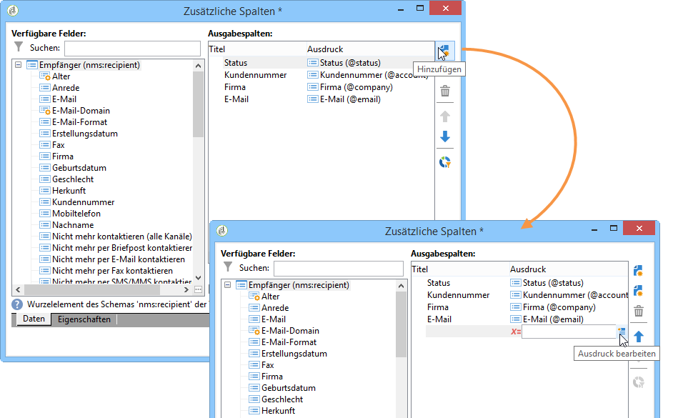

Kreuzen Sie den gewünschten Formeltyp an, beispielsweise Aggregat.

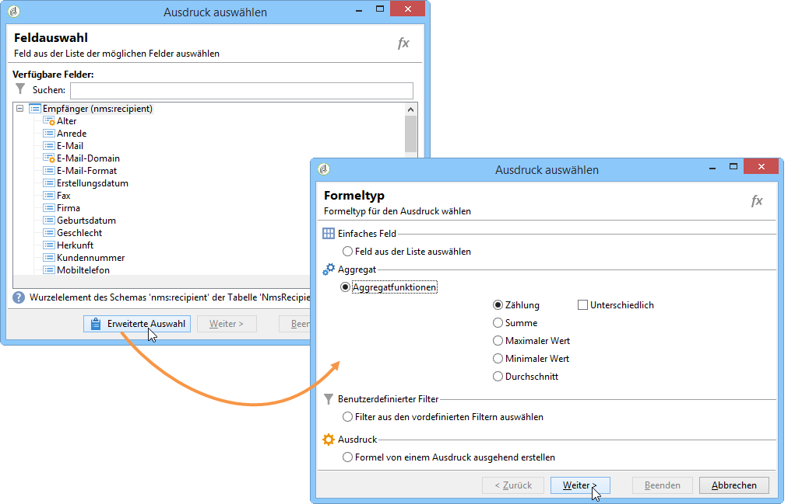

Über die Option **[!UICONTROL Unterelement hinzufügen]** können Sie berechnete Daten an die Sammlung anhängen. Sie können zusätzliche Daten aus der Sammlung auswählen oder Aggregatberechnungen aus den Sammlungselementen definieren.

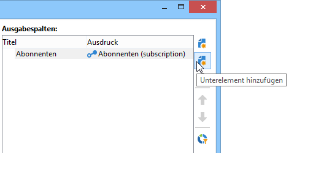

Die Unterelemente erscheinen als Unterordner der Sammlung, der sie angehören.

Sammlungen werden in der Unterregisterkarte **[!UICONTROL Sammlungen]** angezeigt. Sie können die gesammelten Elemente filtern, indem Sie auf das Symbol **[!UICONTROL Detail]** der ausgewählten Sammlung klicken. Mit dem Filterassistenten können Sie die gesammelten Daten auswählen und die auf die Daten in der Sammlung anzuwendenden Filterbedingungen festlegen.

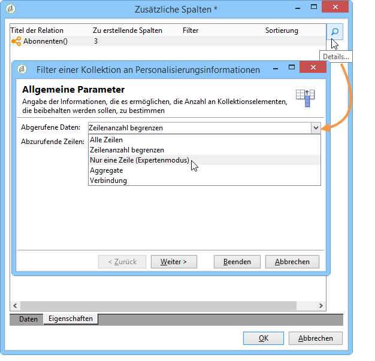

### Einschränken der Zielgruppe mithilfe zusätzlicher Daten {#refining-the-target-using-additional-data}

Mit den gesammelten zusätzlichen Daten können Sie die Datenfilterung in der Datenbank verfeinern. Klicken Sie dazu auf den Link **[!UICONTROL Zielgruppe mithilfe zusätzlicher Daten einschränken…]**: Dies ermöglicht die Überfilterung der hinzugefügten Daten.

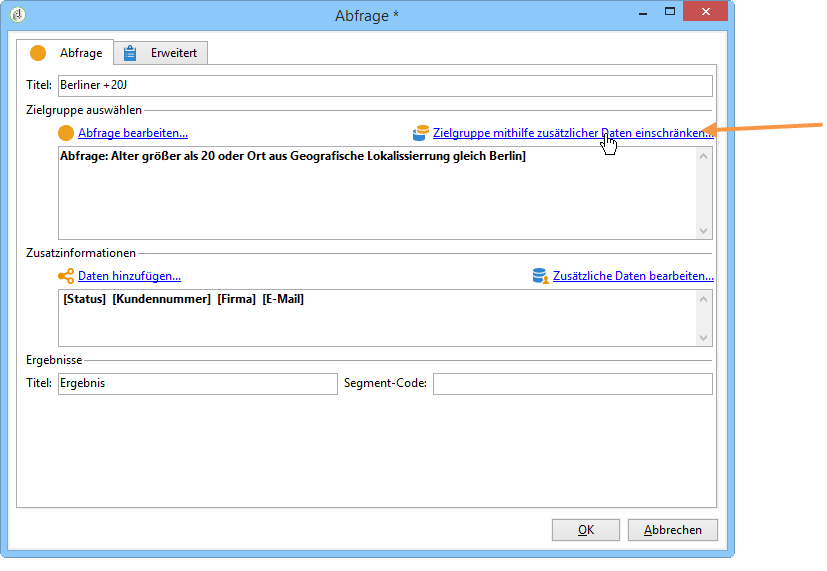

### Vereinheitlichen von Daten {#homogenizing-data}

Bei Aktivitäten des Typs **[!UICONTROL Vereinigung]** oder **[!UICONTROL Schnittmenge]** können Sie auswählen, nur gemeinsam verwendete Zusatzdaten zu übernehmen, um die Daten konsistent zu halten. In diesem Fall enthält die resultierende temporäre Arbeitstabelle dieser Aktivität nur die zusätzlichen Daten, die in allen eingehenden Teilmengen vorkommen.

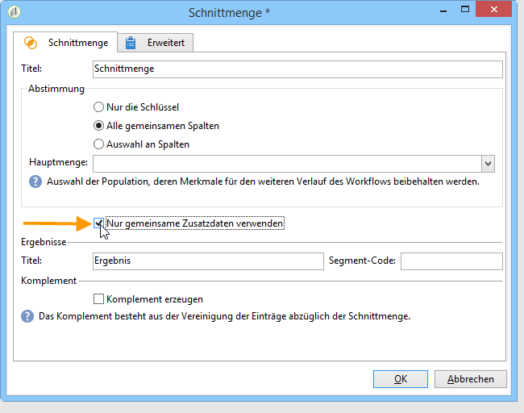

### Mit Zusatzdaten abstimmen {#reconciliation-with-additional-data}

In den Phasen der Datenabstimmung (**[!UICONTROL Vereinigung]**, **[!UICONTROL Schnittmenge]** etc.) können Sie die zur Abstimmung zu verwendenden Spalten aus den Zusatzdatenspalten auswählen. Konfigurieren Sie hierzu eine Abstimmung über eine Auswahl von Spalten und geben Sie die Hauptmenge an. Wählen Sie dann in der unteren Spalte des Fensters die Spalten wie im folgenden Beispiel gezeigt aus:

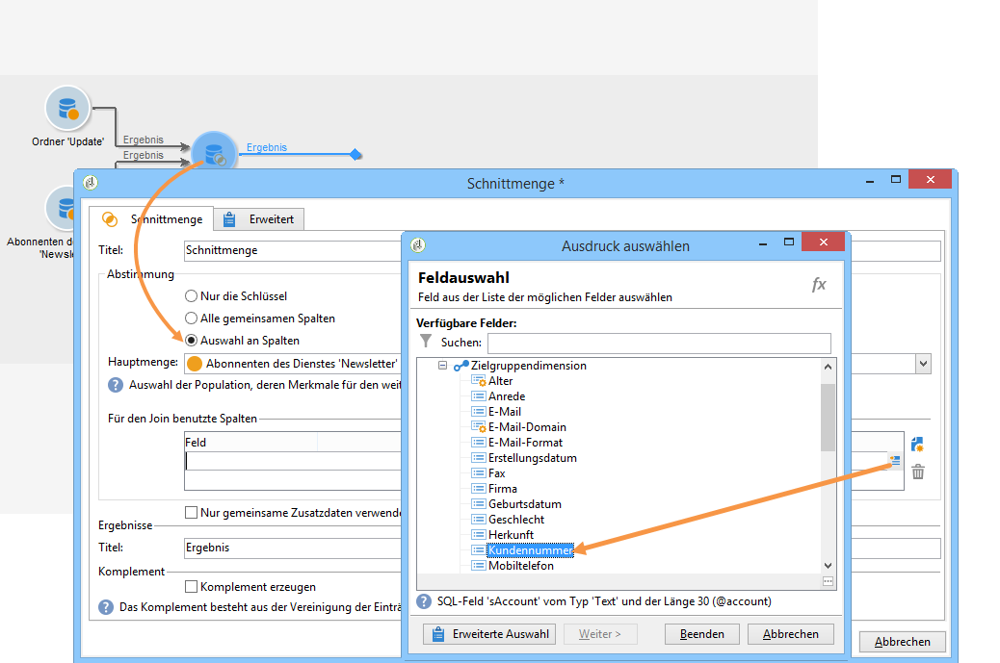

### Erstellen von Teilmengen {#creating-subsets}

Mit der Aktivität **[!UICONTROL Aufspaltung]** können Sie Teilmengen aus Kriterien erstellen, die über Extraktionsabfragen definiert wurden. Beim Bearbeiten einer Filterbedingung für die Population rufen Sie dann für jede Teilmenge die Standard-Abfrageaktivität auf, in der Sie die Bedingungen für die Zielgruppensegmentierung definieren können.

Sie können eine Zielgruppe in mehrere Teilmengen unterteilen, indem Sie als Filterbedingungen nur zusätzliche Daten oder aber diese zusätzlich zu den Zielgruppendaten verwenden. Sie können auch externe Daten nutzen, wenn Sie die Option **Federated Data Access** besitzen.

Weitere Informationen hierzu finden Sie unter [Teilmengen mithilfe der Aufspaltungs-Aktivität erstellen](#creating-subsets-using-the-split-activity).

## Segmentieren von Daten {#segmenting-data}

### Kombinieren mehrerer Zielgruppen (Vereinigung) {#combining-several-targets--union-}

Über die Vereinigungsaktivität können Sie die Ergebnisse verschiedener Aktivitäten in einer Transition zusammenfassen. Teilmengen müssen nicht unbedingt homogen sein.

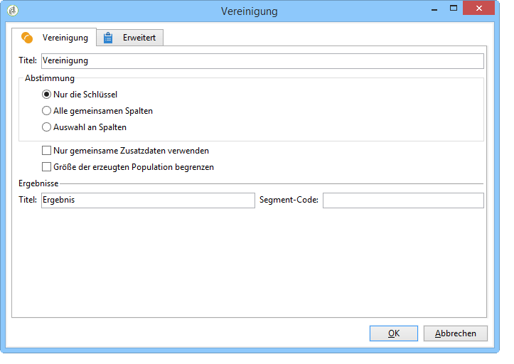

Zur Abstimmung der Daten stehen folgende Optionen zur Verfügung:

* **[!UICONTROL Nur die Schlüssel]**

  Diese Option kann bei homogenen Eingangspopulationen verwendet werden.

* **[!UICONTROL Alle gemeinsamen Spalten]**

  Diese Option ermöglicht die Abstimmung der Datensätze über alle den verschiedenen Zielpopulationen gemeinsamen Spalten.

  Adobe Campaign identifiziert Spalten anhand ihres Namens. Dabei werden geringfügige Unterschiede akzeptiert. Der Spaltentitel „Email“ wird beispielsweise identisch mit dem Titel „@email“ gewertet.

* **[!UICONTROL Auswahl an Spalten]**

  Diese Option ermöglicht die Auswahl der Spalten, die zur Abstimmung herangezogen werden sollen.

  Wählen Sie zunächst die die Quelldaten enthaltende Hauptmenge aus und anschließend die Spalten, die den Join herstellen sollen.

  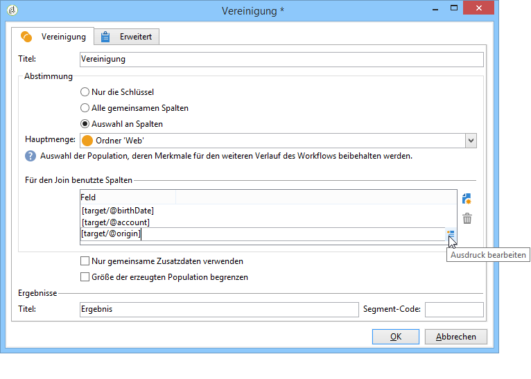

  >[!CAUTION]
  >
  >Die Populationen werden im Rahmen der Abstimmung nicht auf Duplikate geprüft.

  Sie können die Populationsgröße auf eine bestimmte Anzahl von Einträgen beschränken. Aktivieren Sie hierzu die entsprechende Option und geben Sie die Anzahl der beizubehaltenden Einträge an.

  Geben Sie außerdem die Priorität der Eingangspopulationen an. Im unteren Bereich des Fensters werden die in die Vereinigungsaktivität eingehenden Transitionen aufgelistet. Die Reihenfolge kann mithilfe der blauen Pfeile rechts verändert werden.

  Die beibehaltenen Datensätze stammen zunächst aus der ersten eingehenden Transition und werden, falls die gewünschte Anzahl noch nicht erreicht ist, durch die Population der folgenden Transitionen ergänzt.

  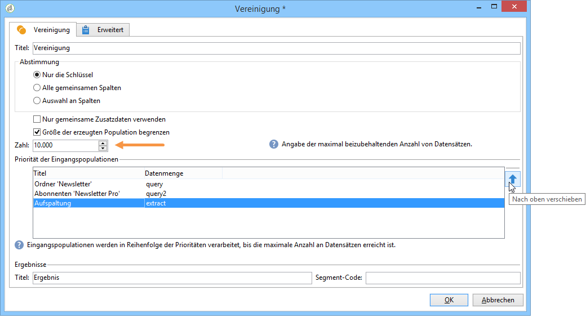

### Extrahieren gemeinsamer Daten (Schnittmenge) {#extracting-joint-data--intersection-}

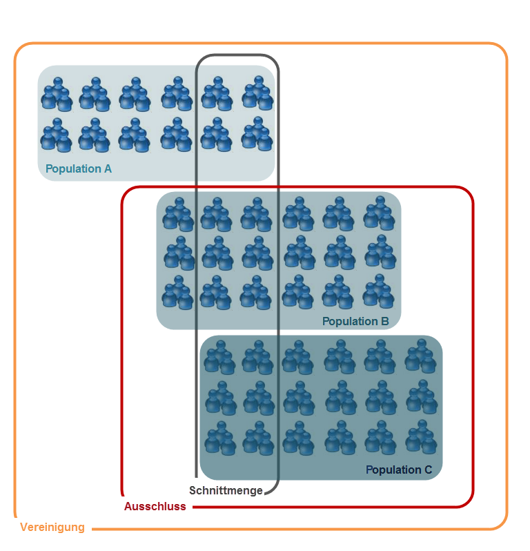

Über die Schnittmenge lassen sich nur die Zeilen abrufen, die alle Populationen der eingehenden Transitionen gemeinsam haben. Diese Aktivität muss wie die Vereinigungsaktivität konfiguriert werden.

Es ist außerdem möglich, nur eine Auswahl an Spalten oder nur die Spalten, die in allen eingehenden Populationen enthalten sind, abzurufen.

Die Schnittmengenaktivität wird im Abschnitt [Schnittmenge](intersection.md) detailliert beschrieben.

### Ausschließen von Populationen (Ausschluss) {#excluding-a-population--exclusion-}

Über die Ausschlussaktivität lassen sich Elemente einer Zielgruppe aus einer anderen Zielgruppenpopulation ausschließen. Die Zielgruppendimension der Ausgabe dieser Aktivität ist die der Hauptmenge.

Bei Bedarf können Sie die eingehenden Tabellen ändern. Um eine Zielgruppe aus einer anderen Dimension auszuschließen, muss diese Zielgruppe tatsächlich auf dieselbe Zielgruppendimension wie die Hauptzielgruppe zurückgesetzt werden. Klicken Sie dazu auf die Schaltfläche **[!UICONTROL Hinzufügen]** und geben Sie die Bedingungen der Dimensionsänderung an.

Die Abstimmung der Daten kann über die Kennungen, eine Achsenänderung oder einen Join erfolgen. Ein Beispiel finden Sie unter [Verwendung von Daten aus einer Liste: Liste lesen](../../platform/using/import-export-workflows.md#using-data-from-a-list--read-list).

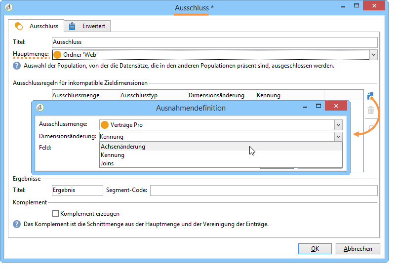

### Erstellen von Teilmengen mithilfe der Aufspaltungs-Aktivität {#creating-subsets-using-the-split-activity}

Bei der Aktivität **[!UICONTROL Aufspaltung]** handelt es sich um eine Standardaktivität, die die unbegrenzte Erstellung von Teilmengen mit einer oder mehreren Filterdimensionen ermöglicht. Es kann eine ausgehende Transition pro Teilmenge oder eine eindeutige Transition erzeugt werden.

Dabei können von der Transition übermittelte Zusatzdaten in den Filterbedingungen verwendet werden.

Zur Konfiguration wählen Sie zunächst die Bedingungen aus:

1. Ziehen Sie in Ihren Workflow die Aktivität **[!UICONTROL Aufspaltung]**.
1. Wählen Sie im Tab **[!UICONTROL Allgemein]** die gewünschte Option aus: **[!UICONTROL Zielgruppendaten und zusätzliche Daten nutzen]**, **[!UICONTROL Nur zusätzliche Daten nutzen]** oder **[!UICONTROL Externe Daten nutzen]**.
1. Bei Auswahl der Option **[!UICONTROL Zielgruppendaten und zusätzliche Daten nutzen]** erlaubt die Zielgruppendimension die Verwendung aller von der eingehenden Transition übermittelten Daten.

   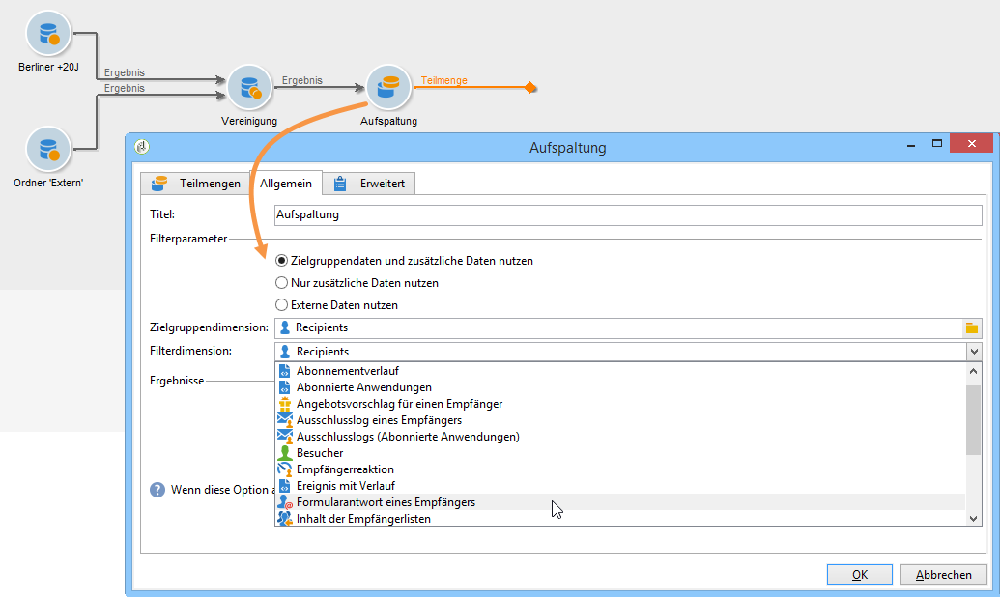

   Bei der Erstellung von Teilmengen werden die zuvor definierten Filterparameter genutzt.

   Um Filterbedingungen zu definieren, wählen Sie die Option **[!UICONTROL Filterbedingung für die Eingangspopulation hinzufügen]** und klicken Sie auf den Link **[!UICONTROL Bearbeiten…]**. Geben Sie dann die Filterbedingungen für die Erstellung dieser Teilmenge an.

   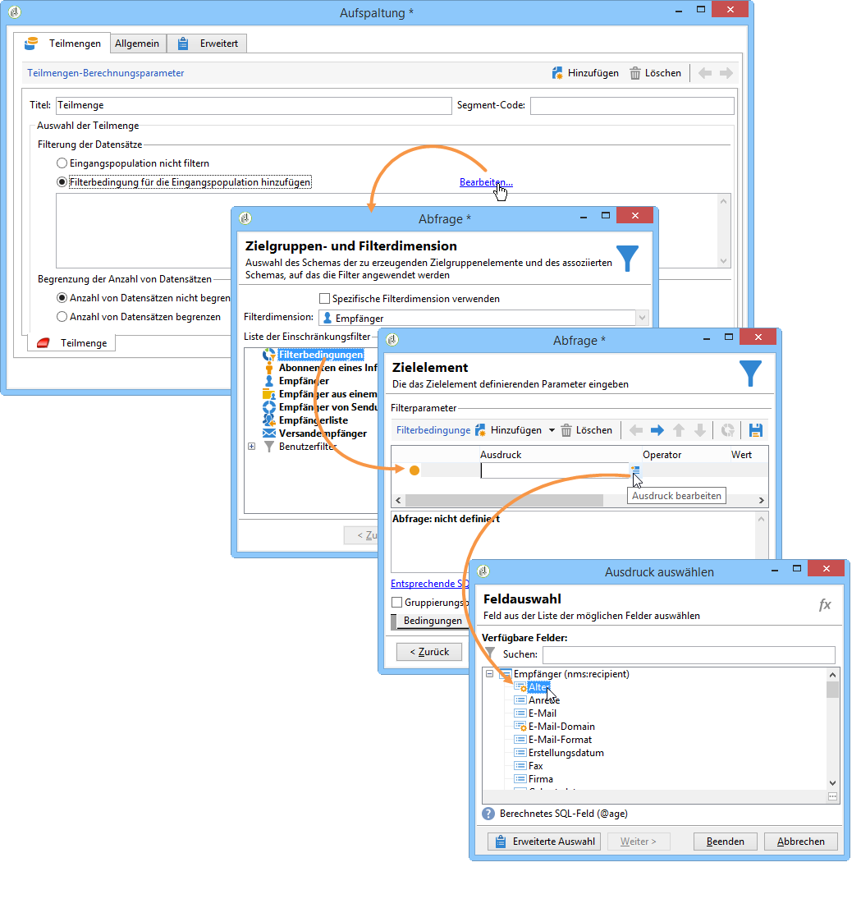

   Ein Beispiel für die Verwendung der Aktivität **[!UICONTROL Aufspaltung]** zur Segmentierung der Zielgruppe in unterschiedliche Populationen finden Sie in [diesem Abschnitt](cross-channel-delivery-workflow.md).

   Im Feld **[!UICONTROL Titel]** können Sie die erstellte Teilmenge benennen. Der Titel wird auf der ausgehenden Transition angezeigt.

   Sie können der Teilmenge außerdem einen Segment-Code zuweisen, welcher ihre Identifizierung und ihre Verwendung als Zielpopulation ermöglicht.

   Bei Bedarf können die Zielgruppenbestimmungs- und Filterungsdimensionen für jede Teilmenge, die Sie erstellen wollen, einzeln angepasst werden. Bearbeiten Sie dazu die Filterbedingung der Teilmenge und aktivieren Sie die Option **[!UICONTROL Spezifische Filterdimension verwenden]**.

   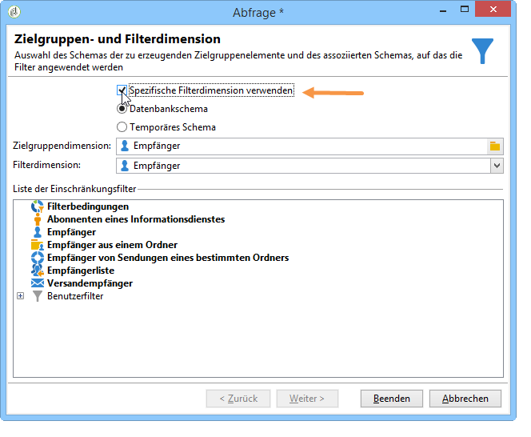

1. Wenn die Option **[!UICONTROL Nur Zusatzdaten verwenden]** aktiviert wurde, stehen nur die zusätzlichen Daten zur Filterung der Teilmengen zur Verfügung.

   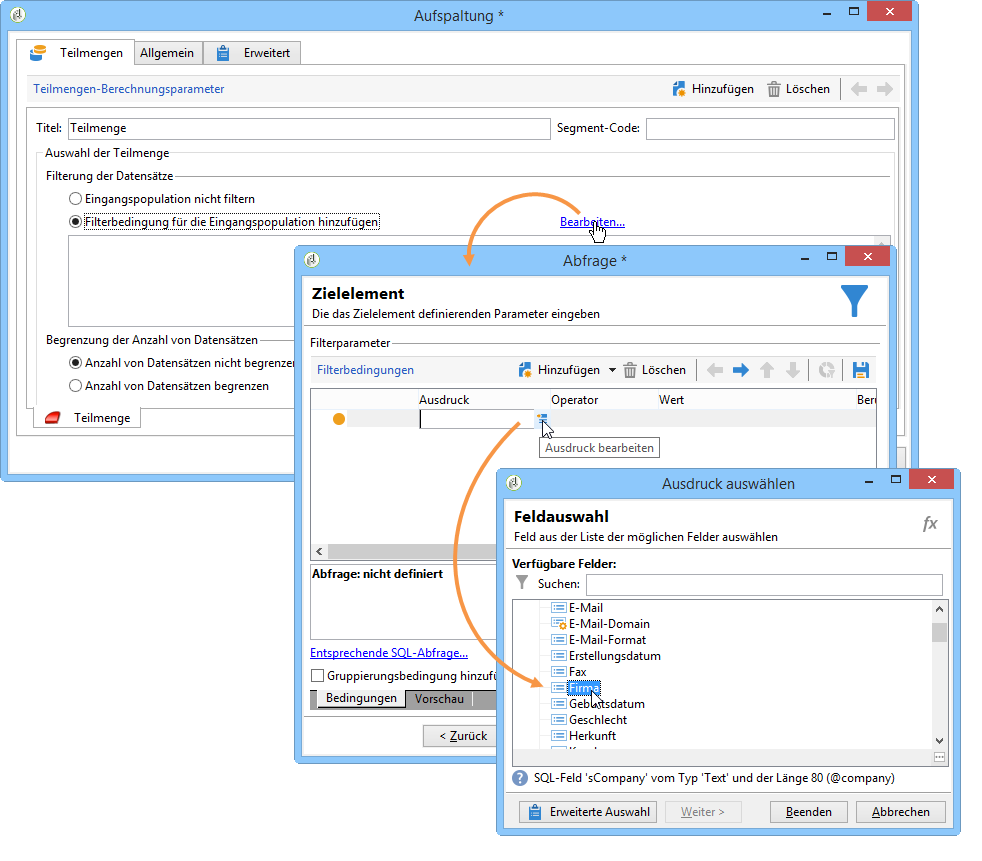

1. Wenn die Option **Federated Data Access** aktiviert wurde, bietet die Option **[!UICONTROL Externe Daten verwenden]** die Möglichkeit, Daten einer bereits verbundenen externen Datenbank zu verwenden oder eine neue Verbindung herzustellen.

   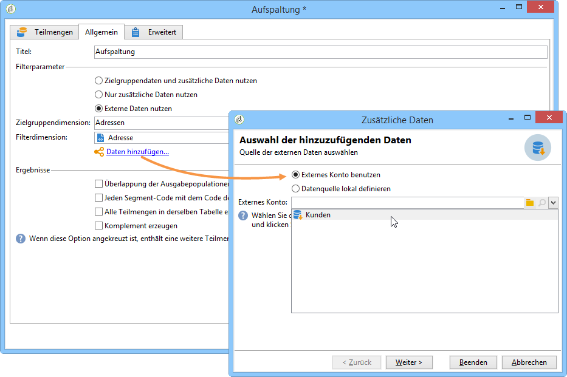

   Weitere Informationen hierzu finden Sie je nach Campaign-Version in den folgenden Abschnitten:

   [Dokumentation zu Campaign v7](../../installation/using/about-fda.md)

   [Dokumentation zu Campaign v8](https://experienceleague.adobe.com/docs/campaign/campaign-v8/connect/fda.html?lang=de)

Danach müssen neue Teilmengen hinzugefügt werden:

1. Klicken Sie auf die Schaltfläche **[!UICONTROL Hinzufügen]** und definieren Sie die Filterbedingungen.

   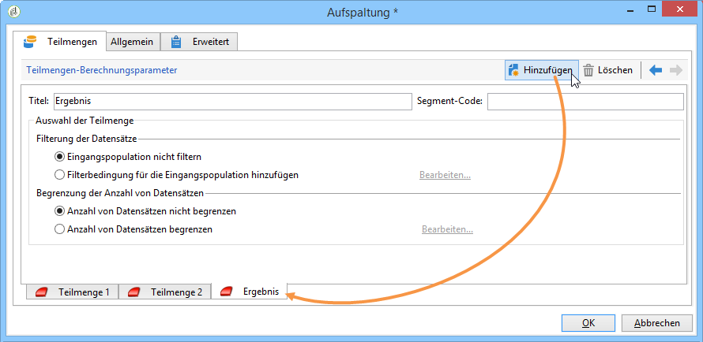

1. Definieren Sie die Filterdimension im **[!UICONTROL Allgemein]**-Tab (siehe oben). Sie gilt automatisch für alle Teilmengen.

   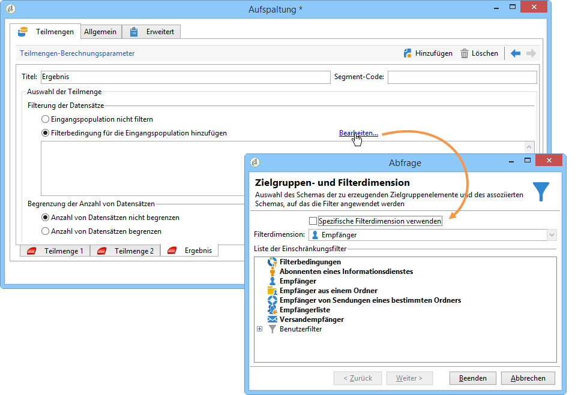

1. Bei Bedarf können Sie die Filterdimension für jede Teilmenge einzeln ändern. Auf diese Weise können Sie etwa mithilfe derselben Aktivität „Aufspaltung“ eine Teilmenge für alle Kundinnen und Kunden mit einer Gold-Karte erstellen, eine zweite für alle Empfängerinnen und Empfänger, die im letzten Newsletter geklickt haben, und eine dritte für Kundinnen und Kunden zwischen 18 und 25 Jahren, die in den letzten 30 Tagen einen Kauf in einem Ihrer Geschäfte getätigt haben. Wählen Sie dazu die Option **[!UICONTROL Spezifische Filterdimension verwenden]** und wählen Sie den Kontext der Datenfilterung aus.

   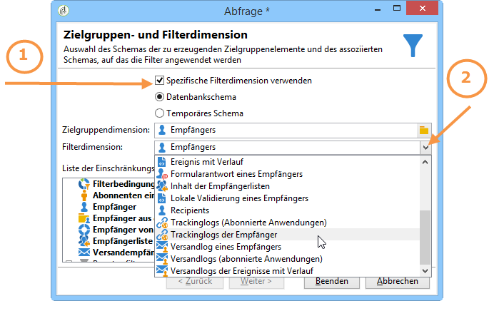

   >[!NOTE]
   >
   >Wenn Sie über die Option **Federated Data Access** verfügen, können Sie Teilmengen unter Hinzuziehung von in externen Datenbanken enthaltenen Informationen erstellen. Wählen Sie hierzu im Feld **[!UICONTROL Zielgruppendimension]** das Schema der entsprechenden externen Tabelle aus. Weitere Informationen hierzu finden Sie unter [Zugriff auf externe Datenbanken (FDA)](accessing-an-external-database-fda.md).

Nach der Erstellung von Teilmengen zeigt die Aufspaltungsaktivität standardmäßig so viele ausgehende Transitionen an, wie Teilmengen vorhanden sind:

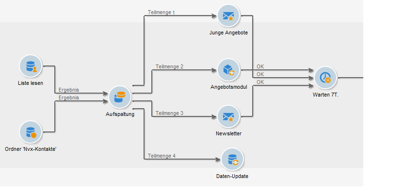

Sie können alle diese Teilmengen in einer einzigen Ausgabetransition gruppieren. In diesem Fall ist die Verknüpfung mit den entsprechenden Teilmengen beispielsweise im Segment-Code sichtbar. Wählen Sie dazu die Option **[!UICONTROL Alle Teilmengen in derselben Tabelle erzeugen]**.

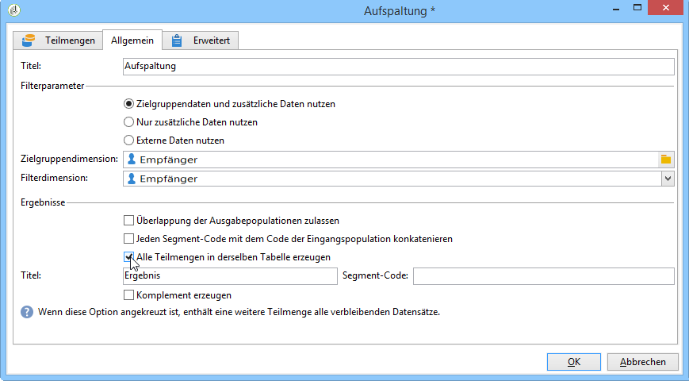

Dies ist beispielsweise dann interessant, wenn Sie eine einzige Versandaktivität anschließen, den Inhalt aber je nach Segment-Code der Teilmenge personalisieren möchten:

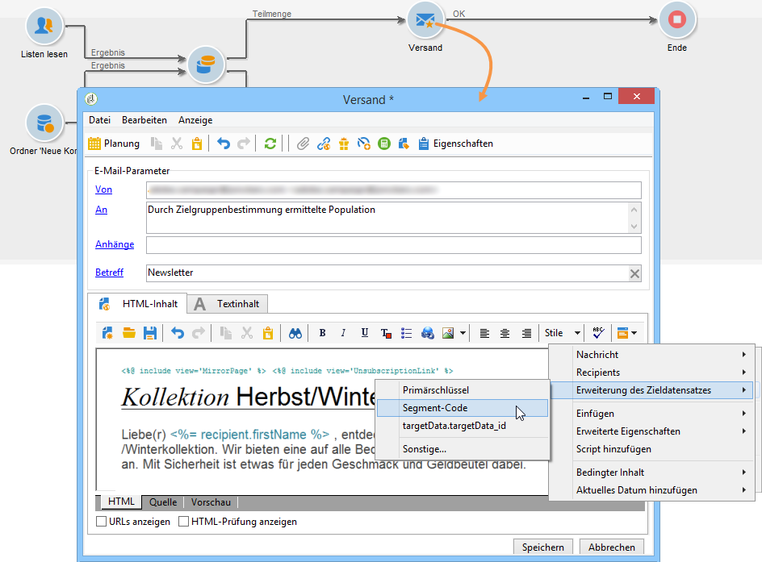

Teilmengen können auch mithilfe der Aktivität **[!UICONTROL Segmente]** erstellt werden. Weitere Informationen hierzu finden Sie im Abschnitt [Segmente](cells.md).

### Verwenden von Zielgruppendaten {#using-targeted-data}

Nach Identifizierung und Aufbereitung der Daten können diese in folgenden Kontexten verwendet werden:

* Update der Datenbank im Anschluss an die verschiedenen Workflow-Aktivitäten.

  Weitere Informationen hierzu finden Sie unter [Daten aktualisieren](update-data.md).

* Update von existierenden Listen.

  Weitere Informationen hierzu finden Sie unter [Listen-Update](list-update.md).

* Vorbereitung und/oder Start von Sendungen direkt im Workflow.

  Weitere Informationen hierzu finden Sie unter [Versand](delivery.md), [Versand bearbeiten](delivery-control.md) und [Versand (fortlaufend)](continuous-delivery.md).

## Daten-Management {#data-management}

In Adobe Campaign kombiniert das Daten-Management eine Reihe von Aktivitäten zur Lösung komplexer Zielgruppenbestimmungsprobleme, indem effizientere und flexiblere Tools bereitgestellt werden. Auf diese Weise ist es möglich, eine kohärente und individuelle Kommunikation mit Kontakten zu gewährleisten, indem beispielsweise Informationen zu Verträgen, Abonnements oder Reaktionen auf vorhergehende Sendungen verwendet werden. Das Daten-Management erlaubt es darüber hinaus, den Lebenszyklus von Daten während der Segmentierungsprozesse zu verfolgen, insbesondere werden:

* Zielbestimmungen vereinfacht, u. a. durch Einschluss von nicht im Datamart modelisierten Daten (Erstellung neuer Tabellen: lokale Erweiterung auf jeden Zielgruppen-Workflow in Abhängigkeit von seiner Konfiguration);
* Zwischenergebnisse gespeichert und weitergegeben (interessant im Zuge der Zielbestimmung oder der Datenbankadministration);
* Zugriffe auf externe Datenbanken ermöglicht (optional), was die Berücksichtigung heterogener Datenbanken bei Zielgruppenbestimmungsprozessen zulässt.

Hierfür bietet Adobe Campaign:

* Datenerfassungsaktivitäten: [Dateiübertragung](file-transfer.md), [Laden (Datei)](data-loading-file.md), [Laden (DBMS)](data-loading-rdbms.md), [Daten-Update](update-data.md). Dieser erste Schritt der Datenerfassung bereitet die Daten so vor, dass sie in anderen Aktivitäten verarbeitet werden können. Mehrere Parameter müssen überwacht werden, um sicherzustellen, dass der Workflow korrekt ausgeführt wird und die erwarteten Ergebnisse liefert. Wenn Sie beispielsweise Daten importieren, muss der Primärschlüssel (Pkey) für diese Daten für jeden Datensatz eindeutig sein.
* Aktivitäten zur Zielgruppenbestimmung mit Daten-Management-Optionen: [Abfrage](query.md), [Vereinigung](union.md), [Schnittmenge](intersection.md), [Aufspaltung](split.md). Dies ermöglicht die Konfiguration einer Vereinigung oder einer Schnittmenge mit Daten, die unterschiedliche Zielgruppendimensionen aufweisen, vorausgesetzt eine Abstimmung der Daten ist möglich.
* Formatierungsaktivitäten: [Anreicherung](enrichment.md), [Dimensionsänderung](change-dimension.md).

>[!CAUTION]
>
>In Workflows löst bei in Relation stehenden Tabellen das Löschen eines Elements der Quelltabelle nicht das Löschen der verbundenen Elemente aus.
>  
>Zum Beispiel zieht das Löschen einer empfangenden Person mithilfe eines Workflows nicht das Löschen ihres Versandverlaufs nach sich. Wird eine Person jedoch direkt im Ordner „Empfänger“ des Navigationsbaums gelöscht, werden auch alle anderen auf sie bezogenen Daten gelöscht.

### Anreichern und Ändern von Daten {#enriching-and-modifying-data}

Ergänzend zur Zielgruppendimension ermöglicht die Filterdimension, die Art der abgerufenen Daten zu präzisieren. Siehe [Zielgruppenbestimmungs- und Filterdimensionen](building-a-workflow.md#targeting-and-filtering-dimensions).

Identifizierte und abgerufene Daten können angereichert, zusammengefasst und bearbeitet werden, um die Zielgruppenerstellung zu optimieren. Verwenden Sie dazu zusätzlich zu den im Abschnitt [Daten segmentieren](#segmenting-data) beschriebenen Datenbearbeitungstätigkeiten Folgendes:

* Mit der Aktivität **[!UICONTROL Anreicherung]** können Sie vorübergehend Spalten zu einem Schema sowie Informationen zu bestimmten Elementen hinzufügen. Weitere Informationen hierzu finden Sie im Abschnitt [Anreicherung](enrichment.md) des Aktivitäten-Repositorys.
* Mit der Aktivität **[!UICONTROL Schema-Bearbeitung]** können Sie die Struktur eines Schemas ändern. Weitere Informationen hierzu finden Sie im Abschnitt [Schema-Bearbeitung](edit-schema.md) des Aktivitäten-Repositorys.
* Mit der Aktivität **[!UICONTROL Dimensionsänderung]** können Sie die Zielgruppendimension beim Erstellen der Zielgruppe ändern. Weitere Informationen hierzu finden Sie im Abschnitt [Dimensionsänderung](change-dimension.md).

