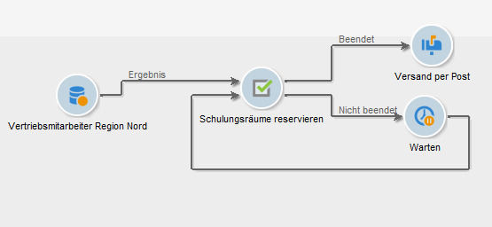
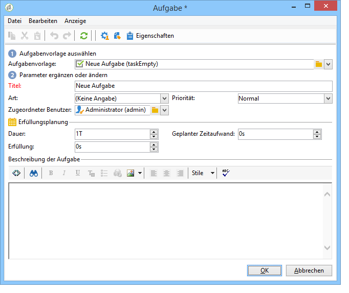

# Aufgabe{#task}

In Kampagnen-Workflows können mithilfe einer **[!UICONTROL Aufgabe]** zwei mögliche Szenarien definiert werden: Das erste kommt zum Tragen, wenn die Aufgabe beendet (im Sinn von erfüllt und wenn erforderlich validiert) wurde, das zweite, wenn die Aufgabe nicht beendet wurde. Dies ist beispielsweise der Fall, wenn der Benutzer die Erfüllung abgelehnt hat oder wenn sie überfällig ist.

Funktionsweise und Konfiguration von Aufgaben werden in diesem [Abschnitt](../../campaign/using/creating-and-managing-tasks.md) erläutert.

In der Option **[!UICONTROL Ressourcen]** können die für die Erfüllung der Aufgabe verantwortlichen Benutzer sowie Angaben zu ihrer Validierung gemacht werden. Die Zurückweisung einer erfüllten Aufgabe durch den Validierungsverantwortlichen zieht nicht automatisch die Aktivierung der Transition &#39;Nicht beendet&#39; nach sich.
