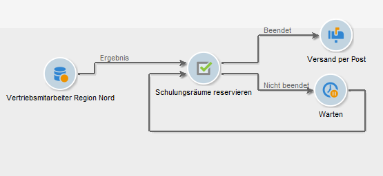
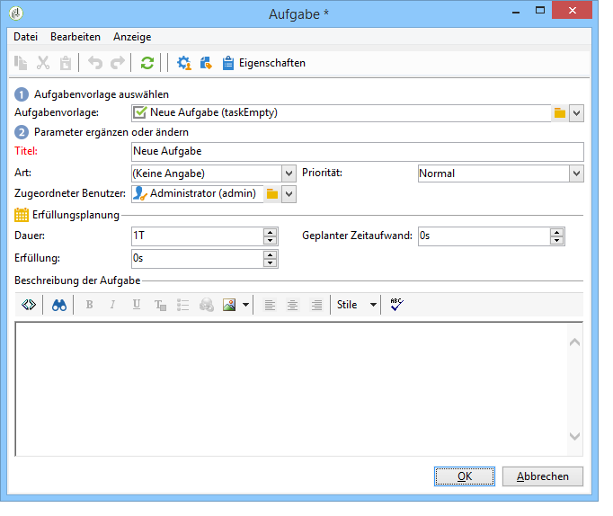

# Aufgabe{#task}

>[!AVAILABILITY]
>
>`:warning:` Diese Funktion ist nur in Campaign Classic v7 verfügbar. [Weitere Informationen](../../mrm/using/creating-and-managing-tasks.md)

In Kampagnen-Workflows können mithilfe einer **[!UICONTROL Aufgabe]** zwei mögliche Szenarien definiert werden: Das erste kommt zum Tragen, wenn die Aufgabe beendet wurde, das zweite, wenn die Aufgabe nicht beendet wurde. Dies ist beispielsweise der Fall, wenn der Benutzer die Erfüllung abgelehnt hat oder wenn sie überfällig ist.

Wie eine Aufgabe konfiguriert und durchgeführt wird, ist in der Dokumentation zu [Campaign Classic v7](../../mrm/using/creating-and-managing-tasks.md) beschrieben.

Mit **[!UICONTROL Option]** Ressourcen“ können Sie mehrere Benutzer sowie einen Validierungsplan für die Aufgabe definieren. Wenn die genehmigende Person ablehnt, führt dies nicht dazu, dass die Aufgabe selbst abgelehnt wird.
