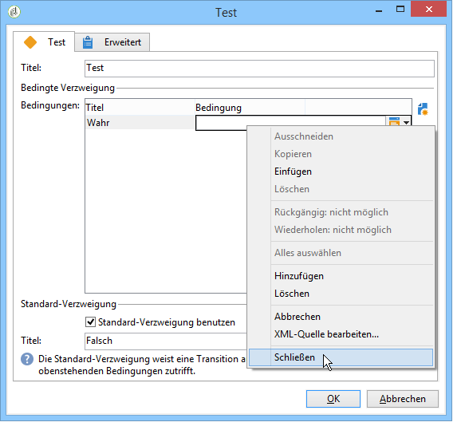

# Test{#test}

Ein **Test** aktiviert die erste Transition, welche die ihm zugeordneten Bedingungen erfüllt. Wenn keine der Bedingungen &#39;wahr&#39; zurückgibt, wird die **[!UICONTROL Standard-Verzweigung]** aktiviert, vorrausgesetzt, die entsprechende Option wurde angekreuzt.

Eine Bedingung ist ein JavaScript-Ausdruck, der entweder &#39;true&#39; oder &#39;false&#39; zurückgibt. Klicken Sie auf die Schaltfläche rechts in der Bedingungsspalte und wählen Sie die Option **[!UICONTROL Bearbeiten...]** aus.

Weitere Informationen zu allen zusätzlichen JavaScript-Funktionen und SOAP-Methoden des über Workflow-JavaScript zugänglichen Applikationsservers finden Sie in der [JSAPI-Dokumentation](https://docs.adobe.com/content/help/en/campaign-classic/technicalresources/api/index.html).

Im Editor können auch direkt Variablen eingegeben werden.

Bedingungen können im Bearbeitungsfenster der Aktivitätseigenschaften hinzugefügt, gelöscht oder geordnet oder über die Transition geändert werden.

Wenn ein Berechnungsergebnis in verschiedenen Bedingungen verwendet werden soll, kann die Berechnung im Initialisierungsscript der Aktivität erfolgen. Das Ergebnis ist dann in einer Variablen der Aufgabe zu speichern, damit es für die Bedingungsscripts verfügbar ist (task.vars.xxx).
