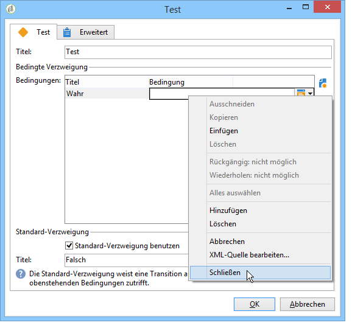

# Test{#test}

Eine **Test**-Aktivität aktiviert die erste Transition, die die damit verbundene Bedingung erfüllt. Wenn keine Bedingung erfüllt ist und die Option **[!UICONTROL Standardverzweigung verwenden]** aktiviert ist, wird die Standardüberblendung aktiviert.

Eine Bedingung ist ein JavaScript-Ausdruck, der als &#39;true&#39; oder &#39;false&#39; ausgewertet werden muss. Um den Ausdruck einzugeben, klicken Sie auf das Symbol rechts neben dem Namen der Bedingung und wählen Sie **[!UICONTROL Bearbeiten…]**.

Weitere Informationen zu allen zusätzlichen JavaScript-Funktionen und SOAP-Methoden des über Workflow-JavaScript zugänglichen Applikationsservers finden Sie in der [JSAPI-Dokumentation](https://experienceleague.adobe.com/developer/campaign-api/api/index.html?lang=de).

Im Editor können auch direkt Variablen eingegeben werden. Weitere Informationen zum Arbeiten mit Variablen finden Sie in [diesem Abschnitt](javascript-scripts-and-templates.md#variables).

Bedingungen können im Bearbeitungsfenster der Aktivitätseigenschaften hinzugefügt, gelöscht oder geordnet oder über die Transition geändert werden.

Soll das Ergebnis einer Berechnung unter verschiedenen Bedingungen wiederverwendet werden, so ist es möglich, es im Initialisierungsskript der Aktivität zu berechnen. Das Ergebnis muss in einer Variablen der Aufgabe gespeichert werden, auf die die Bedingungsskripte zugreifen können (task.vars.xxx).

