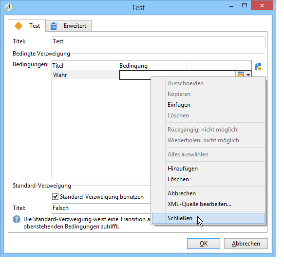

# Test{#test}

Mit einer Aktivität des Typs **Test** wird die erste Transition aktiviert, die die damit verknüpfte Bedingung erfüllt. Wenn keine Bedingung erfüllt ist und die Option **[!UICONTROL Standardtransition verwenden]** aktiviert ist, wird die Standardtransition aktiviert.

Eine Bedingung ist ein JavaScript-Ausdruck, der als &#39;true&#39; oder &#39;false&#39; ausgewertet werden muss. Um den Ausdruck einzugeben, klicken Sie auf das Symbol rechts neben dem Namen der Bedingung und wählen Sie **[!UICONTROL Bearbeiten…]**.

Weitere Informationen zu allen zusätzlichen JavaScript-Funktionen und SOAP-Methoden des über Workflow-JavaScript zugänglichen Applikationsservers finden Sie in der [JSAPI-Dokumentation](https://experienceleague.adobe.com/de/tools/campaign-api).

Im Editor können auch direkt Variablen eingegeben werden. Weitere Informationen zum Arbeiten mit Variablen finden Sie in [diesem Abschnitt](javascript-scripts-and-templates.md#variables).

Bedingungen können im Bearbeitungsfenster der Aktivitätseigenschaften hinzugefügt, gelöscht oder geordnet oder über die Transition geändert werden.

Wenn ein Berechnungsergebnis in verschiedenen Bedingungen verwendet werden soll, kann die Berechnung im Initialisierungsskript der Aktivität erfolgen. Das Ergebnis muss dann in einer Variablen der Aufgabe gespeichert werden, damit es für die Bedingungsskripts verfügbar ist (task.vars.xxx).

