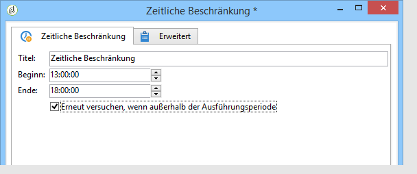

# Zeitliche Beschränkung{#time-constraint}

Mit der Aktivität **Zeitliche Beschränkung** können Sie die Ausführung einer Aufgabe verschieben oder abbrechen.

Benennen Sie die Aktivität und geben Sie Beginn und Ende der Zeitspanne an.

Kreuzen Sie die Option **[!UICONTROL Erneut versuchen, wenn außerhalb der Ausführungsperiode]** an, um weitere Ausführungsversuche zu unternehmen. Andernfalls wird der Workflow nach der Aussetzung definitiv abgebrochen.

