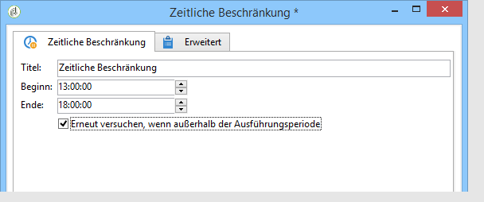

# Zeitliche Beschränkung{#time-constraint}

Mit der Aktivität **Zeitliche Beschränkung** können Sie die Ausführung einer Aufgabe verschieben oder abbrechen.

Benennen Sie die Aktivität und geben Sie Beginn und Ende der Zeitspanne an, inder der Workflow angehalten sein muss.

Wenn die Option **[!UICONTROL Erneut versuchen, wenn außerhalb der Ausführungsperiode]** ausgewählt ist, können Sie die Aufgabe außerhalb des Zeitrahmens für die Ausführung erneut starten. Wenn Sie möchten, dass die Workflow-Aktion nach dem Aussetzen endgültig eingestellt wird, deaktivieren Sie diese Option.

