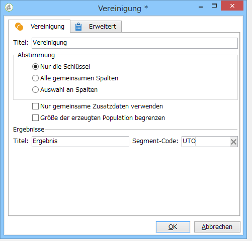
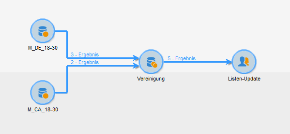

# Vereinigung{#union}

Über eine Vereinigung lassen sich die Ergebnisse mehrerer eingehender Aktivitäten in einer einzigen Zielgruppe zusammenfassen. Das Ziel wird mit allen erhaltenen Ergebnissen erstellt: Alle vorherigen Aktivitäten müssen daher abgeschlossen sein, damit die Vereinigung ausgeführt werden kann.

>[!NOTE]
>
>Weitere Informationen zur Konfiguration und Verwendung der Vereinigungsaktivität finden Sie unter [Populationen vereinen (Vereinigung)](targeting-data.md#combining-several-targets--union-).

## Anwendungsbeispiel für eine Vereinigung {#union-example}

Im folgenden Beispiel wurden die Ergebnisse zweier Abfragen kombiniert, um die Liste zu aktualisieren. Die beiden Abfragen zielen auf die Empfänger ab. Die Ergebnisse basieren daher auf derselben Tabelle.

1. Schließen Sie unmittelbar an die zwei Abfragen eine **[!UICONTROL Vereinigung]** an, gefolgt von einem Listen-Update.
1. Benennen Sie die Aktivität.
1. Wählen Sie als Abstimmoption **[!UICONTROL Nur die Schlüssel]**, da im vorliegenden Beispiel die aus den Abfragen stammenden Populationen homogen sind.
1. Falls Sie in den Abfragen Zusatzdaten verwenden, können Sie sich dafür entscheiden, nur gemeinsame Daten beizubehalten.
1. Bei Bedarf können Sie außerdem die Option **[!UICONTROL Größe der erzeugten Population begrenzen]** aktivieren.

   Geben Sie in diesem Fall die Anzahl an beizubehaltenden Empfängern und die vorrangig zu berücksichtigende Abfrage an.

1. Validieren Sie die Vereinigungsaktivität und konfigurieren Sie das Listen-Update (siehe [Listen-Update](list-update.md)).
1. Starten Sie den Workflow. Die Anzahl der Ergebnisse wird angezeigt und die in der Aktivität Listen-Update definierte Liste wird erstellt oder aktualisiert. Diese Liste enthält die Empfängergruppe für beide Abfragen oder gegebenenfalls die im vorherigen Schritt definierte Zahl.

   

## Eingabeparameter {#input-parameters}

* tableName
* schema

Jedes eingehende Ereignis muss eine durch diese Parameter definierte Zielgruppe angeben.

## Ausgabeparameter {#output-parameters}

* tableName
* schema
* recCount

Anhand der drei Werte lässt sich die durch die Vereinigung ermittelte Zielgruppe identifizieren. **[!UICONTROL tableName]** ist der Name der Tabelle, die die Zielgruppen-IDs enthält, **[!UICONTROL schema]** ist das Schema der Population, (i. d. R. nms:recipient) und **[!UICONTROL recCount]** ist die Anzahl der Elemente in der Tabelle.
