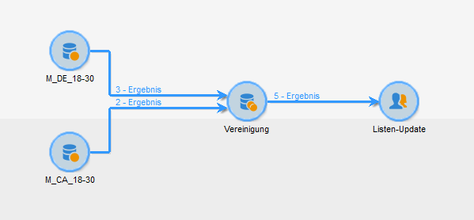

# Vereinigung{#union}

Über eine Vereinigung lassen sich die Ergebnisse mehrerer eingehender Transitionen in einer Zielgruppe zusammenfassen. Die Zielgruppe wird aus allen eingehenden Ergebnissen erstellt, dies bedeutet, dass die vorgeschalteten Aktivitäten beendet sein müssen, bevor die Vereinigung ausgeführt werden kann.

>[!NOTE]
>
>Weitere Informationen zur Konfiguration und Verwendung der Gewerkschaftsaktivität finden Sie unter [Kombinieren mehrerer Ziele (Union)](../../workflow/using/targeting-data.md#combining-several-targets--union-).

## Anwendungsbeispiel {#union-example}

Im folgenden Beispiel sollen die Ergebnisse zweier Abfragen zusammengefasst werden, um eine Liste zu aktualisieren. Beide Abfragen betreffen Empfänger. Die Ergebnisse basieren also auf derselben Tabelle.

1. Insert a **[!UICONTROL Union]** -type activity straight after the two queries and before an update-type activity of the list then open it.
1. Benennen Sie die Aktivität.
1. Select the **[!UICONTROL Keys only]** reconciliation method since, in this example, the population resulting from queries contains consistent data.
1. Falls Sie in den Abfragen Zusatzdaten verwenden, können Sie sich dafür entscheiden, nur gemeinsame Daten beizubehalten.
1. Wenn Sie die Größe der Endpopulation begrenzen möchten, markieren Sie das **[!UICONTROL Limit size of generated population]** Kästchen.

   Geben Sie in diesem Fall die Anzahl an beizubehaltenden Empfängern und die vorrangig zu berücksichtigende Abfrage an.

1. Approve the union activity then configure the list update activity (see [List update](../../workflow/using/list-update.md)).
1. Starten Sie dann den Workflow. Die Anzahl an in der Ergebnismenge enthaltenen Kontakten wird angezeigt und die in der Update-Aktivität angegebene Liste wird erstellt oder aktualisiert. Letztere enthält nun alle Empfänger aus den beiden Abfragen bzw. die im vorangehenden Schritt definierte Anzahl.

   

## Eingabeparameter {#input-parameters}

* tableName
* schema

Jedes eingehende Ereignis muss eine durch diese Parameter definierte Zielgruppe angeben.

## Ausgabeparameter {#output-parameters}

* tableName
* schema
* recCount

Dieser Satz von drei Werten identifiziert das Ziel, das sich aus der Vereinigung ergibt. **[!UICONTROL tableName]** ist der Name der Tabelle, in der die Zielkennungen aufgezeichnet werden, das Schema der Population (normalerweise nms:empfänger) und die Anzahl der Elemente in der Tabelle **[!UICONTROL schema]** ist **[!UICONTROL recCount]** dies.
