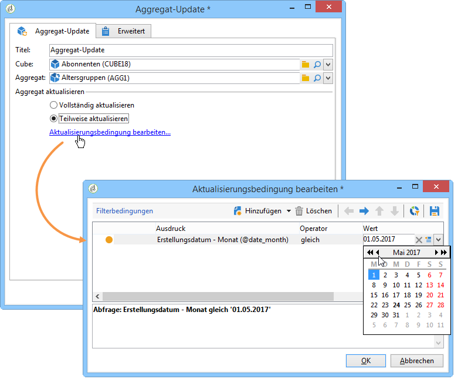
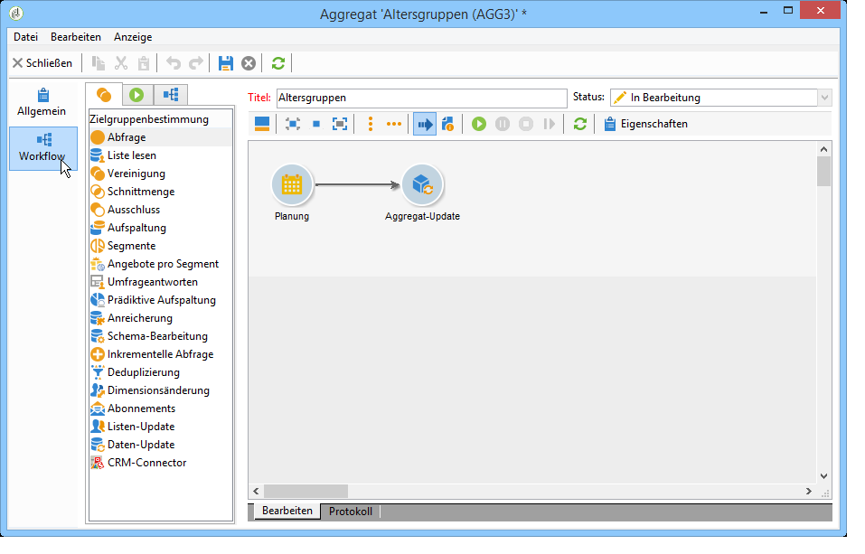

# Aggregat-Update{#update-aggregate}

Aggregate dienen Berichtszwecken und werden auf Cube-Niveau definiert. Bei der Konfiguration von Aggregaten steht ein **[!UICONTROL Workflow]**-Tab zur Verfügung.

Detaillierte Erläuterungen zu Cubes und der Verwendung von Aggregaten in Adobe Campaign finden Sie im entsprechenden [Abschnitt](../../reporting/using/concepts-and-methodology.md#calculating-and-using-aggregates).

In der **[!UICONTROL Aggregat-Update]**-Aktivität besteht die Wahl zwischen einer vollständigen oder teilweisen Aktualisierung.

Standardmäßig wird das Aggregat bei jeder Ausführung vollständig aktualisiert. Bei Auswahl der teilweisen Aktualisierung sind mithilfe des entsprechenden Links die Aktualisierungsbedingungen zu definieren.

**Best practices**: Die Verwendung einer **[!UICONTROL Planung]** ermöglicht die Bestimmung der Aktualisierungshäufigkeit des Aggregats.

