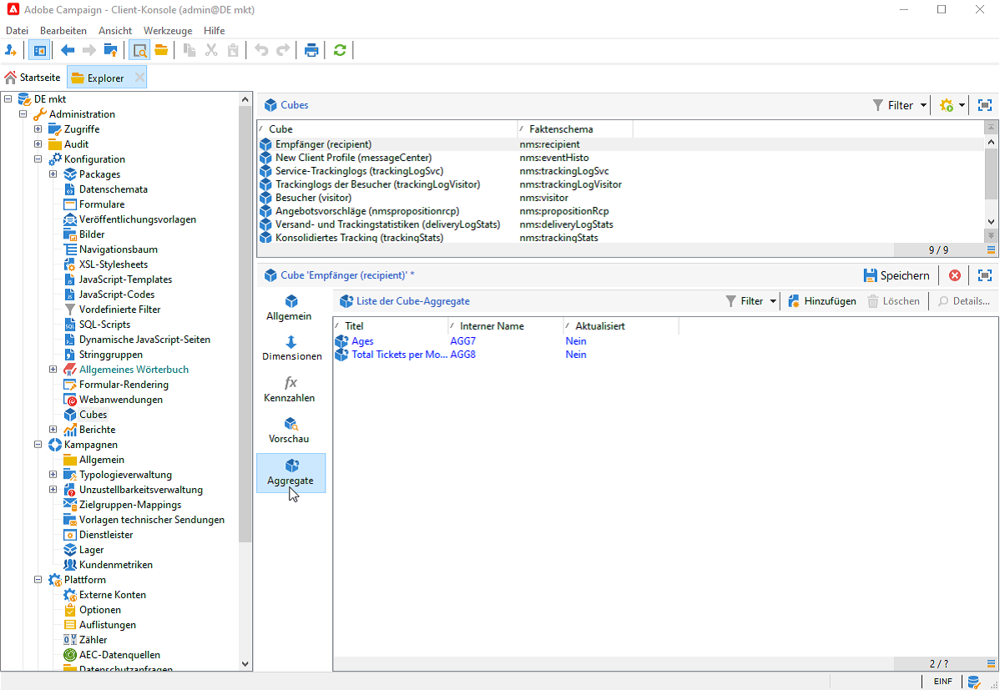
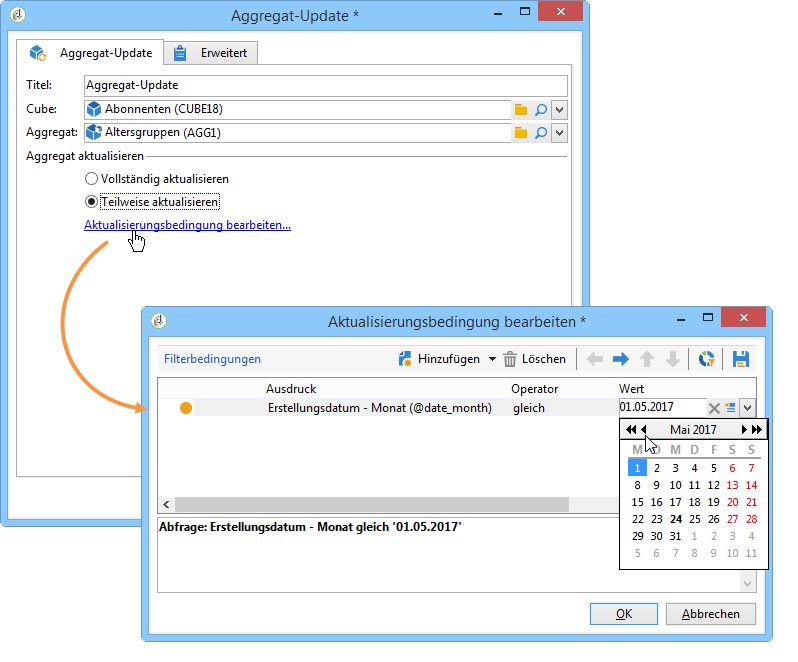
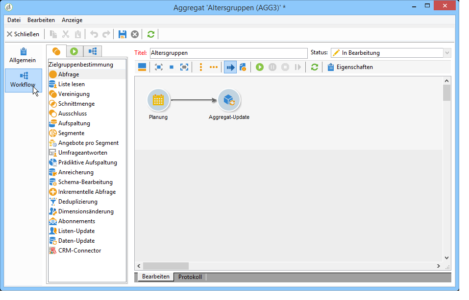

# Aggregat-Update{#update-aggregate}

Aggregate dienen Berichtszwecken und werden auf Cube-Ebene definiert. Bei **[!UICONTROL Konfiguration eines Aggregats ist]** Registerkarte „Workflow“ verfügbar.

Aggregate sind bei der Bearbeitung großer Datenmengen nützlich. Sie werden automatisch auf der Grundlage der im entsprechenden Workflow-Feld definierten Einstellungen aktualisiert, um die zuletzt erfassten Daten in die Indikatoren zu integrieren

Aggregate werden im entsprechenden Tab des Cubes definiert.

In der **[!UICONTROL Aggregat-Update]**-Aktivität besteht die Wahl zwischen einer vollständigen oder teilweisen Aktualisierung.

Standardmäßig wird bei jeder Berechnung eine vollständige Aktualisierung durchgeführt. Um eine partielle Aktualisierung zu aktivieren, wählen Sie die entsprechende Option aus und definieren Sie die Aktualisierungsbedingungen.

**Best practices**: Die Verwendung einer **[!UICONTROL Planung]** ermöglicht die Bestimmung der Aktualisierungshäufigkeit des Aggregats.

