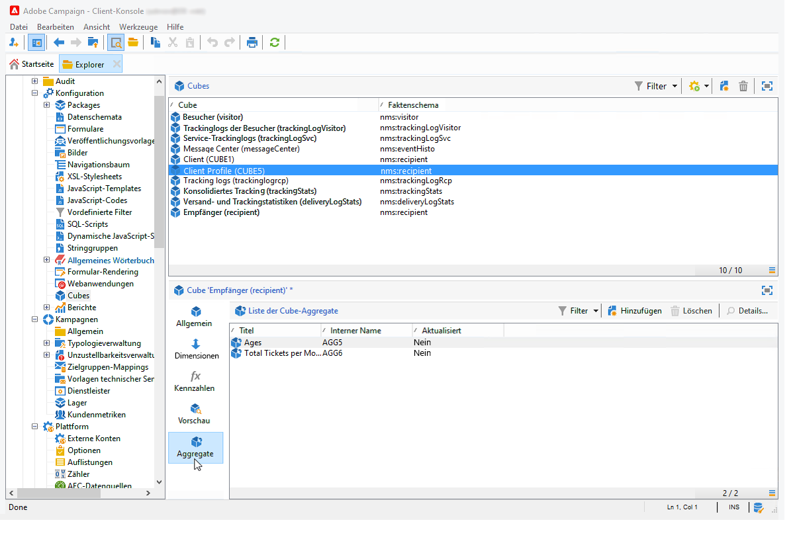

# Aggregat-Update{#update-aggregate}

Aggregate dienen Berichtszwecken und werden auf Cube-Niveau definiert. Bei der Konfiguration von Aggregaten steht die Registerkarte **[!UICONTROL Workflow]** zur Verfügung.

Diese Vorgehensweise empfiehlt sich insbesondere bei der Verarbeitung von großen Datenvolumen. Aggregate werden automatisch entsprechend den in der dedizierten Workflow-Aktivität definierten Parametern aktualisiert, damit neu abgerufene Daten bei der Kennzahlenberechnung berücksichtigt werden können.

Aggregate werden im entsprechenden Tab des Cubes definiert.

In der **[!UICONTROL Aggregat-Update]**-Aktivität besteht die Wahl zwischen einer vollständigen oder teilweisen Aktualisierung.

Standardmäßig wird das Aggregat bei jeder Ausführung vollständig aktualisiert. Bei Auswahl der teilweisen Aktualisierung sind mithilfe des entsprechenden Links die Aktualisierungsbedingungen zu definieren.

**Best practices**: Die Verwendung einer **[!UICONTROL Planung]** ermöglicht die Bestimmung der Aktualisierungshäufigkeit des Aggregats.

