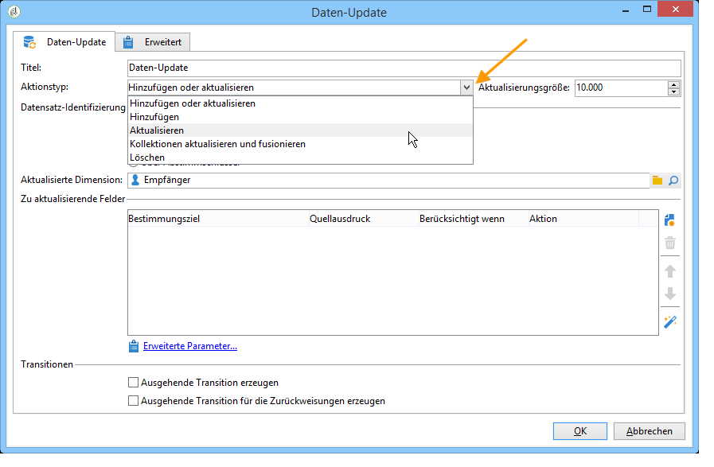
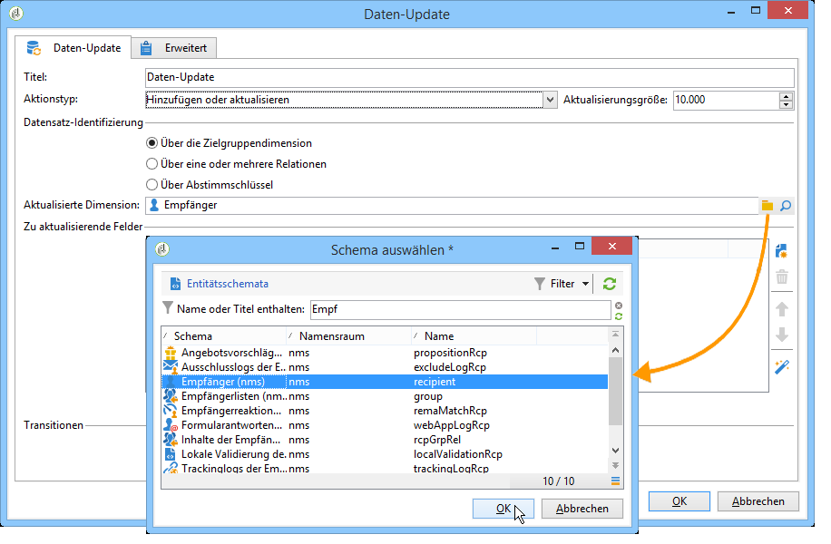
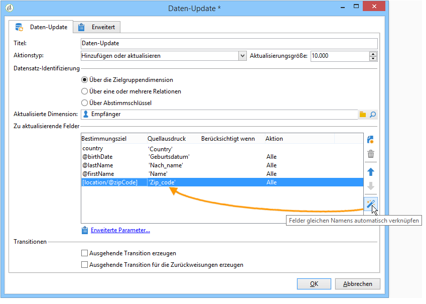
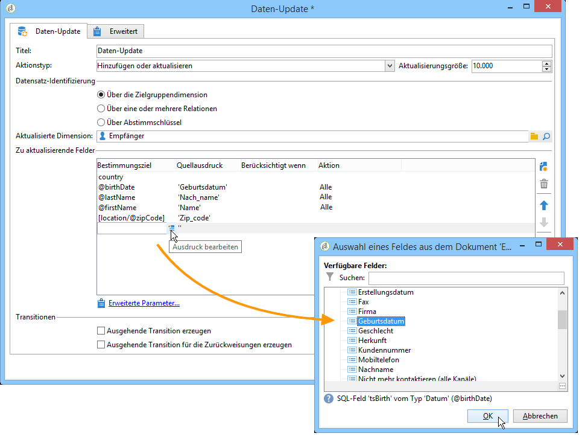
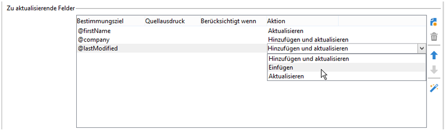
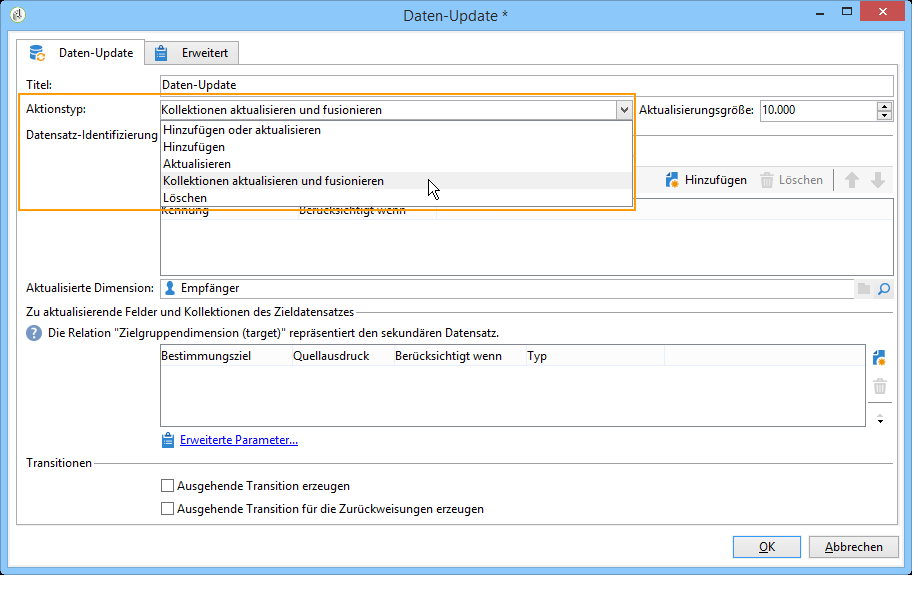
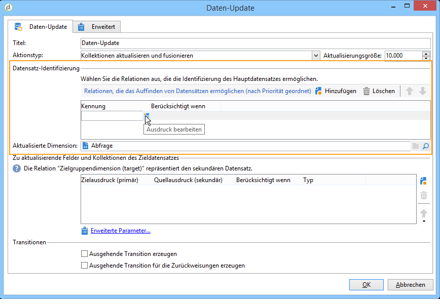
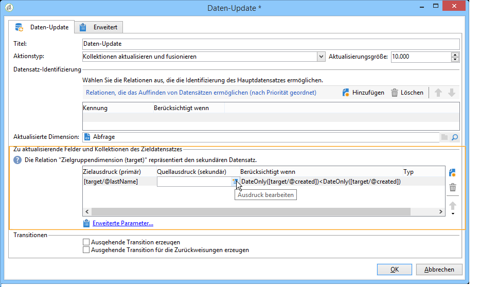

# Daten-Update{#update-data}

Die Aktivität **Daten-Update** ermöglicht eine gebündelte Aktualisierung von Datenbankfeldern.

## Aktionstyp {#operation-type}

Geben Sie im Feld **[!UICONTROL Aktionstyp]** an, auf welche Weise die Daten aktualisiert werden sollen:

* **[!UICONTROL Hinzufügen oder aktualisieren]**: fügt neue Daten zur Datenbank hinzu oder aktualisiert existierende Daten.
* **[!UICONTROL Hinzufügen]**: fügt nur neue Daten hinzu (existierende Daten werden nicht verändert).
* **[!UICONTROL Aktualisieren]**: aktualisiert existierende Daten (fügt keine neuen Datensätze hinzu).
* **[!UICONTROL Sammlung aktualisieren und zusammenführen]**: Aktualisieren Sie Daten und wählen Sie einen primären Datensatz; verknüpfen Sie dann Elemente, die mit den Duplikaten in diesem primären Datensatz verknüpft sind. Anschließend können Duplikate gelöscht werden, ohne dass verwaiste angehängte Elemente erstellt werden.
* **[!UICONTROL Löschen]**: löscht Daten.

Im Feld **[!UICONTROL Batch-Größe]** können Sie festlegen, wie viele Elemente der eingehenden Transition aktualisiert werden sollen. Wenn Sie beispielsweise 500 angeben, werden die ersten 500 verarbeiteten Einträge aktualisiert.

## Datensatz-Identifizierung {#record-identification}

Geben Sie an, auf welche Weise die Datensätze der Datenbank identifiziert werden können:

* Wählen Sie die Option **[!UICONTROL Über die Zielgruppendimension]**, wenn die eingehenden Daten einer existierenden Zielgruppendimension entsprechen und geben Sie diese im Feld **[!UICONTROL Aktualisierte Dimension]** an.

  Mithilfe der Lupe (**[!UICONTROL Verknüpftes Element öffnen]**) können die Felder der ausgewählten Dimension angezeigt werden.

* Wenn die eingehenden Daten keiner existierenden Zielgruppendimension entsprechen, können Sie entweder eine oder mehrere Relationen angeben, die die Identifizierung der Daten ermöglichen, oder Abstimmschlüssel verwenden.

## Auswahl der zu aktualisierenden Felder {#selecting-the-fields-to-be-updated}

Über die Schaltfläche **[!UICONTROL Felder gleichen Namens automatisch verknüpfen]** werden die zu aktualisierenden Felder automatisch von Adobe Campaign identifiziert.

Es besteht auch die Möglichkeit, die Zuordnung manuell vorzunehmen, indem Sie die zu aktualisierenden Felder über die Schaltfläche **[!UICONTROL Hinzufügen]** auswählen.

Wählen Sie alle zu aktualisierenden Felder aus und geben Sie bei Bedarf Bedingungen für die Aktualisierung an. Dies ist in der Spalte **[!UICONTROL Berücksichtigt wenn]** möglich. Die Bedingungen werden nacheinander, in Reihenfolge der Liste geprüft. Die Reihenfolge kann mithilfe der blauen Pfeile rechts der Tabelle angepasst werden.

Ein Zielfeld kann mehrmals verwendet werden.

Wenn Sie die Option **[!UICONTROL Hinzufügen oder aktualisieren]** gewählt haben, können Sie für jedes Feld individuell entscheiden, welche der möglichen Aktionen ausgeführt werden soll. Wählen Sie dazu den gewünschten Wert in der Spalte **[!UICONTROL Vorgang]** aus.

Die Felder **[!UICONTROL modifiedDate]**, **[!UICONTROL modifiedBy]**, **[!UICONTROL createdDate]** und **[!UICONTROL createdBy]** werden im Zuge der Daten-Update-Aktivität automatisch aktualisiert, es sei denn, in der Tabelle der zu aktualisierenden Felder wird explizit etwas anderes konfiguriert.

Die Aktualisierung von Einträgen wird nur für Einträge durchgeführt, die mindestens einen Unterschied aufweisen. Wenn die Werte gleich sind, wird keine Aktualisierung vorgenommen.

Über den Link **[!UICONTROL Erweiterte Parameter]** können Sie weitere Optionen zum Umgang mit der Datenaktualisierung und Duplikatverwaltung angeben. Sie haben außerdem folgende Möglichkeiten:

* **[!UICONTROL Automatische Schlüsselverwaltung deaktivieren]**;
* **[!UICONTROL Audit deaktivieren]**;
* **[!UICONTROL Zielwert löschen, wenn Quellwert leer ist (NULL)]** (diese Option ist standardmäßig automatisch aktiviert);
* **[!UICONTROL Alle Spalten mit übereinstimmenden Namen aktualisieren]**;
* Angabe von Bedingungen bezüglich der Quellelemente mithilfe eines Ausdrucks im Feld **[!UICONTROL Berücksichtigung]**;
* Angabe von Bedingungen zur Berücksichtigung von Dubletten mithilfe eines Ausdrucks. Wenn die Option **[!UICONTROL Den gleichen Zielkontakt betreffende Datensätze ignorieren]** aktiviert ist, wird nur der erste Datensatz der Ausdruckliste berücksichtigt.

**[!UICONTROL Ausgehende Transition erzeugen]**

Erstellt eine ausgehende Transition, die am Ende der Ausführung aktiviert wird. Die Aktualisierung signalisiert in der Regel das Ende eines Workflows zur Zielgruppenbestimmung. Daher ist diese Option standardmäßig nicht aktiviert.

**[!UICONTROL Ausgehende Transition für die Zurückweisungen erzeugen]**

Erzeugt eine ausgehende Transition mit Einträgen, die nach der Aktualisierung nicht korrekt verarbeitet wurden (z. B. wenn es ein Duplikat gibt). Die Aktualisierung bedeutet in der Regel das Ende eines Zielgruppenbestimmungs-Workflows, weshalb die Option standardmäßig nicht aktiviert ist.

## Aktualisierung und Zusammenführung von Sammlungen {#updating-and-merging-collections}

Das Aktualisieren und Zusammenführen von Sammlungen ermöglicht Ihnen das Aktualisieren von Daten in einem Eintrag, indem Sie Daten von einem oder mehreren sekundären Einträgen verwenden, und zwar mit dem Ziel, bei Bedarf nur einen zu behalten. Diese Aktualisierungen werden durch einen Regelsatz verwaltet.

>[!NOTE]
>
>Mit dieser Option können Sie auch Verweise auf sekundäre Einträge aus Workflow-Arbeitstabellen (targetWorkflow), Sendungen (targetDelivery) und Listen (targetList) verarbeiten. Bei Bedarf werden diese Links in der Liste angezeigt, in der Sie Felder und Sammlungen auswählen.

1. Wählen Sie die Option **[!UICONTROL Sammlungen aktualisieren und zusammenführen]**.

   

1. Wählen Sie die Reihenfolge der Priorität für die Links aus. Auf diese Weise können Sie den Haupteintrag identifizieren. Die verfügbaren Links variieren je nach eingehender Transition.

   

1. Geben Sie die in den Hauptdatensatz zu verschiebenden Sammlungen und die zu aktualisierenden Felder an.

   Definieren Sie die Regeln, die im Bezug auf die Felder gelten sollen, wenn ein oder mehrere sekundäre Datensätze identifiziert wurden. Dazu können Sie den Ausdrucksgenerator verwenden. Weiterführende Informationen dazu finden Sie in diesem [Abschnitt](../../platform/using/adobe-campaign-workspace.md#about-queries-in-campaign). Geben Sie beispielsweise an, dass bei Werten aus verschiedenen möglichen Datensätzen jeweils der zuletzt aktualisierte Wert beibehalten werden soll.

   Geben Sie die Bedingungen zur Berücksichtigung der Regel an.

   Geben Sie abschließend die Art der durchzuführenden Aktualisierung an. Sie können sich beispielsweise dazu entscheiden, die sekundären Einträge nach der Aktualisierung der Daten zu löschen.

   Sie können beispielsweise die Zusammenführung von Sammlungen mit heterogenen Daten wie der Liste von Abonnements für eine Empfängerin bzw. einen Empfänger konfigurieren. Mithilfe von Regeln können Sie außerdem neue Abonnementverläufe basierend auf sekundären Einträgen in Bezug auf Abonnements erstellen oder sogar die Liste der Abonnements von einem sekundären Eintrag zu einem primären Eintrag verschieben.

1. Auf der Registerkarte **[!UICONTROL Duplikate]** der **[!UICONTROL Erweiterten Parameter]** besteht die Möglichkeit, die Reihenfolge anzugeben, in der die sekundären Datensätze verarbeitet werden sollen.

   

Die Daten für sekundäre Einträge sind mit dem Haupteintrag verknüpft, wenn die definierten Regeln zutreffen. Je nach ausgewähltem Aktualisierungstyp können die sekundären Einträge gelöscht werden.

## Anwendungsbeispiel: Daten-Update nach einer Anreicherung {#example--update-data-following-an-enrichment}

Ein Beispiel für ein Daten-Update nach einer Anreicherungsaktivität finden Sie im Anwendungsbeispiel zur Erstellung einer Zusammenfassungsliste in [Schritt 2: Schreiben der angereicherten Daten in die Tabelle &quot;Käufe&quot;](creating-a-summary-list.md#step-2--writing-enriched-data-to-the--purchases--table).

## Eingabeparameter {#input-parameters}

* tableName
* schema

Jedes eingehende Ereignis muss eine durch diese Parameter definierte Zielgruppe angeben.

