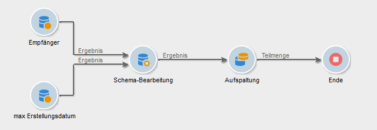
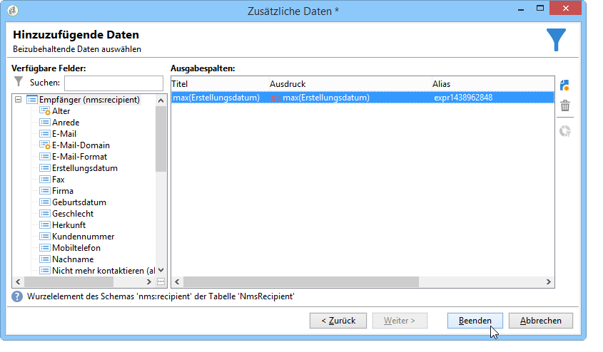
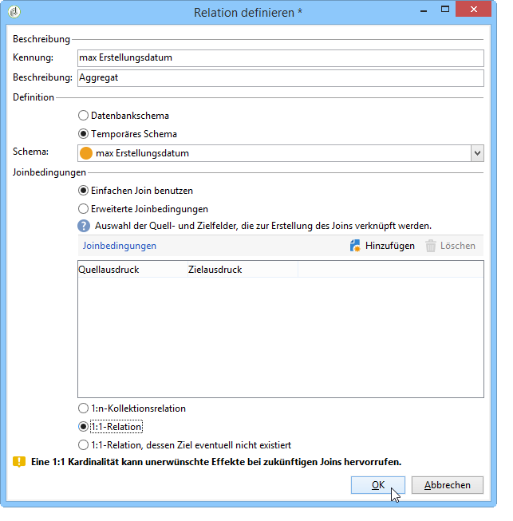
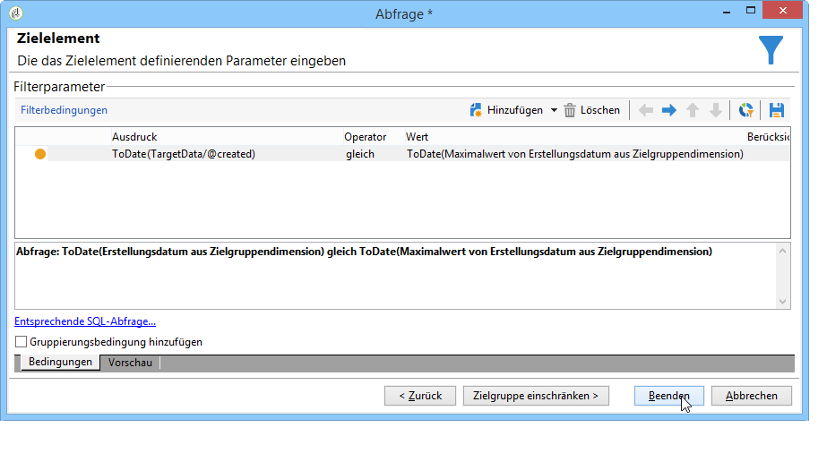

# Verwendung von Aggregaten{#using-aggregates}

Ziel des folgenden Anwendungsbeispiels ist es, die zuletzt zur Datenbank hinzugefügten Empfänger zu identifizieren.

Hierfür wird das Datum der Empfängererstellung in der Datenbank mit dem letzten bekannten Datum, an dem ein Empfänger erstellt wurde, mithilfe eines Aggregats verglichen. Auf diese Weise werden alle an diesem Datum erstellten Empfänger abgerufen.

Die Konfiguration eines Empfängerfilters vom Typ **Erstellungsdatum = max (Erstellungsdatum)** ist mithilfe des folgenden Workflows möglich:

1. Abrufen von Datenbankempfängern mithilfe einer einfachen Abfrage. Weitere Informationen zu diesem Schritt finden Sie unter [Erstellen einer Abfrage](../../workflow/using/query.md#creating-a-query).
1. Berechnung des letzten bekannten Empfängererstellungs-Datums mit der Aggregatfunktion **max (Erstellungsdatum)**.
1. Zuordnung der Empfänger zum Ergebnis des Aggregats im selben Schema.
1. Filterung der Empfänger mithilfe des Aggregats im bearbeiteten Schema.

## 1. Schritt: Berechnung des Aggregats {#step-1--calculating-the-aggregate-result}

1. Erstellen Sie eine Abfrage. Ziel ist die Berechnung des letzten bekannten Erstellungsdatums aus allen in der Datenbank enthaltenen Empfängern. Die Abfrage enthält somit keinen Filter.
1. Auswählen **[!UICONTROL Add data]**.
1. Wählen Sie in den geöffneten Fenstern **[!UICONTROL Data linked to the filtering dimension]** dann **[!UICONTROL Filtering dimension data]**.
1. Fügen Sie im **[!UICONTROL Data to add]** Fenster eine Spalte hinzu, die den Maximalwert für das Feld **Erstellungsdatum** in der Empfängertabelle berechnet. Sie können den Ausdruckseditor verwenden oder **max(@created)** direkt in ein Feld in der **[!UICONTROL Expression]** Spalte eingeben. Then click the **[!UICONTROL Finish]** button.

   

1. Klicken Sie **[!UICONTROL Edit additional data]** dann **[!UICONTROL Advanced parameters...]**. Aktivieren Sie die **[!UICONTROL Disable automatic adding of the primary keys of the targeting dimension]** Option.

   Diese Option ermöglicht es, nicht alle Empfänger als Ergebnis auszugeben und nur die Daten beizubehalten, die explizit hinzugefügt wurden. Hier handelt es sich um das Datum, an dem zuletzt ein Empfänger erstellt wurde.

   Lassen Sie die **[!UICONTROL Remove duplicate rows (DISTINCT)]** Option aktiviert.

## 2. Schritt: Verknüpfung von Empfängern und Aggregat {#step-2--linking-the-recipients-and-the-aggregation-function-result}

Verwenden Sie die Schema-Bearbeitung, um die auf Empfänger bezogene Abfrage mit der zur Berechnung eines Aggregats dienenden Abfrage zu verknüpfen.

1. Wählen Sie als Hauptmenge die Abfrage bezüglich der Empfänger aus.
1. In the **[!UICONTROL Links]** tab, add a new link and enter the information in the window that opens as follows:

   * Wählen Sie das temporäre Schema des Aggregats aus. Die Daten dieses Schemas werden zur Hauptmenge hinzugefügt.
   * Select **[!UICONTROL Use a simple join]** to link the aggregate result to every recipient of the main set.
   * Geben Sie abschließend an, dass es sich bei dem Link um einen **[!UICONTROL Type 11 simple link]** Link handelt.
   

Auf diese Weise wird das Ergebnis des Aggregats mit jedem einzelnen der Empfänger verknüpft.

## Step 3: Filtering recipients using the aggregate. {#step-3--filtering-recipients-using-the-aggregate-}

Nach Erzeugung der Relation sind die Empfänger und das Aggregat Teil desselben temporären Schemas. Dadurch ist es nun möglich, einen Filter auf das Schema anzuwenden, der den Vergleich zwischen dem Erstellungsdatum der Empfänger und dem letzten Erstellungsdatum (durch das Aggregat berechnet) vornimmt. Hierzu wird eine Aufspaltung verwendet.

1. In the **[!UICONTROL General]** tab, select **Recipients** as the targeting dimension and **Edit schema** as the filtering dimension (to filter on the inbound transition schema activity).
1. Wählen Sie auf der **[!UICONTROL subsets]** Registerkarte **[!UICONTROL Add a filtering condition on the inbound population]** und klicken Sie auf **[!UICONTROL Edit...]**.
1. Setzen Sie im Ausdruckseditor das Erstellungsdatum der Empfänger mit dem vom Aggregat berechneten Datum gleich.

   Datumsfelder werden in der Datenbank in der Regel auf die Millisekunde genau gespeichert. Die Datumsangaben müssen daher auf den ganzen Tag ausgedehnt werden, um nicht nur die Empfänger zu berücksichtigen, die in derselben Millisekunde erstellt wurden.

   Im Ausdruckseditor steht hierzu die Funktion **ToDate** zur Verfügung, die Datumsangaben mit Uhrzeit in einfache Daten konvertiert.

   Folgende Ausdrücke sind also für die Bedingung erforderlich:

   * **[!UICONTROL Expression]**: `toDate([target/@created])`.
   * **[!UICONTROL Value]**: `toDate([datemax/expr####])`, wobei sich expr#### auf das Aggregat bezieht, das in der Abfrage der Aggregationsfunktion angegeben ist.
   

Das Ergebnis der Aufspaltung entspricht somit den am selben Tag wie die letzte bekannte Erstellung erstellten Empfängern.

Sie haben die Möglichkeit, im Anschluss weitere Aktivitäten wie beispielsweise ein Listen-Update oder einen Versand im Workflow-Diagramm zu platzieren.
