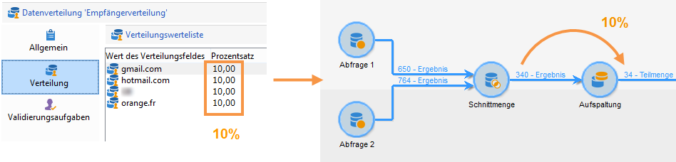
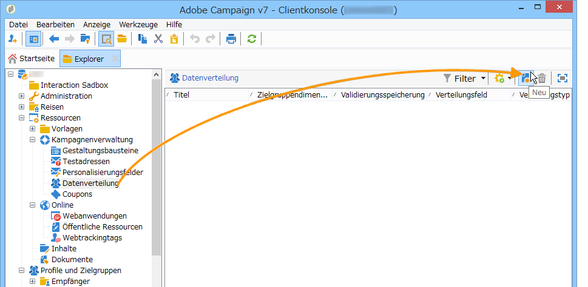
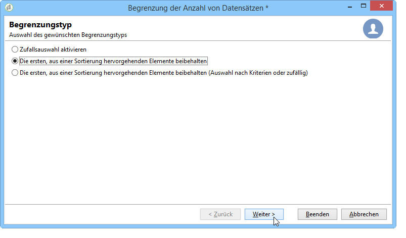
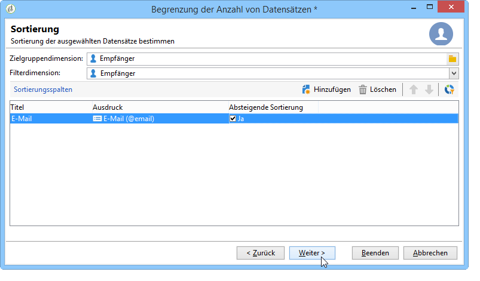
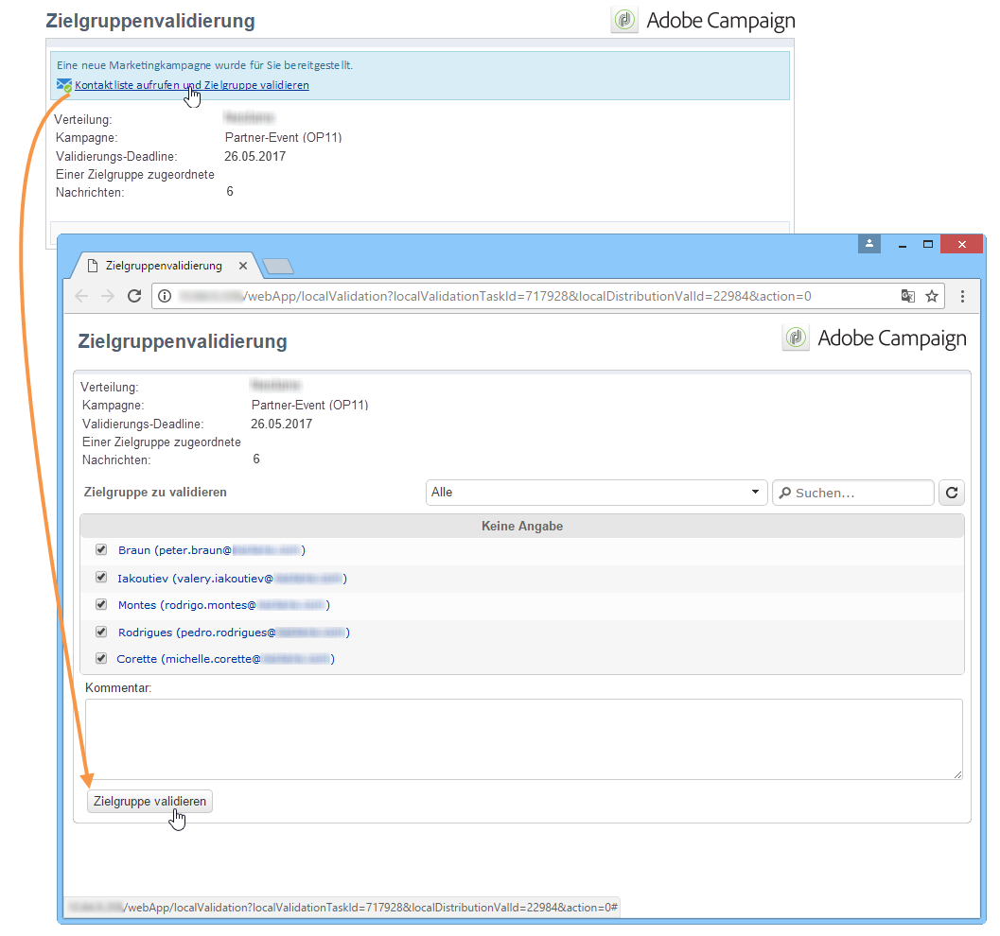
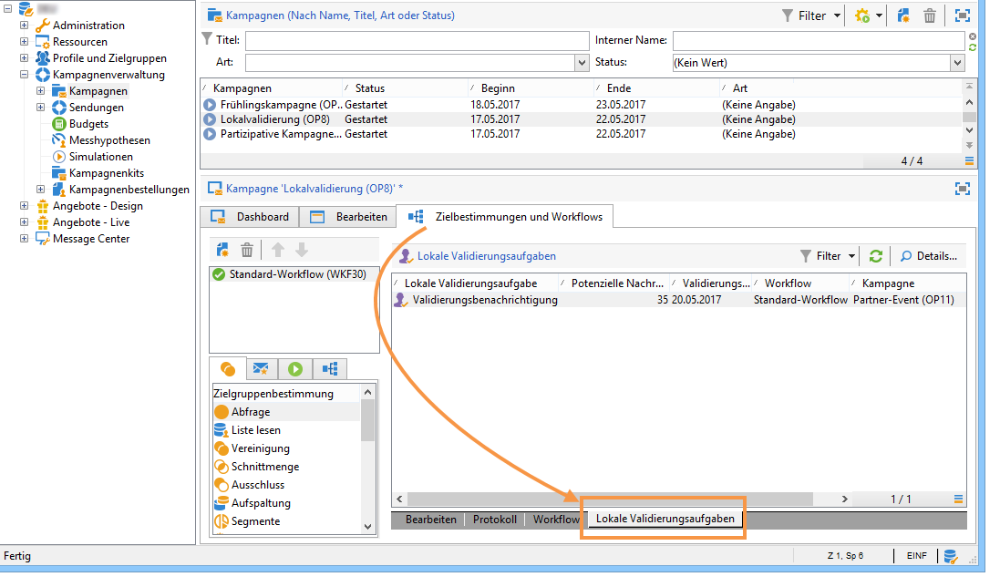

# Lokale Validierung verwenden{#using-the-local-approval-activity}

The **[!UICONTROL Local approval]** activity integrated into a targeting workflow lets you set up a recipient approval process before the delivery is sent.

>[!CAUTION]
>
>Zur Verwendung dieser Funktion benötigen Sie das Modul Distributed Marketing (Campaign-Option). Bitte prüfen Sie Ihren Lizenzvertrag.

Der Workflow für dieses Anwendungsbeispiel stellt sich wie folgt dar:

Der lokale Validierungsprozess gliedert sich in folgende Schritte:

1. The population resulting from targeting can be limited thanks to a **[!UICONTROL Split]** type activity using a data distribution model.

   

1. Die **[!UICONTROL Local approval]** Aktivität übernimmt dann und sendet eine Benachrichtigungs-E-Mail an jeden lokalen Supervisor. Die Aktivität wird eingestellt, bis jede lokale Aufsichtsbehörde die ihnen zugewiesenen Empfänger genehmigt.

   

1. Sobald der Genehmigungszeitpunkt erreicht ist, wird der Workflow erneut gestartet. In diesem Beispiel wird die **[!UICONTROL Delivery]** Aktivität gestartet und die Bereitstellung wird an die genehmigten Ziele gesendet.

   >[!NOTE]
   >
   >Die bis zum Ablauf der Validierungsfrist nicht validierten Empfänger werden in der Versand-Zielgruppe nicht berücksichtigt.

   

1. A few days later, the second **[!UICONTROL Local approval]** type activity sends a notification email to each local supervisor with a summary of the actions carried out by their contacts (clicks, opens, etc.).

   

## 1. Schritt: Erstellung der Datenverteilungsvorlage {#step-1--creating-the-data-distribution-template-}

Mit der Datenverteilungsvorlage können Sie die Population einschränken, die sich aus dem Targeting auf der Grundlage der Datengruppierung ergibt, während Sie jeden Wert einem lokalen Supervisor zuweisen können. In diesem Beispiel haben wir das **[!UICONTROL Email address domain]** Feld als Verteilungsfeld definiert und jedem lokalen Supervisor eine Domäne zugewiesen.

Weitere Informationen zum Erstellen einer Datenverteilungsvorlage finden Sie unter [Beschränken der Anzahl der untergeordneten Datensätze pro Datenverteilung](../../workflow/using/split.md#limiting-the-number-of-subset-records-per-data-distribution).

1. Um die Datenverteilungsvorlage zu erstellen, gehen Sie zum **[!UICONTROL Resources > Campaign management > Data distribution]** Knoten und klicken Sie auf **[!UICONTROL New]**.

   

1. Wählen Sie die **[!UICONTROL General]** Registerkarte.

   

1. Geben Sie die **[!UICONTROL Label]** und die **[!UICONTROL Distribution context]**. In diesem Beispiel haben wir das **[!UICONTROL Recipient]** Targeting-Schema und das **[!UICONTROL Email domain]** -Feld als Verteilungsfeld ausgewählt. Die Liste der Empfänger wird nach Domäne aufgeschlüsselt.
1. Wählen Sie im **[!UICONTROL Distribution type]** Feld aus, wie der Zielbegrenzungswert auf der **[!UICONTROL Distribution]** Registerkarte ausgedrückt werden soll. Hier haben wir uns entschieden **[!UICONTROL Percentage]**.
1. Geben Sie in das **[!UICONTROL Approval storage]** Feld das Speicherschema der Genehmigungen ein, die dem verwendeten Targeting-Schema entsprechen. Hier verwenden wir das standardmäßige Speicherschema: **[!UICONTROL Local approval of recipients]**.
1. Klicken Sie dann auf den **[!UICONTROL Advanced parameters]** Link.

   

1. Keep the **[!UICONTROL Approve the targeted messages]** option checked so that all recipients are pre-selected from the list of recipients to approve.
1. Im **[!UICONTROL Delivery label]** Feld haben wir den Standardausdruck (Berechnungszeichenfolge der Bereitstellung) gelassen. Die Standardbeschriftung der Lieferung wird in der Feedback-Benachrichtigung verwendet.
1. In the **[!UICONTROL Grouping field]** section, we have selected the **[!UICONTROL Gender]** field as a grouping field for displaying recipients in the approval and feedback notifications.
1. Im **[!UICONTROL Edit targeted messages]** Abschnitt haben wir die **[!UICONTROL Edit recipients]** Webanwendung und den **[!UICONTROL recipientId]** Parameter ausgewählt. In den Genehmigungs- und Feedback-Benachrichtigungen werden die Empfänger angeklickt und verweisen auf die URL der Webanwendung. Der zusätzliche URL-Parameter wird **[!UICONTROL recipientId]** angezeigt.
1. Klicken Sie dann auf die **[!UICONTROL Distribution]** Registerkarte. Geben Sie für jede Domäne die folgenden Felder ein:

   

   * **[!UICONTROL Value]**: Geben Sie den Wert des Domänennamens ein.
   * **[!UICONTROL Percentage / Fixed]**: Geben Sie für jede Domäne den Wert max ein. Anzahl der Empfänger, an die die Lieferung gesendet werden soll. In diesem Beispiel möchten wir die Bereitstellung auf 10 % pro Domäne begrenzen.
   * **[!UICONTROL Label]**: Geben Sie die Bezeichnung der Domäne ein, die in den Genehmigungs- und Feedback-Benachrichtigungen angezeigt werden soll.
   * **[!UICONTROL Group or operator]**: Wählen Sie den Operator oder die Gruppe von Operatoren aus, die der Domäne zugewiesen sind.

      >[!CAUTION]
      >
      >Stellen Sie sicher, dass die Benutzer über die nötigen Berechtigungen verfügen.

## 2. Schritt: Erstellung des Zielgruppen-Workflows {#step-2--creating-the-targeting-workflow}

Der Workflow für dieses Anwendungsbeispiel stellt sich wie folgt dar:

Folgende Aktivitäten wurden verwendet:

* Zwei **[!UICONTROL Query]** Tätigkeiten,
* Eine **[!UICONTROL Intersection]** Aktivität,
* Eine **[!UICONTROL Split]** Aktivität,
* Eine **[!UICONTROL Local approval]** Aktivität,
* Eine **[!UICONTROL Delivery]** Aktivität,
* Eine **[!UICONTROL Wait]** Aktivität,
* Eine zweite **[!UICONTROL Local approval]** Aktivität,
* Eine **[!UICONTROL End]** Aktivität.

### Abfragen, Schnittmenge und Aufspaltung {#queries--intersection-and-split}

Das Upstream-Targeting besteht aus zwei Abfragen, einer Schnittmenge und einer Aufteilung. Die Population, die durch Targeting entsteht, kann mithilfe einer **[!UICONTROL Split]** Aktivität mithilfe einer Datenverteilungsvorlage eingeschränkt werden.

Weitere Informationen zum Konfigurieren einer aufgeteilten Aktivität finden Sie unter [Teilen](../../workflow/using/split.md). Die Erstellung einer Datenverteilungsvorlage ist unter [Begrenzung der Anzahl der untergeordneten Datensätze pro Datenverteilung](../../workflow/using/split.md#limiting-the-number-of-subset-records-per-data-distribution)ausführlich beschrieben.

Wenn Sie die Population nicht durch die Abfrage begrenzen möchten, müssen Sie die **[!UICONTROL Query]**, **[!UICONTROL Intersection]** und **[!UICONTROL Split]** Aktivitäten nicht verwenden. In diesem Fall füllen Sie die Datenverteilungsvorlage in der ersten **[!UICONTROL Local approval]** Aktivität aus.

1. Wählen Sie im **[!UICONTROL Record count limitation]** Abschnitt die **[!UICONTROL Limit the selected records]** Option aus und klicken Sie auf den **[!UICONTROL Edit]** Link.

   

1. Wählen Sie die **[!UICONTROL Keep only the first records after sorting]** Option aus und klicken Sie auf **[!UICONTROL Next]**.

   

1. Fügen Sie im **[!UICONTROL Sort columns]** Abschnitt das Feld hinzu, auf das die Sortierung angewendet wird. Hier haben wir das **[!UICONTROL Email]** Feld gewählt. Klicks **[!UICONTROL Next]**.

   

1. Wählen Sie die **[!UICONTROL By data distribution]** Option aus und wählen Sie die zuvor erstellte Verteilungsvorlage aus (siehe [Schritt 1: Erstellen der Datenverteilungsvorlage](#step-1--creating-the-data-distribution-template-)) und klicken Sie auf **[!UICONTROL Finish]**.

   

In der Verteilungsvorlage wurde die Population auf 10 % je Gruppierungswert begrenzt. Dies spiegelt sich im Workflow wieder (340 Empfänger in der eingehenden Transition, 34 in der ausgehenden).

### Validierungsbenachrichtigung {#approval-notification}

The **[!UICONTROL Local approval]** activity lets you send a notification to each local supervisor.

Weitere Informationen zum Konfigurieren der **[!UICONTROL Local approval]** Aktivität finden Sie unter [Lokale Genehmigung](../../workflow/using/local-approval.md).

Folgende Angaben sind erforderlich:

1. Wählen Sie im **[!UICONTROL Action to execute]** Abschnitt die **[!UICONTROL Target approval notification]** Option aus.
1. Wählen Sie im **[!UICONTROL Distribution context]** Abschnitt die **[!UICONTROL Specified in the transition]** Option aus.

   If you don&#39;t want to limit the targeted population, select the **[!UICONTROL Explicit]** option here and enter the distribution template created previously in the **[!UICONTROL Data distribution]** field.

1. In the **[!UICONTROL Notification]** section, select the delivery template and the subject to be used for the notification email. Hier haben wir die Standardvorlage ausgewählt: **[!UICONTROL Local approval notification]**.
1. Im **[!UICONTROL Approval schedule]** Abschnitt haben wir den standardmäßigen Genehmigungszeitpunkt (3 Tage) beibehalten und eine Erinnerung hinzugefügt. Die Lieferung wird 3 Tage nach dem Beginn der Genehmigung. Nach Erreichen des Genehmigungszeitraums werden Empfänger, die nicht genehmigt wurden, nicht durch Targeting berücksichtigt.

The notification email sent by the **[!UICONTROL Local approval]** activity to local supervisors is as follows:

### Warten {#wait}

Mit der Warteaktivität können Sie den Beginn der zweiten lokalen Genehmigungsaktivität verschieben, die die Benachrichtigung über das Lieferrückmelde sendet. In das **[!UICONTROL Duration]** Feld haben wir den **[!UICONTROL 5d]** Wert (5 Tage) eingegeben. Die Aktionen, die die Empfänger 5 Tage nach dem Versand der Lieferung ausführen, werden in die Feedback-Benachrichtigung aufgenommen.

### Versandreaktionen-Benachrichtigung {#feedback-notification}

The second **[!UICONTROL Local approval]** activity lets you send a delivery feedback notification to each local supervisor.

Folgende Angaben sind erforderlich:

1. Wählen Sie im **[!UICONTROL Action to execute]** Abschnitt **[!UICONTROL Delivery feedback report]**.
1. Wählen Sie im **[!UICONTROL Delivery]** Abschnitt **[!UICONTROL Specified in the transition]**.
1. In the **[!UICONTROL Notification]** section, select the delivery template and the subject to be used for the notification email.

Once the deadline configured in the wait activity is reached, the second **[!UICONTROL Local approval]** type activity sends the following notification email to each local supervisor:

### Validierungsverfolgung durch den Administrator {#approval-tracking-by-the-administrator}

Bei jedem Start der lokalen Validierungsaktivität wird eine Validierungsaufgabe erstellt. Der Administrator hat die Möglichkeit, jede dieser Validierungsaufgaben zu prüfen.

Go to the targeting workflow of your campaign and click the **[!UICONTROL Local approval tasks]** tab.

The list of local approval tasks can also be accessed via the **[!UICONTROL Approval tasks]** tab of the data distribution template.

Wählen Sie die zu überwachende Aufgabe aus und klicken Sie auf die **[!UICONTROL Detail]** Schaltfläche. Auf der **[!UICONTROL General]** Registerkarte der lokalen Genehmigungsaufgabe können Sie Informationen zur Aufgabe anzeigen. Bei Bedarf können Sie die Genehmigungs- und Erinnerungsdaten ändern.

Folgende Informationen stehen zur Verfügung:

* Titel und Kennung der Aufgabe,
* verwendete Verteilung,
* Anzahl potenziell zu sendender Nachrichten,
* zugrundeliegender Workflow und Kampagne,
* Planung der Aufgabe.

The **[!UICONTROL Distribution]** tab for the task lets you view the approval logs, their status, the number of messages targeted, the approval date, as well as the operator who approved the delivery.

Wählen Sie ein Genehmigungsprotokoll aus und klicken Sie auf die **[!UICONTROL Detail]** Schaltfläche , um weitere Informationen anzuzeigen. Auf der **[!UICONTROL General]** Registerkarte des lokalen Genehmigungsprotokolls können Sie allgemeine Protokollinformationen anzeigen. Sie können auch den Genehmigungsstatus ändern.

Folgende Informationen stehen zur Verfügung:

* Zugrunde liegende Validierungsaufgabe,
* den Genehmigungsstatus (**[!UICONTROL Approved]** oder **[!UICONTROL Pending]**)
* verwendete Verteilung,
* lokaler Verantwortlicher, der validiert hat, und Validierungsdatum,
* Anzahl potenziell zu sendender Nachrichten und Anzahl validierter Nachrichten.

Auf der **[!UICONTROL Targeted]** Registerkarte des Genehmigungsprotokolls werden die Liste der Empfänger und deren Genehmigungsstatus angezeigt. Sie können diesen Status bei Bedarf ändern.

