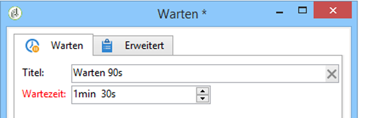

# Warten{#wait}

In einer **Warten**-Aktivität kann eine Wartezeit von wenigen Sekunden bis hin zu mehreren Monaten definiert werden. Nach Ablauf der angegebenen Frist wird die ausgehende Transition aktiviert. Diese Aktivität betrifft nicht den gesamten Workflow, andere Aufgaben können parallel ausgeführt werden.

Im Editor werden der Titel und die Wartezeit angegeben, wie unten abgebildet:

Im Feld **[!UICONTROL Dauer]** können, wenn in den regionalen Parametern des Benutzers nicht anders angegeben, folgende Einheiten verwendet werden:

* **s** für Sekunden, **m** für Minuten, **h** für Stunden, **d** für Tage und **y** für Jahre. Sobald die Eingabe validiert wird, wird der Wert in die am besten lesbare Einheit umgewandelt.

   Die Standardeinheit ist **T** für Tag.

* Wenn die regionalen Parameter für Deutschland definiert wurden, sind folgende Einheiten zu verwenden: **s** für Sekunden, **min** für Minuten, **h** für Stunden, **T** für Tage, **M** für Monate und **J** für Jahre. Sobald die Eingabe validiert wird, wird der Wert in die am besten lesbare Einheit umgewandelt. So wurde in oben stehender Abbildung die Eingabe **90s** in **1 min 30 s** umgewandelt.

   Die Standardeinheit ist **T** für Tag.

