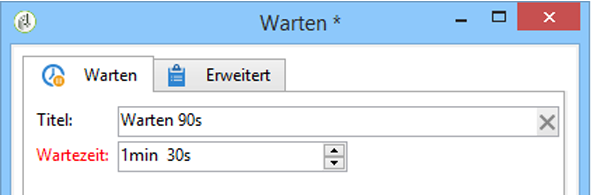

# Warten{#wait}

Eine **Warten**-Aktivität aktiviert ihre Transition nach einer Zeitverzögerung von einigen Sekunden bis zu mehreren Monaten. Eine Warteaufgabe blockiert nicht die Ausführung anderer Aufgaben. Der Workflow kann Aufgaben parallel ausführen, während diese Aufgabe aussteht.

Im Editor werden der Titel und die Wartezeit angegeben, wie unten abgebildet:

Im Feld **[!UICONTROL Dauer]** können, wenn in den regionalen Parametern des Benutzers nicht anders angegeben, folgende Einheiten verwendet werden:

* Wenn keine regionalen Einstellungen angegeben sind: **s** für Sekunden, **m** für Minuten, **h** für Stunden, **d** für Tage, **y** für Jahre. Zum Zeitpunkt der Genehmigung wird der Wert automatisch in die am besten lesbare Einheit umgewandelt.

  Die Standardeinheit ist **T** für Tag.

* Wenn die regionalen Parameter für Deutschland definiert wurden, sind folgende Einheiten zu verwenden: **s** für Sekunden, **min** für Minuten, **h** für Stunden, **T** für Tage, **M** für Monate und **J** für Jahre. Sobald die Eingabe validiert wird, wird der Wert in die am besten lesbare Einheit umgewandelt. So wurde in oben stehender Abbildung die Eingabe **90s** in **1 min 30 s** umgewandelt.

  Die Standardeinheit ist **T** für Tag.
