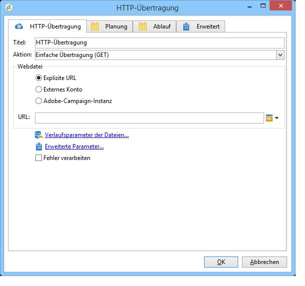
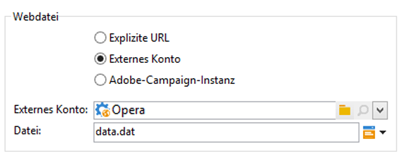
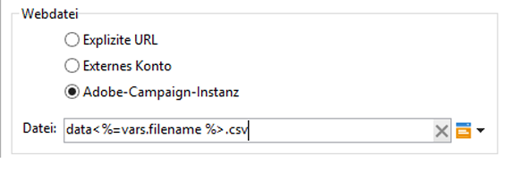
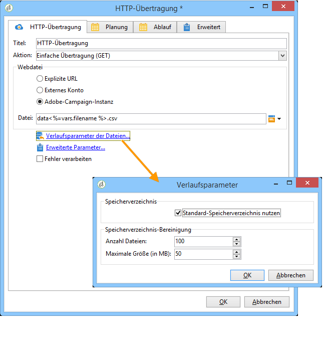
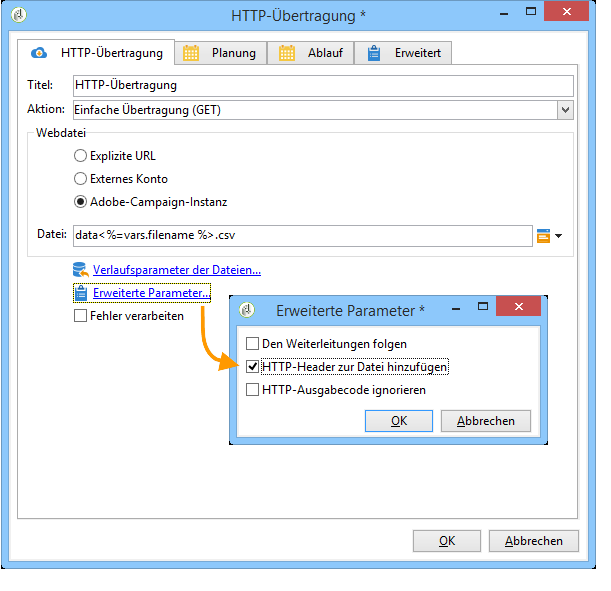

# HTTP-Übertragung{#web-download}

Die **HTTP-Übertragung** lädt Dateien über eine explizite URL, ein externes Konto oder eine Adobe-Campaign-Instanz unter Verwendung des Hypertext Transfer Protocols (HTTP). Sowohl die GET- als auch die POST-Methode können zur Anwendung kommen.

## Eigenschaften {#properties}

1. **Auswahl der Webdatei**

   Die Angabe der zu übertragenden Datei kann entweder über eine explizite URL, über ein externes HTTP-Konto oder über eine Adobe-Campaign-Instanz erfolgen. Folgende Parameter stehen zur Verfügung:

   * Um die URL der herunterzuladenden Datei direkt einzugeben, wählen Sie die **[!UICONTROL Explicit URL]** Option aus und geben Sie die URL in das entsprechende Feld ein. Diese URL kann mit variablen Daten erstellt werden.

      

   * To use an **[!UICONTROL External account]**, select the account from the drop-down list, and specify the file to be downloaded.

      Externe Konten werden vom **[!UICONTROL Administration > Platform > External accounts]** Knoten der Adobe Campaign-Struktur konfiguriert. Die Kontoparameter können über das **[!UICONTROL Edit link]** Symbol bearbeitet werden.

      

   * To download the file from the Adobe Campaign instance, select the **[!UICONTROL Adobe Campaign Instance]** option.

      

1. **Verlaufserstellung**

   The **[!UICONTROL File historization settings...]** link lets you specify the file storage directory and the purge frequency of this directory.

   

   Folgende Optionen stehen zur Verfügung:

   * **[!UICONTROL Use a default storage directory]**: die Datei wird immer verschoben, bevor sie verarbeitet wird. Wenn diese Option aktiviert ist, wird die Datei in den Standardspeicherordner (den **vars** -Ordner des Adobe Campaign-Installationsordners) verschoben. Um einen Speicherordner anzugeben, deaktivieren Sie das Kontrollkästchen und geben Sie dessen Pfad in das **[!UICONTROL Storage directory]** Feld ein
   * **[!UICONTROL Number of files]**: Geben Sie die maximale Anzahl von Dateien ein, die im Speicherordner gespeichert werden sollen.
   * **[!UICONTROL Maximum size (in Mb)]**: die maximale Speicherkapazität (in Megabyte) eingeben.
   Jede Datei wird mindestens 24 Stunden aufbewahrt, bevor Sie den Bereinigungsregeln unterzogen wird. Die Bereinigung erfolgt zu Beginn der Aktivität und berücksichtigt daher nicht die Dateien der aktuellen Workflow-Ausführung.

   Die Löschung beginnt jeweils mit den ältesten Dateien und endet mit den neuesten. Die ältesten Dateien werden gelöscht bis beide Bereinigungsregeln geprüft wurden. Wenn beispielsweise die maximale Anzahl auf 100 begrenzt wurde, enthält das Speicherverzeichnis stets die 100 vor Beginn des Workflows neuesten Dateien, zuzüglich der vom laufenden Workflow übertragenen Dateien.

   Wenn Sie keine Begrenzung für die **[!UICONTROL Number of files]** und- **[!UICONTROL Maximum size (in Mb)]** Optionen mehr festlegen möchten, geben Sie 0 als Wert ein.

1. **Erweiterte Parameter**

   The **[!UICONTROL Advanced parameters...]** link lets you specify the additional options shown below:

   

   Die **[!UICONTROL Process errors]** Option wird unter [Verarbeitungsfehler](../../workflow/using/monitoring-workflow-execution.md#processing-errors)beschrieben.

## Ausgabeparameter {#output-parameters}

* filename

   Vollständiger Name der übertragenen Datei.

