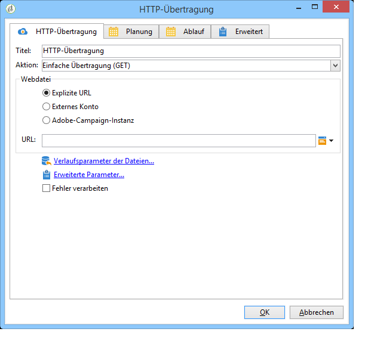
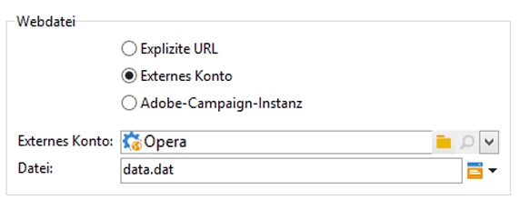
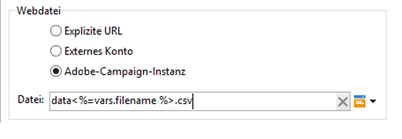
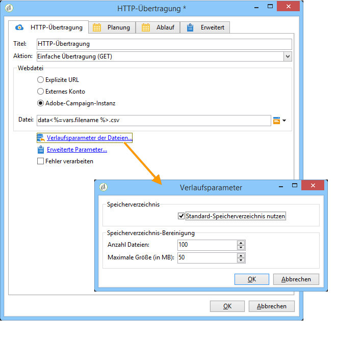
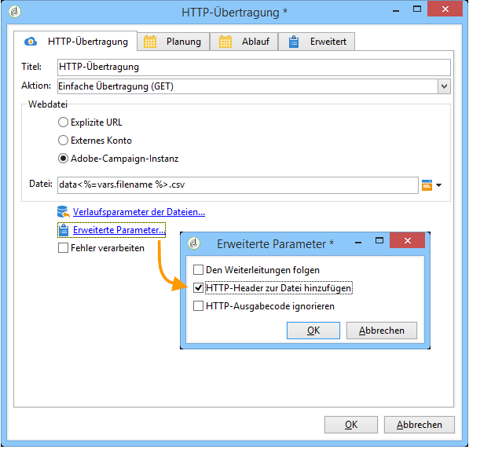

# HTTP-Übertragung{#web-download}

Die Aktivität **Web-Download** startet den Download einer Datei über eine explizite URL, ein externes Konto oder eine Adobe Campaign-Instanz. Das HTTP-Protokoll wird verwendet. Dabei kann es sich um einen GET- oder POST-Download handeln.

## Eigenschaften {#properties}

1. **Auswahl der Webdatei**

   Zum Angeben der zu übertragenden Datei können Sie entweder eine explizite Datei-URL, ein externes HTTP-Konto, auf dem die Datei gespeichert ist, oder eine Adobe Campaign-Instanz eingeben. Die verfügbaren Parameter werden nachfolgend beschrieben:

   * Um direkt die URL der herunterzuladenden Datei einzugeben, wählen Sie die Option **[!UICONTROL Explizite URL]** aus und geben Sie die URL in das entsprechende Feld ein. Diese URL kann mit Variablendaten erstellt werden.

     

   * Bei Verwendung eines **[!UICONTROL externen Kontos]** wird das Konto aus der Dropdown-Liste ausgewählt und die zu ladende Datei angegeben.

     Externe Konten werden über den Knoten **[!UICONTROL Administration > Plattform > Externe Konten]** im Adobe Campaign-Navigationsbaum konfiguriert. Die Kontoparameter können über das Symbol **[!UICONTROL Link bearbeiten]** bearbeitet werden.

     

   * **[!UICONTROL Adobe Campaign-Instanz]**: Die Übertragung erfolgt über eine Adobe Campaign-Instanz.

     

1. **Verlaufserstellung**

   Der Link **[!UICONTROL Verlaufsparameter der Dateien...]** ermöglicht die Angabe des Speicherverzeichnisses für die übertragenen Dateien und der Bereinigungsparameter.

   

   Folgende Optionen stehen zur Verfügung:

   * **[!UICONTROL Standard-Speicherverzeichnis nutzen]**: Die Datei wird immer verschoben, bevor sie verarbeitet wird. Wenn diese Option aktiviert ist, wird die Datei in das Standard-Speicherverzeichnis (das Verzeichnis **vars** im Adobe Campaign-Installationsordner) verschoben. Um ein Speicherverzeichnis anzugeben, deaktivieren Sie das Kontrollkästchen und geben Sie seinen Pfad in das Feld **[!UICONTROL Speicherverzeichnis]** ein.
   * **[!UICONTROL Anzahl Dateien]**: Geben Sie die Anzahl an Dateien an, die maximal im Speicherverzeichnis beibehalten werden soll.
   * **[!UICONTROL Maximale Größe (in MB)]**: Geben Sie die Größe an, die das Speicherverzeichnis nicht überschreiten darf (in Megabytes).

   Jede Datei wird 24 Stunden lang aufbewahrt, bevor sie den definierten Bereinigungsregeln unterliegt. Die Bereinigung erfolgt zu Beginn der Aktivität und berücksichtigt daher nicht die gerade ausgeführte Workflow-Datei.

   Dateien werden in Abhängigkeit ihres Alters (vom ältesten zum neuesten) gelöscht. Die ältesten Dateien werden bereinigt, bis beide Bereinigungsregeln überprüft wurden. Wenn die maximale Anzahl beispielsweise auf 100 begrenzt wurde, enthält das Speicherverzeichnis vor Beginn des Workflows daher stets die 100 neuesten Dateien, zuzüglich der vom laufenden Workflow übertragenen Dateien.

   Wenn Sie für die Optionen **[!UICONTROL Anzahl Dateien]** und **[!UICONTROL Maximale Größe (in MB)]** keine Grenzwerte vorschreiben möchten, können Sie jeweils den Wert 0 angeben.

1. **Erweiterte Parameter**

   Der Link **[!UICONTROL Erweiterte Parameter...]** bietet Zugriff auf folgende Optionen:

   * **[!UICONTROL Den Weiterleitungen folgen]**: Mithilfe der Dateiweiterleitung können Sie Überschreibungen verwenden, um die Dateneingabe oder -ausgabe an ein Gerät eines anderen Typs zu leiten.
   * **[!UICONTROL HTTP-Header zur Datei hinzufügen]**: In einigen Fällen ist es vorteilhaft, einer Datei zusätzliche HTTP-Header hinzuzufügen. In den meisten Fällen werden diese Header verwendet, um zusätzliche Informationen zur Fehlerbehebung zu liefern, oder für [Cross-Origin Resource Sharing (CORS)](https://developer.mozilla.org/docs/Web/HTTP/CORS) oder um bestimmte Caching-Anweisungen festzulegen.
   * **[!UICONTROL HTTP-Ausgabecode ignorieren]**: HTTP-Ausgabe-Codes, auch HTTP-Status-Codes genannt, geben das Ergebnis einer HTTP-Anfrage an.

   

   Die Option **[!UICONTROL Fehler verarbeiten]** wird im Abschnitt [Verarbeitungsfehler](monitoring-workflow-execution.md#processing-errors) erläutert.

## Ausgabeparameter {#output-parameters}

* filename: Vollständiger Name der übertragenen Datei.

