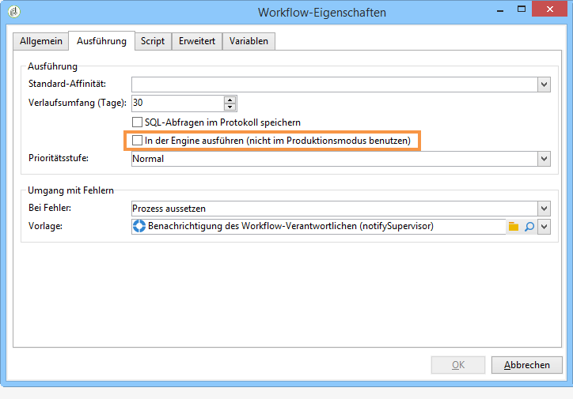
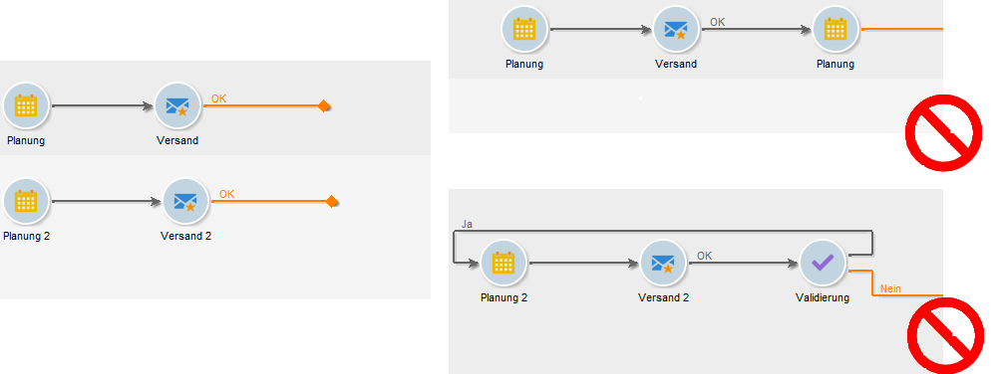
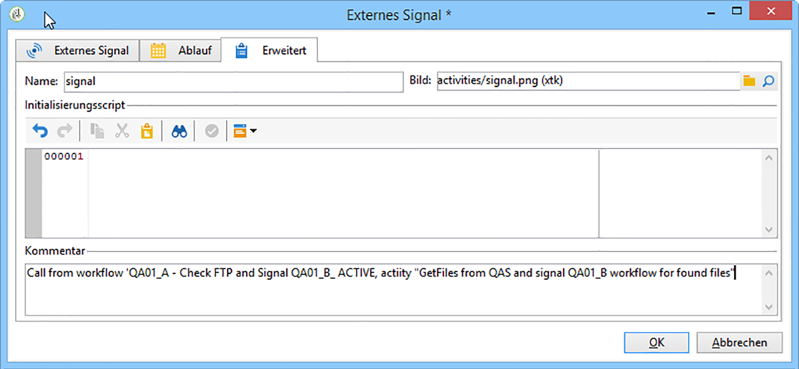

# Best Practices für Workflows{#workflow-best-practices}

## Erfüllung und Leistung {#execution-and-performance}

Im Folgenden finden Sie allgemeine Richtlinien zur Optimierung der Leistung von Campaign, einschließlich Best Practices zur Anwendung auf Ihre Workflows.

Richtlinien zur Fehlerbehebung in Bezug auf die Ausführung von Workflows sind auch in [diesem Abschnitt](../../production/using/workflow-execution.md) verfügbar.

### Logs {#logs}

Die JavaScript-Methode **[!UICONTROL logInfo()]** eignet sich hervorragend für die Problembehebung eines Workflows. Sie ist zwar nützlich, muss aber mit Vorsicht angewendet werden, vor allem bei häufig ausgeführten Aktivitäten. Dies könnte nämlich die Logs überlasten und die Log-Tabelle deutlich vergrößern. Möglicherweise sind neben **[!UICONTROL logInfo()]** noch weitere Maßnahmen erforderlich.

Zwei zusätzliche Lösungen sind verfügbar:

* **Zwischen zwei Ausführungen die ermittelte Population festhalten**

   Mit dieser Option werden temporäre Tabellen zwischen zwei Ausführungen eines Workflows festgehalten. Diese im Tab **[!UICONTROL Allgemein]** der Workflow-Eigenschaften verfügbare Option kann zu Entwicklungs- und Testzwecken verwendet werden, um Daten zu überwachen und Ergebnisse zu überprüfen. Diese Option kann in Entwicklungsumgebungen, nicht jedoch im Produktionsalltag verwendet werden. Das Festhalten temporärer Tabellen könnte dazu führen, dass die Datenbankgröße deutlich zunimmt und schließlich die Maximalgröße erreicht. Außerdem verlangsamt sich dadurch der Sicherungsvorgang.

   Nur die Arbeitstabellen der letzten Ausführung des Workflows werden aufbewahrt. Arbeitstabellen früherer Ausführungen werden durch den täglich durchgeführten **[!UICONTROL Bereinigungs]**-Workflow bereinigt.

   >[!CAUTION]
   >
   >Diese Option darf in einem Produktions-Workflow niemals aktiviert sein. Diese Option wird zur Analyse der Ergebnisse verwendet und ist nur für Testzwecke konzipiert und darf daher nur in Entwicklungs- oder Staging-Umgebungen verwendet werden.

* **SQL-Abfragen im Protokoll speichern**

   Diese Option ist im Tab **[!UICONTROL Ausführung]** der Workflow-Eigenschaften verfügbar und ermöglicht die Speicherung aller vom Tool durch die unterschiedlichen Aktivitäten erzeugten SQL-Abfragen. Damit lässt sich einfach feststellen, welche Aktivitäten von der Plattform tatsächlich ausgeführt werden. Diese Option sollte jedoch nur temporär bei der Entwicklung, nicht aber während der Produktion verwendet werden.

Bereinigen Sie die Logs, wenn sie nicht mehr benötigt werden. Workflow-Verläufe werden nicht automatisch bereinigt, alle Nachrichten werden standardmäßig beibehalten. Gehen Sie zur Bereinigung zu **[!UICONTROL Datei > Aktionen]** oder klicken Sie in der Symbolleiste oberhalb der Workflow-Liste auf die Schaltfläche „Aktionen“. Wählen Sie die Option „Verlauf bereinigen“ aus.
Informationen zum Bereinigen der Logs finden Sie in dieser [Dokumentation](../../workflow/using/starting-a-workflow.md).

### Workflow-Planung {#workflow-planning}

* Versuchen Sie, ein stabiles Aktivitätsniveau während des Tages aufrechtzuerhalten und Spitzen zu vermeiden, um eine Überlastung der Instanz zu verhindern. Verteilen Sie dazu die Startzeiten des Workflows gleichmäßig über den Tag.
* Planen Sie das Laden der Daten für die Nacht, um Ressourcenkonflikte zu reduzieren.
* Lange Workflows können sich auf die Server- und Datenbankressourcen auswirken. Teilen Sie die längsten Workflows auf, um die Bearbeitungszeit zu verkürzen.
* Um die Gesamtlaufzeit zu verkürzen, ersetzen Sie zeitaufwändige Aktivitäten durch einfachere und schnellere Aktivitäten.
* Vermeiden Sie die gleichzeitige Ausführung von mehr als 20 Workflows. Wenn zu viele Workflows gleichzeitig ausgeführt werden, könnte das System nicht mehr über genügend Ressourcen verfügen und instabil werden. Weitere Informationen darüber, warum Ihr Workflow möglicherweise nicht gestartet wird, finden Sie in diesem [Artikel](https://helpx.adobe.com/de/campaign/kb/workflows-not-starting-in-a-campaign-technical-workflows.html).

### Workflow-Ausführung {#workflow-execution}

Es wird empfohlen, Workflows nicht öfter als alle 15 Minuten auszuführen, da die Gesamtleistung des Systems beeinträchtigt werden kann und Blöcke in der Datenbank entstehen können.

Ihre Workflows sollten nicht ausgesetzt werden. Wenn Sie einen temporären Workflow erstellen, achten Sie darauf, dass dieser ordnungsgemäß beendet wird und nicht im Status **[!UICONTROL Ausgesetzt]** verharrt. Bei ausgesetzten Workflows werden die temporären Tabellen gespeichert, was die Größe der Datenbank erhöhen würde. Weisen Sie unter „Workflow-Eigenschaften“ Workflow-Supervisoren zu, um eine Warnung zu senden, wenn ein Workflow fehlschlägt oder vom System ausgesetzt wird.

So vermeiden Sie, dass Workflows ausgesetzt werden:

* Prüfen Sie Ihre Workflows regelmäßig, um sicherzustellen, dass keine unerwarteten Fehler auftreten.
* Bauen Sie Ihre Workflows möglichst einfach auf, indem Sie beispielsweise große Workflows in mehrere kleine unterteilen. Mit der Aktivität **[!UICONTROL Externes Signal]** können Sie Workflows durch andere Workflows auslösen.
* Vermeiden Sie es, Aktivitäten mit Flüssen in Ihren Workflows zu deaktivieren, die Threads offen lassen und zu vielen temporären Tabellen führen, die viel Platz verbrauchen können. Behalten Sie in Ihren Workflows keine Aktivitäten im Status **[!UICONTROL Nicht aktivieren]** oder **[!UICONTROL Aktivieren, aber nicht ausführen]**.

Beenden Sie außerdem nicht verwendete Workflows. Workflows, die weiterhin ausgeführt werden, halten Verbindungen zur Datenbank aufrecht.

Verwenden Sie den unbedingten Stopp so selten wie möglich. Verwenden Sie diese Aktion nicht regelmäßig. Wenn Verbindungen, die von Workflows zur Datenbank erzeugt werden, nicht sauber geschlossen werden, beeinträchtigt dies die Leistung.

### In der Engine ausführen {#execute-in-the-engine-option}

Kreuzen Sie in den **[!UICONTROL Workflow-Eigenschaften]** im Produktionsmodus nie die Option **[!UICONTROL In der Engine ausführen]** an. Andernfalls wird der Workflow prioritär und bis zu seinem Abschluss werden alle anderen Workflows angehalten.

## Workflow-Eigenschaften    {#workflow-properties}

### Workflow-Ordner {#workflow-folders}

Adobe empfiehlt, Ihre Workflows in einem eigenen Ordner zu erstellen.

Wenn der Workflow die gesamte Plattform betrifft, (z. B. Bereinigungsprozesse), könnte es sinnvoll sein, einen Unterordner zum nativen Ordner **[!UICONTROL Technische Workflows]** hinzuzufügen.

### Workflow-Name {#workflow-naming}

Um die Suche und Fehlerbehebung zu vereinfachen, empfiehlt Adobe, Ihre Workflows mit eigenen Namen und Titeln zu versehen: Erläutern Sie im Beschreibungsfeld des Workflows kurz den jeweiligen Prozess, damit dessen Zweck für den Benutzer leicht ersichtlich ist.

Wenn der Workflow Teil eines mehrere Workflows umfassenden Prozesses ist, können Sie jeden Workflow durch die Angabe eines Titels exakt benennen. Zahlen sind beispielsweise eine gute Möglichkeit, Workflows zu ordnen.

Beispiel:

* 001 – Importieren – Empfänger importieren
* 002 – Importieren – Verkäufe importieren
* 003 – Importieren – Verkaufsdetails importieren
* 010 – Exportieren – Versandlogs exportieren
* 011 – Exportieren – Trackinglogs exportieren

### Workflow-Schweregrad {#workflow-severity}

Sie können die Prioritätsstufe eines Workflows im Tab **[!UICONTROL Ausführung]** der Workflow-Eigenschaften konfigurieren:

* Normal
* Produktion
* Kritisch

Durch Angabe dieser Informationen bei der Erstellung eines Workflows ist die Prioritätsstufe des konfigurierten Prozesses besser ersichtlich.

Diese Option beeinflusst nur Kampagnen-Workflows.

Kampagnen-Workflows (Workflows, die als Teil einer Kampagne erstellt werden) mit höherer Prioritätsstufe werden vorgezogen, wenn die Kampagne mehrere Prozesse enthält, die gleichzeitig ausgeführt werden müssen. Standardmäßig können entsprechend der Option NmsOperation_LimitConcurrency maximal zehn Prozesse einer Kampagnen gleichzeitig ausgeführt werden. Wenn eine Kampagne beispielsweise aus 25 Workflows besteht, werden Workflows mit einer höheren Prioritätsstufe in der ersten Gruppe von zehn Prozessen ausgeführt.

### Workflow-Monitoring {#workflow-monitoring}

Alle Ihre terminierten in Produktionsumgebungen ausgeführten Workflows sollten überwacht werden, damit Sie bei Auftreten eines Fehlers benachrichtigt werden.

Wählen Sie dazu in den Workflow-Eigenschaften eine Gruppe von Supervisoren. Dies können entweder die standardmäßigen **[!UICONTROL Workflow-Supervisoren]** oder eine benutzerdefinierte Gruppe sein. Achten Sie darauf, dass zumindest ein Benutzer der Gruppe eine eingerichtete E-Mail-Adresse besitzt.

Bestimmen Sie zu Beginn der Workflow-Erstellung Workflow-Supervisoren. Diese werden bei Fehlern per E-Mail informiert. Weitere Informationen hierzu finden Sie unter [Fehler beheben](../../workflow/using/monitoring-workflow-execution.md#managing-errors).

Überprüfen Sie regelmäßig die Rubrik **[!UICONTROL Monitoring]**, um den Gesamtstatus der aktiven Workflows anzuzeigen. Weitere Informationen hierzu finden Sie unter [Instanz-Monitoring](../../workflow/using/monitoring-workflow-execution.md#instance-supervision).

Die Workflow-Heatmap ermöglicht den Administratoren der Adobe Campaign-Plattform, die Auslastung der Instanz zu überwachen und Workflows entsprechend zu planen. Weitere Informationen dazu finden Sie unter [Workflow-Monitoring](../../workflow/using/heatmap.md).

## Aktivitäten verwenden {#using-activities}

>[!CAUTION]
>
>Sie können Aktivitäten innerhalb eines Workflows kopieren und einfügen. Wir raten jedoch davon ab, Aktivitäten über verschiedene Workflows hinweg zu kopieren und einzufügen. Einige Einstellungen, die Aktivitäten wie Sendungen und Planung betreffen, können zu Konflikten und Fehlern beim Ausführen des Ziel-Workflows führen. Stattdessen empfehlen wir, Workflows zu **duplizieren**. Weitere Informationen finden Sie unter [Workflows duplizieren ](../../workflow/using/building-a-workflow.md#duplicating-workflows).

### Name der Aktivität {#name-of-the-activity}

Bei der Entwicklung Ihres Workflows erhalten alle Aktivitäten sowie alle Adobe Campaign-Objekte einen Namen. Diese Namen werden zwar vom Tool erstellt, wir empfehlen jedoch, sie bei der Konfiguration zu ändern. Geschieht dies erst zu einem späteren Zeitpunkt, besteht die Gefahr, dass dadurch der Workflow durch Aktivitäten mit Namen einer anderen früheren Aktivität unterbrochen wird. Deshalb wäre die nachträgliche Aktualisierung der Namen eine schwierige Aufgabe.

Der Aktivitätsname ist im Tab **[!UICONTROL Erweitert]** verfügbar. Behalten Sie nicht die Namen **[!UICONTROL abfrage]**, **[!UICONTROL abfrage1]**, **[!UICONTROL abfrage11]** bei, sondern benennen Sie sie beispielsweise **[!UICONTROL abfrageAbonnenten]**. Dieser Name wird im Protokoll angezeigt und gegebenenfalls auch in den SQL-Logs, was Ihnen hilft, bei der Konfiguration des Workflows Fehler zu beheben.

### Erste und letzte Aktivitäten {#first-and-last-activities}

* Beginnen Sie Ihren Workflow stets mit der Aktivität **[!UICONTROL Beginn]** oder **[!UICONTROL Planung]**. Bei Bedarf können Sie auch die Aktivität **[!UICONTROL Externes Signal]** hinzufügen.
* Pro Workflow-Verzweigung darf nur eine einzige **** Planung verwendet werden. Wenn dieselbe Verzweigung eines Workflows mehrere Planungen enthält, die miteinander verknüpft sind, steigt die Anzahl der auszuführenden Aufgaben exponentiell an, wodurch die Datenbank überlastet würde. Diese Regel gilt auch für alle Aktivitäten mit einem Tab **[!UICONTROL Planung &amp; Verlauf]**. Weitere Informationen zur [Planung](../../workflow/using/scheduler.md).

   

* Verwenden Sie in allen Workflows jeweils **[!UICONTROL Ende]**-Aktivitäten. Auf diese Weise wird temporärer Speicherplatz freigesetzt, der für Berechnungen in Workflows reserviert ist. Weitere Informationen finden Sie unter [Start und Ende](../../workflow/using/start-and-end.md).

### JavaScript innerhalb einer Aktivität {#javascript-within-an-activity}

Sie können bei der Initialisierung einer Workflow-Aktivität im Tab **[!UICONTROL Erweitert]** der jeweiligen Aktivität JavaScript hinzufügen.

Um den Workflow leichter erkennbar zu machen, empfehlen wir, am Anfang und Ende des Titels der Aktivität doppelte Bindestriche zu setzen, z. B.: -- Mein Titel --.

### Signal {#signal}

Meistens ist nicht bekannt, wo das Signal ausgelöst wurde. Um dies zu vermeiden, notieren Sie im Tab **[!UICONTROL Erweitert]** der Signalaktivität im Feld **[!UICONTROL Kommentar]** den angenommenen Auslöser eines Signals für diese Aktivität.

## Workflow-Update {#workflow-update}

Ein Produktions-Workflow sollte nicht direkt aktualisiert werden. Prozesse sollten zuerst in einer Entwicklungsumgebung getestet werden, außer der Prozess besteht aus einer Kampagne mit Vorlagen-Workflows. Nach der Validierung kann der Workflow für die Produktion bereitgestellt werden.

Führen Sie alle Tests in Entwicklungs- oder Staging-Umgebungen, nicht in Produktionsumgebungen durch. Die Leistung kann in einem solchen Fall nicht gewährleistet werden.

Während Workflows in einem Archivordner auf Entwicklungs- oder Testplattformen aufbewahrt werden können, sollte die Produktionsumgebung möglichst sauber gehalten werden. Entfernen Sie deshalb alte, inaktive Workflows aus der Produktionsumgebung.
