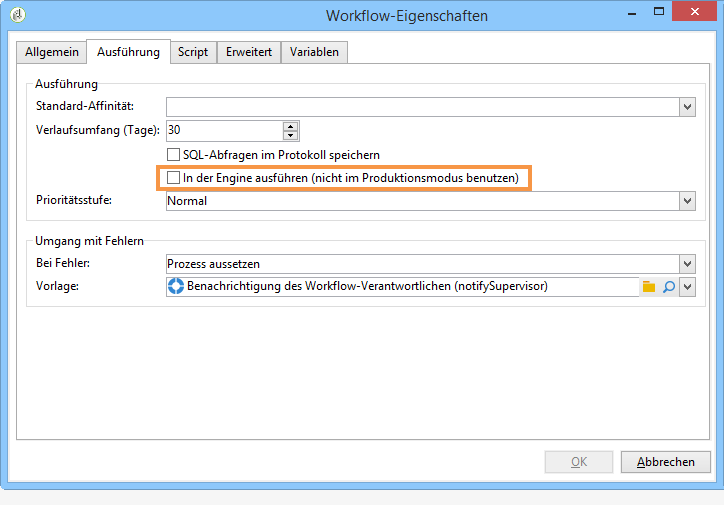
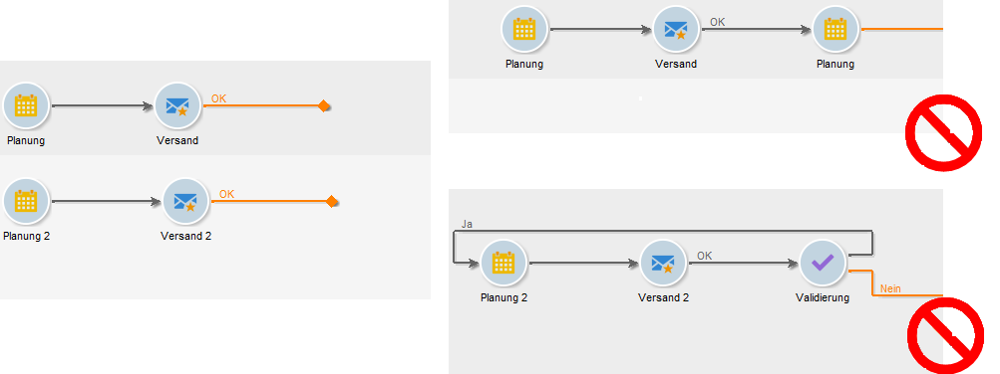
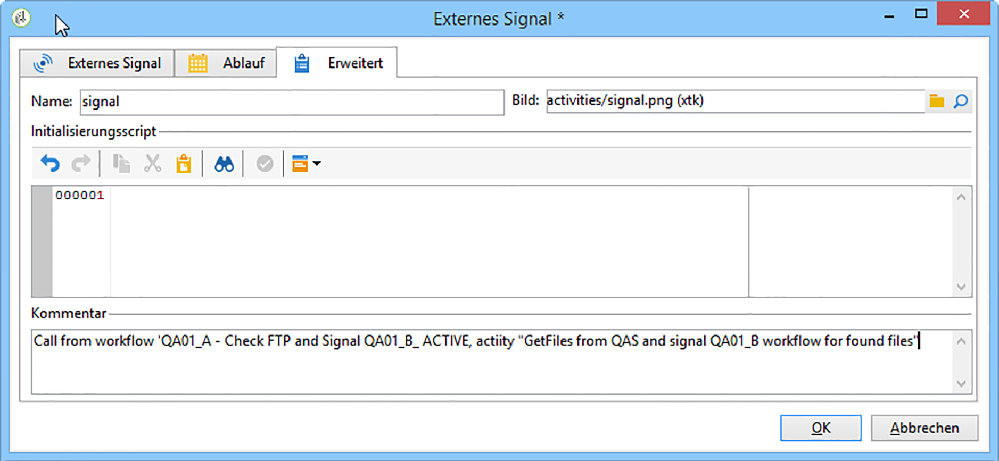

# Best Practices bei Workflows{#workflow-best-practices}

## Ausführung und Performance {#execution-and-performance}

Im Folgenden finden Sie allgemeine Richtlinien zur Optimierung der Performance von Campaign, einschließlich Best Practices zur Anwendung auf Ihre Workflows.

Richtlinien zur Fehlerbehebung bei der Ausführung von Workflows finden Sie auch im [Produktionshandbuch zu Campaign Classic v7](../../production/using/workflow-execution.md).

### Logs {#logs}

Die JavaScript-Methode **[!UICONTROL logInfo()]** ist eine Lösung zum Debuggen eines Workflows. Sie ist nützlich, muss jedoch insbesondere für häufig ausgeführte Aktivitäten mit Bedacht eingesetzt werden, da sie die Protokolle überlasten und die Größe der Protokolltabelle erheblich erhöhen kann. Aber vielleicht brauchen Sie auch mehr als **[!UICONTROL logInfo()]**.

Zwei zusätzliche Lösungen sind verfügbar:

* **Zwischen zwei Ausführungen die ermittelte Population festhalten**

  Mit dieser Option werden temporäre Tabellen zwischen zwei Ausführungen eines Workflows festgehalten. Diese Option ist auf der Registerkarte **[!UICONTROL Allgemein]** der Workflow-Eigenschaften verfügbar und kann für Entwicklungs- und Testzwecke verwendet werden, um Daten zu überwachen und Ergebnisse zu überprüfen. Sie können diese Option in Entwicklungsumgebungen verwenden, sollten sie aber nie in Produktionsumgebungen verwenden. Die Beibehaltung temporärer Tabellen könnte dazu führen, dass die Größe der Datenbank erheblich zunimmt und letztendlich die Größenbeschränkung erreicht wird. Außerdem wird dadurch das Backup verlangsamt.

  Nur die Arbeitstabellen der letzten Ausführung des Workflows werden aufbewahrt. Arbeitstabellen früherer Ausführungen werden durch den täglich durchgeführten **[!UICONTROL Bereinigungs]**-Workflow bereinigt.

  >[!CAUTION]
  >
  >Diese Option darf in einem Produktions-Workflow niemals aktiviert sein. Diese Option wird zur Analyse der Ergebnisse verwendet und ist nur für Testzwecke konzipiert und darf daher nur in Entwicklungs- oder Staging-Umgebungen verwendet werden.

* **SQL-Abfragen im Protokoll speichern**

  Diese Option ist in der Registerkarte **[!UICONTROL Ausführung]** der Workflow-Eigenschaften verfügbar und ermöglicht die Protokollierung aller vom Tool durch die unterschiedlichen Aktivitäten erzeugten SQL-Abfragen.Dies ist eine gute Möglichkeit, um zu sehen, was tatsächlich von der Plattform ausgeführt wird. Diese Option sollte jedoch nur vorübergehend während der Entwicklung verwendet und nicht in der Produktion aktiviert werden.

Bereinigen Sie die Protokolle, wenn sie nicht mehr benötigt werden. Der Workflow-Verlauf wird nicht automatisch bereinigt: Alle Nachrichten werden standardmäßig beibehalten. Der Verlauf kann über das Menü **[!UICONTROL Datei > Aktionen]** oder durch Klicken auf die Schaltfläche „Aktionen“ in der Symbolleiste oberhalb der Liste bereinigt werden. Wählen Sie „Verlauf bereinigen“ aus.
Weitere Informationen zum Bereinigen Ihrer Protokolle finden Sie in dieser [Dokumentation](starting-a-workflow.md).

### Workflow-Planung {#workflow-planning}

* Versuchen Sie, ein über den Tag verteiltes stabiles Aktivitätsniveau beizubehalten und vermeiden Sie Spitzen, damit Ihre Instanz nicht überlastet wird. Verteilen Sie dazu die Startzeiten des Workflows gleichmäßig über den Tag.
* Planen Sie das Laden der Daten für die Nacht, um Ressourcenkonflikte zu reduzieren.
* Lange Workflows können sich möglicherweise auf die Server- und Datenbankressourcen auswirken. Teilen Sie die längsten Workflows auf, um die Verarbeitungszeit zu reduzieren.
* Um die Gesamtlaufzeit zu verkürzen, ersetzen Sie zeitaufwändige Aktivitäten durch einfachere und schnellere Aktivitäten.
* Vermeiden Sie die gleichzeitige Ausführung von mehr als 20 Workflows. Wenn zu viele Workflows gleichzeitig ausgeführt werden, könnte das System nicht mehr über genügend Ressourcen verfügen und instabil werden. Weitere Informationen darüber, warum Ihr Workflow möglicherweise nicht gestartet wird, finden Sie in diesem [Artikel](https://helpx.adobe.com/de/campaign/kb/workflows-not-starting-in-a-campaign-technical-workflows.html).

### In der Engine ausführen {#execute-in-the-engine-option}

Aktivieren Sie im Fenster **[!UICONTROL Eigenschaften des Workflows]** nie die Option **[!UICONTROL In der Engine ausführen]**. Wenn diese Option aktiviert ist, hat der Workflow Priorität und alle anderen Workflows werden bis zu seinem Abschluss von der Workflow-Engine gestoppt.

## Workflow-Eigenschaften {#workflow-properties}

### Workflow-Ordner {#workflow-folders}

Adobe empfiehlt, Ihre Workflows in einem eigenen Ordner zu erstellen.

Wenn der Workflow die gesamte Plattform betrifft, (z. B. Bereinigungsprozesse), könnte es sinnvoll sein, einen Unterordner zum nativen Ordner **[!UICONTROL Technische Workflows]** hinzuzufügen.

### Workflow-Name {#workflow-naming}

Um die Suche und Fehlerbehebung zu vereinfachen, empfiehlt Adobe, Ihre Workflows mit eigenen Namen und Titeln zu versehen: Erläutern Sie im Beschreibungsfeld des Workflows kurz den jeweiligen Prozess, damit dessen Zweck für den Benutzer leicht ersichtlich ist.

Wenn der Workflow Teil eines mehrere Workflows umfassenden Prozesses ist, können Sie jeden Workflow durch die Angabe eines Titels exakt benennen. Zahlen sind beispielsweise eine gute Möglichkeit, Workflows zu ordnen.

Beispiel:

* 001 – Importieren – Empfänger importieren
* 002 – Importieren – Verkäufe importieren
* 003 – Importieren – Verkaufsdetails importieren
* 010 – Exportieren – Versandlogs exportieren
* 011 – Exportieren – Trackinglogs exportieren

### Workflow-Prioritätsstufe {#workflow-severity}

Sie können die Prioritätsstufe eines Workflows im Tab **[!UICONTROL Ausführung]** der Workflow-Eigenschaften konfigurieren:

* Normal
* Produktion
* Kritisch

Durch Angabe dieser Informationen bei der Erstellung eines Workflows ist die Prioritätsstufe des konfigurierten Prozesses besser ersichtlich.

Diese Option beeinflusst nur Kampagnen-Workflows.

Kampagnen-Workflows (als Teil einer Kampagne/eines Vorgangs erstellte Workflows) mit höherer Prioritätsstufe werden nach Priorität ausgeführt, falls die Kampagne mehrere Prozesse enthält, die gleichzeitig ausgeführt werden sollen. Standardmäßig können in einer Kampagne gemäß der Option „NmsOperation_LimitConcurrency“ nur 10 Prozesse gleichzeitig ausgeführt werden. Wenn eine Kampagne beispielsweise 25 Workflows enthält, werden Workflows mit einer höheren Prioritätsstufe im ersten Pool von 10 Prozessen ausgeführt.

### Überwachen von Workflows {#workflow-monitoring}

Alle Ihre terminierten in Produktionsumgebungen ausgeführten Workflows sollten überwacht werden, damit Sie bei Auftreten eines Fehlers benachrichtigt werden.

Wählen Sie in den Workflow-Eigenschaften eine Gruppe an Verantwortlichen, entweder die standardmäßigen **[!UICONTROL Workflow-Verantwortlichen]** oder eine benutzerdefinierte Gruppe. Stellen Sie sicher, dass mindestens eine Benutzerin bzw. ein Benutzer zu dieser Gruppe gehört und eine E-Mail eingerichtet ist.

Bevor Sie mit dem Erstellen eines Workflows beginnen, denken Sie daran, Workflow-Verantwortliche zu definieren. Diese werden im Fall von Fehlern per E-Mail benachrichtigt. Weitere Informationen hierzu finden Sie unter [Fehler beheben](monitoring-workflow-execution.md#managing-errors).

Überprüfen Sie regelmäßig den Tab **[!UICONTROL Monitoring]**, um den Gesamtstatus der aktiven Workflows anzuzeigen. Weitere Informationen hierzu finden Sie unter [Instanz-Monitoring](monitoring-workflow-execution.md#instance-supervision).

Die Workflow-Heatmap ermöglicht den Administratoren der Adobe Campaign-Plattform, die Auslastung der Instanz zu überwachen und Workflows entsprechend zu planen. Weitere Informationen dazu finden Sie unter [Workflow-Monitoring](heatmap.md).

## Aktivitäten verwenden {#using-activities}

>[!CAUTION]
>
>Sie können Aktivitäten innerhalb eines Workflows kopieren und einfügen. Wir raten jedoch davon ab, Aktivitäten über verschiedene Workflows hinweg zu kopieren und einzufügen. Einige Einstellungen, die Aktivitäten wie Sendungen und Planung betreffen, können zu Konflikten und Fehlern beim Ausführen des Ziel-Workflows führen. Stattdessen empfehlen wir, Workflows zu **duplizieren**. Weitere Informationen finden Sie unter [Workflows duplizieren ](building-a-workflow.md#duplicating-workflows).

### Name der Aktivität {#name-of-the-activity}

Bei der Entwicklung Ihres Workflows erhalten alle Aktivitäten sowie alle Adobe Campaign-Objekte einen Namen. Der Name wird von einem Tool generiert, wir empfehlen jedoch eine Umbenennung auf einen expliziten Namen bei der Konfiguration. Bei einer späteren Umbenennung besteht das Risiko, dass ein Workflow mit Aktivitäten unterbrochen wird, die den Namen einer anderen vorherigen Aktivität verwenden. Es wäre daher schwierig, die Namen danach zu aktualisieren.

Der Aktivitätsname ist im Tab **[!UICONTROL Erweitert]** verfügbar. Behalten Sie nicht die simplen Namen **[!UICONTROL abfrage]**, **[!UICONTROL abfrage1]**, **[!UICONTROL abfrage11]** bei, sondern benennen Sie sie beispielsweise **[!UICONTROL abfrageAbonnenten]**. Dieser Name wird im Protokoll angezeigt und gegebenenfalls auch in den SQL-Logs, was Ihnen hilft, bei der Konfiguration des Workflows Fehler zu beheben.

### Erste und letzte Aktivitäten {#first-and-last-activities}

* Beginnen Sie Ihren Workflow stets mit der Aktivität **[!UICONTROL Beginn]** oder **[!UICONTROL Planung]**. Bei Bedarf können Sie auch die Aktivität **[!UICONTROL Externes Signal]** hinzufügen.
* Pro Workflow-Verzweigung darf nur eine einzige **** Planung verwendet werden. Wenn dieselbe Verzweigung eines Workflows mehrere Planungen enthält, die miteinander verknüpft sind, steigt die Anzahl der auszuführenden Aufgaben exponentiell an, wodurch die Datenbank überlastet würde. Diese Regel gilt auch für alle Aktivitäten mit einem Tab **[!UICONTROL Planung &amp; Verlauf]**. Weitere Informationen zur [Planung](scheduler.md).

  

* Verwenden Sie Aktivitäten des Typs **[!UICONTROL Ende]** für jeden Workflow. Auf diese Weise wird temporärer Speicherplatz in Adobe Campaign freigesetzt, der für Berechnungen in Workflows verwendet wird. Weitere Informationen finden Sie unter [Start und Ende](start-and-end.md).

### JavaScript innerhalb einer Aktivität {#javascript-within-an-activity}

Sie können bei der Initialisierung einer Workflow-Aktivität JavaScript hinzufügen. Dies kann auf der Registerkarte **[!UICONTROL Erweitert]** der jeweiligen Aktivität erfolgen.

Um den Workflow leichter erkennbar zu machen, empfehlen wir, am Anfang und Ende des Titels der Aktivität doppelte Bindestriche zu setzen, z. B.: -- Mein Titel --.

### Signal {#signal}

Meistens ist nicht bekannt, wo das Signal ausgelöst wurde. Um dies zu vermeiden, notieren Sie im Feld **[!UICONTROL Kommentar]** auf der Registerkarte **[!UICONTROL Erweitert]** der Signalaktivität die erwartete Herkunft eines Signals für diese Aktivität.

## Workflow-Update {#workflow-update}

Ein Produktions-Workflow sollte nicht direkt aktualisiert werden. Prozesse sollten zuerst in einer Entwicklungsumgebung getestet werden, außer der Prozess besteht aus der Erstellung einer Kampagne mit Vorlagen-Workflows. Nach dieser Validierung kann der Workflow in der Produktion bereitgestellt und gestartet werden.

Führen Sie alle Tests in Entwicklungs- oder Staging-Umgebungen, nicht in Produktionsumgebungen durch. die Performance kann in einem solchen Fall nicht gewährleistet werden.

Archivierte Workflows können in einem Archivordner auf Entwicklungs- und Testplattformen gespeichert werden, die Produktionsumgebung sollte jedoch so sauber wie möglich gehalten werden. Alte Workflows sollten aus der Produktionsumgebung entfernt werden, wenn sie inaktiv sind.
